import A11yStatus from 'components/A11yStatus';

import {
  Add,
  Copy,
  Download,
  Edit,
  Export,
  Pause,
  Play,
  Restart,
  StopOutline,
  SubtractAlt,
  TrashCan,
  Upload,
} from '@carbon/react/icons';

<PageDescription>

Buttons are used to initialize an action. Button labels express what action will
occur when the user interacts with it.

</PageDescription>

<InlineNotification>

**Note:** Some of the examples we discuss here include fluid (full-span) and
hanging buttons which are not available for production use. This guidance
reflects our current understanding of these topics and we are working towards
releasing this work in a future version of Carbon.

</InlineNotification>

<AnchorLinks>

<AnchorLink>Live demo</AnchorLink>
<AnchorLink>Overview</AnchorLink>
<AnchorLink>Formatting</AnchorLink>
<AnchorLink>Content</AnchorLink>
<AnchorLink>Universal behaviors</AnchorLink>
<AnchorLink>Primary button</AnchorLink>
<AnchorLink>Secondary button</AnchorLink>
<AnchorLink>Tertiary button</AnchorLink>
<AnchorLink>Ghost button</AnchorLink>
<AnchorLink>Danger button</AnchorLink>
<AnchorLink>Modifiers</AnchorLink>
<AnchorLink>Related</AnchorLink>
<AnchorLink>References</AnchorLink>
<AnchorLink>Feedback</AnchorLink>

</AnchorLinks>

## Live demo

<StorybookDemo
  themeSelector
  url="https://react.carbondesignsystem.com"
  variants={[
    {
      label: 'Default',
      variant: 'components-button--default',
    },
    {
      label: 'Danger',
      variant: 'components-button--danger',
    },
    {
      label: 'Ghost',
      variant: 'components-button--ghost',
    },
    {
      label: 'Icon button',
      variant: 'components-button--icon-button',
    },
    {
      label: 'Secondary',
      variant: 'components-button--secondary',
    },
    {
      label: 'Set of buttons',
      variant: 'components-button--set-of-buttons',
    },
    {
      label: 'Tertiary',
      variant: 'components-button--tertiary',
    },
  ]}
/>

<A11yStatus layout="cards" components="Button" />

## Overview

Buttons are clickable elements that are used to trigger actions. They
communicate calls to action to the user and allow users to interact with pages
in a variety of ways. Button labels express what action will occur when the user
interacts with it.

#### When to use

Use buttons to communicate actions users can take and to allow users to interact
with the page. Each page should have only one primary button. Any remaining
calls to action should be represented as lower emphasis buttons.

#### When not to use

Do not use buttons as navigational elements. Instead, use
[links](https://www.carbondesignsystem.com/components/link/usage) when the
desired action is to take the user to a new page.

### Variants

Each button variant has a particular function and its design signals that
function to the user. It is, therefore, very important that the different
variants are implemented consistently across products to convey the correct
actions.

| Variant                        | Purpose                                                                                                                                                                                                                                                                                                                                       |
| ------------------------------ | --------------------------------------------------------------------------------------------------------------------------------------------------------------------------------------------------------------------------------------------------------------------------------------------------------------------------------------------- |
| [Primary](#primary-button)     | For the principal call to action on the page. Primary buttons should only appear once per screen (not including the application header, modal dialog, or side panel).                                                                                                                                                                         |
| [Secondary](#secondary-button) | For secondary actions on each page. Secondary buttons can only be used in conjunction with a primary button. As part of a pair, the secondary button's function is to perform the negative action of the set, such as "Cancel" or "Back". Do not use a secondary button in isolation and do not use a secondary button for a positive action. |
| [Tertiary](#tertiary-button)   | For less prominent, and sometimes independent, actions. Tertiary buttons can be used in isolation or paired with a primary button when there are multiple calls to action. Tertiary buttons can also be used for sub-tasks on a page where a primary button for the main and final action is present.                                         |
| [Ghost](#ghost-button)         | For the least pronounced actions; often used in conjunction with a primary button. In a situation such as a progress flow, a ghost button may be paired with a primary and secondary button set, where the primary button is for forward action, the secondary button is for "Back", and the ghost button is for "Cancel".                    |
| [Danger](#danger-button)       | For actions that could have destructive effects on the user’s data (for example, delete or remove). Danger button has three styles: primary, tertiary, and ghost.                                                                                                                                                                             |

## Formatting

### Anatomy

A button’s label communicates the action that is performed when the user
interacts with it. In an icon only button, that has no label, the icon must
accurately represent what the button does.

In a Carbon button, the label is always left-aligned, not center-aligned. The
icons in a button with a label is right-aligned but in an icon only button, the
icon is centered.

<Row>
<Column colLg={8}>

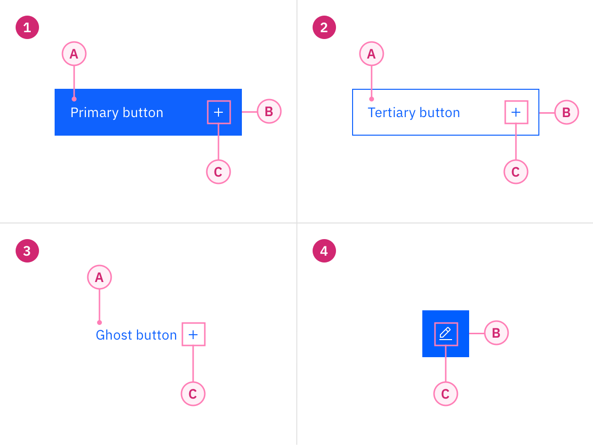

</Column>
</Row>

<Caption>Anatomy of buttons</Caption>

<Row>
<Column colSm={2} colMd={4} colLg={4}>

#### 1. Button

A. Label   B. Container   C. Icon (optional)

#### 3. Ghost button

A. Label   C. Icon (optional)

</Column>
<Column colSm={2} colMd={4} colLg={4}>

#### 2. Tertiary button

A. Label   B. Container   C. Icon (optional)

#### 4. Icon button

B. Container   C. Icon

</Column>
</Row>

### Button sizes

The button is available in seven different sizes: **extra small**, **small**,
**medium**, **large (productive)**, **large (expressive)**, **extra large**, and
**2XL**. The table below adds more context around the use case for each size.
For guidance on button heights, see [Size](/components/button/style/#size) on
the Style tab.

| Button size        | Use case                                                                                                                                          |
| ------------------ | ------------------------------------------------------------------------------------------------------------------------------------------------- |
| Extra small        | Use when vertical space is limited or in areas with a confined layout.                                                                            |
| Small              | Use when buttons are paired with 32px small sized input fields.                                                                                   |
| Medium             | Use when buttons are paired with 40px medium sized input fields.                                                                                  |
| Large (productive) | This is the most common button size in software products. Pairs with 14px body copy.                                                              |
| Large (expressive) | The larger expressive type size within this button provides balance when paired with 16px body copy. Used by the IBM.com team in website banners. |
| Extra large        | Use when buttons bleed to the edge of a larger component, like in the context of modals, side panel and narrow tearsheets.                        |
| 2XL                | Use when buttons bleed to the edge of a full-screen component, like in the context of large tearsheets.                                           |

<Row>
<Column colLg={8}>

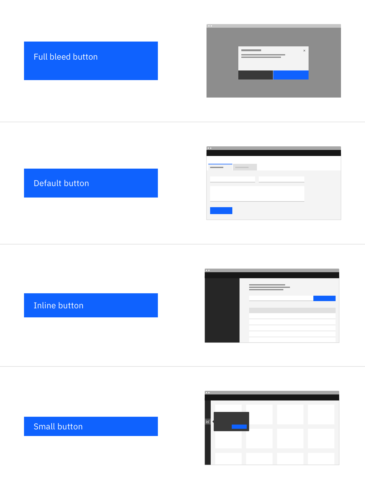

</Column>
</Row>

<Caption>Sizes of buttons in relation to its usage.</Caption>

### Emphasis

You don’t necessarily need to use the buttons in the order that their labels
imply. Although secondary buttons have less visual prominence because they are
less saturated than their primary counterparts, they are still tonally heavy. If
your layout requires multiple actions—as is the case with some toolbars, data
lists and dashboards—low emphasis buttons (tertiary or ghost) may be a better
choice.

The most important thing is to establish a visual hierarchy between the buttons
in your UI. Keep these best practices in mind.

#### A single, high-emphasis button

As a general rule, a layout should contain a single high-emphasis button that
makes it clear that other buttons have less importance in the hierarchy. This
high-emphasis button commands the most attention.

#### Multiple button emphasis

A high-emphasis button can be accompanied by medium- and low-emphasis buttons
that perform less important actions. Keep in mind that you should only group
together calls to action that have a relationship to one another.

<DoDontRow>
  <DoDont type="do" caption="Do use high-emphasis and medium-emphasis buttons in a button group.">

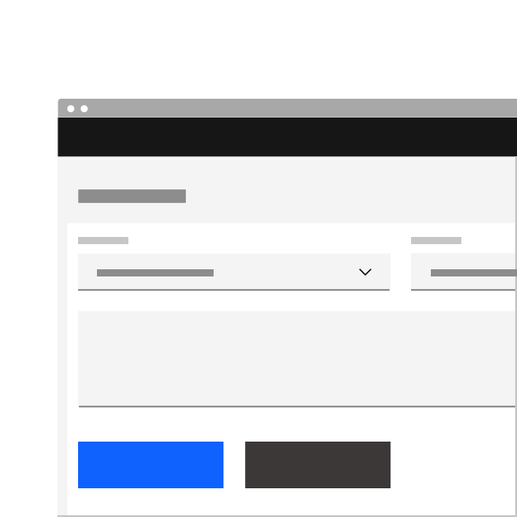

  </DoDont>
  <DoDont type="dont" caption="Do not use two high-emphasis buttons in a button group.">

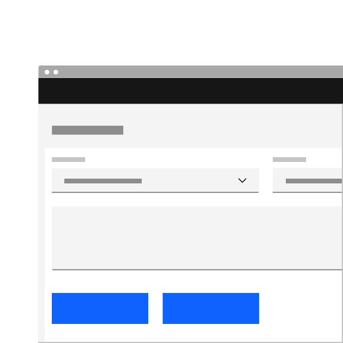

  </DoDont>
</DoDontRow>

### Alignment

Alignment refers to whether the buttons are aligned to the right or the left of
a window, container, or layout. Buttons are unique, more so than any other
component, in that their alignment depends on where they appear and whether or
not they’re contained within another component.

As a general rule, on full-page designs, the primary button is on the left side
of the page. When the browser window is large and the user is scrolling to read,
it’s best to have the primary button where the user’s attention has been focused
all along. Whereas in wizards, where a user is progressing through a series of
steps or dialog windows, the primary action traditionally sits at the bottom
right. Buttons within components such as notifications, search fields, and data
tables are also right-aligned.

In some cases a button group—or even a single button in the case of a side panel
or small tile—may span the entire width of a window or container. Typical nested
button locations include:

- Banner calls to action
- Dialog windows
- Wizards
- Forms
- Cards
- Toolbars

<Row>
<Column colLg={8}>

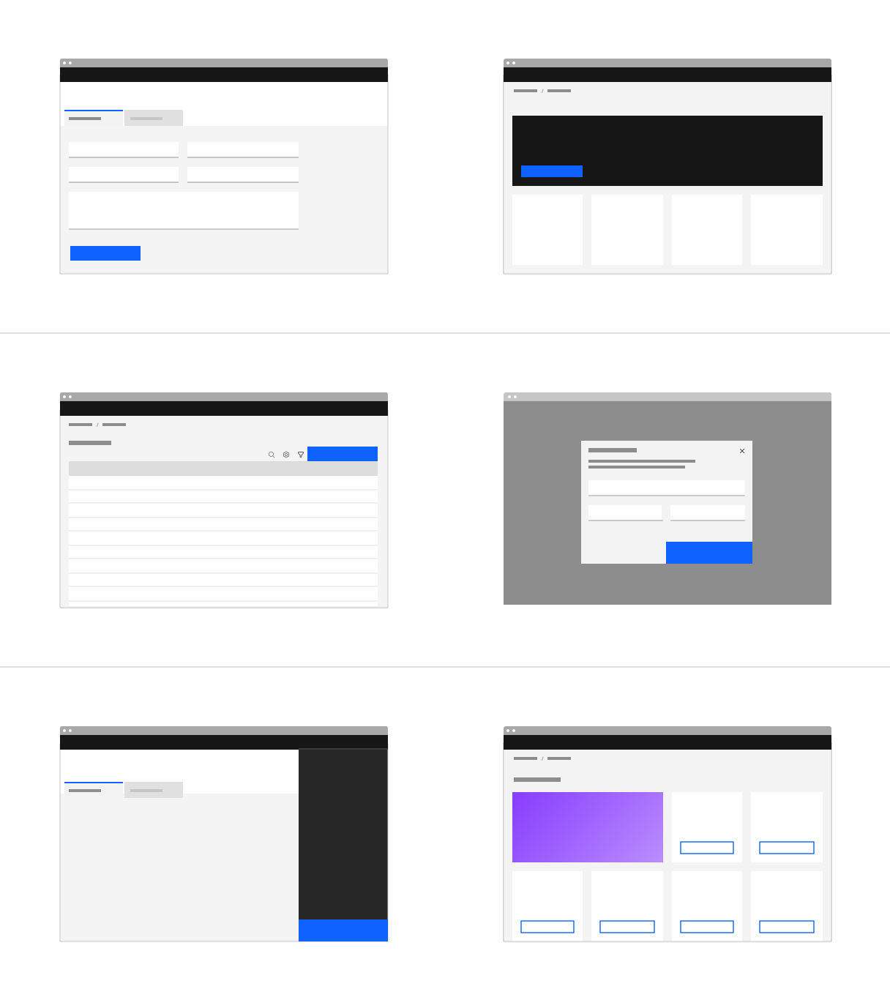

</Column>
</Row>

<Caption>Alignment of buttons across various layouts.</Caption>

| Alignment       | Use case                                                                                                                                                                                                                                                                                                                                  |
| --------------- | ----------------------------------------------------------------------------------------------------------------------------------------------------------------------------------------------------------------------------------------------------------------------------------------------------------------------------------------- |
| Left-justified  | Banner call to actions, in-page forms, and nested buttons in components like tiles.                                                                                                                                                                                                                                                       |
| Right-justified | Inline notifications, inline field buttons and data tables, progressive forms, wizards, and single-button dialogs.                                                                                                                                                                                                                        |
| Full-span       | Dialogs, side panel, and small tiles; currently Carbon does not offer a way to implement full-span buttons in code, without an override as mentioned [here](https://github.com/carbon-design-system/carbon/blob/66c14c2d2631a868703073a6cfabf1fd03a0b9e7/packages/styles/scss/components/button/_mixins.scss#L56), they max out at 320px. |

#### Fixed versus fluid buttons

Button alignment is also closely related to whether the button is treated as a
fixed or a fluid element within a layout. When we say “fixed,” there is a fixed
padding of 16px to the left and a 64px padding to the right of the button label.
The button label determines the button’s width. Refer to the
[Style tab](/components/button/style#button-structure) for more guidance.

When we say “fluid,” we mean that the button becomes a part of a larger,
compound component by bleeding to two or more edges of its container. Rather
than defining the fluid button in columns or mini units, its width is defined as
a percentage (often 50%) of the container’s width.

Within the layout of a page, primary, secondary, or tertiary variants of buttons
can have fluid widths. In more contained spaces, like in tearsheets or modals, a
ghost button can have a fluid width when paired with other buttons in a group.
Also, as a general rule, fluid buttons are never left-aligned in a layout or a
container—they’re either right-aligned or span the full width of the container.

<Row>
<Column colLg={8}>

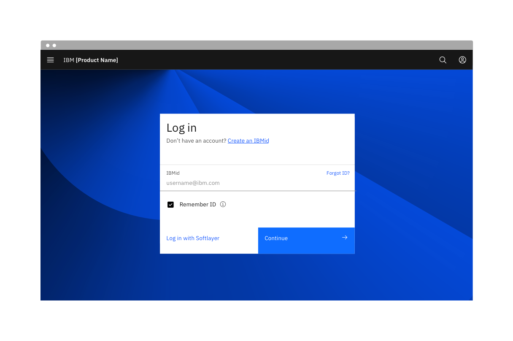

<Caption>Login screen using a fluid input field and a fluid button.</Caption>

</Column>
</Row>

<DoDontRow>
  <DoDont type="do" caption="Do bleed ghost button hovers when they are paired with other fluid buttons.">

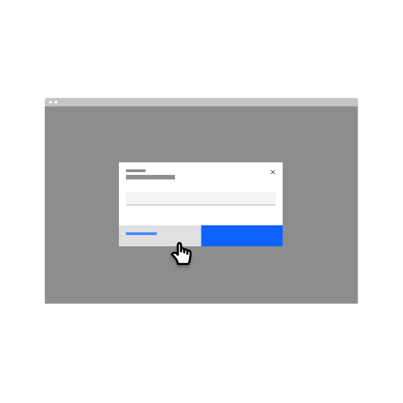

  </DoDont>
  <DoDont type="dont" caption="Do not use a tertiary button in a fluid application.">

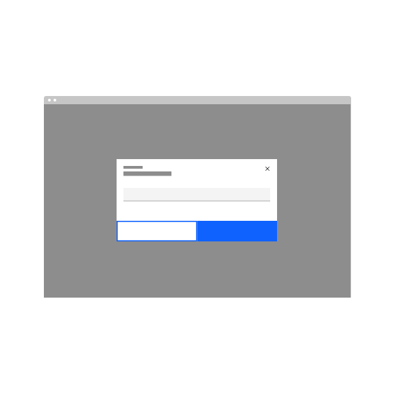

  </DoDont>
</DoDontRow>

#### Fluid button border

There is a 1px border between all fluid buttons that use the `$button-separator`
token for borders. This feature adds a 3:1 distinction between the two
interactive UI elements. The border is a recommended feature to improve
accessibility. Refer to the
[Style tab](/components/button/style#button-groups-structure) for more guidance.

<Row>
<Column colLg={8}>

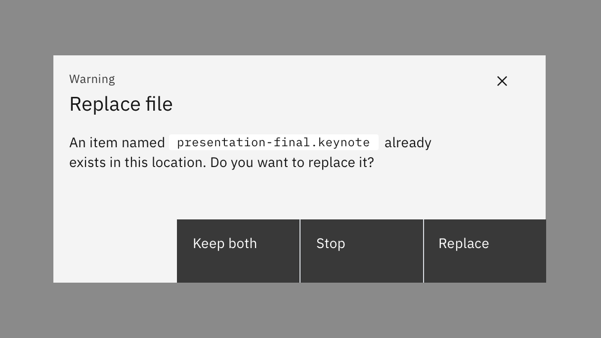

<Caption>
  Example of $button-separator token border between fluid buttons.
</Caption>

</Column>
</Row>

#### Fluid width buttons

There is a hybrid scenario where a floating primary, secondary, or tertiary
button can span a designated number of columns on the responsive column grid,
giving it a fluid width. These are called “fluid width buttons.”

Fluid width buttons are always preferable to fixed width default buttons in a
layout. When possible set the button container’s relative position to the
responsive layout grid and match the button width to the width of other elements
on the page. Ideally, when using groups of related buttons (not including ghost
buttons unless in a tearsheet or modal), they should all be the same width. See
button groups below for more detailed information.

<Row>
<Column colLg={8}>

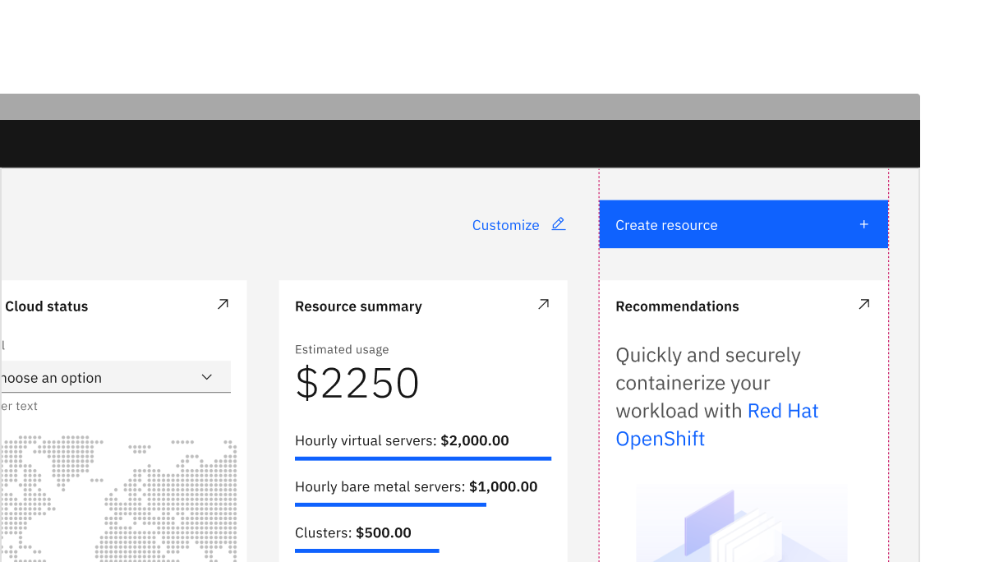

<Caption>
  Example of a primary button matching the width of a card in a layout.
</Caption>

</Column>
</Row>

### Button groups

Button groups are a useful way of aligning buttons that have a relationship.
Group the buttons logically into sets based on usage and importance. Too many
calls to action will overwhelm and confuse users so they should be avoided.

As mentioned in the [Emphasis section](#emphasis), you don’t necessarily need to
use the buttons in the order that their labels imply. Either a secondary or a
tertiary button can be used in conjunction with a primary button. In fact, due
to the visual weight of the secondary button, it’s recommended to use tertiary
or ghost buttons in layouts with more than three calls to action.

<Row>
<Column colLg={8}>

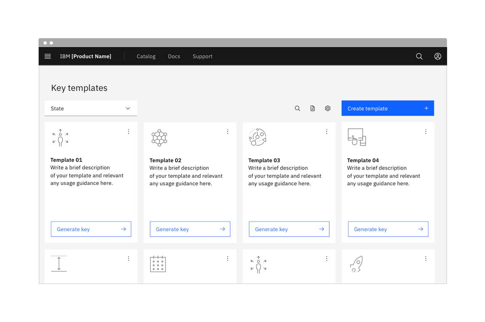

</Column>
</Row>

<DoDontRow>
  <DoDont type="do" caption="Do use a primary and two of the same lower emphasis buttons in a button group.">

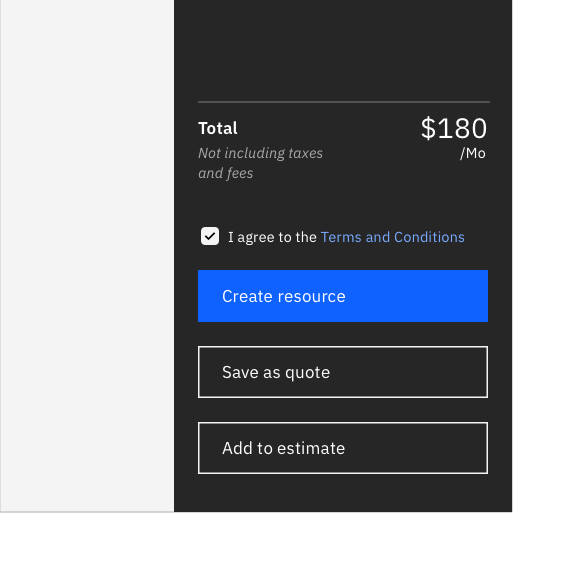

  </DoDont>
  <DoDont type="dont" caption="Do not mix primary, secondary, and tertiary buttons in the same button group.">

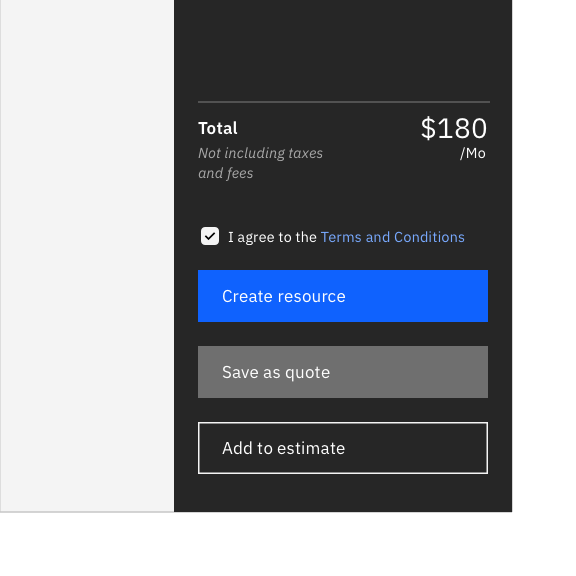

  </DoDont>
</DoDontRow>

#### Button groups and the grid

Ideally, when using groups of related buttons (not including ghost buttons),
they should all be the same width. This can be achieved in one of two ways, both
of which are acceptable. The first approach involves using the
[narrow gutter mode](/elements/2x-grid/implementation#gutter-modes). In this
situation each button would be set individually on the column grid. _Note:
Carbon developers are working on the narrow gutter mode, currently left-hanging
buttons can only be achieved with an override._

<Row>
<Column colLg={8}>

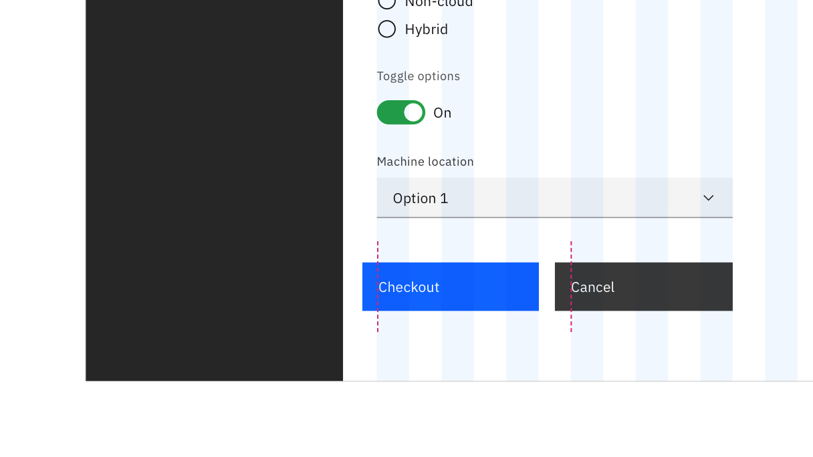

<Caption>Example of hanging buttons</Caption>

</Column>
</Row>

Some products don’t want to hang their buttons into the gutter, but still want a
16px distance between buttons. This can be achieved while maintaining same-width
buttons by treating the button group as a single object (rather than two
separate entities) on the grid. Each button will essentially span 50% of their
container with a programmatic 16px gutter between them.

<Row>
<Column colLg={8}>

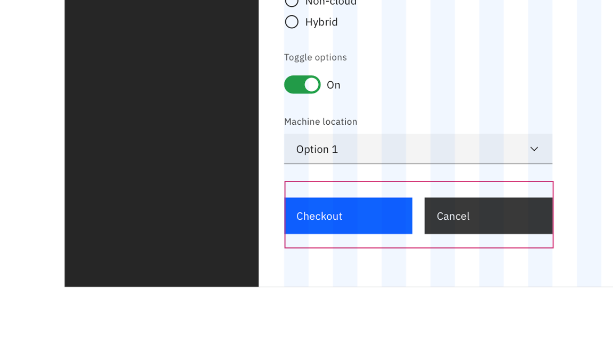

<Caption>
  Here the button group is treated as one element on the grid to achieve a 16px
  gutter between the two, without gutter hang.
</Caption>

</Column>
</Row>

<DoDontRow>
  <DoDont type="do" caption="Do apply the same width to all buttons in a group, even if they don’t bleed.">

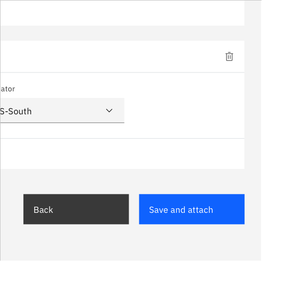

  </DoDont>
  <DoDont type="dont" caption="Do not make buttons in a group different widths.">

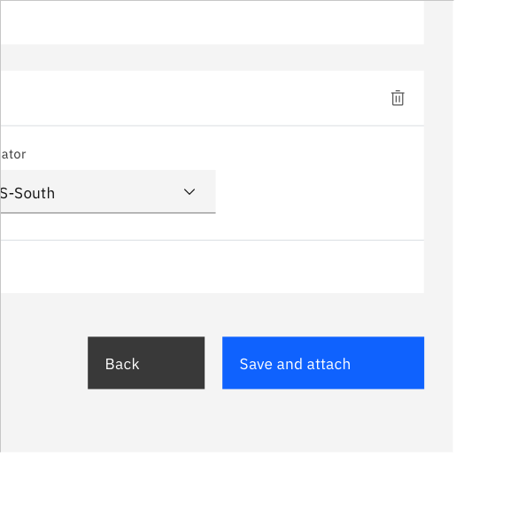

  </DoDont>
</DoDontRow>

#### Horizontally arranged groups

When using multiple buttons, the position of the primary button adheres to the
[alignment guidance](#alignment) above. To sum up, a primary button will be
left-aligned and positioned to the left of the secondary/tertiary button on
full-page designs. The primary button will be right-aligned and appear to the
right of the secondary/tertiary button within wizards and dialog windows.

<InlineNotification>

**Note:** This guidance has changed. Previously we advocated maintaining the
primary button position to the right of the secondary button when the button
group was left-aligned. After talking to teams and doing more research, we’ve
revised our position.

</InlineNotification>

<Row>
<Column colLg={8}>

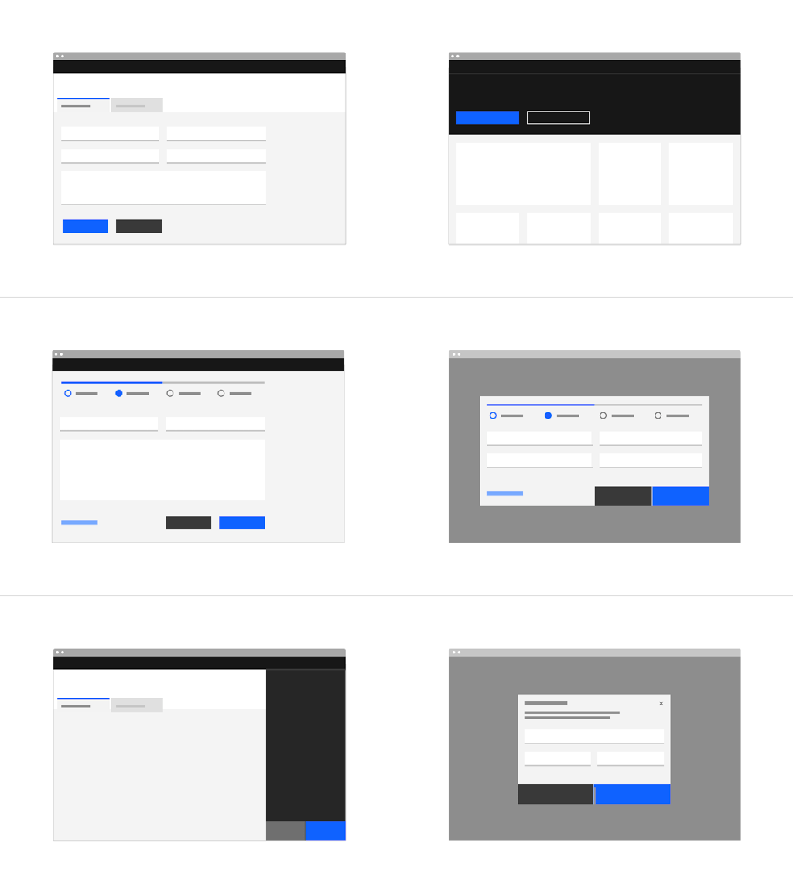

</Column>
</Row>

#### Stacked button groups

Typical product landing pages have buttons side by side. However vertical button
groups are also common in products, to save real estate in narrow columns and
occasionally side panels. In these instances, the primary button is always on
top and the secondary or tertiary button is below.

Generally, when designers stack buttons, they tend to use the hybrid fluid
buttons. However, stacked fluid buttons are also an option in desktop side
panels with especially long calls to action. _Note: experimenting with stacked
fluid buttons would require an override to the existing code._

<Row>
<Column colLg={12}>

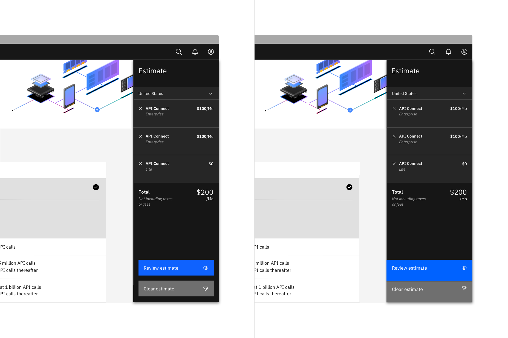

</Column>
</Row>

#### Groups with Danger buttons

Danger buttons have a different visual style to inform users of potentially
destructive actions they are about to take. Within a set, use the primary danger
button style.

<Row>
<Column colLg={8}>

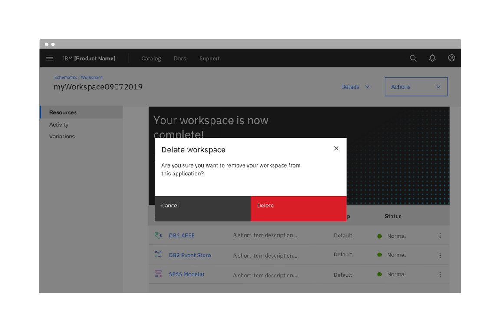

</Column>
</Row>

## Content

### Main elements

#### Button label

A button’s label is the most important element on a button, as it communicates
the action that will be performed when the user interacts with it. Buttons need
to be clear and predictable.

Button labels should clearly indicate the action of the button. To provide
enough context, use the &#123;verb&#125; + &#123;noun&#125; content formula on
buttons except in the case of common actions like “Done”, “Close”, “Cancel”,
“Add”, or “Delete”.

There are exceptions to this rule for situations in which button length could
cause problems in compact UIs or negatively impact translation, but the
&#123;verb&#125; + &#123;noun&#125; formula is still best practice.

By default Carbon uses sentence case for all button labels.

For consistency, see Carbon’s
[content guidelines](/guidelines/content/action-labels) for a list of
recommended action labels.

<DoDontRow>
  <DoDont type="do" caption="Do use the {verb} + {noun} content formula in buttons whenever possible.">

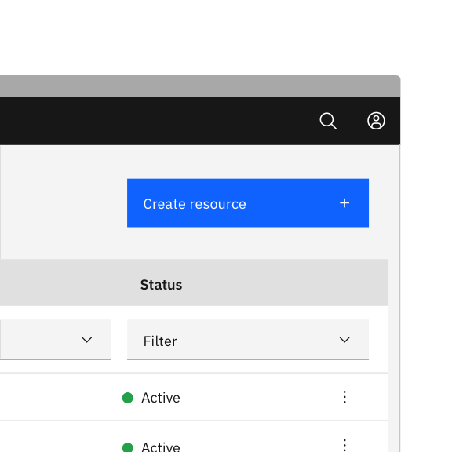

  </DoDont>
  <DoDont type="dont" caption="Do not use only a noun as a button label.">

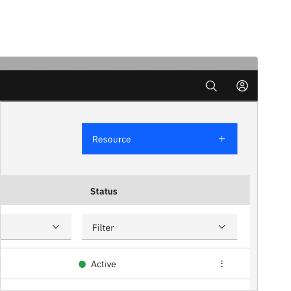

  </DoDont>
</DoDontRow>

<Title>Label alignment</Title>

<DoDontRow>
  <DoDont type="do" caption="Do left-align the label in a button, even if the button is wide.">

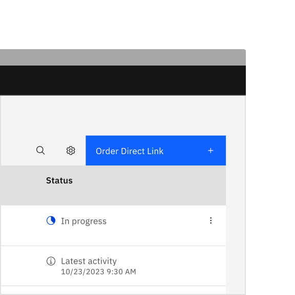

  </DoDont>
  <DoDont type="dont" caption="Do not center align the label in a button, even if the button is wide.">

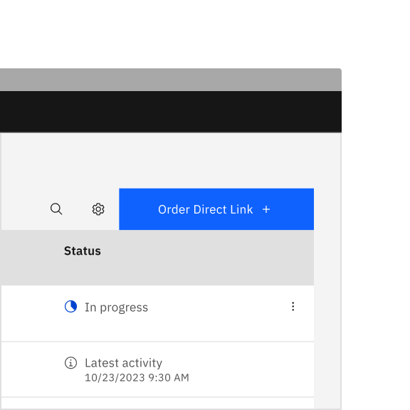

  </DoDont>
</DoDontRow>

#### Internationalization (RTL)

For right-to-left (RTL) languages, the entire button is mirrored horizontally.
The label is right-aligned and the icon is left-aligned.

<Row>
<Column colLg={8}>

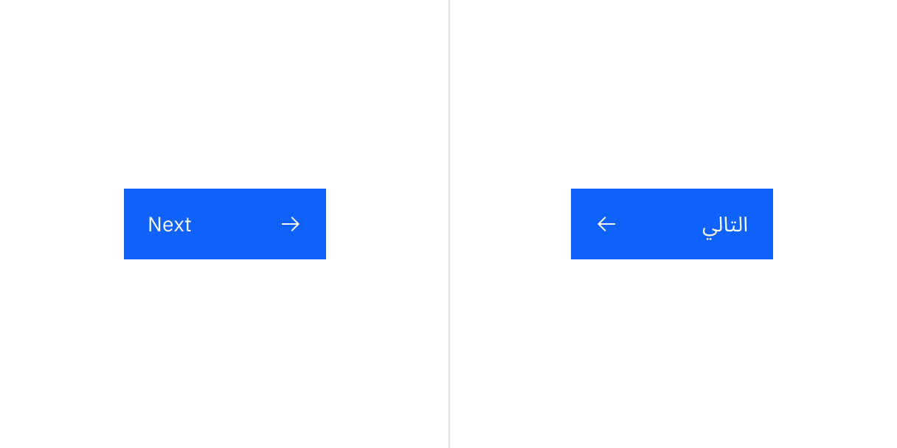

</Column>
</Row>

<Caption>Primary button without and with RTL.</Caption>

### Overflow content

When the button’s label is too long to fit within the available space of the
button, the label should overflow and wrap to the second line. We do not
recommend truncating a button label.

As mentioned above, it is best practice to keep button label succinct and follow
the &#123;verb&#125; + &#123;noun&#125; content formula.

<DoDontRow>
  <DoDont type="do" caption="Do wrap the button label to a second line if there’s overflow content.">

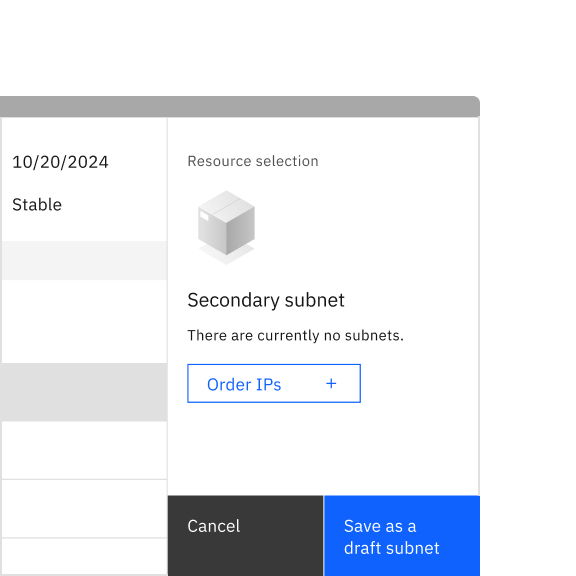

  </DoDont>
  <DoDont type="dont" caption="Do not truncate the label of a button if there’s insufficient space inside the button.">

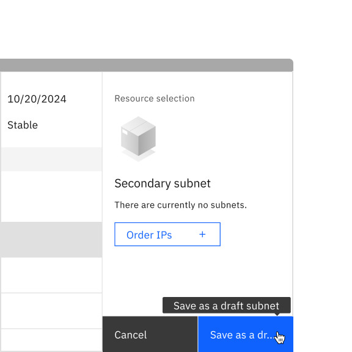

  </DoDont>
</DoDontRow>

### Further guidance

For further content guidance, see Carbon’s
[content guidelines](https://carbondesignsystem.com/guidelines/content/overview/).

## Universal behaviors

### Primary button focus

The primary button is the default action. When dialogs appear, the primary
button typically takes focus. On a form, if focus is on a component that is not
actionable with the `Enter` key, pressing `Enter` will activate the primary
button.

<Row>
<Column colLg={8}>

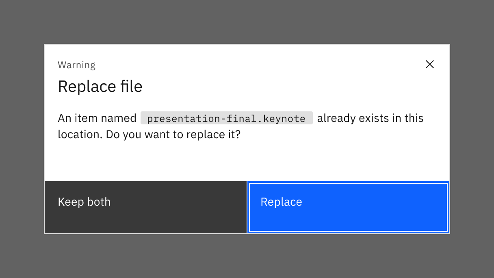

</Column>
</Row>

<Caption>
  Primary button takes default focus when there’s no other actionable component
  in a dialog.
</Caption>

### States

The default and interactive states of buttons should follow the
button [Style](/components/button/style#color) tab guidelines.

### Interactions

#### Mouse

Users can trigger a button by clicking anywhere within the button container.

<Row>
<Column colLg={8}>

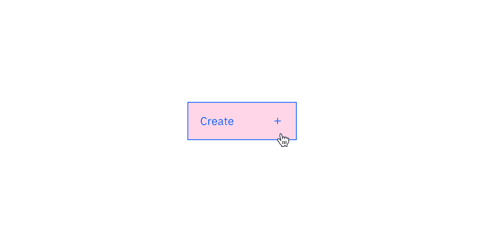

</Column>
</Row>

<Caption>Mouse interaction for button.</Caption>

#### Keyboard

Users can trigger a button by pressing `Enter` or `Space` while the button has
focus. For additional keyboard interactions, see the
[Accessibility](/components/button/accessibility) tab.

### Loading

Buttons can have
[inline loading](https://carbondesignsystem.com/components/inline-loading/usage/)
that provides visual feedback that the action is in process. The button would be
disabled when inline loading is in progress.

<Row>

<Column colLg={8}>
<GifPlayer color='dark'>

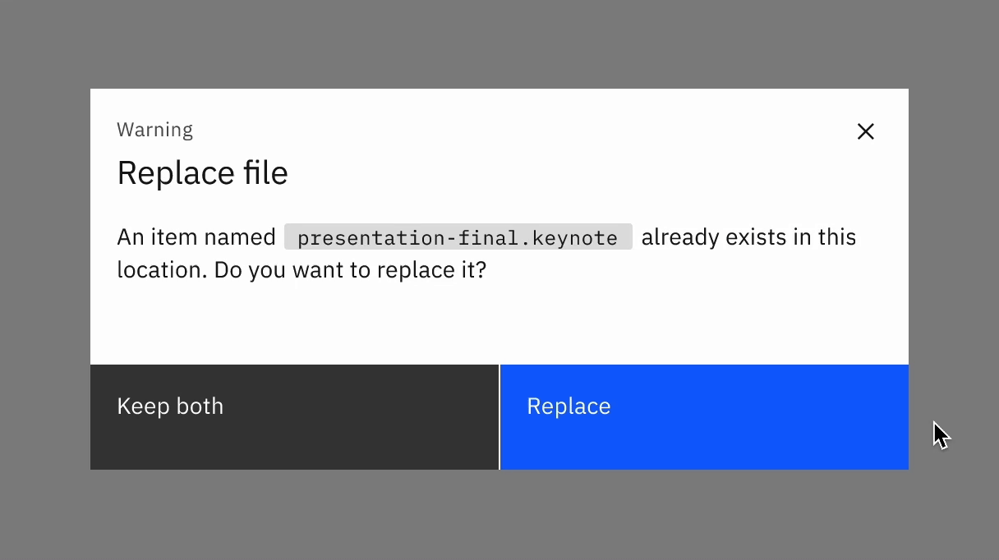

</GifPlayer>
</Column>
</Row>

<Caption>Inline loading in the context of a button.</Caption>

## Primary button

Primary button is used for the principal call to action on the page. Primary
button should only appear once per screen (the only exceptions are temporary
flows with primary actions). Primary button helps give the user focus and gives
them context behind the expected next step.

<Row>
<Column colLg={12}>

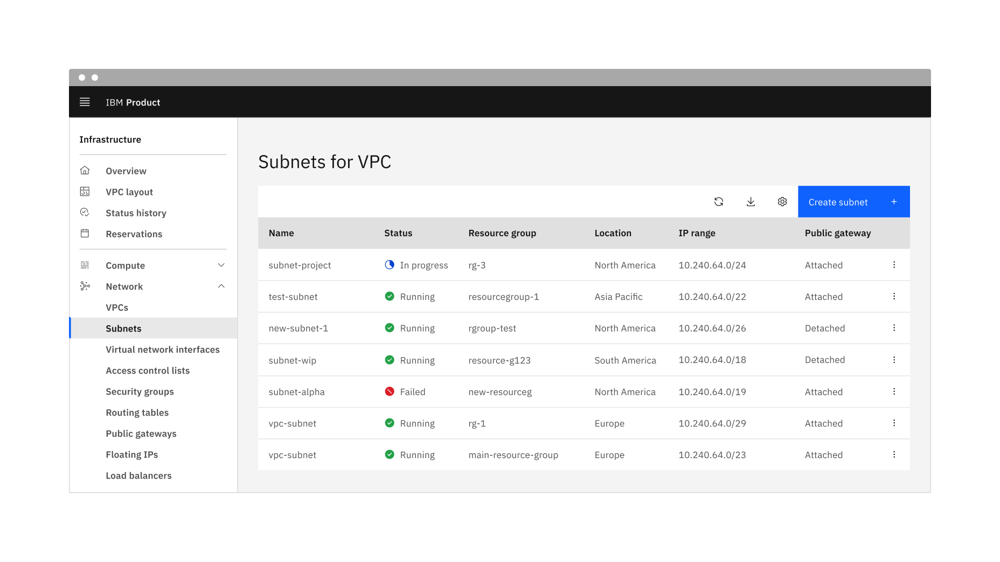

</Column>
</Row>

<Caption>Primary button in the context of a product UI.</Caption>

#### Temporary flows with primary action

There may be times when there is a primary button on a page, but through
interaction with the page content, another flow may be launched that has its own
primary button. Temporarily, there may be two primary buttons on a page.

In this case, a user has triggered something with an intention to focus on
another flow, therefore temporarily having two primary buttons on a page is
acceptable. This is the only scenario where having two primary actions on a page
is advised.

<Row>
<Column colLg={12}>

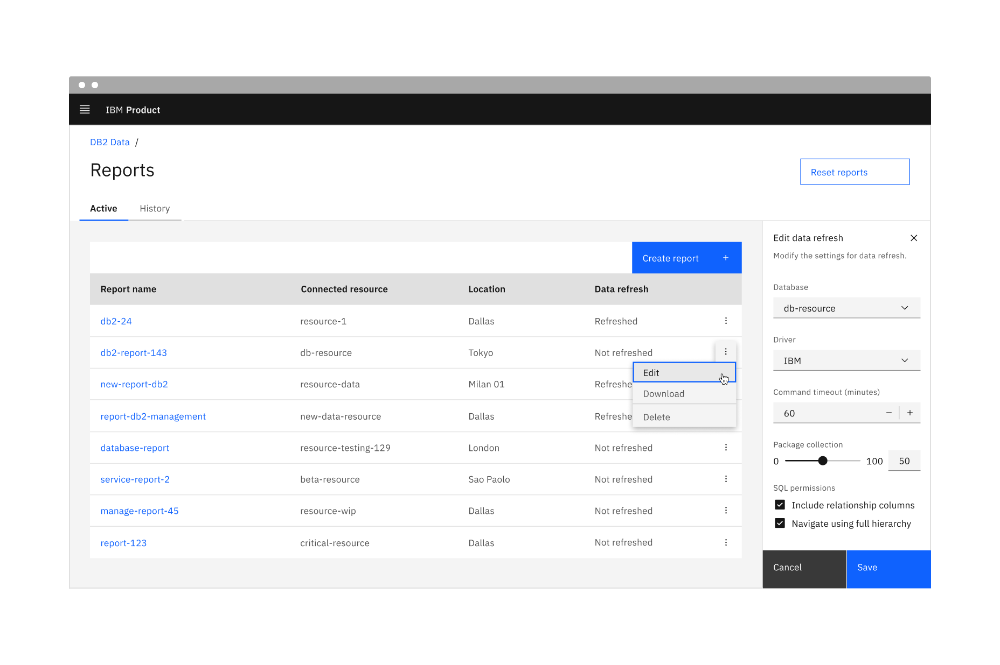

</Column>
</Row>

<Caption>
  A temporary user flow where a data table with primary action has an open side
  panel with its own primary action.
</Caption>

### Best practices

#### Not every page needs a primary button

Sometimes the primary purpose of the page is to interact with other components
or read over content, rather than to trigger an action. In this case, use
tertiary and ghost buttons for these supporting actions or experiences.

<Row>
<Column colLg={8}>

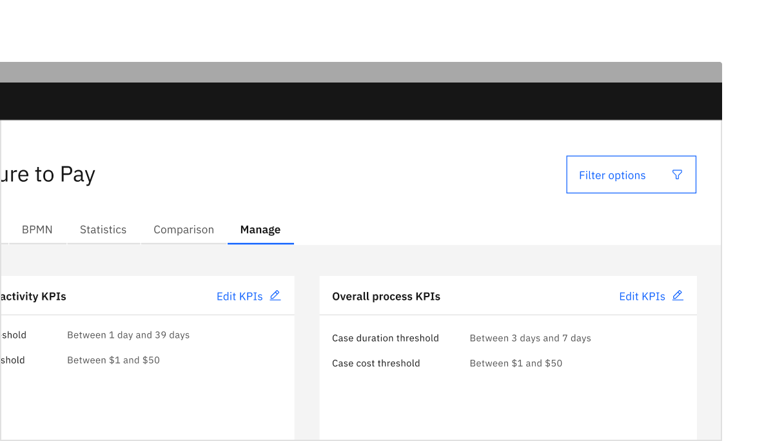

</Column>
</Row>

<Caption>
  The primary intent of this page is to present content, with actions like
  filtering and editing represented by tertiary and ghost buttons.
</Caption>

## Secondary button

As mentioned in the [Emphasis section](#emphasis),  secondary buttons are
tonally heavy but have less visual prominence than their primary counterparts
due to their lower saturation. As a result, secondary buttons are intended to be
used in conjunction with a primary button. When used in a pair, the secondary
button executes the set's negative action, like "Cancel" or "Back."

<Row>
<Column colLg={12}>

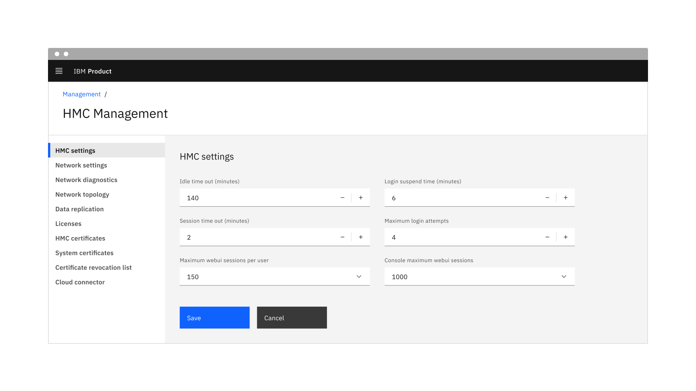

</Column>
</Row>

<Caption>Secondary button in the context of a product UI.</Caption>

Secondary buttons should not be used in isolation or for a positive/primary
action. See [button groups](#button-groups) for more guidance on how to use
secondary buttons.

<DoDontRow>
  <DoDont type="do" caption="Do use the secondary button in conjunction with the primary button.">

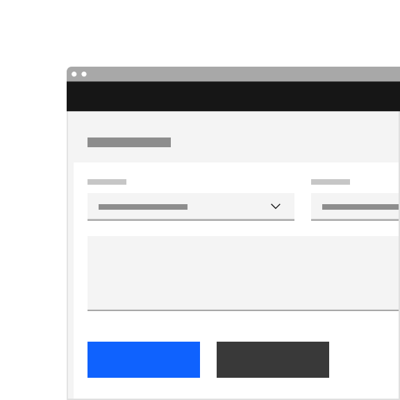

  </DoDont>
  <DoDont type="dont" caption="Do not use the secondary button in isolation or for a positive/primary action.">

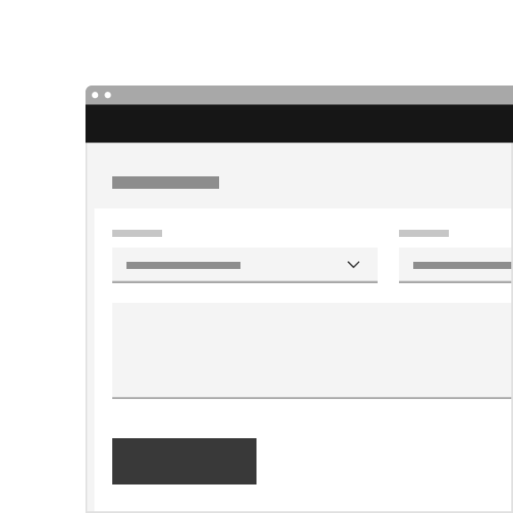

  </DoDont>
</DoDontRow>

## Tertiary button

Tertiary buttons have less prominence than a primary button and slightly more
prominence than a ghost button. Tertiary buttons work well on their own or as
part of a button group.

<Row>
<Column colLg={12}>

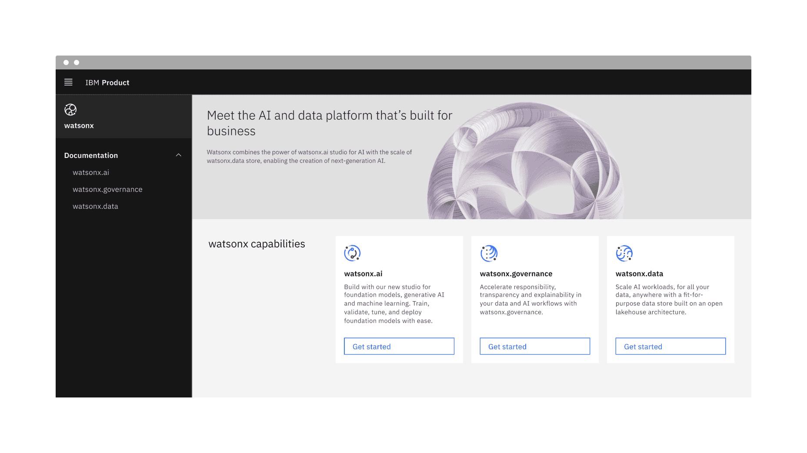

</Column>
</Row>

<Caption>Tertiary button in the context of a product UI.</Caption>

Tertiary buttons should stay aligned with the content of the page. Always make
sure the tertiary button has adequate padding on all sides. As mentioned in the
[fluid button guidance](#alignment), tertiary buttons should not be used in
fluid arrangements.

<DoDontRow>
  <DoDont type="do" caption="Do align the tertiary button with the rest of the content.">

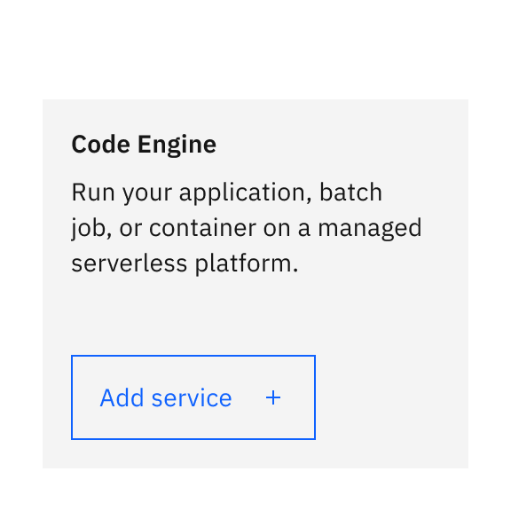

  </DoDont>
  <DoDont type="dont" caption="Do not use a tertiary button in a fluid arrangement.">

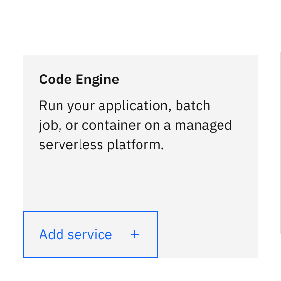

  </DoDont>
</DoDontRow>

### Best practices

#### Tertiary buttons for page headers

It is challenging to use a primary button in the header of a page because the
content beneath the header is probably going to have a primary action, or will
in a future release. Even if the the button in the page header is not styled as
a primary button, it has significant prominence due to its hierarchical
placement at the top.. Therefore, it is advised to use a tertiary button for
page headers.

If it is determined that the button in the page header, across all tabs, should
be primary, ensure none of the content below the header contain another primary
action.

<DoDontRow>
  <DoDont type="do" caption="Do use a tertiary button in the page header if there is a primary button in the content section.">

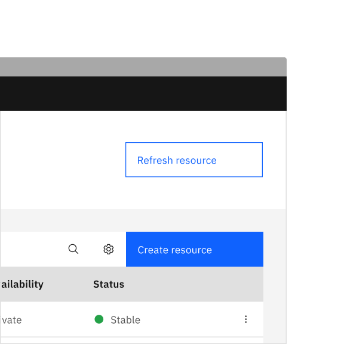

  </DoDont>
  <DoDont type="dont" caption="Do not use a primary button in the page header and the content section.">

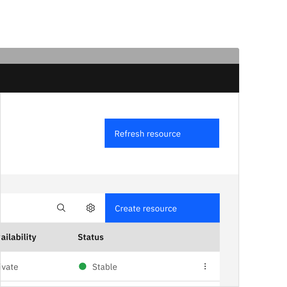

  </DoDont>
</DoDontRow>

#### Tertiary buttons in button groups

In [button groups](#button-groups), where there is one primary and two other
actions with shared importance, consider using tertiary buttons.

<Row>
<Column colLg={8}>

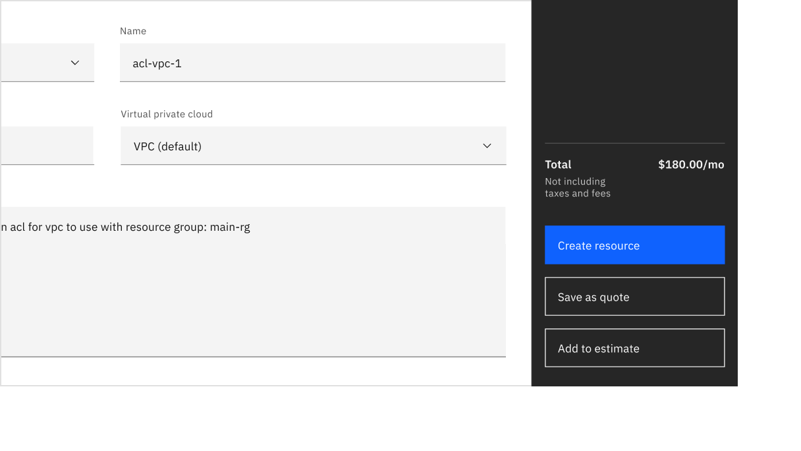

</Column>
</Row>

<Caption>Example of tertiary buttons used in button groups.</Caption>

#### Tertiary buttons in empty states

For empty states that appear on pages that already have the primary action
defined, a tertiary button is the ideal solution to launch a new task flow.

<Row>
<Column colLg={8}>

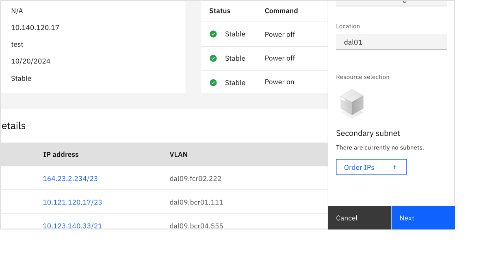

</Column>
</Row>

<Caption>Example of a tertiary button used with empty state content.</Caption>

## Ghost button

Ghost buttons have the least prominence among the button variants. Ghost buttons
are more subtle, making them ideal for supplementary actions. They work best
when they are flush against a container or horizontally grouped with other
elements.

<Row>
<Column colLg={12}>

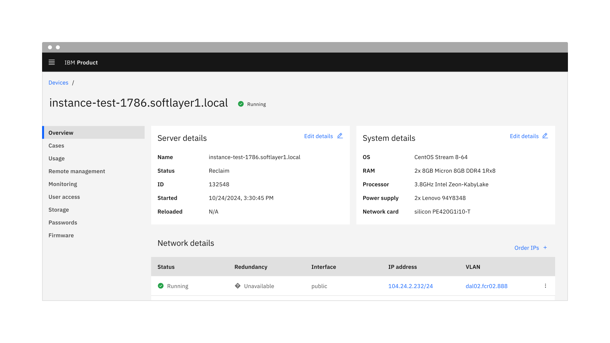

</Column>
</Row>

<Caption>Ghost button in the context of a product UI.</Caption>

#### Aligning ghost buttons

Ghost buttons work well when aligned to a corner of a container. The general
rule for vertically aligning a ghost button with other content is to ensure its
label aligns with the text elsewhere on the page.

<DoDontRow>
  <DoDont type="do" caption="Do align the ghost button label with the rest of the content.">

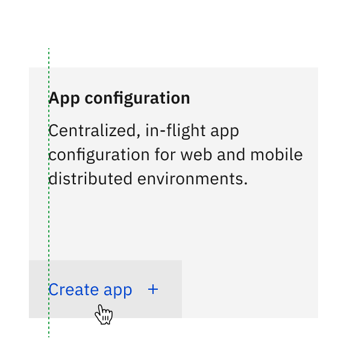

  </DoDont>
  <DoDont type="dont" caption="Do not align the edge of the ghost button with the rest of the content, even if it looks partially aligned.">

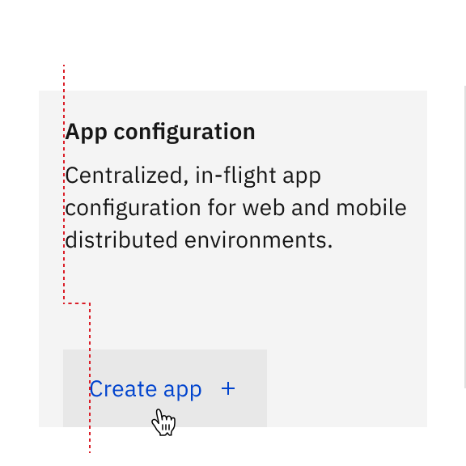

  </DoDont>
</DoDontRow>

Ghost buttons can be useful for small supplementary actions in side panels. In
this context, extending the width of the ghost button to the full width of the
container makes this treatment seem intentional. Aligning to the full width of a
container is only recommended when the containers are smaller in size such as a
side panel of 480px (medium) and below.

<DoDontRow>
  <DoDont type="do" caption="Do extend the ghost button to the full width of the side panel.">

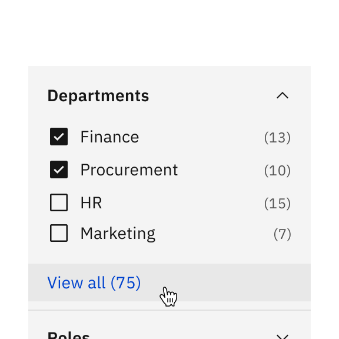

  </DoDont>
  <DoDont type="dont" caption="Do not leave a ghost button hanging halfway within the side panel.">

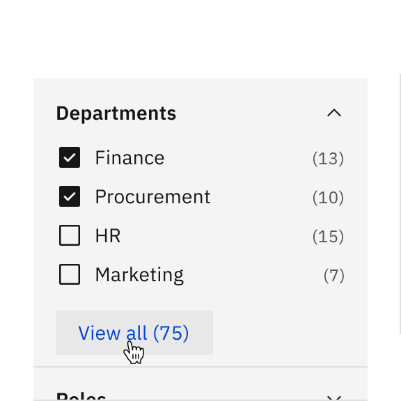

  </DoDont>
</DoDontRow>

Ghost buttons can also be aligned horizontally and inline with other components
on the page.

<Row>
<Column colLg={8}>

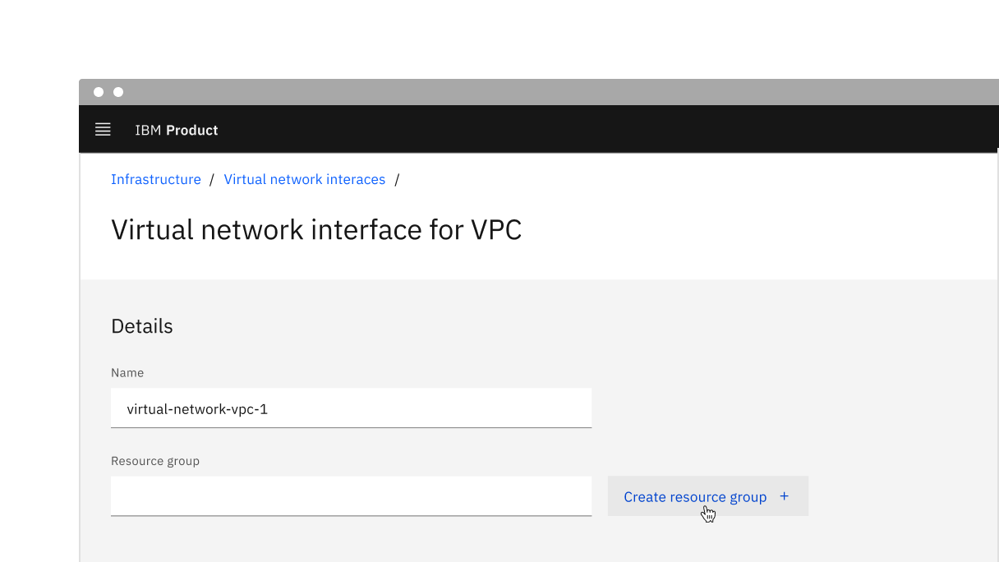

</Column>
</Row>

<Caption>
  Example of a ghost button aligned horizontally and inline with a component.
</Caption>

### Best practices

#### Ghost buttons for data table actions

Buttons in the table toolbar are often depicted as a primary button, but this
might not always be the case. Use a ghost button instead if there is another
button on the page that requires primary styling.

<Row>
<Column colLg={8}>

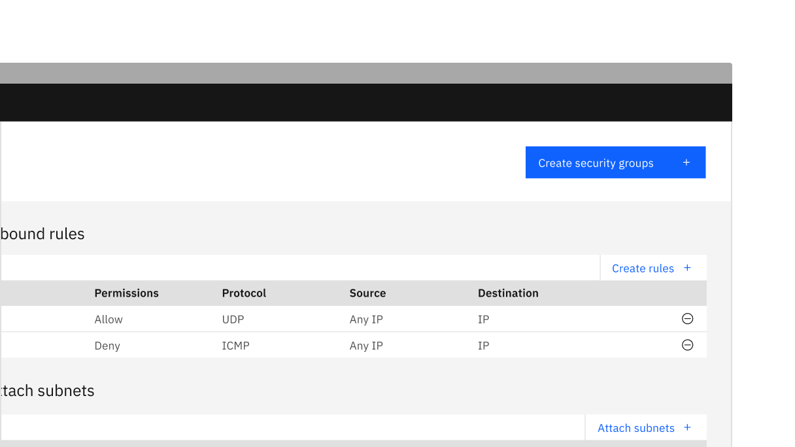

</Column>
</Row>

<Caption>
  A ghost button represents the data table's primary action to avoid conflict
  with the primary button in the page header.
</Caption>

#### Ghost buttons in productive cards

In dashboards with multiple productive cards, ghost buttons work well as they
draw less attention than a tertiary button. For a ghost button to appear aligned
in vertical arrangements within a container, it is recommended that it touches
at least two edges of the container.

See
the [cards component](https://pages.github.ibm.com/carbon/ibm-products/components/card/overview/)
for more details.

<Row>
<Column colLg={8}>

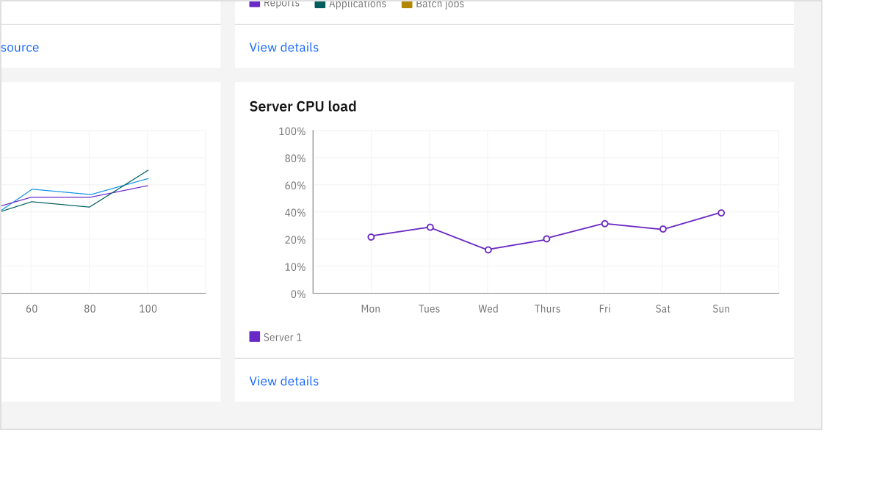

</Column>
</Row>

<Caption>Example of a ghost button used in cards.</Caption>

#### Ghost button used as a cancel action

Ghost buttons work well as a cancel button in progressive flows, as they draw
less attention; users have to purposefully find and click the button to cancel.
In tearsheets, the buttons are fluid, which wouldn’t be a suitable application
for a tertiary button.

<Row>
<Column colLg={12}>

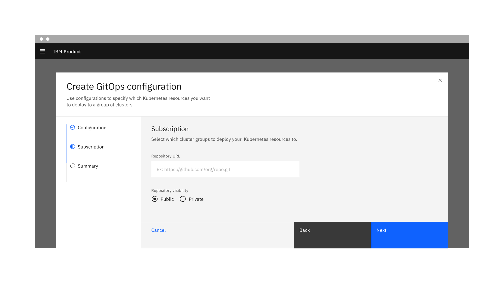

</Column>
</Row>

<Caption>Example of ghost button used in a modal.</Caption>

## Danger button

Danger button is used for actions that could have destructive effects, such as
“Delete”, “Remove”, or “Stop”.

The danger button has three different styles:
[primary](/components/button/style#danger-primary-button-color.mdx),
[tertiary](/components/button/style#danger-tertiary-button-color.mdx), and
[ghost](/components/button/style#danger-ghost-button-color.mdx). Determining
which danger button style to use will depend on the level of emphasis you want
to give to the destructive action. Destructive actions that are a required or
primary step in a workflow should use the primary danger button style. However,
if a destructive action is just one of several actions a user could choose from,
then a lower emphasis style like the tertiary danger button or the ghost danger
button may be more appropriate.

<Row>
<Column colLg={8}>

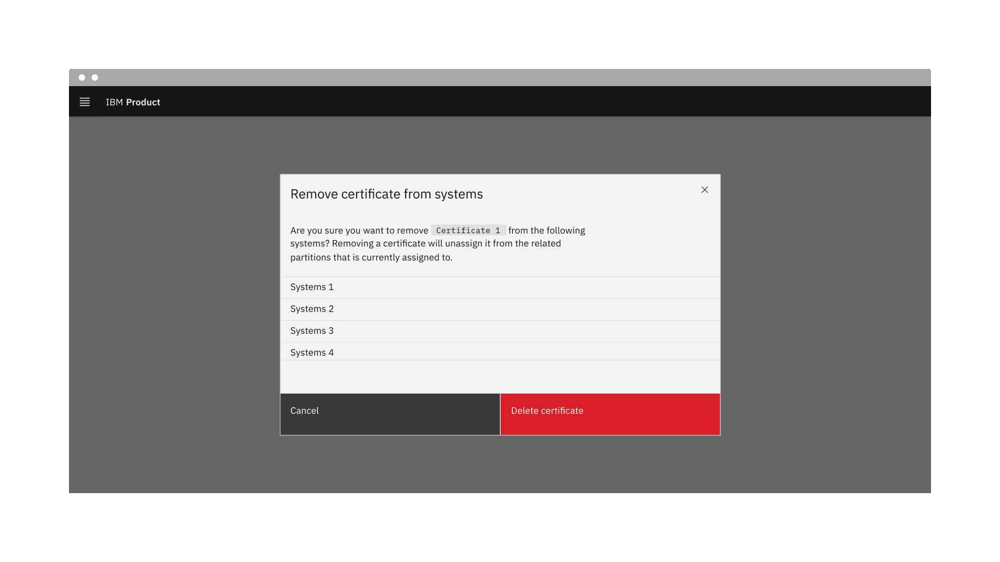

</Column>
</Row>

<Caption>Danger button in the context of a product UI.</Caption>

<DoDontRow>
  <DoDont type="do" caption="Do use a tertiary danger button for lower emphasis destructive actions.">

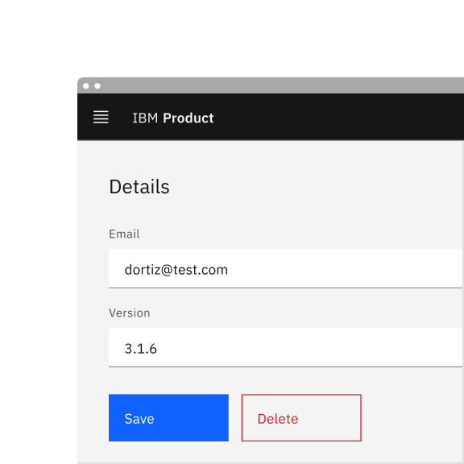

  </DoDont>
  <DoDont type="do" caption="Do use a ghost danger button for lower emphasis destructive actions.">

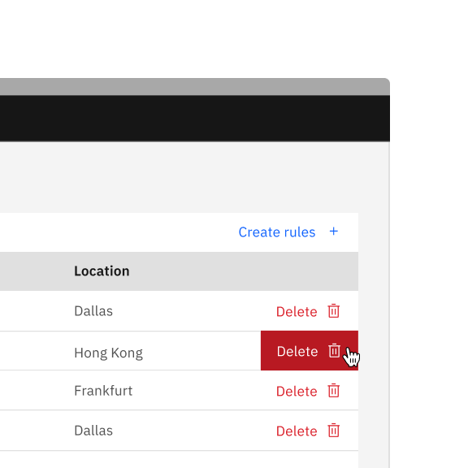

  </DoDont>
</DoDontRow>

## Modifiers

### Button with icon

Icons can be placed next to labels to clarify an action and call attention to a
button. However, icons should be used sparingly, as overuse can create visual
noise and make an experience less usable. If you use a button with an icon in
one part of your UI it does not mean that you need to add icons to all other
buttons.

- Use a 16px icon within buttons; use a 20px icon within the large expressive
  buttons.
- Icons are distinguished by their solid shape and knocked-out details.
- Icons should always appear to the right of the label.
- Icons used in buttons must be directly related to the action that the user is
  taking.
- Icons must match the color value of the label within a button.

<DoDontRow>
  <DoDont type="do" caption="Do place the icon on the right side of the button after the label.">

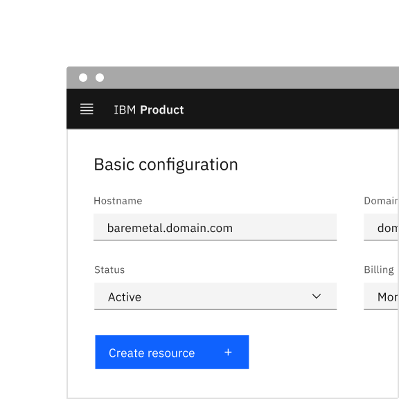

  </DoDont>
  <DoDont type="dont" caption="Do not place the icon to the left of the label on the button.">

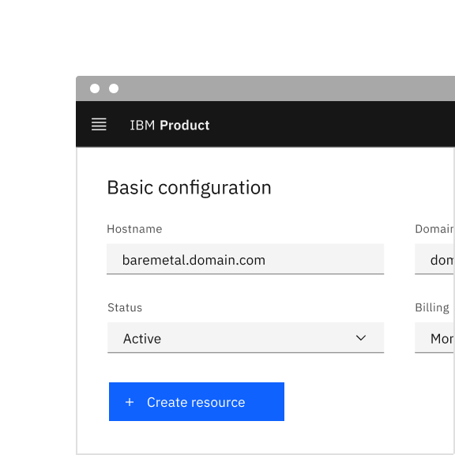

  </DoDont>
</DoDontRow>

<DoDontRow>
  <DoDont type="do" caption="Do use 8px spacing between the label and the icon in a ghost button.">

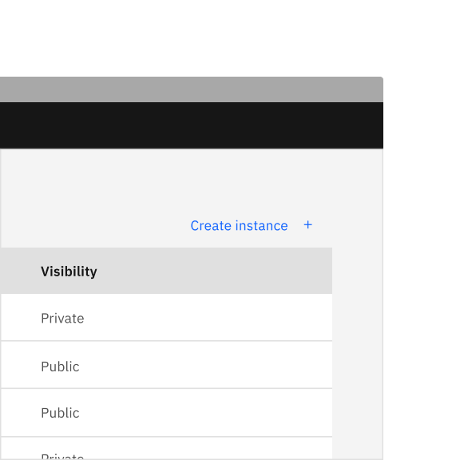

  </DoDont>
  <DoDont type="dont" caption="Do not leave too much space between the label and the icon in a ghost button.">

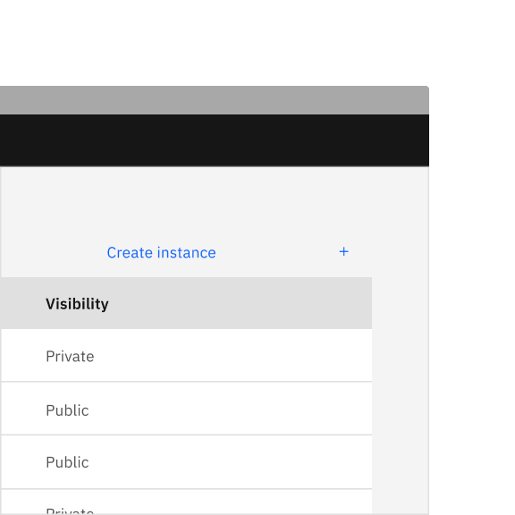

  </DoDont>
</DoDontRow>

#### Universal actions with well-established icons

When deciding whether to add an icon to a button, it’s important to consider how
recognizable the icon is and whether, in other contexts, a similar icon may be
used for a different meaning. We want to avoid the same icon being used for
completely different actions.

For this reason, we have defined a set of universal actions suitable for adding
an icon alongside the button label. These have clearly defined and widely
recognized icons within IBM Software and beyond.

Icons that are not in this list can be used in buttons, as long as the icon
clearly conveys the intended action. To determine the expected use of an icon,
check its name in the
[Carbon icon library](https://carbondesignsystem.com/elements/icons/library/).

| Name of action | Associated icon                                    | Name in icon library |
| -------------- | -------------------------------------------------- | -------------------- |
| Create/Add     | <Add size={16} aria-label="Add" />                 | Add                  |
| Edit           | <Edit size={16} aria-label="Edit"/>                | Edit                 |
| Copy           | <Copy size={16} aria-label="Copy"/>                | Copy                 |
| Delete         | <TrashCan size={16} aria-label="Trash can"/>       | Trash can            |
| Remove         | <SubtractAlt size={16} aria-label="Subtract alt"/> | Subtract alt         |
| Export         | <Export size={16} aria-label="Export"/>            | Export               |
| Upload         | <Upload size={16} aria-label="Upload"/>            | Upload               |
| Download       | <Download size={16} aria-label="Download"/>        | Download             |
| Play/Start     | <Play size={16} aria-label="Play"/>                | Play                 |
| Pause          | <Pause size={16} aria-label="Pause"/>              | Pause                |
| Stop           | <StopOutline size={16} aria-label="Stop outline"/> | Stop outline         |
| Refresh        | <Restart size={16} aria-label="Restart"/>          | Restart              |

Do you think a universal action with a clearly defined icon is missing? Let us
know [here](https://github.com/carbon-design-system/carbon/issues/new/choose).

#### Do not use a defined icon to represent a different universal action

Using icons in the above list for other actions can confuse the expected outcome
and experience.

<DoDontRow>
  <DoDont type="do" caption="Do use a defined icon to represent a universal action.">

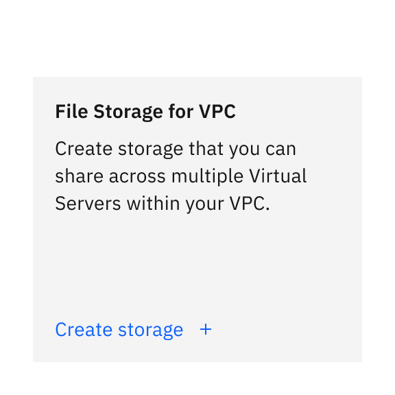

  </DoDont>
  <DoDont type="dont" caption="Do not use an icon for an action that would not be associated with it.">

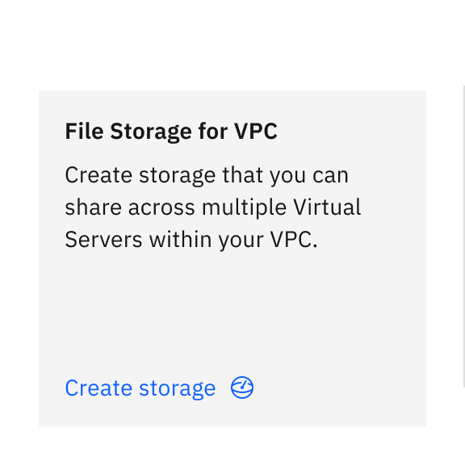

  </DoDont>
</DoDontRow>

#### Launch icon

The launch icon should be used on any call to action that launches the user into
another tab (whether the content of the new tab is part of the same product or
an entirely separate web resource). Buttons and links requiring the launch icon
are often found in the UI left navigation area, side panel, cards, and modals.
The target destination of the launch action should be made clear to the user
through the button or link label and the surrounding context.

_For IBMers only:_ See the
[navigation labels](https://pages.github.ibm.com/carbon/ibm-products/guidelines/content/navigation-labels/)
of our content guide.

<Row>
<Column colLg={8}>

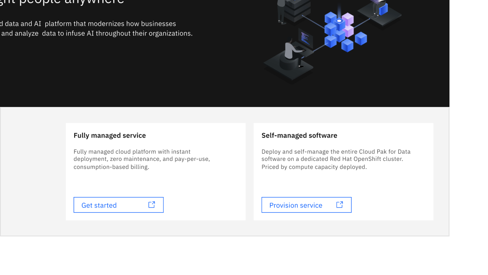

</Column>
</Row>

<Caption>
  Example of a tertiary button with icon indicating that clicking the button
  would launch a new page.
</Caption>

#### Be consistent with icon usage for buttons in a button group

Using icons in button groups is optional. We recommend showing an icon for each
button in a button group or showing no icons for consistency. A benefit of
pairing an icon with a button label is that it visually describes its action and
directs more attention to it. However, in some cases, using too many buttons
with icons in a group can create unwanted noise in the UI and tend to
overcomplicate a simple experience.

Only use icons in button groups for the universal actions listed in the table
above or for other actions where a particular icon is commonly paired and
associated.

<DoDontRow>
  <DoDont type="do" caption="Do follow a consistent approach across button groups when introducing icons.">

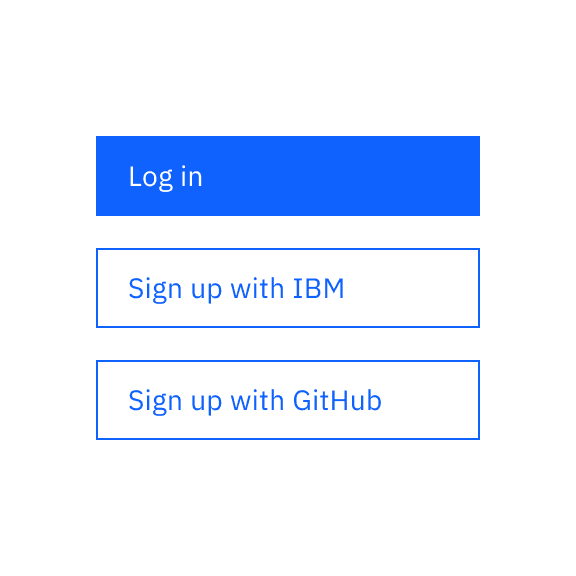

  </DoDont>
  <DoDont type="do" caption="Do follow a consistent approach across button groups when introducing icons.">

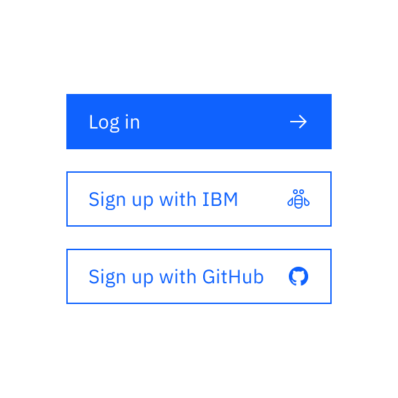

  </DoDont>
</DoDontRow>

<DoDontRow>
  <DoDont type="dont" caption="Do not introduce icons only for a few buttons in a button group.">

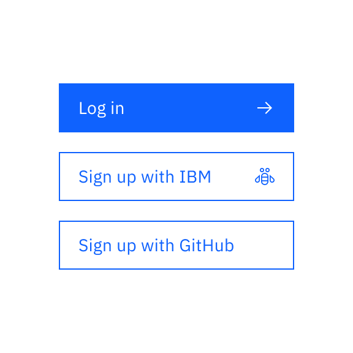

  </DoDont>
  <DoDont type="dont" caption="Do not introduce icons only for a few buttons in a button group.">

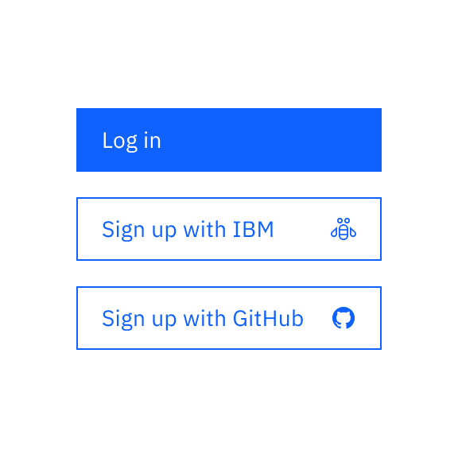

  </DoDont>
</DoDontRow>

#### Use the default variation for all icons

The Carbon library contains filled variants of a few icons. Since not every icon
has this variation, we advise using the default option for all icons (the only
exception is status icons, which have their own defined icon to use). Default
icons are named after their action.

<DoDontRow>
  <DoDont type="do" caption="Do use the default icon which is “Play”.">

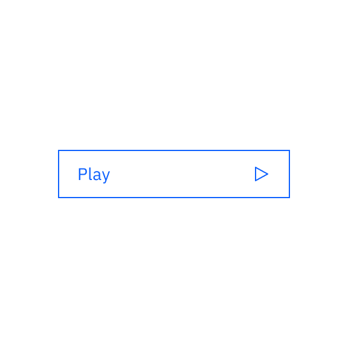

  </DoDont>
  <DoDont type="dont" caption="Do not use the filled icon variations.">

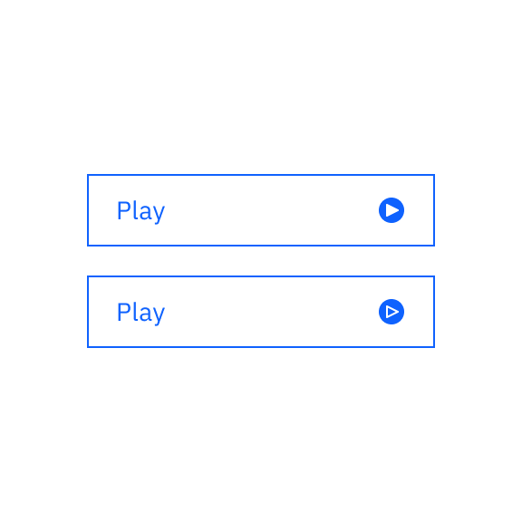

  </DoDont>
</DoDontRow>

### Icon only buttons

Icon only buttons allow users to take actions, and make choices, with a single
tap. Icon buttons can take the form of a primary, secondary, tertiary, or ghost
variant but most commonly will be styled as primary or ghost buttons.

Icon only buttons should be used sparingly. “For most situations, users learn
correct interpretations better with text alone than with icons alone.” —
Wiedenbeck, S (1999). For this reason, using icon only buttons is recommended
for the following use cases:

- The icon must be standardized and recognizable without label or must represent
  an action with a strong visual attribute, such as a pin icon for a pinning
  action.
- There is insufficient space and multiple actions, therefore a toolbar using
  icon buttons is required. See
  the [toolbars pattern](https://pages.github.ibm.com/cdai-design/pal/patterns/toolbars)
  for more details.

<Row>
<Column colLg={8}>

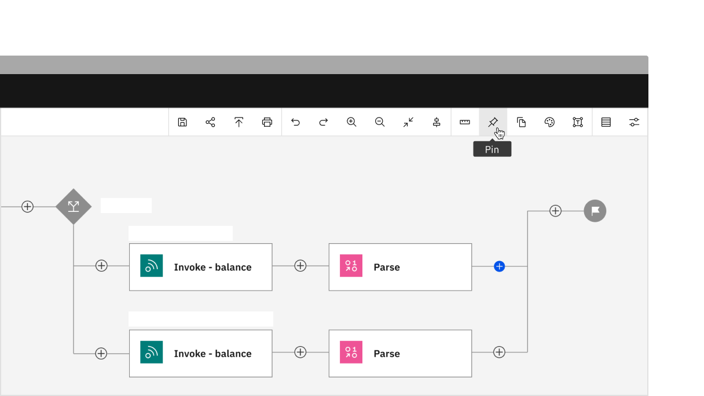

<Caption>
  Example of an icon only ghost button in a toolbar showing a tooltip on hover.
</Caption>

</Column>
</Row>

#### Tooltips for icon only buttons

Regardless of how recognizable an icon may or may not be, or whether that action
lies within the universal actions list, a tooltip is always required with text
explaining what the icon button would do if clicked.

<Row>
<Column colLg={8}>

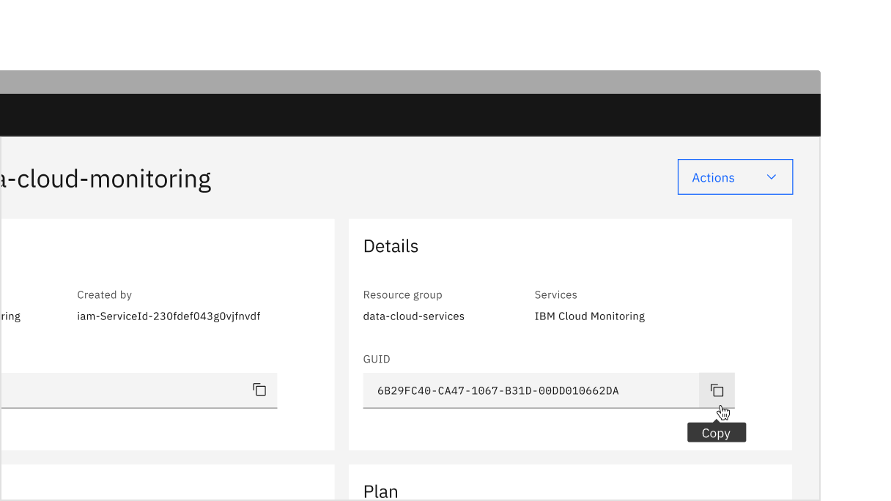

<Caption>
  Example of an icon only ghost button showing a tooltip on hover.
</Caption>

</Column>
</Row>

#### Colors of icon only ghost buttons

Carbon builds type, color, and spacing tokens into its components, improving the
ease of component usage. Do not change the color token for icon only ghost
buttons. The same applies for specifications across components. Learn more about
icon only ghost button colors in the
[Style](/components/button/style#ghost-button-color.mdx) tab.

<DoDontRow>
  <DoDont type="do" caption="Do use the system’s defined color for ghost icon only buttons.">

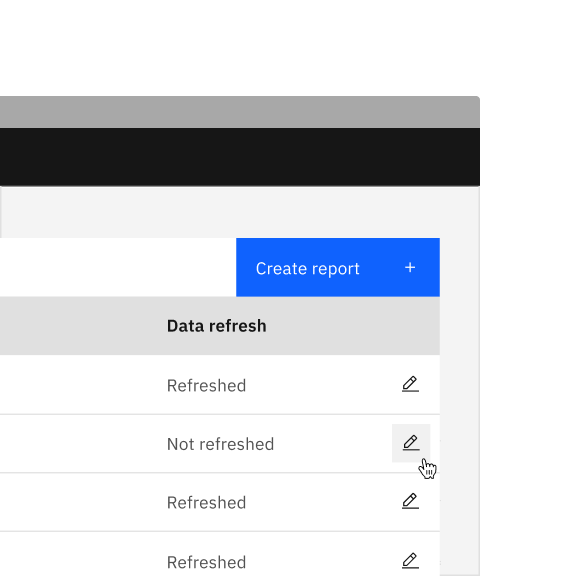

  </DoDont>
  <DoDont type="dont" caption="Do not change the color for ghost icon only buttons.">

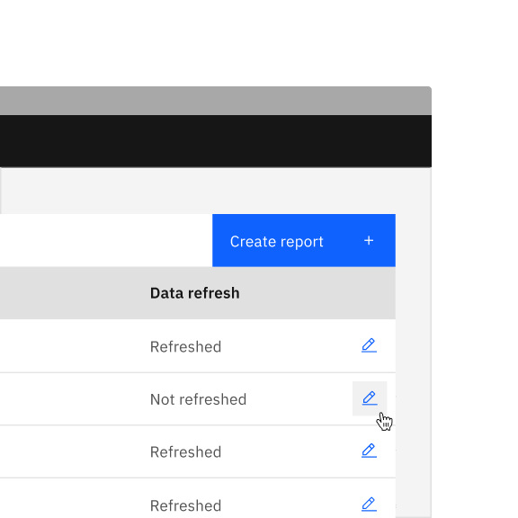

  </DoDont>
</DoDontRow>

#### Danger buttons cannot be used in an icon only form

Danger can be a critical action and should be applied to a button that holds
higher emphasis along with a visual label. As mentioned in
the [danger button guidance](#danger-button),  it is best to use a danger button
in a primary, tertiary, or ghost button form.

<DoDontRow>
  <DoDont type="do" caption="Do use a visual label in a danger button for a destructive action.">

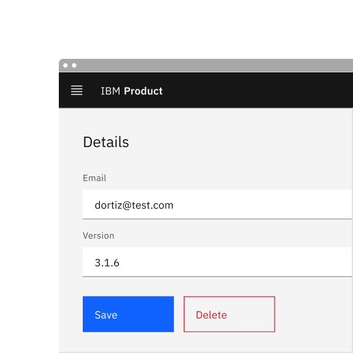

  </DoDont>
  <DoDont type="dont" caption="Do not use a danger button in an icon only form for a destructive action.">

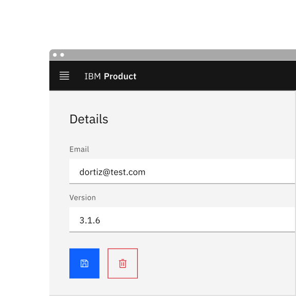

  </DoDont>
</DoDontRow>

## Related

- [Button labels](https://pages.github.ibm.com/cdai-design/pal/content/button-labels)
- [Fixed button bars](https://pages.github.ibm.com/carbon/ibm-products/patterns/fixed-button-bars/usage/)
- [Form pattern](/patterns/forms-pattern)
- [Icons](https://carbondesignsystem.com/elements/icons/library/)
- [Link component](/components/link/usage)
- [Menu buttons](https://carbondesignsystem.com/components/menu-buttons/usage/)
- [Modal component](/components/modal/usage)

## References

- Mehmet Goktürk,
  [_The Glossary of Human Computer Interaction, Chapter 37_](https://www.interaction-design.org/literature/book/the-glossary-of-human-computer-interaction/fitts-s-law)
  (The Interaction Design Foundation)
- Jakob Nielsen,
  [_OK-Cancel or Cancel-OK? The Trouble With Buttons_](https://www.nngroup.com/articles/ok-cancel-or-cancel-ok/)
  (Nielsen Norman Group, 2008)
- Artem Syzonenko
  [_Buttons on the web: placement and order_](https://uxdesign.cc/buttons-placement-and-order-bb1c4abadfcb)
  (UX Collective, 2019)
- Wiedenbeck, S (1999). The use of icons and labels in an end-user application
  program: An empirical study of learning and retention. Behavior & Information
  Technology, 18(2), p68–82

## Feedback

Help us improve this component by providing feedback, asking questions, and
leaving any other comments on
[GitHub](https://github.com/carbon-design-system/carbon-website/issues/new?assignees=&labels=feedback&template=feedback.md).
