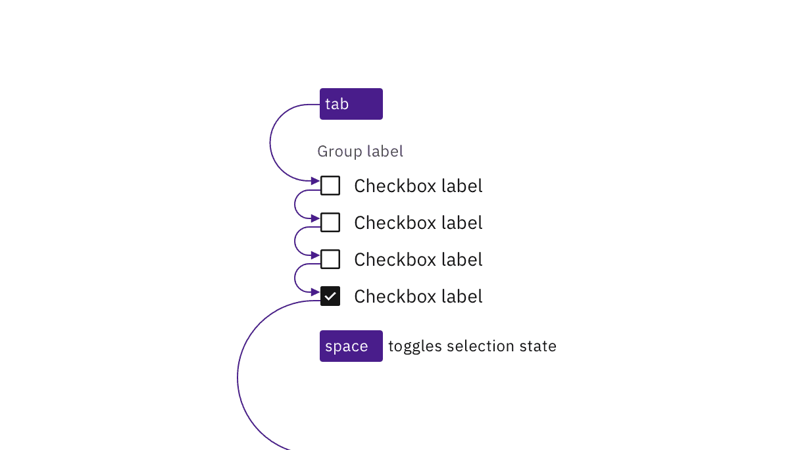
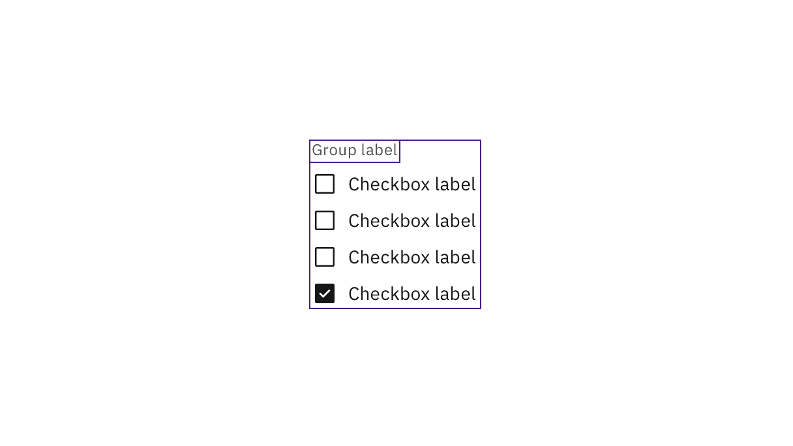

<PageDescription>

Design annotations are needed for specific instances shown below, but for the standard checkbox component, Carbon already incorporates accessibility.

</PageDescription>

<AnchorLinks>
  <AnchorLink>What Carbon provides</AnchorLink>
  <AnchorLink>Design annotations</AnchorLink>
  <AnchorLink>Developer considerations</AnchorLink>
</AnchorLinks>

## What Carbon provides

Carbon bakes keyboard operation into its components, improving the experience of blind users and others who operate via the keyboard. Carbon incorporates many other accessibility considerations, some of which are described below.

### Keyboard interactions

<Row>
<Column colLg={8}>

</Column>
</Row>

Each checkbox can be reached by `Tab` and selected with `Space` independently.

### Grouping

For groups of checkboxes, Carbon already provides the code for screen readers to properly detect the set of checkboxes and announce the group label.

<Row>
<Column colLg={8}>

</Column>
</Row>

Carbon handles the accessibility of grouped checkboxes.

## Design annotations

Design annotations are needed for the following instances.

### Meaningful order

Checkboxes can appear in multiple columns. If there is a meaningful order to the items (such as days of the week), annotate whether the tab order is by row or by column. See [Specify the tab order](https://www.ibm.com/able/toolkit/design/ux/navigation/#tab-order).

<Row>
<Column colLg={8}>

</Column>
</Row>

Annotate if there is meaningful navigation order in rows of checkboxes.

## Developer considerations

Keep these considerations in mind if you are modifying Carbon or creating a custom component:

* Checkboxes are grouped using `<fieldset>` and `<legend>`.
* A tri-state checkbox that is partially checked (indeterminate) has `aria-checked` set to `"mixed"`. See [Behaviors](https://carbondesignsystem.com/components/checkbox/usage/#behaviors) on the Usage tab for details.
* See the [ARIA authoring practices](https://www.w3.org/TR/wai-aria-practices-1.2/#checkbox) for more considerations.