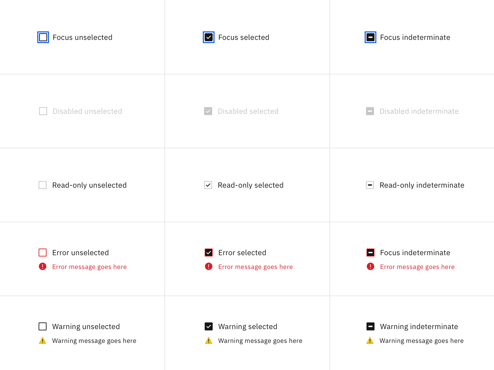

<PageDescription>

The following page documents visual specifications such as color, typography,
and structure.

</PageDescription>

<AnchorLinks>

<AnchorLink>Color</AnchorLink>
<AnchorLink>Typography</AnchorLink>
<AnchorLink>Structure</AnchorLink>
<AnchorLink>AI presence</AnchorLink>
<AnchorLink>Feedback</AnchorLink>

</AnchorLinks>

## Color

| Element            | Property         | Color token       |
| ------------------ | ---------------- | ----------------- |
| Group label        | text color       | `$text-secondary` |
| Checkbox label     | text color       | `$text-primary`   |
| Checkbox:unchecked | border           | `$icon-primary`   |
|                    | background-color | transparent       |
| Checkbox:checked   | background-color | `$icon-primary`   |
|                    | checkmark        | `$icon-inverse`   |
| Helper text        | text color       | `$text-secondary` |

<Row>
<Column colLg={8}>

</Column>
</Row>

### Interactive states

| State     | Element         | Property   | Color token        |
| --------- | --------------- | ---------- | ------------------ |
| Focus     | Checkbox        | border     | `$focus`           |
| Disabled  | Label           | text color | `$text-disabled`   |
|           | Checkbox        | border     | `$icon-disabled`   |
|           |                 | background | `$icon-disabled`   |
| Read-only | Label           | text color | `$text-primary`    |
|           | Checkbox        | border     | `$icon-disabled`   |
|           |                 | inner fill | `$icon-primary`    |
| Error     | Label           | text color | `$text-primary`    |
|           | Checkbox        | border     | `$support-error`   |
|           | Error message   | text color | `$text-error`      |
|           | Error icon      | svg        | `$support-error`   |
| Warning   | Label           | text color | `$text-primary`    |
|           | Checkbox        | border     | `$icon-primary`    |
|           | Warning message | text color | `$text-primary`    |
|           | Warning icon    | svg        | `$support-warning` |
|           |                 | inner fill | `$black`           |

<Row>
<Column colLg={12}>

</Column>
</Row>

## Typography

Checkbox labels and group labels should be sentence case, with only the first
word in a phrase and any proper nouns capitalized. Checkbox labels and group
labels should not exceed three words.

| Element         | Font-size (px/rem) | Font-weight   | Type token         |
| --------------- | ------------------ | ------------- | ------------------ |
| Group label     | 12 / 0.75          | Regular / 400 | `$label-01`        |
| Checkbox label  | 14 / 0.875         | Regular / 400 | `$body-compact-01` |
| Helper text     | 12 / 0.75          | Regular / 400 | `$helper-text-01`  |
| Error message   | 12 / 0.75          | Regular / 400 | `$label-01`        |
| Warning message | 12 / 0.75          | Regular / 400 | `$label-01`        |

## Structure

| Element        | Property       | px / rem | Spacing token |
| -------------- | -------------- | -------- | ------------- |
| Checkbox       | height & width | 16px     | –             |
|                | border         | 1px      | –             |
| Checkbox:focus | border         | 2px      | –             |
|                | border inset   | 1px      | –             |
| Group label    | margin-bottom  | 8 / 0.5  | `$spacing-03` |
| Checkbox label | padding-left   | 8 / 0.5  | `$spacing-03` |
| Checkbox item  | margin-bottom  | 4 / 0.25 | `$spacing-02` |

<Caption fullWidth>
  Structure and spacing measurements for a checkbox group | px / rem
</Caption>

<Caption fullWidth>
  Structure and spacing measurements for vertical and horizontal checkbox
  groupings | px / rem
</Caption>

## AI presence

The only style modification an AI variant of the checkbox has is the addition of
the AI label. All other tokens in the component remain the same as the non-AI
variants.

For more information on the AI style elements, see the
[Carbon for AI](/guidelines/carbon-for-ai/) guidelines.

| Element  | Property | Token / Size |
| -------- | -------- | ------------ |
| AI label | size     | mini         |

<Row>
<Column colLg={8}>

</Column>
</Row>

## Feedback

Help us improve this component by providing feedback, asking questions, and
leaving any other comments on
[GitHub](https://github.com/carbon-design-system/carbon-website/issues/new?assignees=&labels=feedback&template=feedback.md).
