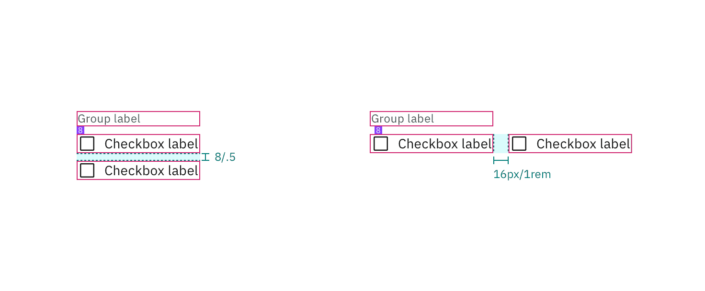

## Color

| Element            | Property         | Color token       |
| ------------------ | ---------------- | ----------------- |
| Group label        | text color       | `$text-secondary` |
| Checkbox label     | text color       | `$text-primary`   |
| Checkbox:unchecked | border           | `$icon-primary`   |
|                    | background-color | transparent       |
| Checkbox:checked   | background-color | `$icon-primary`   |
|                    | checkmark        | `$icon-inverse`   |

<Row>
<Column colLg={8}>

</Column>
</Row>

### Interactive states

| Element           | Property   | Color token      |
| ----------------- | ---------- | ---------------- |
| Checkbox:focus    | border     | `$focus`         |
| Label:disabled    | text color | `$text-disabled` |
| Checkbox:disabled | border     | `$icon-disabled` |
|                   | background | `$icon-disabled` |

<Row>
<Column colLg={8}>

</Column>
</Row>

## Typography

Checkbox labels and group labels should be sentence case, with only the first
word in a phrase and any proper nouns capitalized. Checkbox labels and group
labels should not exceed three words.

| Element        | Font-size (px/rem) | Font-weight   | Type token         |
| -------------- | ------------------ | ------------- | ------------------ |
| Group label    | 12 / 0.75          | Regular / 400 | `$label-01`        |
| Checkbox label | 14 / 0.875         | Regular / 400 | `$body-compact-01` |

## Structure

| Element        | Property       | px / rem | Spacing token |
| -------------- | -------------- | -------- | ------------- |
| Checkbox       | height & width | 16px     | –             |
|                | border         | 1px      | –             |
| Checkbox:focus | border         | 2px      | –             |
|                | border inset   | 1px      | –             |
| Group label    | margin-bottom  | 8 / 0.5  | `$spacing-03` |
| Checkbox label | padding-left   | 8 / 0.5  | `$spacing-03` |
| Checkbox item  | margin-bottom  | 4 / 0.25 | `$spacing-02` |

<Caption>
  Structure and spacing measurements for a checkbox group | px / rem
</Caption>

<Caption>
  Structure and spacing measurements for vertical and horizontal checkbox
  groupings | px / rem
</Caption>
