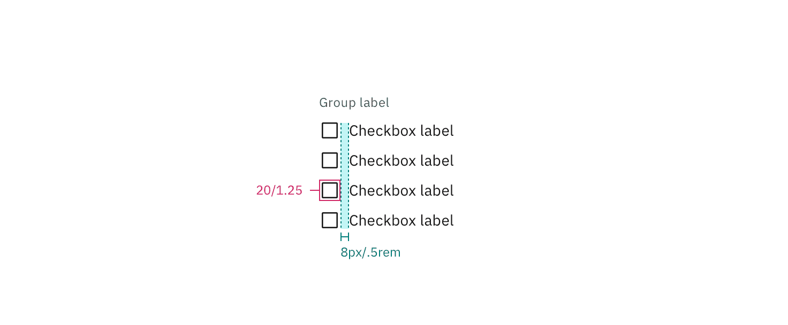

## Color

| Class                     | Property         | Color token   |
| ------------------------- | ---------------- | ------------- |
| `.bx--label`              | text color       | `$text-02`    |
| `.bx--checkbox-label`     | text color       | `$text-01`    |
| `.bx--checkbox`           | border           | `$icon-01`    |
| `.bx--checkbox:unchecked` | background-color | transparent   |
| `.bx--checkbox:checked`   | background-color | `$icon-01`    |
| `.bx--checkbox:checked`   | checkmark        | `$inverse-01` |

<Row>
<Column colLg={8}>

</Column>
</Row>

### Interactive states

| State       | Property   | Color token    |
| ----------- | ---------- | -------------- |
| `:focus`    | border     | `$focus`       |
| `:disabled` | text color | `$disabled-02` |
| `:disabled` | border     | `$disabled-02` |

<Row>
<Column colLg={8}>

</Column>
</Row>

## Typography

Checkbox headings and labels should be sentence case, with only the first word
in a phrase and any proper nouns capitalized. Checkbox headings and labels
should not exceed three words.

| Class                 | Font-size (px/rem) | Font-weight   | Type token       |
| --------------------- | ------------------ | ------------- | ---------------- |
| `.bx--label`          | 12 / 0.75          | Regular / 400 | `$label-01`      |
| `.bx--checkbox-label` | 14 / 0.875         | Regualr / 400 | `$body-short-01` |

## Structure

| Class                                 | Property       | px / rem | Spacing token |
| ------------------------------------- | -------------- | -------- | ------------- |
| `.bx--checkbox`                       | height & width | 16px     | –             |
| `.bx--checkbox`                       | border         | 1px      | –             |
| `.bx--checkbox:focus`                 | border         | 2px      | –             |
| `.bx--label`                          | margin-bottom  | 8 / 0.5  | `$spacing-03` |
| `.bx--checkbox-label`                 | padding-left   | 8 / 0.5  | `$spacing-03` |
| `.bx--form-item.bx--checkbox-wrapper` | margin-bottom  | 8 / 0.5  | `$spacing-03` |

<Caption>Structure and spacing measurements for checkbox | px / rem</Caption>
