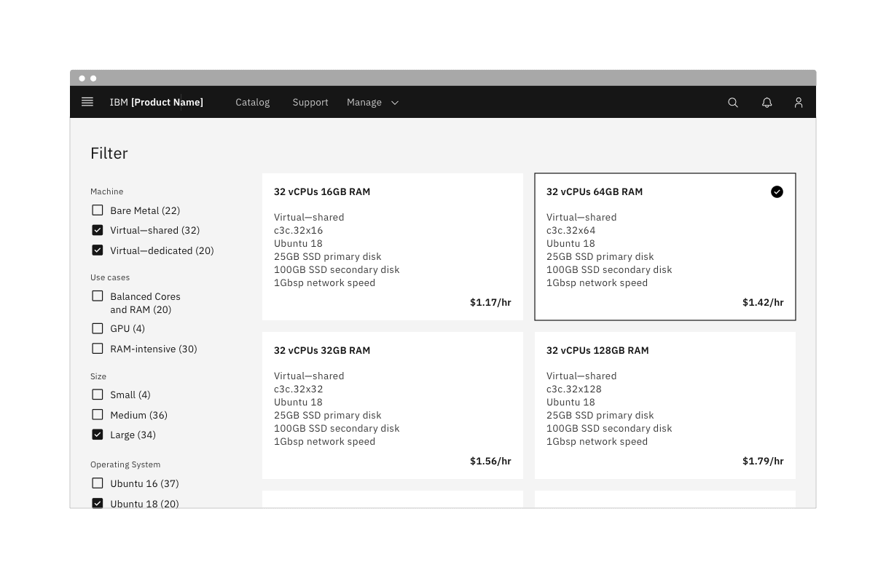

<AnchorLinks>

<AnchorLink>General guidance</AnchorLink>
<AnchorLink>Related components</AnchorLink>
<AnchorLink>Content</AnchorLink>
<AnchorLink>Tables</AnchorLink>

</AnchorLinks>

## General guidance

Checkboxes are used for a list of options where the user may select multiple options, including all or none.

#### Checkbox states

The checkbox control allows for three states: **selected**, **unselected**, and **indeterminate**. The indeterminate state comes into play when the checkbox contains a sublist of selections, some of which are selected, and some unselected.

#### Click target

Users should be able to select the checkbox by clicking on the box directly or by clicking on its label.

#### Default selection

The default view of a set of checkboxes is having no option selected.

<Row>
<Column colLg={8}>

</Column>
</Row>

<Caption>By default, checkboxes are unchecked.</Caption>

## Related components

#### Checkbox vs. radio button

Whereas radio buttons represent a group of _mutually exclusive_ choices, users can select one or more checkboxes from a group. In use cases where only one selection of a group is allowed, use the radio button component instead of the checkbox.

#### Checkbox vs. toggle switch

Generally, toggle switches are preferred when the resulting action will be instantaneously applied, without the need for further confirmation. Checkboxes generally represent one input in a larger flow which requires a final confirmation step.

#### References

 

- [Toggle](/components/toggle/code)
- [Radio button](/components/radio-button/code)
- [Form](/components/form/code)
- _Data table (coming soon)_

## Content

#### Headings

If necessary, a heading can accompany a set of checkboxes to provide further context or clarity. Use sentence case for checkbox headings. In the example below, “IBM designers” would be the heading for the set of checkboxes.

#### Labels

Always use clear and concise labels for checkboxes. Be explicit about the results that will follow if the checkbox is selected. Labels appear to the right of checkboxes.

## Tables

See the [data table](/components/data-table/usage) section for guidance on how to use checkboxes within a table.
