import A11yStatus from 'components/A11yStatus';

<PageDescription>

Checkboxes are used when there are multiple items to select in a list. Users can
select zero, one, or any number of items.

</PageDescription>

<InlineNotification>

Checkbox
[with AI label](https://react.carbondesignsystem.com/?path=/story/components-checkbox--with-ai-label)
is now stable. This addition changes the visual appearance of the component and
introduces an AI explainability feature when AI is present in the component. See
the [AI presence](/components/checkbox/usage/#ai-presence) section for more
details.

</InlineNotification>

<AnchorLinks>

<AnchorLink>Live demo</AnchorLink>
<AnchorLink>Overview</AnchorLink>
<AnchorLink>Formatting</AnchorLink>
<AnchorLink>Content</AnchorLink>
<AnchorLink>Behaviors</AnchorLink>
<AnchorLink>AI presence</AnchorLink>
<AnchorLink>Related</AnchorLink>
<AnchorLink>References</AnchorLink>
<AnchorLink>Feedback</AnchorLink>

</AnchorLinks>

## Live demo

<StorybookDemo
  themeSelector
  url="https://react.carbondesignsystem.com"
  variants={[
    {
      label: 'Default',
      variant: 'components-checkbox--default',
    },
    {
      label: 'With AI label',
      variant: 'components-checkbox--with-ai-label',
    },
  ]}
/>

<A11yStatus layout="cards" components="Checkbox" />

## Overview

Checkboxes are used for multiple choices, not for mutually exclusive choices.
Each checkbox works independently from other checkboxes in the list, therefore
checking an additional box does not affect any other selections.

### When to use

#### Forms

Can be used in forms on a full page, in modals, or on side panels.

#### Filtering and batch action

Used to filter data either on a page, in a menu, or within a component.
Checkboxes are found in
[Data table](https://www.carbondesignsystem.com/components/data-table/usage) for
batch editing purposes.

#### Terms and conditions

Turning the checkbox input on or off can indicate whether you agree to the
terms.

#### Lists with sub-selections

Used when there is a parent and child relationship. You can use a parent
checkbox to make a bulk selection of all list items. Unchecking the parent
deselects all of the list items. Alternatively, you can select children
individually when the parent is not selected, which is where the indeterminate
state comes in to play.

<Row>
<Column colLg={8}>

</Column>
</Row>

<Caption>Example of a full page filter list</Caption>

### When not to use

If a user can select only one option from a list, radio buttons should be used
instead of checkboxes. Checkboxes allow the user to select multiple items in a
set whereas radio buttons allow the user to select only one option.

<DoDontRow>
  <DoDont type="do" caption="Do use radio buttons when only one item can be selected.">

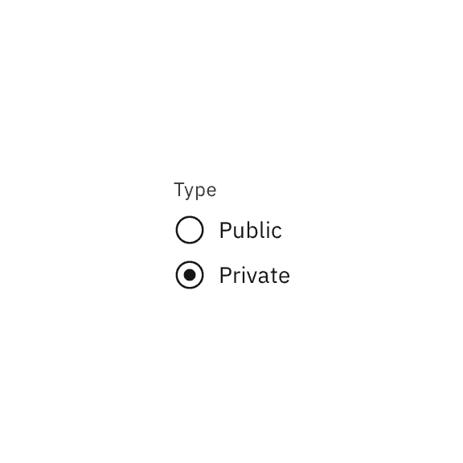

  </DoDont>
  <DoDont type="dont" caption="Don't use checkboxes when only one item can be selected.">

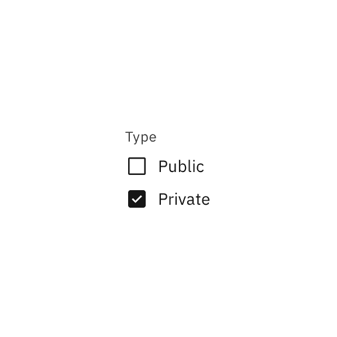

  </DoDont>
</DoDontRow>

## Formatting

### Anatomy

The checkbox component is comprised of a checkbox label and a checkbox input. If
there is a group of checkboxes, a group label can be added.

<Row>
<Column colLg={8}>

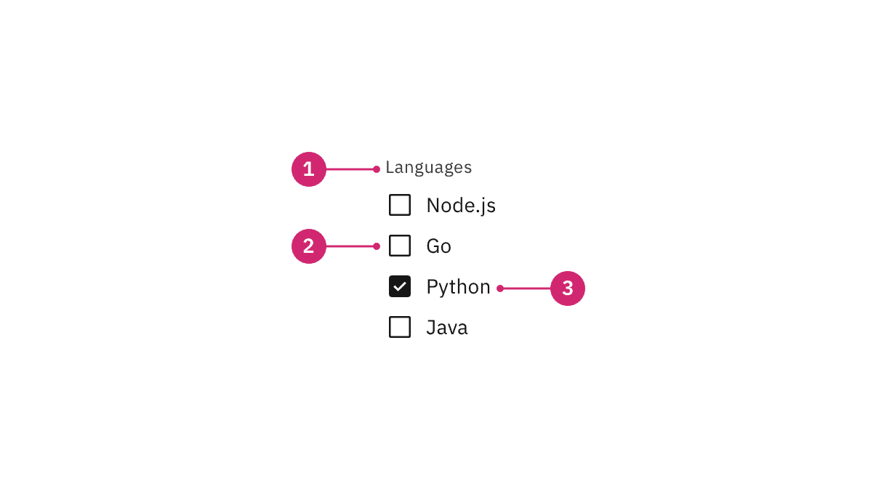

</Column>
</Row>

1. **Group label (optional):** Communicates what needs to be selected below.
2. **Checkbox input:** A checkbox input indicating the appropriate state. By
   default it is unselected.
3. **Checkbox label:** Describes the information you want to select or unselect.

### Alignment

Checkbox labels are positioned to the right of their inputs. If there is a
checkbox grouping, they can be laid out vertically or horizontally depending on
the use case and the structure of the UI. When possible, arrange the checkbox
and radio button groups vertically for easier reading.

<Row>
<Column colLg={8}>

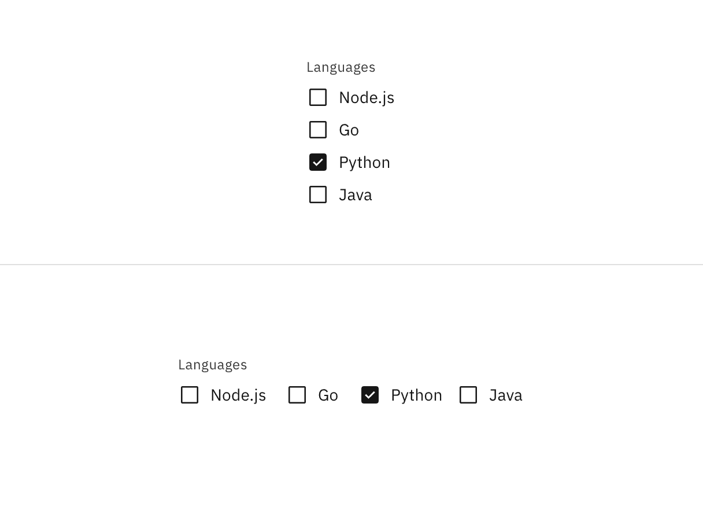

</Column>
</Row>

<Caption>Vertically stacked versus horizontal alignment</Caption>

### Placement

The checkbox component is often used in forms. Forms can be placed on a full
page, in a modal or in a side panel. A checkbox can also be used for agreeing to
terms and conditions or to filter information.

<Row>
<Column colLg={8}>

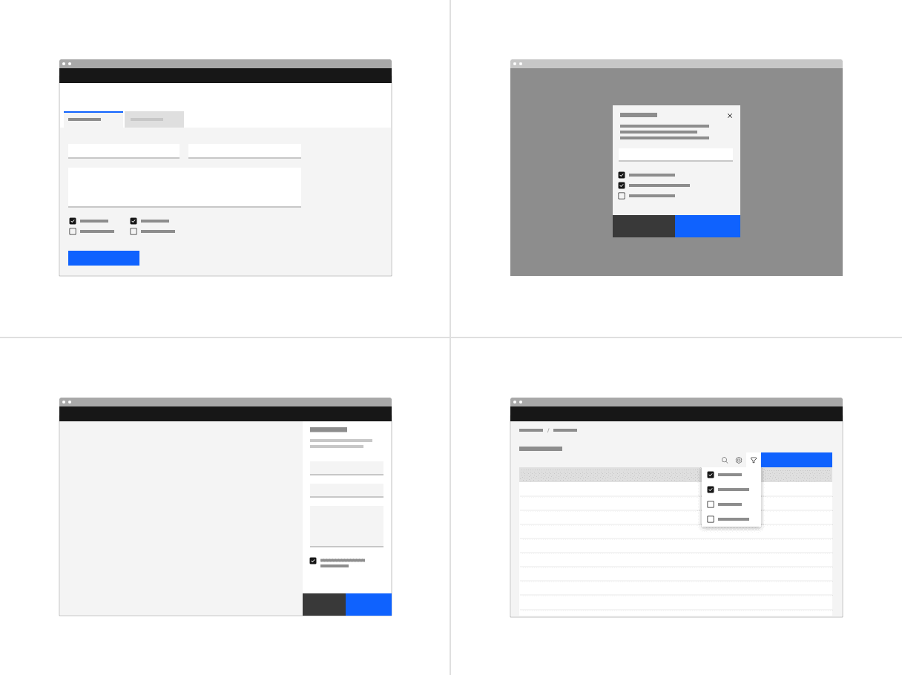

</Column>
</Row>

Checkboxes in a form should be placed at least 32px (`layout-03`) below or
before the next component. Spacing of 24px (`layout-02`) or 16px (`layout-01`)
can also be used when space is more restricted or if the form is more complex.

For more information on spacing in forms, see our
[form style guidance](https://www.carbondesignsystem.com/components/form/style).

<Row>
<Column colLg={8}>

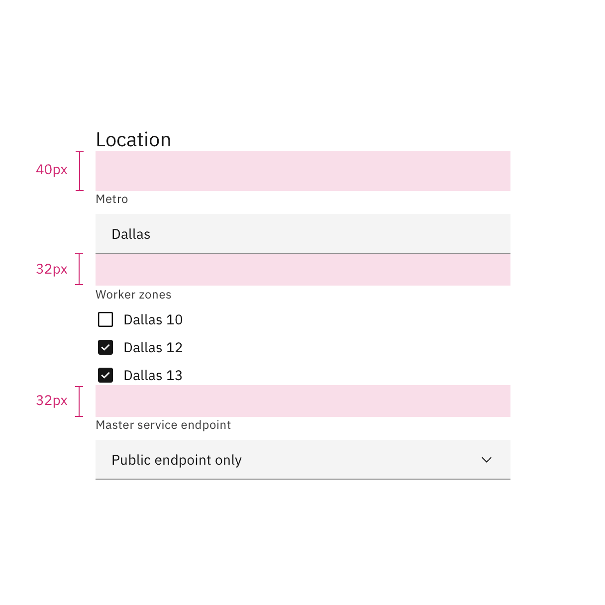

</Column>
</Row>

<Caption>Spacing between a checkbox and other components in a form</Caption>

For more information about spacing for the checkbox component itself, see the
[style tab](https://www.carbondesignsystem.com/components/checkbox/style#structure).

## Content

### Main elements

#### Group labels (optional)

- In most cases, a set of checkboxes is preceded by a group label to provide
  further context or clarity.
- A group label can either state the category of the grouping or describe what
  actions to take below.
- Use sentence case for group labels.
- In some cases, a group of checkboxes may be within a larger group of
  components that already have a group label. In this case, an additional group
  label for the checkbox component itself is not needed.

#### Checkbox labels

- Always use clear and concise labels for checkboxes.
- Labels appear to the right of checkbox inputs.
- Regardless of whether the label is visible in the interface, a label is always
  needed in code, whether it's for one checkbox or a group of them. See the
  [checkbox code tab](https://www.carbondesignsystem.com/components/checkbox/code)
  for more information.

### Overflow content

- We recommend checkbox labels being fewer than three words.
- If you are tight on space, consider rewording the label. Do not truncate
  checkbox label text with an ellipsis.
- Long labels may wrap to a second line, and this is preferable to truncation.
- Text should wrap beneath the checkbox so the control and label are top
  aligned.

<Row>
<Column colLg={8}>

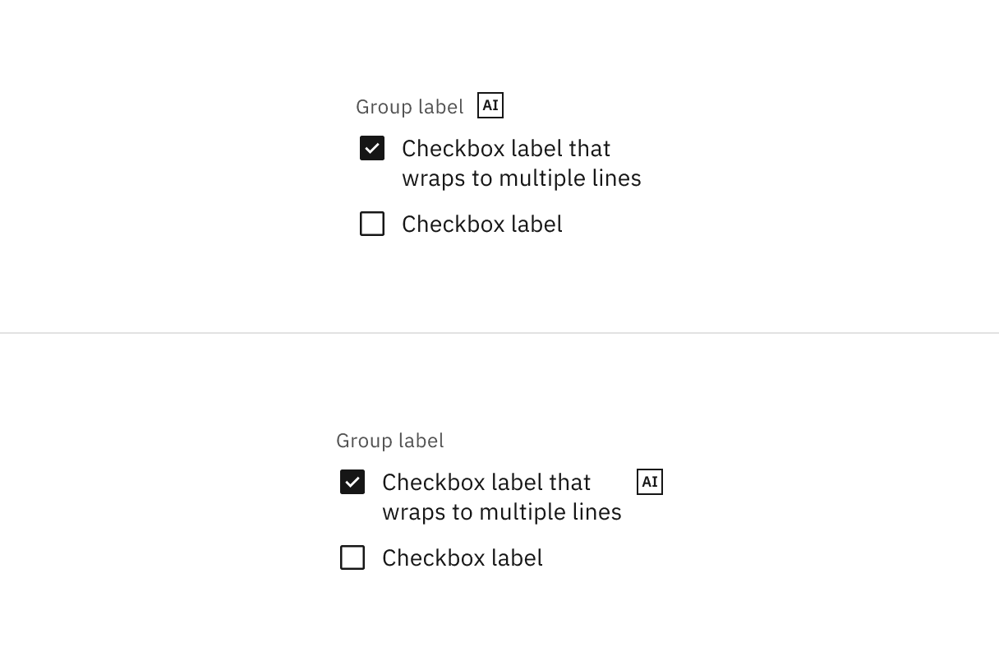

</Column>
</Row>

<DoDontRow>
  <DoDont type="do" caption="Do let text wrap beneath the checkbox so the control and label are top aligned.">

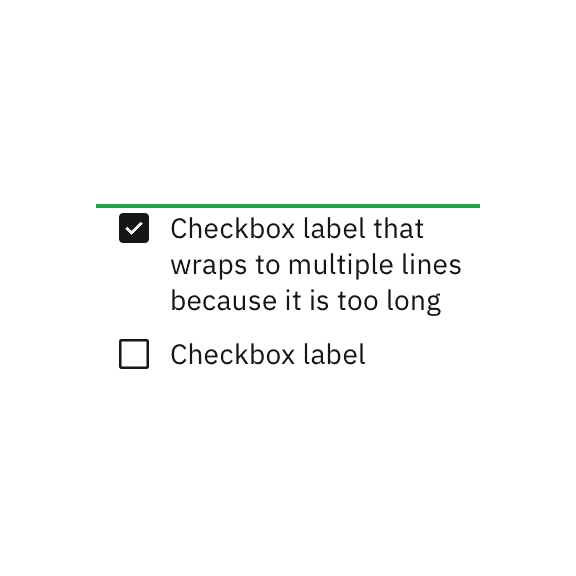

  </DoDont>
  <DoDont type="dont" caption="Do not vertically center wrapped text with the checkbox.">

  </DoDont>
</DoDontRow>

### Further guidance

For further content guidance, see Carbon's
[content guidelines](/guidelines/content/overview).

## Behaviors

### States

The checkbox input allows for a series of states: **unselected**, **selected**,
and **indeterminate**. The default view of a set of checkboxes is having no
option selected.

<Row>
<Column colLg={8}>

</Column>
</Row>

Use the indeterminate state when the checkbox contains a sublist of selections,
some of which are selected, and some unselected. In addition to unselected,
selected, and indeterminate states, checkboxes also have states for focus,
disabled, read-only, error, and warning. When deciding whether to use a disabled
or read-only state for checkboxes, see our
[Read-only states pattern](https://carbondesignsystem.com/patterns/read-only-states-pattern/)
guidance.

<Row>
<Column colLg={12}>

</Column>
</Row>

#### Group states

Checkbox groups can receive the following states: read-only, disabled, error,
and warning, as well as the addition of helper text.

<Row>
<Column colLg={12}>

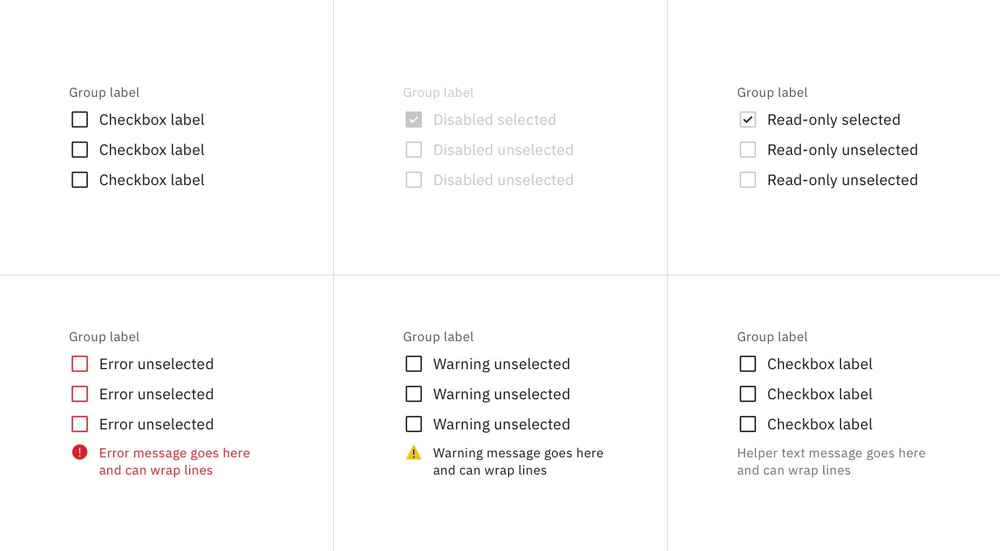

</Column>
</Row>

### Nesting

Checkboxes can be nested when a parent and child relationship is needed. Users
can either select an entire set of options or only a subset.

Checking the parent checkbox automatically selects all of the nested children
checkboxes. Unchecking the parent checkbox automatically deselects all of the
children checkboxes.

<Row>
<Column colLg={8}>

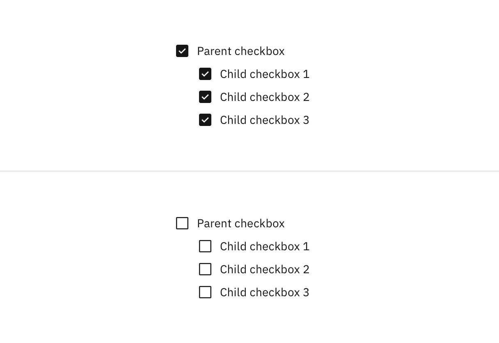

</Column>
</Row>

Checking a child checkbox, if at least one other child checkbox is not selected,
automatically puts the parent checkbox into the indeterminate state. Unchecking
a child checkbox, when all other children checkboxes remain selected, switches
the parent checkbox from the default checked state to the indeterminate state.

<Row>
<Column colLg={8}>

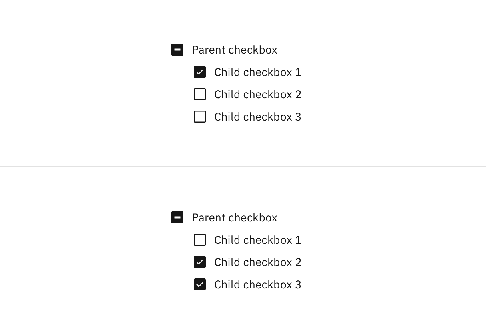

</Column>
</Row>

### Interactions

#### Mouse

Users can trigger an item by clicking the checkbox input directly or by clicking
the checkbox label. Having both regions interactive creates a more accessible
click target. The only hover effect when the mouse is placed over the target is
a pointer shape change.

<Row>
<Column colLg={8}>

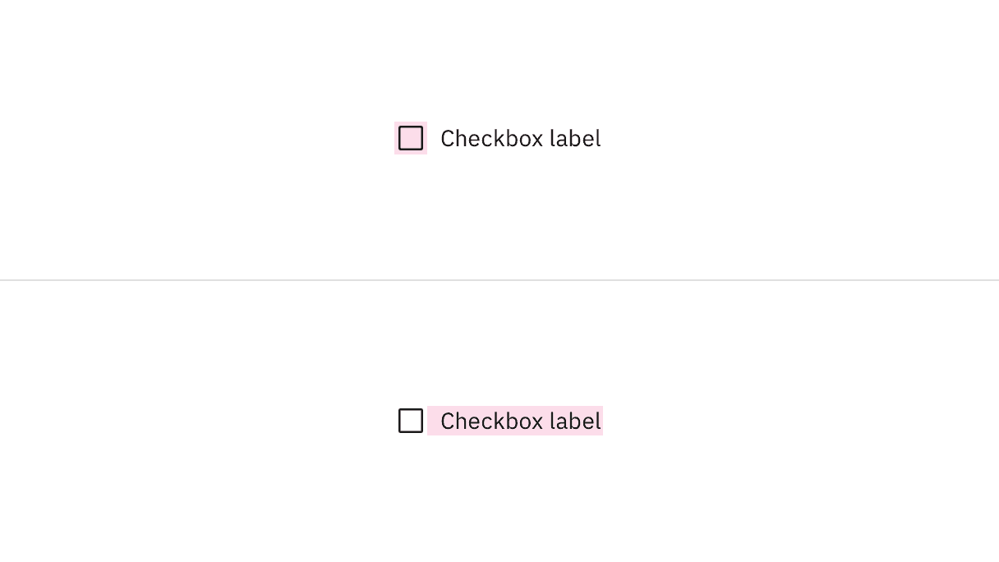

</Column>
</Row>

#### Keyboard

Users can navigate to and between checkbox inputs by pressing `Tab` or
`Shift-Tab`. Users can trigger a state change by pressing `Space` while the
checkbox input has focus. For additional keyboard interactions, see the
[accessibility tab](https://www.carbondesignsystem.com/components/checkbox/accessibility).

## AI presence

Checkbox has a modification that embeds the AI label when AI is present in the
control. The AI variant functions the same as the normal version except with the
addition of the AI label which is both a visual indicator and the trigger for
the explainability popover. The AI label can be placed on the checkbox group
label or on individual checkbox labels.

For more information on designing for AI, see the
[Carbon for AI](/guidelines/carbon-for-ai/) guidelines.

<Row>
<Column colLg={8}>

</Column>
</Row>

## Related

#### Checkbox versus radio button

Radio buttons represent a group of _mutually exclusive_ choices, while
checkboxes allow users to select one or more checkboxes from a group. In use
cases where only one selection of a group is allowed, use the radio button
component instead of the checkbox.

#### Checkbox versus toggle switch

Toggle switches are preferred when the resulting action will be instantaneously
applied, without the need for further confirmation. By comparison, checkboxes
represent one input in a larger flow which usually requires a final confirmation
step.

#### Tables

See the
[data table component](https://www.carbondesignsystem.com/components/data-table/usage#multiselect-batch-action)
for guidance on how to use checkboxes within a table.

## References

- [Data table](https://www.carbondesignsystem.com/components/data-table/usage)
- [Form](https://www.carbondesignsystem.com/components/form/usage)
- [Radio button](https://www.carbondesignsystem.com/components/radio-button/usage)
- [Toggle](https://www.carbondesignsystem.com/components/toggle/usage)

## Feedback

Help us improve this component by providing feedback, asking questions, and
leaving any other comments on
[GitHub](https://github.com/carbon-design-system/carbon-website/issues/new?assignees=&labels=feedback&template=feedback.md).
