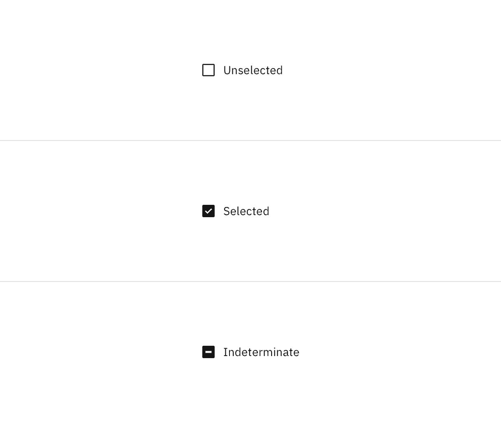

<AnchorLinks>

<AnchorLink>General guidance</AnchorLink>
<AnchorLink>Formatting</AnchorLink>
<AnchorLink>Content</AnchorLink>
<AnchorLink>Behavior</AnchorLink>
<AnchorLink>Accessibility</AnchorLink>
<AnchorLink>Variations</AnchorLink>
<AnchorLink>Style</AnchorLink>
<AnchorLink>Code</AnchorLink>
<AnchorLink>Feedback</AnchorLink>

</AnchorLinks>

## General guidance 

Checkboxes are used for a list of options where the user may select multiple options, including all or none.

Whereas [radio buttons](/components/radio-button) represent a group of _mutually exclusive_ choices, users can select one or more checkboxes from a group. In use cases where only one selection of a group is allowed, use the radio button component instead of the checkbox.

Generally, [toggle switches](/components/toggle) are preferred when the resulting action will be instantaneously applied, without the need for further confirmation. Checkboxes generally represent one input in a larger flow which requires a final confirmation step.

See the [data table](/components/data-table/usage) section for guidance on how to use checkboxes within a table.

<ComponentCode
  name="Checkbox"
  component="checkbox"
  variation="checkbox"
  hasReactVersion="checkbox--default"
  hasVueVersion="checkbox--default"
  hasAngularVersion="?path=/story/checkbox--basic"
  codepen="NmxPEm"></ComponentCode>

## Formatting

## Content 

**If necessary, a heading can accompany a set of checkboxes to provide further context or clarity.** Use sentence case for checkbox headings.

**Always use clear and concise labels for checkboxes.** Be explicit about the results that will follow if the checkbox is selected. Labels appear to the right of checkboxes.

## Behavior

**The checkbox control allows for three states: selected, unselected, and indeterminate.** The indeterminate state comes into play when the checkbox contains a sublist of selections, some of which are selected, and some unselected. The default view of a set of checkboxes is having no option selected.

**Users should be able to select the checkbox by clicking on the box directly or by clicking on its label.**

## Accessibility

## Variations 

## Style

### Color

| Class                     | Property         | Color token   |
| ------------------------- | ---------------- | ------------- |
| `.bx--label`              | text color       | `$text-02`    |
| `.bx--checkbox-label`     | text color       | `$text-01`    |
| `.bx--checkbox`           | border           | `$ui-05`      |
| `.bx--checkbox:unchecked` | background-color | transparent   |
| `.bx--checkbox:checked`   | background-color | `$ui-05`      |
| `.bx--checkbox:checked`   | checkmark        | `$inverse-01` |

### Interactive states

| State       | Property   | Color token    |
| ----------- | ---------- | -------------- |
| `:focus`    | border     | `$focus`       |
| `:disabled` | text color | `$disabled-02` |
| `:disabled` | border     | `$disabled-02` |

<Caption>Disabled and normal checkbox states</Caption>

### Typography

Checkbox headings and labels should be sentence case, with only the first word in a phrase and any proper nouns capitalized. Checkbox headings and labels should not exceed three words.

| Class                 | Font-size (px/rem) | Font-weight   | Type token       |
| --------------------- | ------------------ | ------------- | ---------------- |
| `.bx--label`          | 12 / 0.75          | Regular / 400 | `$label-01`      |
| `.bx--checkbox-label` | 14 / 0.875         | Regualr / 400 | `$body-short-01` |

### Structure

| Class                                 | Property       | px / rem | Spacing token |
| ------------------------------------- | -------------- | -------- | ------------- |
| `.bx--checkbox`                       | height & width | 16px     | –             |
| `.bx--checkbox`                       | border         | 1px      | –             |
| `.bx--label`                          | margin-bottom  | 8 / 0.5  | `$spacing-03` |
| `.bx--checkbox-label`                 | padding-left   | 8 / 0.5  | `$spacing-03` |
| `.bx--form-item.bx--checkbox-wrapper` | margin-bottom  | 8 / 0.5  | `$spacing-03` |

<Caption>Structure and spacing measurements for checkbox | px / rem</Caption>

## Code

<ComponentDocs component="checkbox"></ComponentDocs>

## Feedback
