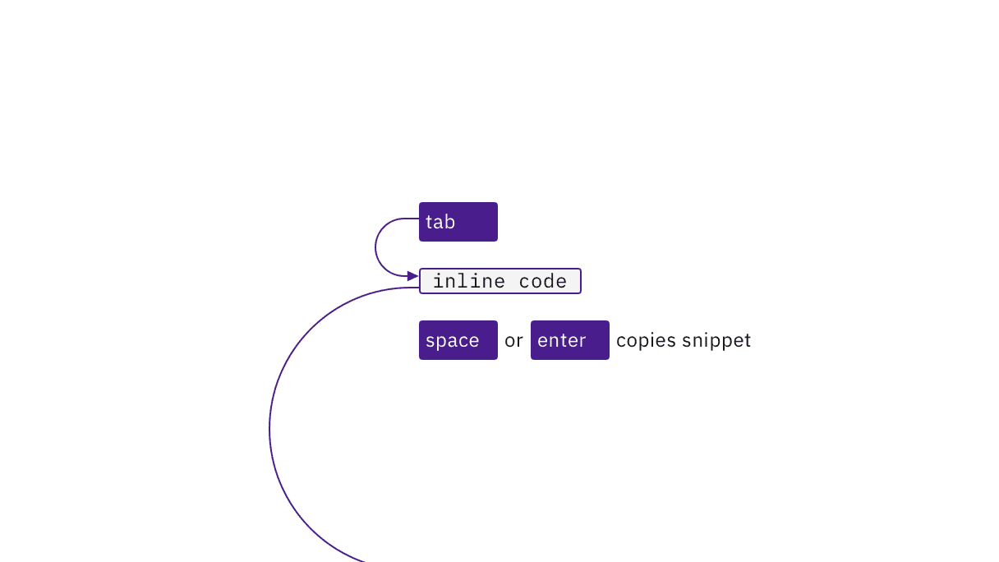
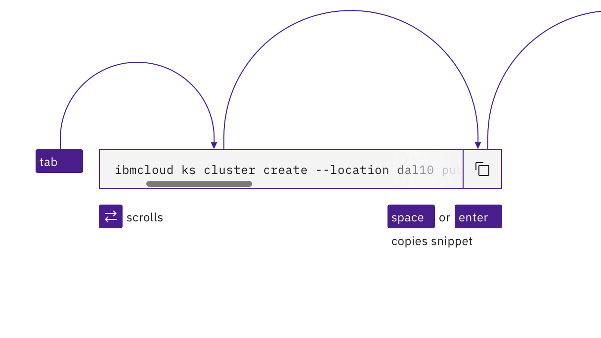
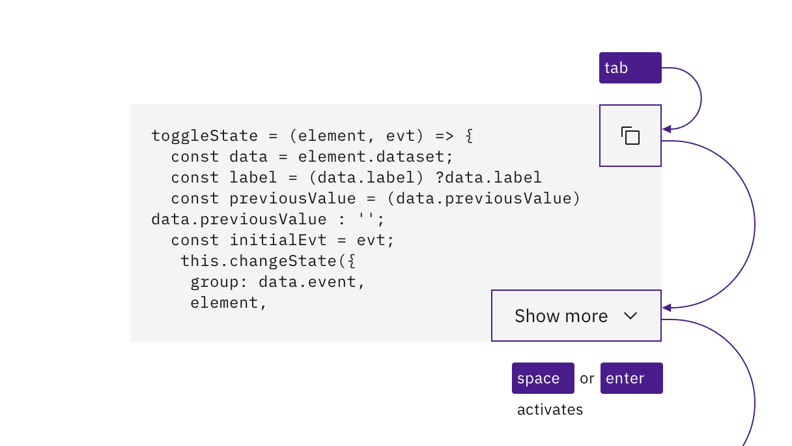

import {
  StructuredListWrapper,
  StructuredListHead,
  StructuredListBody,
  StructuredListRow,
  StructuredListInput,
  StructuredListCell,
  OrderedList,
  ListItem,
} from 'carbon-components-react';

<PageDescription>

No accessibility annotations are needed for code snippets, but keep these considerations in mind if you’re modifying Carbon or creating a custom component.

</PageDescription>

<AnchorLinks>
  <AnchorLink>What Carbon provides</AnchorLink>
  <AnchorLink>Developer considerations</AnchorLink>
</AnchorLinks>

## What Carbon provides

Carbon bakes keyboard operation into its components, as well as many other
accessibility considerations.

### Keyboard interaction

For all three variants, the code snippet can be copied with Space or Enter. Arrow
keys can operate scroll bars.

<Row>
<Column colLg={8}>

</Column>
</Row>

By default, each inline code snippet is reachable by Tab and copied with Space or Enter.

<Row>
<Column colLg={8}>

</Column>
</Row>

The single line code snippet tabstop supports left and right arrow key scrolling.

<Row>
<Column colLg={8}>

</Column>
</Row>

The multi-line’s buttons are reachable by Tab and activated with Space or Enter.

### Labelling and updates

Carbon provides the copy button's default label and tooltip behavior. Carbon
handles notices about the success of the copy function, as well as updates to the
Show more mechanism.

<Row>
<Column colLg={8}>

</Column>
</Row>

The code snippet’s buttons expose their labels on hover or focus.

<Row>
<Column colLg={8}>

</Column>
</Row>

The results of activating buttons are provided in text.

## Developer considerations

Keep this in mind if you’re modifying Carbon or creating a custom component:

* the inline code text is implemented as a button so its text can be copied
* single line snippets take an additional tabstop to support arrow key scrolling
