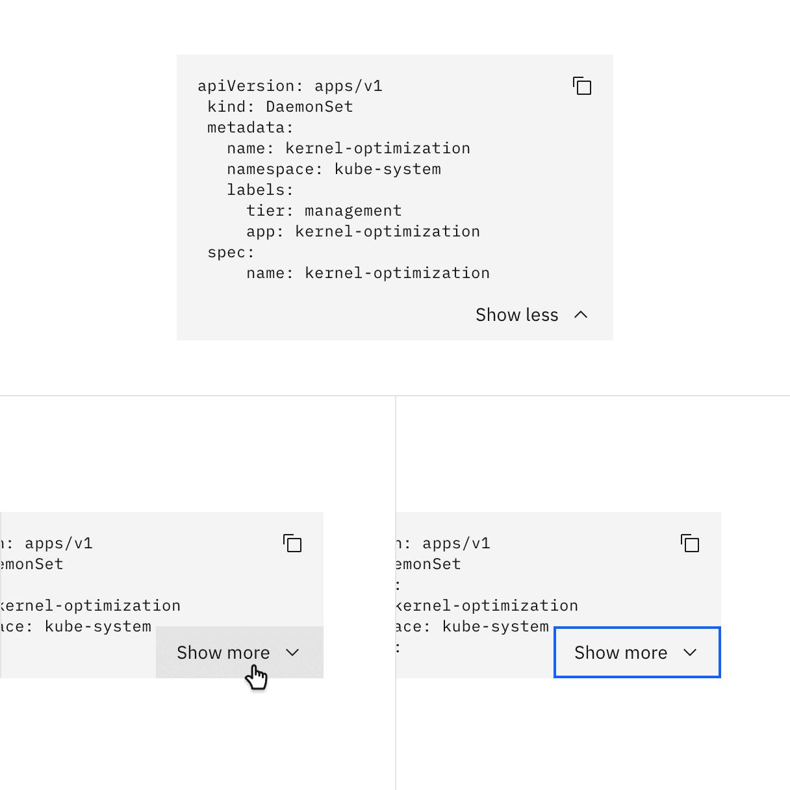
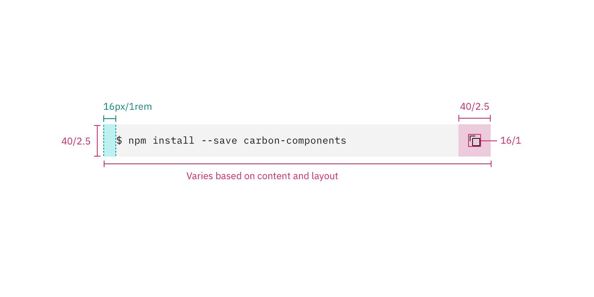
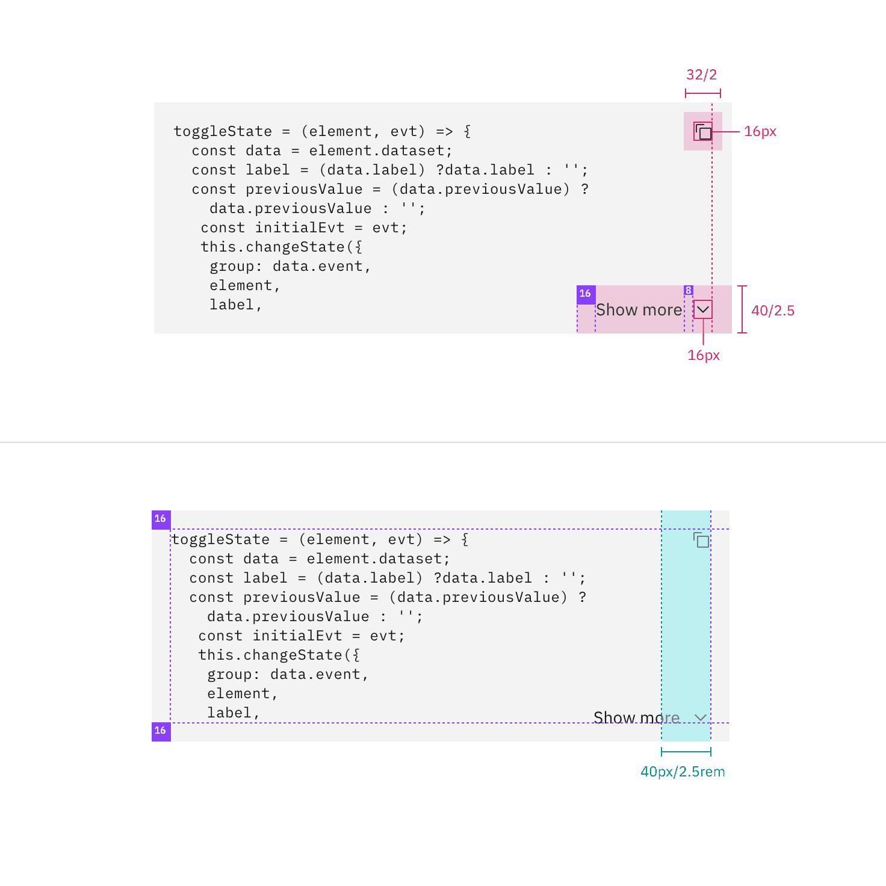

## Color

### Single line

| Element         | Property                                                              | Color token     |
| --------------- | --------------------------------------------------------------------- | --------------- |
| Container       | background                                                            | `$layer` \*     |
| Code            | text color                                                            | `$text-primary` |
| Copy button     | See [ghost button - icon only](/components/button/style#ghost-button) |                 |
| Container:focus | border                                                                | `$focus`        |

<Caption fullWidth>
  \* Denotes a contextual color token that will change values based on the layer
  it is placed on.
</Caption>

<Row>
<Column colLg={8}>

<Caption>Enabled, focus, hover, and active states</Caption>

</Column>
</Row>

### Multi-line

| Element                          | Property                                                              | Color token     |
| -------------------------------- | --------------------------------------------------------------------- | --------------- |
| Container                        | background                                                            | `$layer` \*     |
| Code                             | text color                                                            | `$text-primary` |
| Icon                             | svg                                                                   | `$icon-primary` |
| Copy button   Snippet button | See [ghost button - icon only](/components/button/style#ghost-button) |                 |
| Container:focus                  | border                                                                | `$focus`        |

<Caption>
  * Denotes a contextual color token that will change values based on the layer
  it is placed on.
</Caption>

<Row>
<Column colLg={8}>

<Caption>
  States for copy button: active, enabled, hover, focus, disabled
</Caption>

</Column>
</Row>

<Row>
<Column colLg={8}>

<Caption>States for show toggle: enabled, hover, focus</Caption>

</Column>
</Row>

### Inline snippet

| Element          | Property         | Color token        |
| ---------------- | ---------------- | ------------------ |
| Container        | background-color | `$layer` \*        |
| Code             | text color       | `$text-primary`    |
| Container:hover  | background-color | `$layer-hover` \*  |
| Container:focus  | focus            | `$focus`           |
| Container:active | background-color | `$layer-active` \* |

<Caption>
  * Denotes a contextual color token that will change values based on the layer
  it is placed on.
</Caption>

<Row>
<Column colLg={8}>

<Caption>States for inline codesnippet: enabled, hover, active, focus</Caption>

</Column>
</Row>

### Syntax colors

Carbon has defined a set of accessible syntax colors. View an incontext
[example](https://codepen.io/team/carbon/full/eKMBLw/) on CodePen.

## Typography

| Element   | Font-size (px/rem) | Font-weight   | Type token |
| --------- | ------------------ | ------------- | ---------- |
| Code text | 12 / 0.75          | Regular / 400 | `$code-01` |

## Structure

### Single line

| Element   | Property      | px / rem | Spacing token |
| --------- | ------------- | -------- | ------------- |
| Container | height        | 40 / 3   | –             |
|           | max-width     | 768 / 48 | –             |
|           | padding-right | 48 / 3   | `$spacing-09` |
|           | padding-left  | 16 / 1   | `$spacing-05` |

<Caption>
  Structure and spacing measurements for code snippet | px / rem
</Caption>

### Multi-line code snippet

| Element        | Property      | px / rem                | Spacing token |
| -------------- | ------------- | ----------------------- | ------------- |
| Container      | min-height    | 288 / 18                | –             |
|                | max-height    | Varies based on content | –             |
|                | max-width     | 768 / 48                | –             |
|                | padding       | 16 / 1                  | `$spacing-05` |
|                | padding-right | 40 / 2.5                | `$spacing-08` |
| Icon           | height, width | 16px                    | –             |
| Snippet button | height, width | 40 / 2.5                | –             |
| Copy button    | height, width | 32 / 2                  | –             |

<Caption>
  Structure and spacing measurements for multi-line snippet | px / rem
</Caption>

### Inline code snippet

| Element   | Property                    | px / rem                | Spacing token |
| --------- | --------------------------- | ----------------------- | ------------- |
| Container | height                      | 16 / 1                  | –             |
|           | width                       | Varies based on content | –             |
|           | border-radius               | 2                       | -             |
| Code      | padding-right, padding-left | 8 / 0.5                 | `$spacing-03` |

<Caption>
  Structure and spacing measurements for inline code snippet | px / rem
</Caption>
