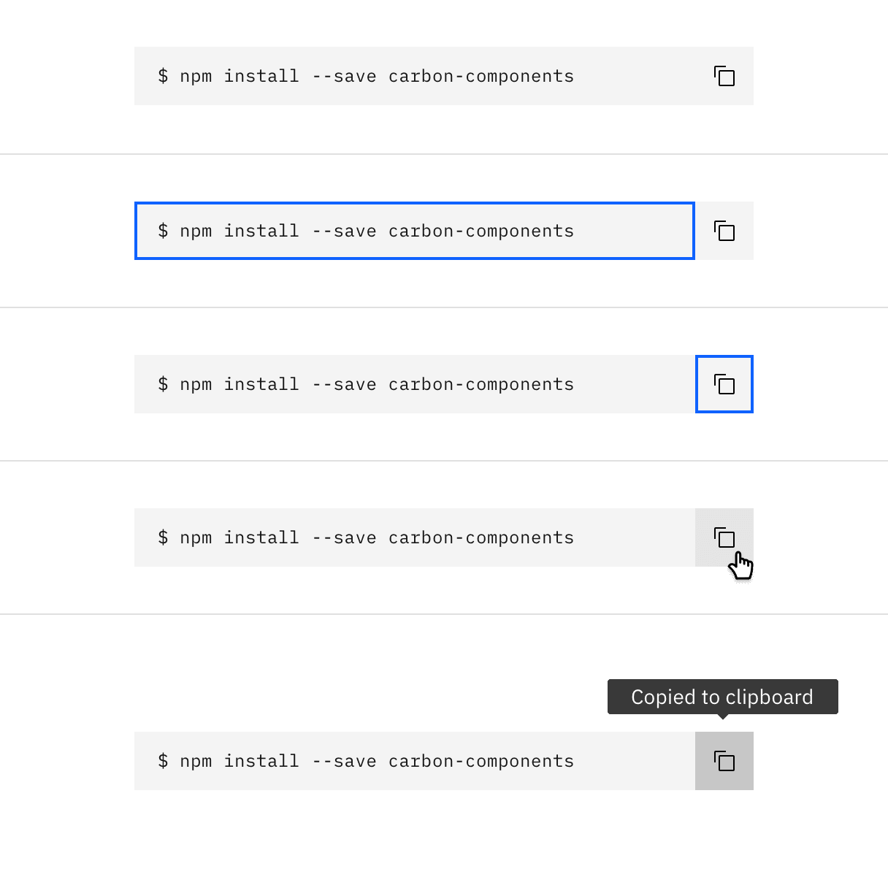
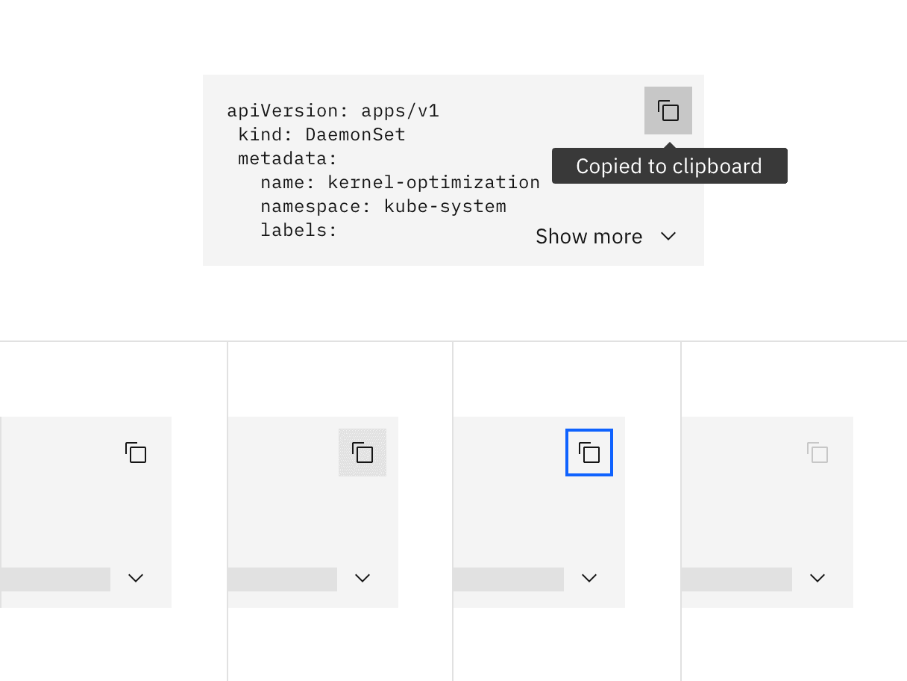
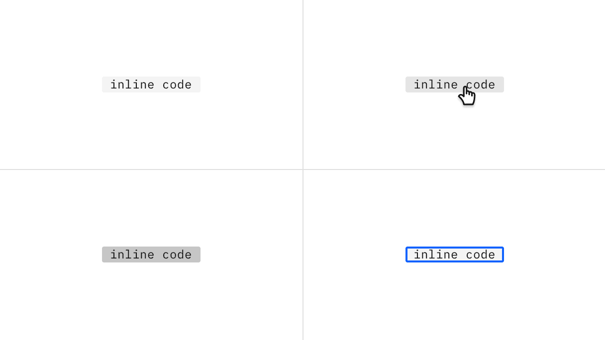
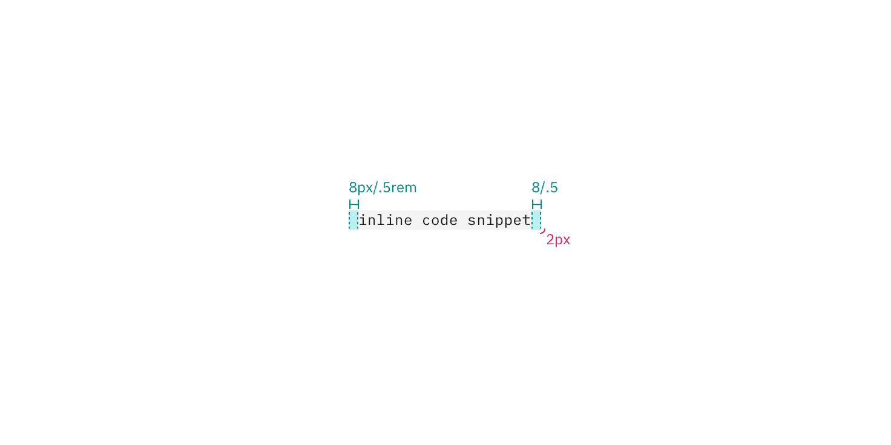

## Color

### Single line

| Class                         | Property         | Color token        |
| ----------------------------- | ---------------- | ------------------ |
| `.bx--snippet`                | background       | `$field-01`        |
| `.bx--snippet`                | text color       | `$text-01`         |
| `.bx--snippet__icon`          | svg              | `$icon-01`         |
| `.bx--copy-btn:hover`         | background-color | `$hover-ui`        |
| `.bx--copy-btn:focus`         | border           | `$focus`           |
| `.bx--copy-btn:active`        | background-color | `$active-ui`       |
| `.bx--snippet--light`         | background-color | `$field-02`        |
| `.bx--copy-btn--light:hover`  | background-color | `$hover-light-ui`  |
| `.bx--copy-btn--light:active` | background-color | `$active-light-ui` |

<Row>
<Column colLg={8}>

<Caption>Enabled, focus, hover, and active states</Caption>

</Column>
</Row>

### Multi-line

| Class                                                                | Property         | Color token        |
| -------------------------------------------------------------------- | ---------------- | ------------------ |
| `.bx--snippet`                                                       | background       | `$field-01`        |
| `.bx--snippet`                                                       | text color       | `$text-01`         |
| `.bx--snippet__icon`                                                 | svg              | `$icon-01`         |
| `.bx--copy-btn:hover`   `.bx--snippet-btn:hover`                 | background-color | `$hover-ui`        |
| `.bx--copy-btn:focus`   `.bx--snippet-btn:focus`                 | border           | `$focus`           |
| `.bx--copy-btn:active`   `.bx--snippet-btn:active`               | background-color | `$active-ui`       |
| `.bx--snippet--light`                                                | background-color | `$field-02`        |
| `.bx--copy-btn--light:hover`   `.bx--snippet-btn--light:hover`   | background-color | `$hover-light-ui`  |
| `.bx--copy-btn--light:active`   `.bx--snippet-btn--light:active` | background-color | `$active-light-ui` |

<Row>
<Column colLg={8}>

<Caption>
  States for copy button: active, enabled, hover, focus, disabled
</Caption>

</Column>
</Row>

<Row>
<Column colLg={8}>

<Caption>States for show toggle: enabled, hover, focus</Caption>

</Column>
</Row>

### Inline snippet

| Class                                            | Property         | Color token        |
| ------------------------------------------------ | ---------------- | ------------------ |
| `.bx--snippet--inline`                           | background-color | `$field-01`        |
| `.bx--snippet--inline`                           | color            | `$text-01`         |
| `.bx--snippet--inline:hover`                     | background-color | `$hover-ui`        |
| `.bx--snippet--inline:focus`                     | focus            | `$focus`           |
| `.bx--snippet--inline:active`                    | background-color | `$active-ui`       |
| `.bx--snippet--inline.bx--snippet--light`        | background-color | `$field-02`        |
| `.bx--snippet--inline:hover.bx--snippet--light`  | background-color | `$hover-light-ui`  |
| `.bx--snippet--inline:active.bx--snippet--light` | background-color | `$active-light-ui` |

<Row>
<Column colLg={8}>

<Caption>States for inline codesnippet: enabled, hover, active, focus</Caption>

</Column>
</Row>

### Syntax colors

Carbon has defined a set of accessible syntax colors. View an incontext
[example](https://codepen.io/team/carbon/full/eKMBLw/) on CodePen.

## Typography

| Class                       | Font-size (px/rem) | Font-weight   | Type token |
| --------------------------- | ------------------ | ------------- | ---------- |
| `.bx--snippet.code`         | 12 / 0.75          | Regular / 400 | `$code-01` |
| `.bx--snippet--inline.code` | 12 / 0.75          | Regular / 400 | `$code-01` |

## Structure

### Single line

| Class                  | Property      | px / rem | Spacing token |
| ---------------------- | ------------- | -------- | ------------- |
| `.bx--snippet--single` | height        | 40 / 3   | –             |
| `.bx--snippet--single` | max-width     | 768 / 48 | –             |
| `.bx--snippet--single` | padding-right | 48 / 3   | `$spacing-09` |
| `.bx--snippet--single` | padding-left  | 16 / 1   | `$spacing-05` |

<Caption>
  Structure and spacing measurements for code snippet | px / rem
</Caption>

### Multi-line code snippet

| Class                    | Property      | px / rem                | Spacing token |
| ------------------------ | ------------- | ----------------------- | ------------- |
| `.bx--snippet--multi`    | min-height    | 288 / 18                | –             |
| `.bx--snippet--multi`    | max-height    | Varies based on content | –             |
| `.bx--snippet--multi`    | max-width     | 768 / 48                | –             |
| `.bx--snippet`           | padding       | 16 / 1                  | `$spacing-05` |
| `.bx--snippet-container` | padding-right | 40 / 2.5                | `$spacing-08` |
| `.bx--snippet__icon`     | height, width | 16px                    | –             |
| `.bx--snippet-button`    | height, width | 40 / 2.5                | –             |
| `.bx--copy-button`       | height, width | 32 / 2                  | –             |

<Caption>
  Structure and spacing measurements for multi-line snippet | px / rem
</Caption>

### Inline code snippet

| Class                       | Property                    | px / rem                | Spacing token |
| --------------------------- | --------------------------- | ----------------------- | ------------- |
| `.bx--snippet--inline`      | height                      | 16 / 1                  | –             |
| `.bx--snippet--inline`      | width                       | Varies based on content | –             |
| `.bx--snippet--inline`      | border-radius               | 2                       | -             |
| `.bx--snippet--inline code` | padding-right, padding-left | 8 / 0.5                 | \$spacing-03  |

<Caption>
  Structure and spacing measurements for inline code snippet | px / rem
</Caption>
