<PageDescription>

Code snippets are strings or small blocks of reusable code that can be copied
and inserted in a code file.

</PageDescription>

<AnchorLinks>

<AnchorLink>Overview</AnchorLink>
<AnchorLink>Live demo</AnchorLink>
<AnchorLink>Formatting</AnchorLink>
<AnchorLink>Content</AnchorLink>
<AnchorLink>Universal behaviors</AnchorLink>
<AnchorLink>Inline</AnchorLink>
<AnchorLink>Single line</AnchorLink>
<AnchorLink>Multi-line</AnchorLink>
<AnchorLink>Modifiers</AnchorLink>
<AnchorLink>Feedback</AnchorLink>

</AnchorLinks>

import {
  codeSnippet,
  codeSnippetSingle,
} from '../../../data/components/code-snippet.js';

## Overview

There are three different variants of code snippets to help cater to varied line
length use cases—inline, single line, and multi-line.

### Variants

| Variant                     | Purpose                                                               |
| --------------------------- | --------------------------------------------------------------------- |
| [Inline](#inline)           | A block of text used inline with sentences or paragraphs.             |
| [Single line](#single-line) | A single line of code.                                                |
| [Multi-line](#multi-line)   | Multiple lines of code with the ability to show more or less strings. |

### When to use

- Use a code snippet to help the user copy strings of text easily, or if you
  want to call out key words for the user.
- Code snippets are typically used in code documentation to help the user get
  started quickly.

### When not to use

- Do not use a code snippet if you want the user to change the input value. Our
  code snippets are read only.

## Live demo

<ComponentDemo
  scope={{ codeSnippet, codeSnippetSingle }}
  components={[
    {
      id: 'code-snippet-single',
      label: 'Single line',
    },
    {
      id: 'code-snippet-multi',
      label: 'Multi line',
    },
    {
      id: 'code-snippet-inline',
      label: 'Inline',
    },
  ]}>
  <ComponentVariant
    id="code-snippet-single"
    knobs={{ CodeSnippet: ['light'] }}
    links={{
      React:
        'http://react.carbondesignsystem.com/?path=/story/codesnippet--inline',
      Angular:
        'https://angular.carbondesignsystem.com/?path=/story/components-code-snippet--basic',
      Vue:
        'http://vue.carbondesignsystem.com/?path=/story/components-cvcodesnippet--default',
      Vanilla: 'https://the-carbon-components.netlify.com/?nav=code-snippet',
    }}>{`
    <CodeSnippet type="single">
    {codeSnippet}
    </CodeSnippet>
`}</ComponentVariant>
  <ComponentVariant
    id="code-snippet-multi"
    knobs={{ CodeSnippet: ['light'] }}
    links={{
      React:
        'http://react.carbondesignsystem.com/?path=/story/codesnippet--inline',
      Angular:
        'https://angular.carbondesignsystem.com/?path=/story/components-code-snippet--basic',
      Vue:
        'http://vue.carbondesignsystem.com/?path=/story/components-cvcodesnippet--default',
      Vanilla: 'https://the-carbon-components.netlify.com/?nav=code-snippet',
    }}>{`
    <CodeSnippet type="multi">
    {codeSnippet}
    </CodeSnippet>
`}</ComponentVariant>
  <ComponentVariant
    id="code-snippet-inline"
    knobs={{ CodeSnippet: ['light'] }}
    links={{
      React:
        'http://react.carbondesignsystem.com/?path=/story/codesnippet--inline',
      Angular:
        'https://angular.carbondesignsystem.com/?path=/story/components-code-snippet--basic',
      Vue:
        'http://vue.carbondesignsystem.com/?path=/story/components-cvcodesnippet--default',
      Vanilla: 'https://the-carbon-components.netlify.com/?nav=code-snippet',
    }}>{`
    <CodeSnippet type="inline">{codeSnippetSingle}</CodeSnippet>
`}</ComponentVariant>
</ComponentDemo>

## Formatting

### Anatomy

<Row>
<Column colLg={8}>

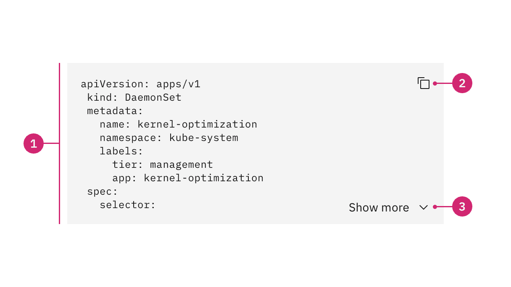

</Column>
</Row>

1. **Snippet text:** Lines or a block of code.
2. **Copy button (optional)**: An icon button to copy the code to the clipboard.
3. **Show more button (optional)**: A ghost button to expand or collapse the
   code snippet to show more or fewer lines of code.

### Placement

Code snippet containers should vertically align to the grid with other form
components on a page.

_Note: If using an inline code snippet, the snippet will live within a body of
text._

<DoDontRow>
  <DoDont caption="Do align code snippet containers to the grid.">

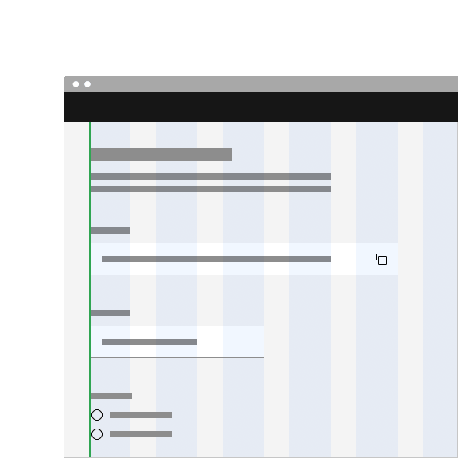

  </DoDont>
  <DoDont type="dont" caption="Do not align code snippet text to the grid and hang the container.">

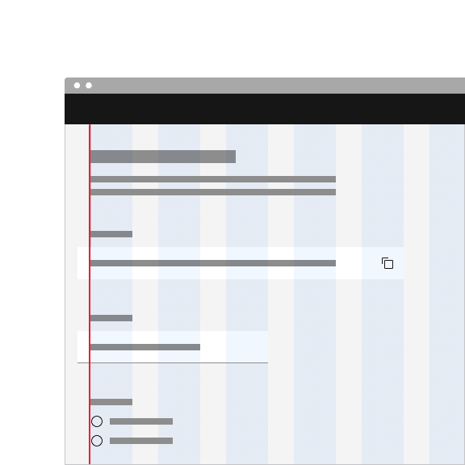

  </DoDont>
</DoDontRow>

## Content

### Main elements

#### Snippet text

- Make sure the code is using the correct syntax so that the code will not break
  if the user copies it to their clipboard.

#### Copy button tooltip

- The copy button should be accompanied by a tooltip. Tooltip feedback text
  should be concise and describe the action taken when the user clicks the copy
  button. By default we display the text "Copied to clipboard".

#### Show more button

- The ghost button text should describe what the button will reveal or hide when
  the user clicks it. By default we display the text "Show more" or "Show less".

### Further guidance

For further content guidance, see Carbon's
[content guidelines](/guidelines/content/overview).

## Universal behaviors

### Copy to clipboard

Code snippets by default have a copy functionality that allows users to copy the
provided code to their clipboard. The copy icon must be accompanied by a
confirmation tooltip that states the successful action of copying an item to the
clipboard. Having copy functionality is optional and can be removed if it's not
necessary for your use case.

<Row>
<Column colLg={8}>

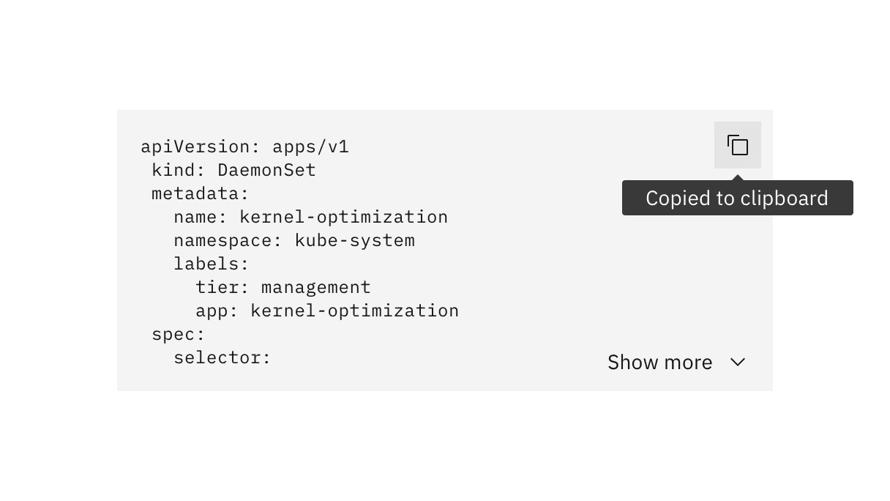

</Column>
</Row>

## Interactions

#### Mouse

An inline code snippet can be copied by clicking anywhere on the snippet itself.

<Row>
<Column colLg={8}>

</Column>
</Row>

A single line code snippet can be copied by clicking on the "copy" icon or by
manually highlighting the text and right clicking "copy".

<Row>
<Column colLg={8}>

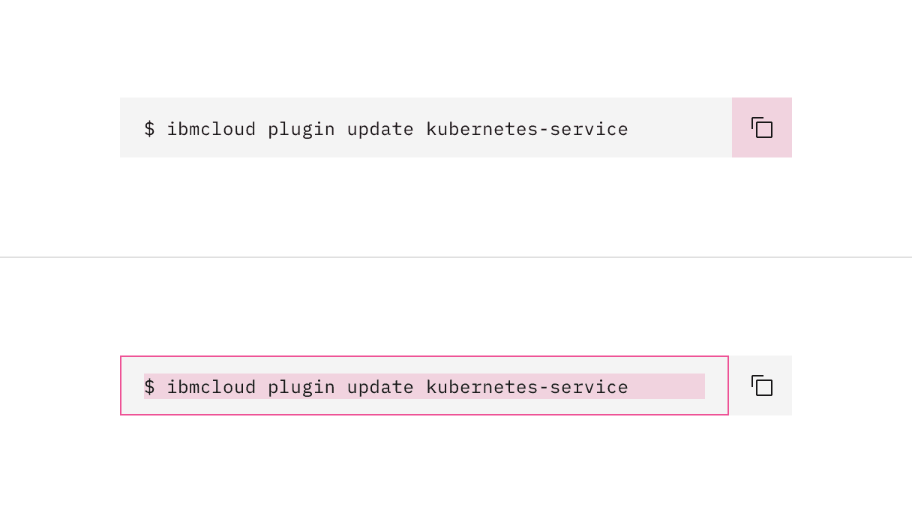

</Column>
</Row>

A multi-line code snippet can be copied by clicking on the copy icon or by
manually highlighting the text and right clicking "copy".

<Row>
<Column colLg={8}>

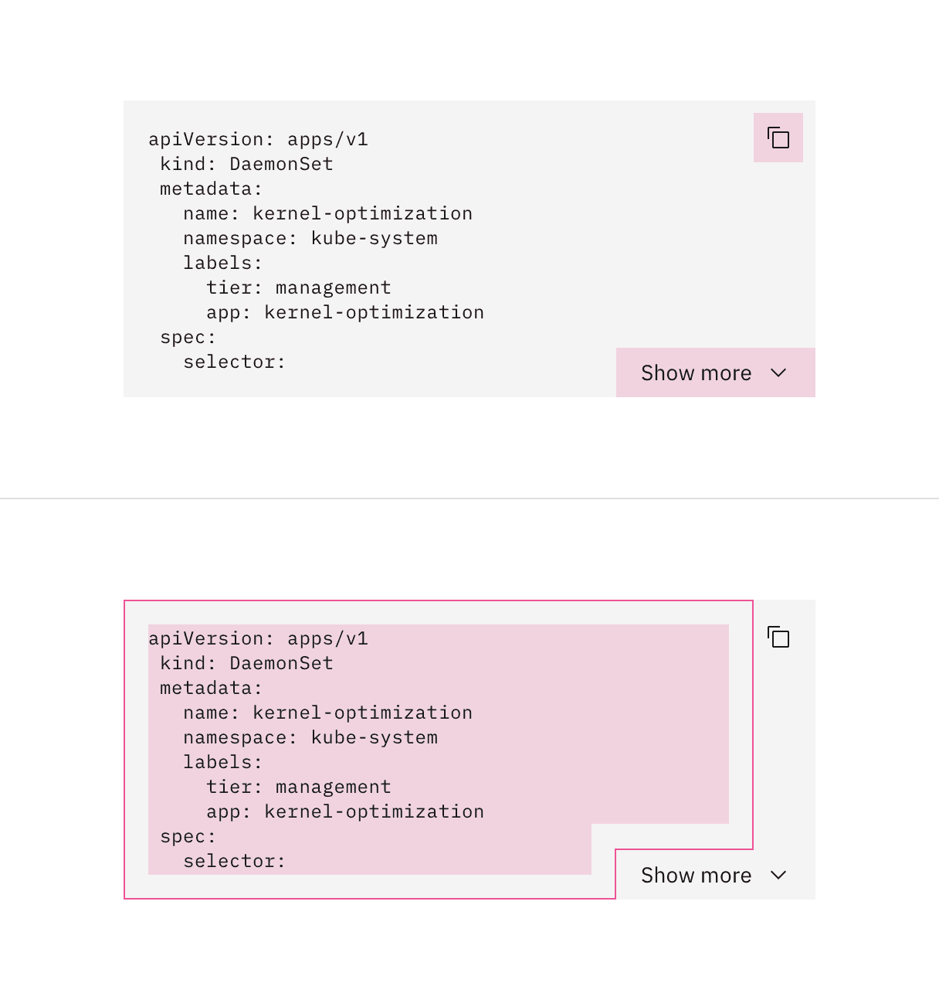

</Column>
</Row>

#### Keyboard

#### Copy button:

- The copy button can be focused by pressing `Tab`.
- Once the copy button is in focus, the copy functionality can be activated by
  pressing either `Space` or `Enter`.
- After the copy button is activated, the focus remains on the button since
  there is no change in context.

#### Show more button:

- The ghost button in the multi-line code snippet can be focused by pressing
  `Tab`.
- Show more or less code by pressing `Space` or `Enter` while the ghost button
  is in focus.

#### Screen readers

- VoiceOver: Users can copy code by pressing `Space` while the copy button has
  screen reader focus.
- JAWS: Users can copy code by pressing `Space` while the copy button has screen
  reader focus.
- NVDA: Users can copy code by pressing `Space` while the copy button has screen
  reader focus.

## Inline

Use inline code snippets within bodies of text. Using code snippets inline helps
create emphasis on important key words to copy and makes long bodies of text
easier to scan. Refrain from having inline code snippets that extend to multiple
lines.

<Row>
<Column colLg={8}>

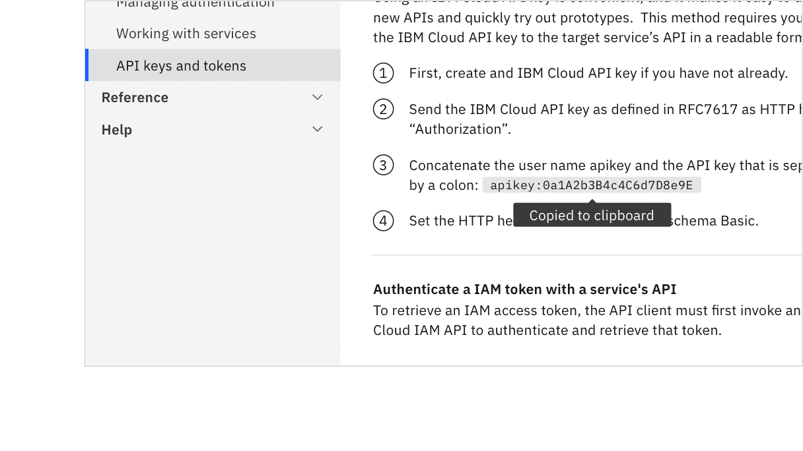

</Column>
</Row>

## Single line

Use single line code snippets for longer strings of code that can still be
presented on one line.

<Row>
<Column colLg={8}>

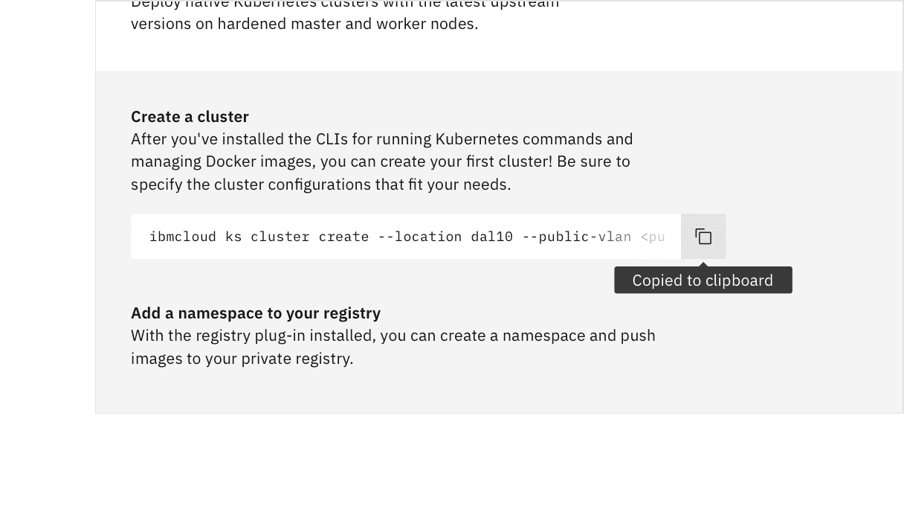

</Column>
</Row>

### Overflow content

If the text in a single line code snippet is lengthy, the text overflows into a
horizontal scroll.

<Row>
<Column colLg={8}>

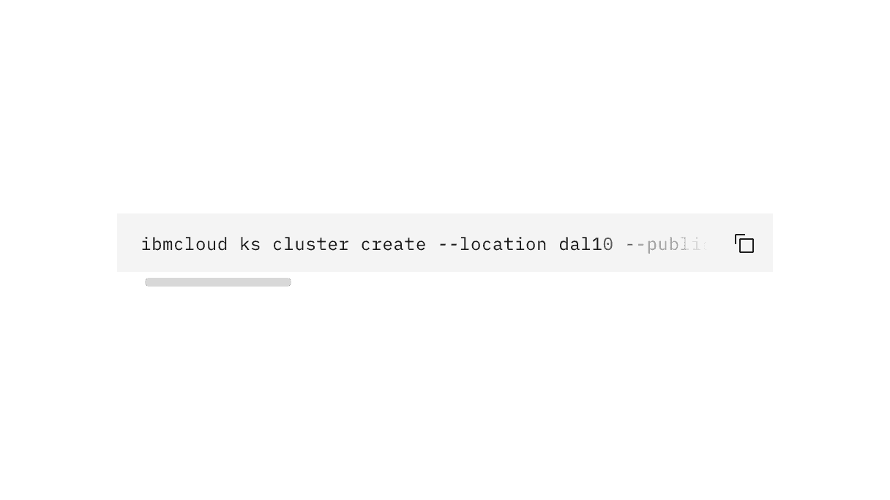

</Column>
</Row>

## Multi-line

Use multi-line code snippets for displaying multiple lines of code.

<Row>
<Column colLg={12}>

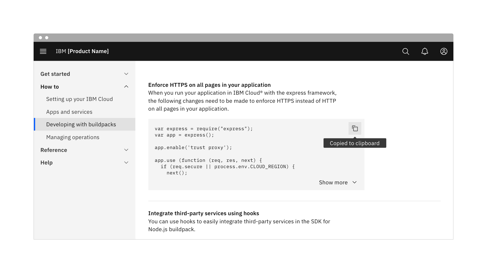

</Column>
</Row>

### Overflow content

#### Show more button

A ghost button can be added to a multi-line code snippet to show more or fewer
lines of code. Use this functionality if your layout is tight on space.

<Row>
<Column colLg={8}>

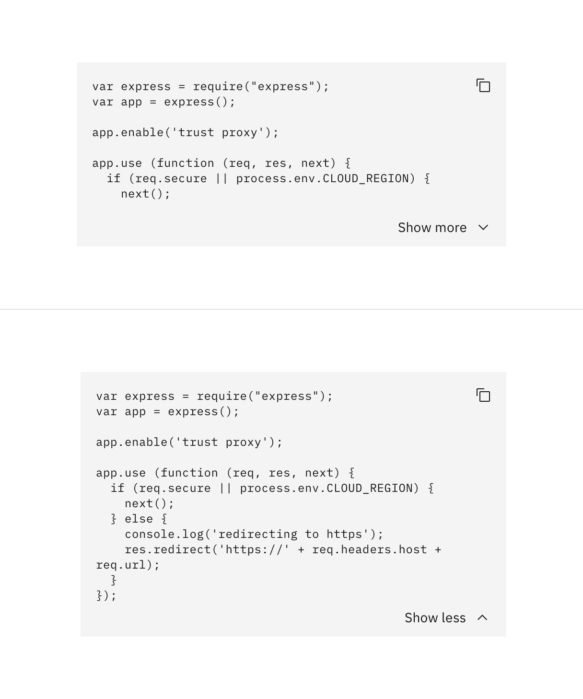

</Column>
</Row>

#### Vertical scroll

Alternatively, you can apply vertical scrolling to the code snippet if there are
more than nine lines of code.

#### Horizontal scroll

Terminal commands are often longer strings and should only appear on one line.
Apply horizontal scrolling to maintain the set width of the box for these longer
strings.

## Modifiers

#### Light

Use the `light` prop modifier when using a code snippet on a background other
than the UI background for that theme. The light prop changes the background
color token of the code snippet from `field-01` to `field-02`.

<Row>
<Column colLg={8}>

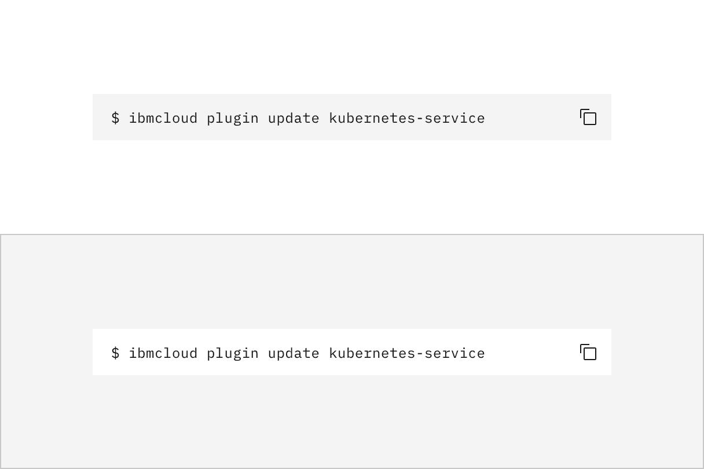

</Column>
</Row>

## Feedback

Help us improve this component by providing feedback, asking questions, and
leaving any other comments on
[GitHub](https://github.com/carbon-design-system/carbon-website/issues/new?assignees=&labels=feedback&template=feedback.md).
