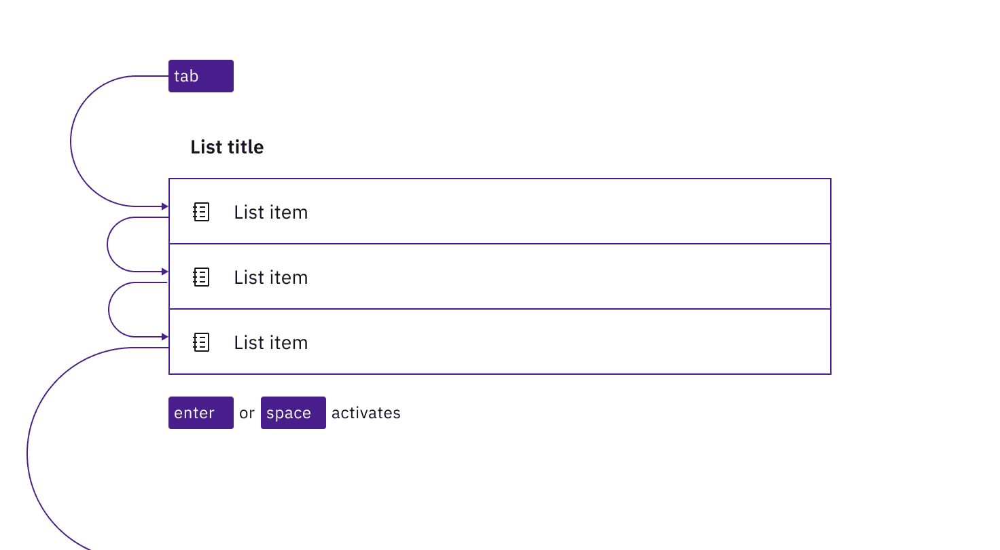
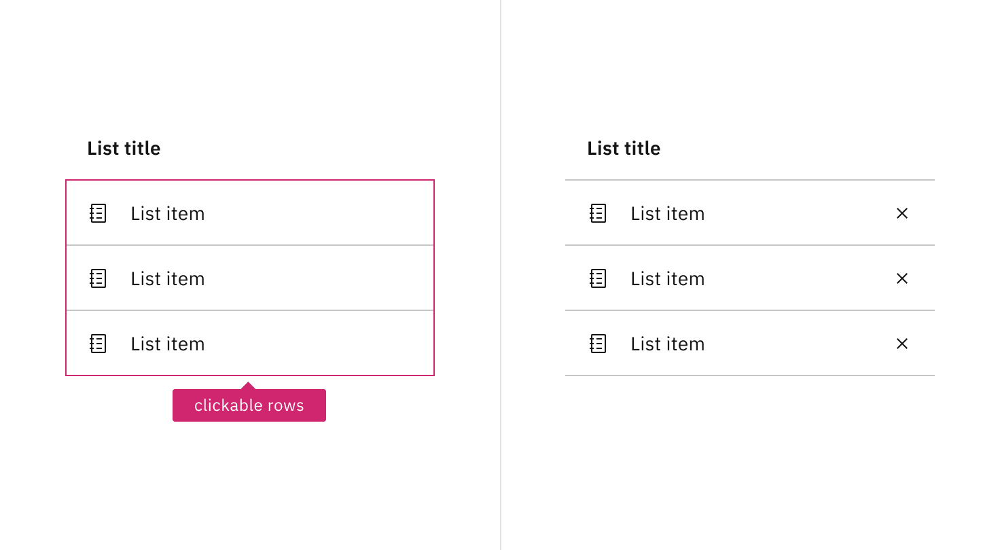

<PageDescription>

Design annotations are needed for specific instances shown below, but for the
standard contained list component, Carbon already incorporates accessibility.

</PageDescription>

<InlineNotification>

This page is underdevelopment. Please check back later for updates.

</InlineNotification>

<AnchorLinks>
  <AnchorLink>What Carbon provides</AnchorLink>
  <AnchorLink>Design recommendations</AnchorLink>
  <AnchorLink>Development considerations</AnchorLink>
</AnchorLinks>

## What Carbon provides

Carbon bakes keyboard operation into its components, improving the experience of
blind users and others who operate via the keyboard. Carbon incorporates many
other accessibility considerations, some of which are described below.

### Keyboard interactions

The default contained list is not interactive, but a number of its variants
include keyboard operation. In all interactive variants, the `Tab` key is used
for navigation, and `Space` or `Enter` are used to activate components.

Users tab between any actionable items in the list, whether each item is itself
clickable or contains an action button (such as ‘delete’). It is possible for
multiple tab stops to exist for each list item.

<Row>
<Column colLg={8}>

<Caption>
  In a clickable contained list, each list item is a tab stop, activated with
  Enter or Space.
</Caption>

</Column>
</Row>

<Row>
<Column colLg={8}>

<Caption>
  Where a contained list has buttons on each row, the buttons are in the tab
  order.
</Caption>

</Column>
</Row>

<Row>
<Column colLg={8}>

<Caption>
  If a contained list contained both clickable rows and action items, there are
  multiple tab stops on each row.
</Caption>

</Column>
</Row>

There are two kinds of filterable contained lists: persistent or expandable. The
only difference is that for the expandable, a Filter button hides the input
until it is activated with `Enter` or `Space`. In both cases, once the user has
tabbed to the input, the standard Carbon
[search input interaction](https://carbondesignsystem.com/components/search/accessibility/)
takes place.

<Row>
<Column colLg={8}>

<Caption>
  The expandable search is launched by activating the Filter button with Enter
  or Space. The user then tabs into the input to begin to filter the list.
</Caption>

</Column>
</Row>

## Design recommendations

### Indicate when the contained list is clickable

There is no persistent visual indicator that the list items in a contained list
are clickable. To help developers distinguish them from the default contained
list in your designs, annotate where the rows in a list are intended to be
clickable.

<Row>
<Column colLg={8}>

<Caption>
  Annotate whether the switcher should be implemented as automatic or manual.
</Caption>

</Column>
</Row>

## Development considerations

Keep these considerations in mind if you are modifying Carbon or creating a
custom component.

- The contained list is implemented as a list (usually a `<ul>`) with each item
  an `<li>`, and the list title associated with the list through use of
  `aria-labelledby`.
- Any operable variant, whether a clickable list or a list with action items, is
  a `<button>` implemented as a child of the `<li>`.
