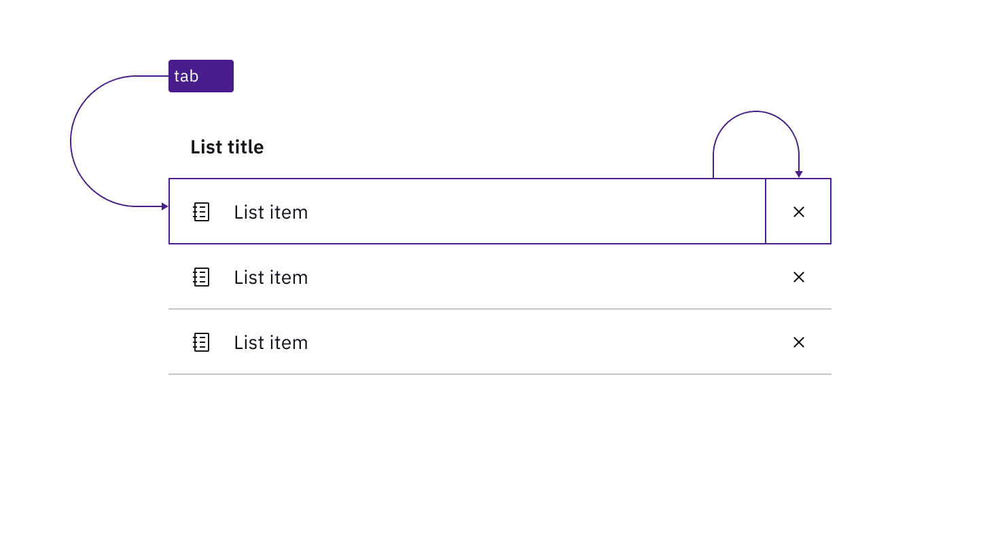

<PageDescription>

Design annotations are needed for specific instances shown below, but for the
standard contained list component, Carbon already incorporates accessibility.

</PageDescription>

<InlineNotification>

This page is underdevelopment. Please check back later for updates.

</InlineNotification>

<AnchorLinks>
  <AnchorLink>What Carbon provides</AnchorLink>
  <AnchorLink>Design recommendations</AnchorLink>
  <AnchorLink>Development considerations</AnchorLink>
</AnchorLinks>

## What Carbon provides

Carbon bakes keyboard operation into its components, improving the experience of
blind users and others who operate via the keyboard. Carbon incorporates many
other accessibility considerations, some of which are described below.

### Keyboard interactions

The default contained list is not interactive, but several of its variants
include keyboard operation. In all interactive variants, the `Tab` key is used
for navigation and both `Space` and `Enter` are used to activate components.

Users tab between any actionable items in the list, regardless of whether each
item is itself clickable or contains an action button (such as ‘delete’). It is
possible for multiple tab stops to exist for each list item.

<Row>
<Column colLg={8}>

<Caption>
  In a clickable contained list, each list item is a tab stop, activated with
  Enter or Space.
</Caption>

</Column>
</Row>

<Row>
<Column colLg={8}>

<Caption>
  Where a contained list has buttons on each row, the buttons are in the tab
  order.
</Caption>

</Column>
</Row>

<Row>
<Column colLg={8}>

<Caption>
  If a contained list contains both clickable rows and action items, there are
  multiple tab stops on each row.
</Caption>

</Column>
</Row>

## Design recommendations

### Indicate when the contained list is clickable

There is no persistent visual indicator that the list items in a contained list
are clickable. To help developers distinguish them from the default contained
list in your designs, annotate if each row in a list is intended to be
clickable. There is no need to annotate clickable buttons on each row since
these are visually identifiable.

<Row>
<Column colLg={8}>

<Caption>
  Annotate if the rows of a contained list are clickable. Do not annotate if it
  is only buttons on each row that are actionable.
</Caption>

</Column>
</Row>

## Development considerations

Keep these considerations in mind if you are modifying Carbon or creating a
custom component.

- The contained list is implemented as a list (usually a `<ul>`) with each item
  an `<li>`, and the list title associated with the list through use of
  `aria-labelledby`.
- Any operable variant, whether a clickable list or a list with action items, is
  a `<button>` implemented as a child of the `<li>`.
