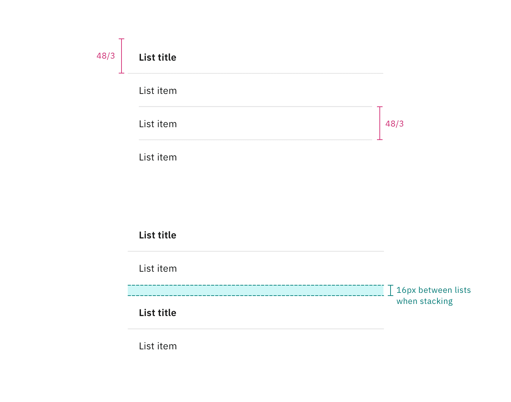

## Color

| Element          | Property         | Color token        |
| ---------------- | ---------------- | ------------------ |
| Title: on page   | text color       | `$text-primary`    |
|                  | background-color | `$background`      |
| Title: disclosed | text color       | `$text-secondary`  |
|                  | background-color | `$layer`\*         |
| Item             | text color       | `$text-primary`    |
|                  | background-color | transparent        |
| Icon (optional)  | svg              | `$icon-primary`    |
| Row divider      | border-bottom    | `$border-subtle`\* |

<Caption>
  * Denotes a contextual color token that will change values based on the layer
  it is placed on.
</Caption>

<Row>
<Column colLg={8}>

</Column>
</Row>

<Caption>Example of enabled states for contained list variants.</Caption>

## Interactive states

| Element  | Property         | Color token        |
| -------- | ---------------- | ------------------ |
| Hover    | background-color | `$layer-hover`\*   |
| Focus    | border           | `$focus`           |
| Active   | background-color | `$layer-active`\*  |
| Disabled | text color       | `$text-disabled`   |
|          | border           | `$border-disabled` |

<Caption>
  * Denotes a contextual color token that will change values based on the layer
  it is placed on.
</Caption>

<Row>
<Column colLg={8}>

</Column>
</Row>

<Caption>Example of states for contained list item rows.</Caption>

<Row>
<Column colLg={8}>

</Column>
</Row>

<Caption>Example of states for contained list inline actions.</Caption>

## Typography

All contained list text should be set in sentence case, with only the first word
in a phrase and any proper nouns capitalized.

| Element          | Font-size (px/rem) | Font-weight    | Type token            |
| ---------------- | ------------------ | -------------- | --------------------- |
| Title: on page   | 14 / 0.875         | SemiBold / 600 | `$heading-compact-01` |
| Title: disclosed | 12 / 0.75          | Regular / 400  | `$label-01`           |
| Item             | 14 / 0.875         | Regular / 400  | `$body-01`            |

## Structure

| Element           | Property                    | px / rem | Spacing token |
| ----------------- | --------------------------- | -------- | ------------- |
| Header: on page   | height                      | 32/2     | $spacing-07   |
|                   | padding-left, padding-right | 16/1     | $spacing-05   |
| Header: disclosed | height                      | 48/3     | $spacing-09   |
|                   | padding-left, padding-right | 16/1     | $spacing-05   |
| Item              | padding-left, padding-right | 16/1     | $spacing-05   |
| Icon (optional)   | height, width               | 16/1     | —             |

<Caption>
  Structure and spacing measurements for contained list. | px / rem
</Caption>

<Caption>
  Structure and spacing measurements for contained list. | px / rem
</Caption>

<Caption>
  Structure and spacing measurements for contained list. | px / rem
</Caption>

<Caption>
  Structure and spacing measurements for contained list. | px / rem
</Caption>
