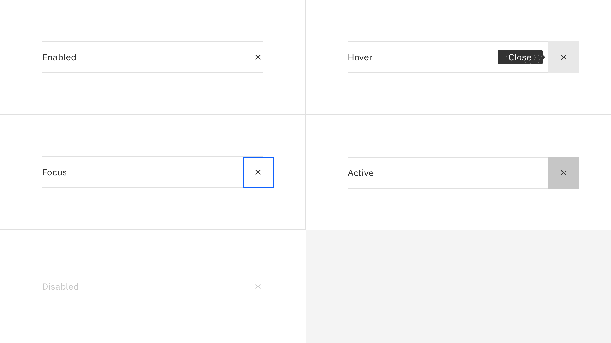
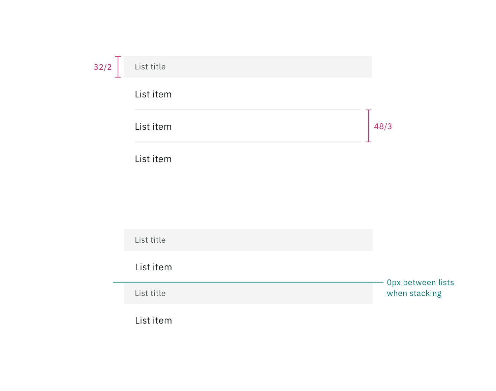
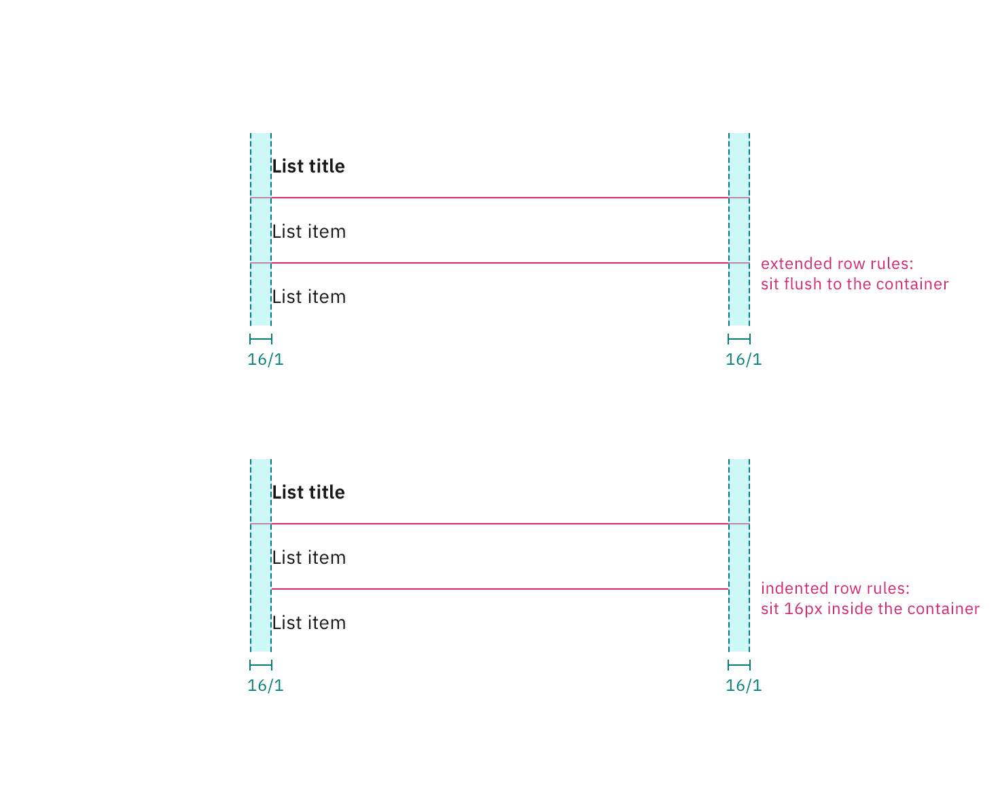
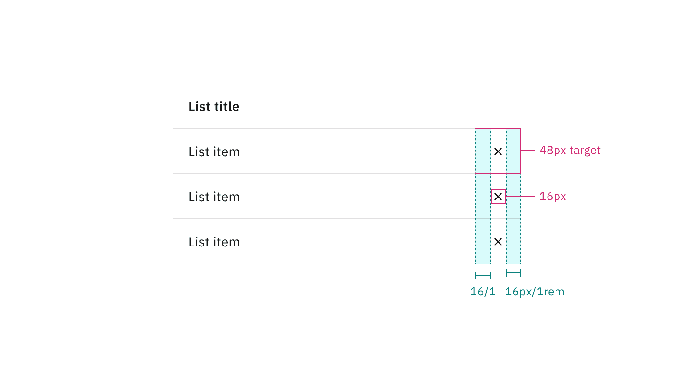
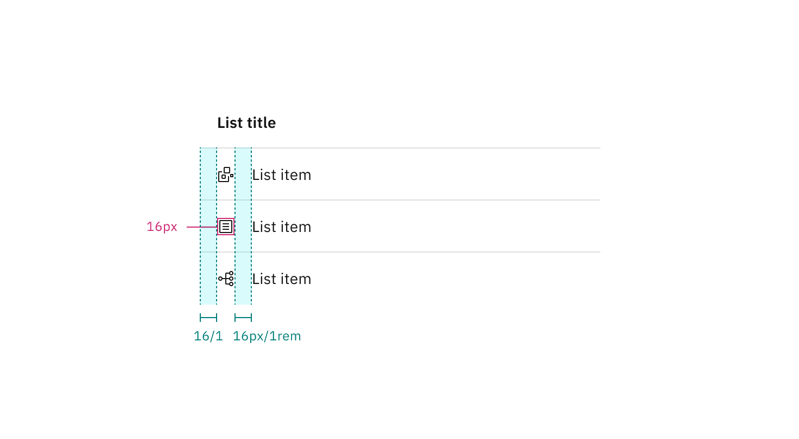
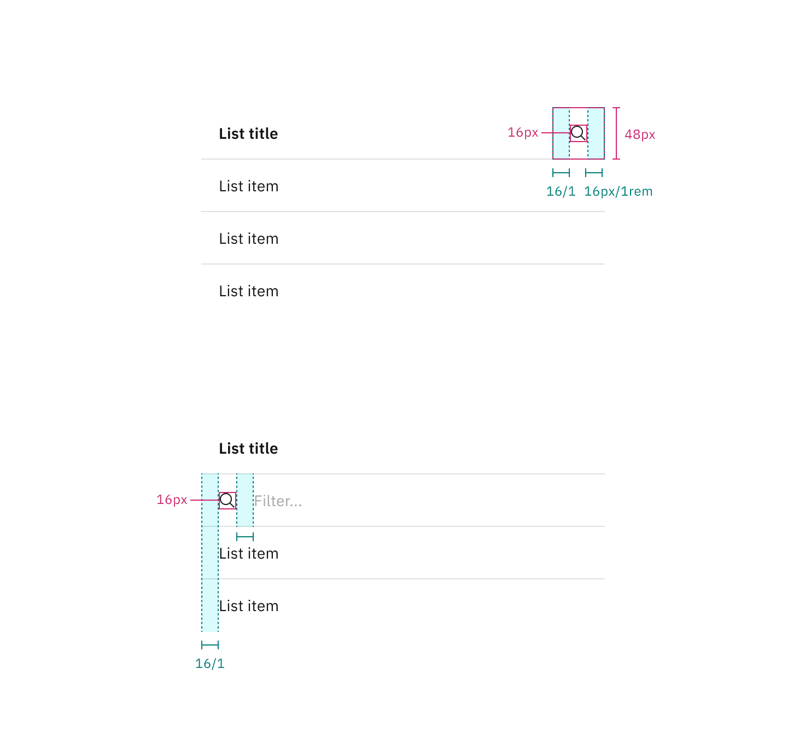
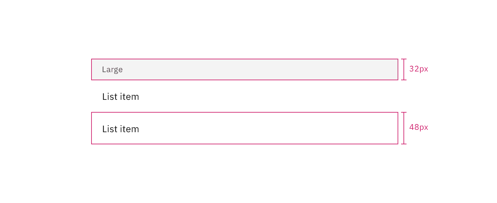

<PageDescription>

The following page documents visual specifications such as color, typography,
structure, and size.

</PageDescription>

<AnchorLinks>

<AnchorLink>Color</AnchorLink>
<AnchorLink>Typography</AnchorLink>
<AnchorLink>Structure</AnchorLink>
<AnchorLink>Size</AnchorLink>
<AnchorLink>Feedback</AnchorLink>

</AnchorLinks>

## Color

| Element               | Property         | Color token        |
| --------------------- | ---------------- | ------------------ |
| List title: on-page   | text color       | `$text-primary`    |
|                       | background-color | `$background`      |
| List title: disclosed | text color       | `$text-secondary`  |
|                       | background-color | `$layer`\*         |
| List item             | text color       | `$text-primary`    |
|                       | background-color | transparent        |
| Icon (optional)       | svg              | `$icon-primary`    |
| Row divider           | border-bottom    | `$border-subtle`\* |

<Caption>
  * Denotes a contextual color token that will change values based on the layer
  it is placed on.
</Caption>

<Row>
<Column colLg={8}>

</Column>
</Row>

<Caption>Example of enabled states for contained list variants.</Caption>

### Interactive states

| Element  | Property         | Color token        |
| -------- | ---------------- | ------------------ |
| Hover    | background-color | `$layer-hover`\*   |
| Focus    | border           | `$focus`           |
| Active   | background-color | `$layer-active`\*  |
| Disabled | text color       | `$text-disabled`   |
|          | border           | `$border-disabled` |

<Caption>
  * Denotes a contextual color token that will change values based on the layer
  it is placed on.
</Caption>

<Row>
<Column colLg={12}>

</Column>
</Row>

<Caption>Example of interactive states for contained list item rows.</Caption>

 

<Row>
<Column colLg={12}>

</Column>
</Row>

<Caption>
  Example of interactive states for contained list inline actions.
</Caption>

## Typography

All contained list text should be set in sentence case, with only the first word
in a phrase and any proper nouns capitalized.

| Element               | Font-size (px/rem) | Font-weight    | Type token            |
| --------------------- | ------------------ | -------------- | --------------------- |
| List title: on-page   | 14 / 0.875         | SemiBold / 600 | `$heading-compact-01` |
| List title: disclosed | 12 / 0.75          | Regular / 400  | `$label-01`           |
| List item             | 14 / 0.875         | Regular / 400  | `$body-01`            |

## Structure

| Element                         | Property                    | px / rem | Spacing token |
| ------------------------------- | --------------------------- | -------- | ------------- |
| List header area: on-page       | height                      | 32 / 2   | `$spacing-07` |
|                                 | padding-left, padding-right | 16 / 1   | `$spacing-05` |
| List header area: disclosed     | height                      | 48 / 3   | `$spacing-09` |
|                                 | padding-left, padding-right | 16 / 1   | `$spacing-05` |
| List item                       | padding-left, padding-right | 16 / 1   | `$spacing-05` |
| Non-interactive icon (optional) | height, width               | 16px     | —             |
|                                 | padding left, padding-right | 16 / 1   | `$spacing-05` |
| Inline action icon (optional)   | height, width               | 16px     | —             |
|                                 | padding left, padding-right | 16 / 1   | `$spacing-05` |
| Search icon (optional)          | height, width               | 16px     | —             |
|                                 | padding left, padding-right | 16 / 1   | `$spacing-05` |

<Caption>
  Structure and spacing measurements for the on-page list variant. | px / rem
</Caption>

 

<Caption>
  Structure and spacing measurements for the disclosed list variant. | px / rem
</Caption>

 

<Caption>
  Structure and spacing measurements for height and width of row content. | px /
  rem
</Caption>

 

<Caption>
  Structure and spacing measurements for padding and rule alignment. | px / rem
</Caption>

 

<Caption>
  Structure and spacing measurements for inline actions. | px / rem
</Caption>

 

<Caption>
  Structure and spacing measurements for non-interactive icons. | px / rem
</Caption>

 

<Caption>
  Structure and spacing measurements for search and filtering. | px / rem
</Caption>

## Size

### On-page list

| Size             | Element        | Height px / rem |
| ---------------- | -------------- | --------------- |
| Small (sm)       | Header and row | 32 / 2          |
| Medium (md)      | Header and row | 40 / 2.5        |
| Large (lg)       | Header and row | 48 / 3          |
| Extra large (xl) | Header         | 48 / 3          |
|                  | Row            | 64 / 4          |

<Caption>Sizes for contained list on-page variant | px / rem</Caption>

### Disclosed list

| Size       | Element | Height px / rem |
| ---------- | ------- | --------------- |
| Large (lg) | Header  | 32 / 2          |
|            | Row     | 48 / 3          |

<Caption>Sizes for contained list disclosed variant | px / rem</Caption>

## Feedback

Help us improve this component by providing feedback, asking questions, and
leaving any other comments on
[GitHub](https://github.com/carbon-design-system/carbon-website/issues/new?assignees=&labels=feedback&template=feedback.md).
