import A11yStatus from 'components/A11yStatus';

<PageDescription>

Contained lists group content that is similar or related and can contain
read-only or interactive information.

</PageDescription>

<AnchorLinks>

<AnchorLink>Live demo</AnchorLink>
<AnchorLink>Overview</AnchorLink>
<AnchorLink>Formatting</AnchorLink>
<AnchorLink>Content</AnchorLink>
<AnchorLink>On-page list</AnchorLink>
<AnchorLink>Disclosed list</AnchorLink>
<AnchorLink>Modifiers</AnchorLink>
<AnchorLink>Related</AnchorLink>
<AnchorLink>Feedback</AnchorLink>

</AnchorLinks>

## Live demo

<StorybookDemo
  themeSelector
  url="https://react.carbondesignsystem.com"
  variants={[
    {
      label: 'Default',
      variant: 'components-containedlist--default',
    },
    {
      label: 'Disclosed',
      variant: 'components-containedlist--disclosed',
    },
    {
      label: 'With actions',
      variant: 'components-containedlist--with-actions',
    },
    {
      label: 'With icons',
      variant: 'components-containedlist--with-icons',
    },
    {
      label: 'With interactive items',
      variant: 'components-containedlist--with-interactive-items',
    },
    {
      label: 'With interactive items and actions',
      variant: 'components-containedlist--with-interactive-items-and-actions',
    },
    {
      label: 'With list title decorators',
      variant: 'components-containedlist--with-list-title-decorators',
    },
  ]}
/>

<A11yStatus layout="cards" components="Contained list" />

## Overview

Contained lists are commonly used inside of containers like cards, sidebars, and
disclosure situations. These lists have one header column of information with
multiple list item rows. Contained lists help you organize related content
within smaller spaces within a user interface and allow you to include inline
actions and interactive elements.

<Row>
<Column colLg={8}>

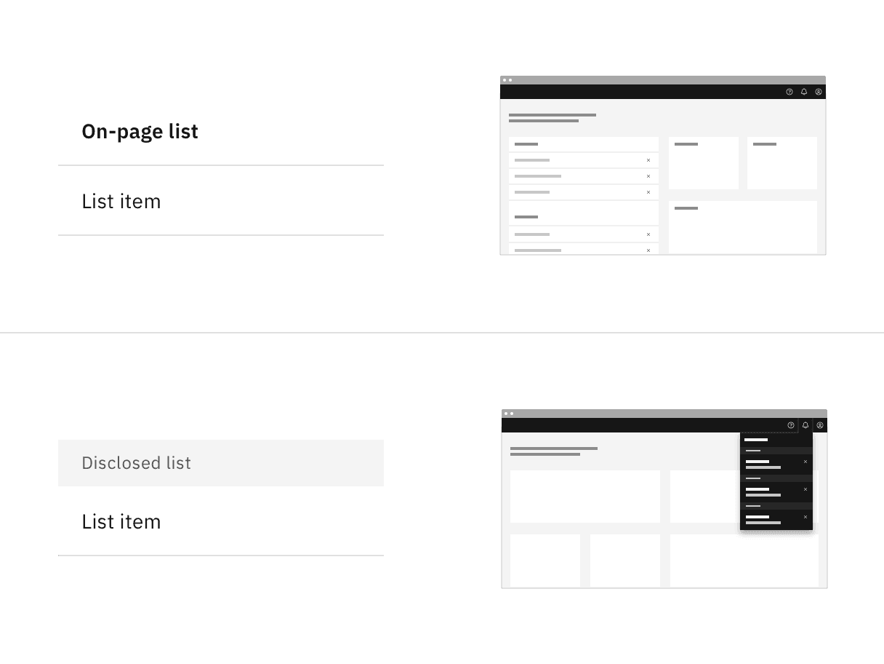

</Column>
</Row>

### When to use

- Use on a page inside of small spaces or in disclosure situations.
- Use when including interactive elements or inline actions in a list.
- To logically group items that follow the same content structure.

### When not to use

- Do not use if the list content needs to be nested more than one level deep and
  becomes overly complex and lengthy. For these situations, use the
  [data table](https://carbondesignsystem.com/components/data-table/usage/)
  component instead.
- Do not use if the list needs to contain multiple column headers, instead use
  the
  [structured list](https://carbondesignsystem.com/components/structured-list/usage/)
  component.

### Variants

| Variant                           | Purpose                                                                                                                                                |
| --------------------------------- | ------------------------------------------------------------------------------------------------------------------------------------------------------ |
| [On-page list](#on-page-list)     | Use this variant when placing the list in a persistent context like the main area in the user interface, such as on a card or in a sidebar.            |
| [Disclosed list](#disclosed-list) | Use this variant when the list is shown within a temporary context, for example within a popover or layer that is elevated by a drop shadow or border. |

## Formatting

### Anatomy

Contained lists are made up of a list header area, list title, list item rows,
and optional interactive elements.

<Row>
<Column colLg={8}>

</Column>
</Row>

1. **List header area:** Area to group the succeeding list items.
2. **List item area:** Area to group text and elements in a list row.
3. **List title:** Descriptive name for the group of list items.
4. **List item:** The content in a list item row.
5. **Non-interactive icon (optional):** A decorative icon to help visually
   describe a list item.
6. **Search icon button (optional):** An icon button for search or filtering
   functionality in the contained list.
7. **Interactive element (optional):** An interactive element in the header or
   row such as a button, link, icon, tag, or toggle.

### Alignment

Contained lists can have multiple sections and stack on top of each other. When
stacking multiple on-page lists, there should be 16px padding ($spacing-05)
between each list. When stacking multiple disclosed lists, stack them to be
flush with 0px padding between each other.

<Row>
<Column colLg={8}>

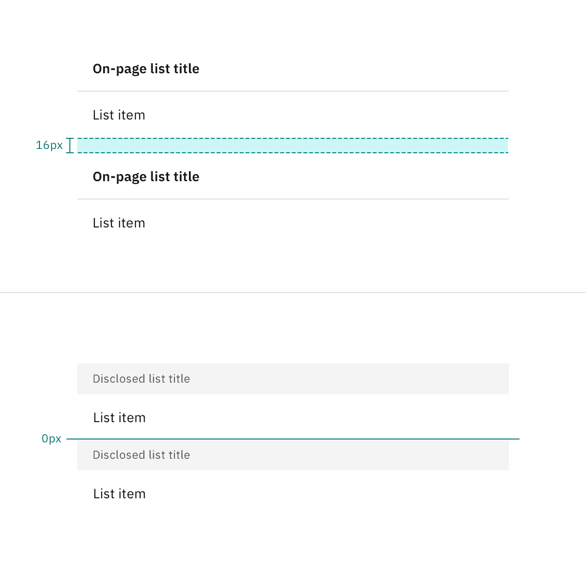

</Column>
</Row>

### Scrolling

Contained list header areas can be sticky and fixed in place while the list item
rows scroll underneath. This functionality is optional depending on the use
case.

<Row>
<Column colLg={8}>

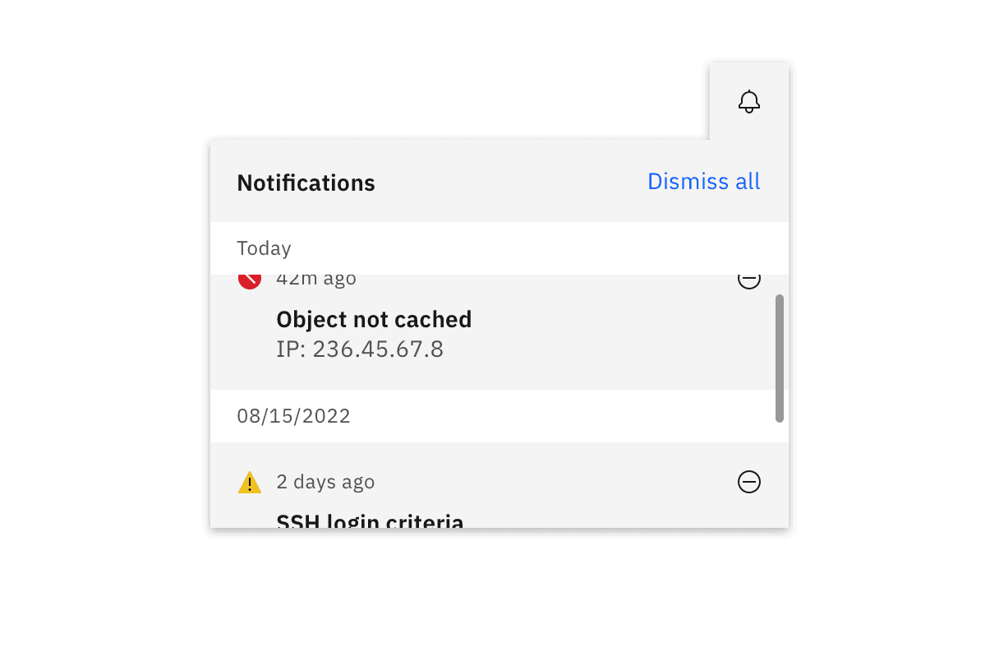

</Column>
</Row>

## Content

### Main elements

#### List title

- A list title is a descriptive name for the group of list items.
- List titles should be short and clear, ranging from one to three words to
  describe the list group.
- Use sentence case capitalization.

#### List item

- List item text can vary but the structure of the content should be similar per
  row in the same contained list.
- List item text can have multiple lines of concise content, but should not
  contain multiple paragraphs of lengthy information.
- Use sentence case capitalization.

## On-page list

Use the on-page list variant when placing the list on the general page of a user
interface. On-page lists typically appear in smaller spaces, like in a card or
sidebars. The on-page list styling has no visible background header with fixed
information. If there are scrolling capabilities, the header will remain sticky
and have a background layer to differentiate it from the list item rows
scrolling beneath it.

### Placement

On-page lists should span the entire width of the container they are placed
within to make the best use of space and to achieve vertical type alignment with
other text and components on the page.

<Row>
<Column colLg={8}>

</Column>
</Row>

### Sizing

The on-page list comes in four height sizes — extra large (64px), large (48px),
medium (40px), and small (32px). The large height size is the default size.

<Row>
<Column colLg={8}>

</Column>
</Row>

The list header height is always fixed, while list item row heights can vary
based on the amount of content in each row. The content in each row is flexible,
but by default each list item row height follows the extra large, large, or
small height size for one line of content.

<Row>
<Column colLg={8}>

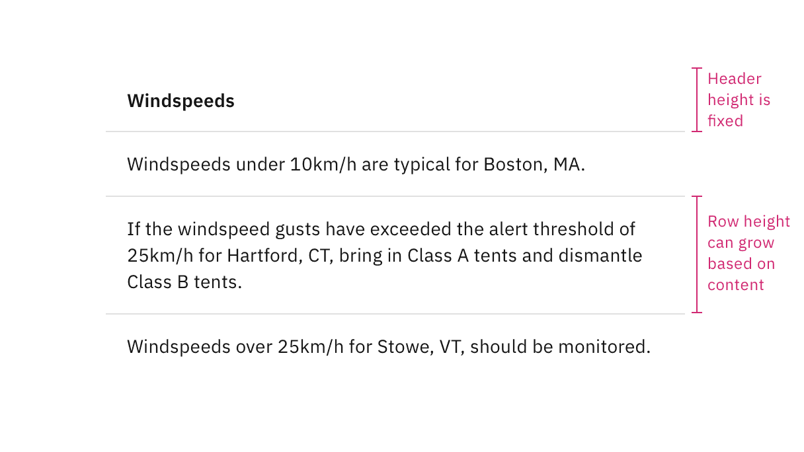

</Column>
</Row>

## Disclosed list

Use the disclosed list variant when placing the list within a temporary context,
like a popover or disclosure, which is typically accompanied by an enclosed
border or drop shadow. The disclosed list styling has a background layer
underneath the header. Each header has a smaller height than the on-page list
styling to take up less real estate in the smaller and scrollable spaces it
usually appears in.

### Placement

Disclosed lists should span the entire width of the container they are placed
within to make the best use of space.

<Row>
<Column colLg={8}>

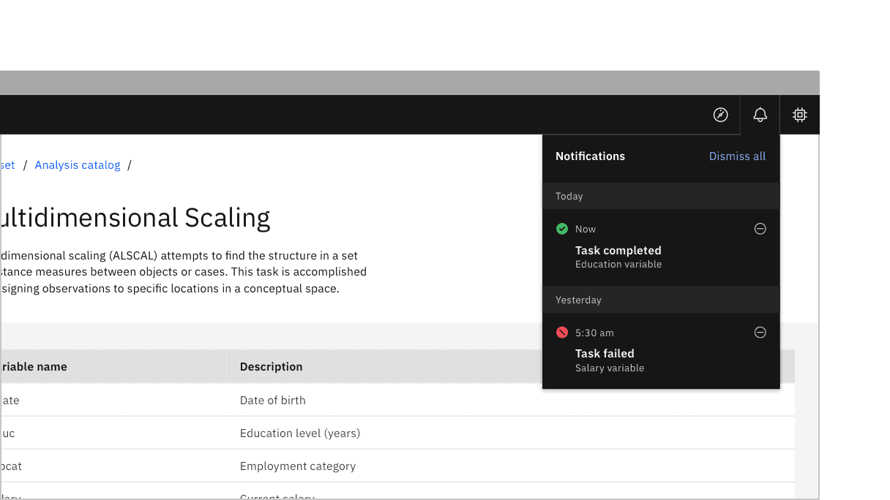

</Column>
</Row>

### Sizing

The disclosed list header has a 32px height and the list item rows by default
have a 48px height. The disclosed list often appears in small, restricted places
so keeping a shorter height can save valuable space and reduce the amount of
vertical scrolling.

<Row>
<Column colLg={8}>

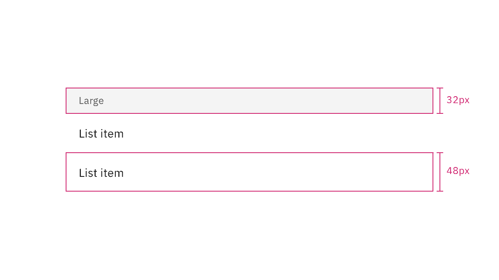

</Column>
</Row>

Similarly to the on-page list variant, the list header height is always fixed,
while list item row heights can vary based on the amount of content in each row.
The content in each row is flexible, but by default each list item row height
follows a 48px height for one line of content.

<Row>
<Column colLg={8}>

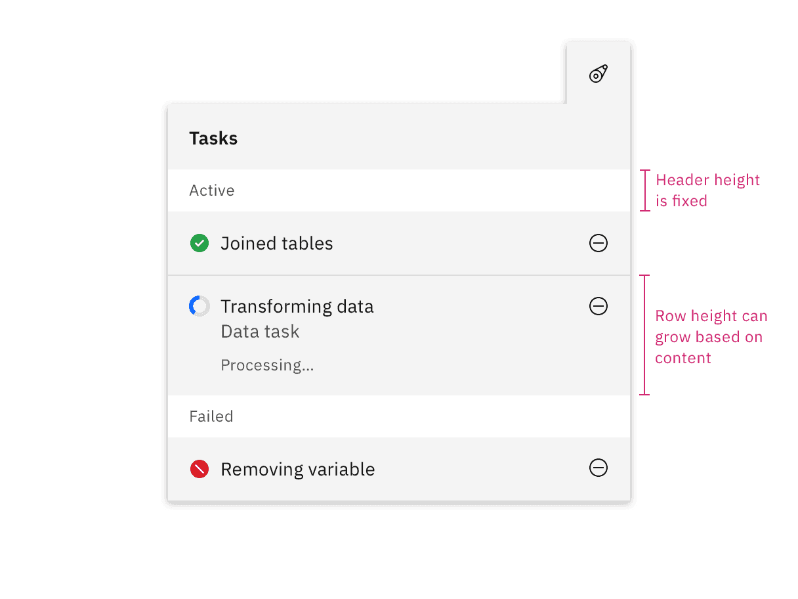

</Column>
</Row>

## Modifiers

### Inset row dividers

Depending on the use case you can inset contained list row dividers. By default,
use extended row dividers for row items. Typically indented row dividers are
used when placed close to other components that also contain row dividers so
they do not collide with each other and create visual tension.

<Row>
<Column colLg={8}>

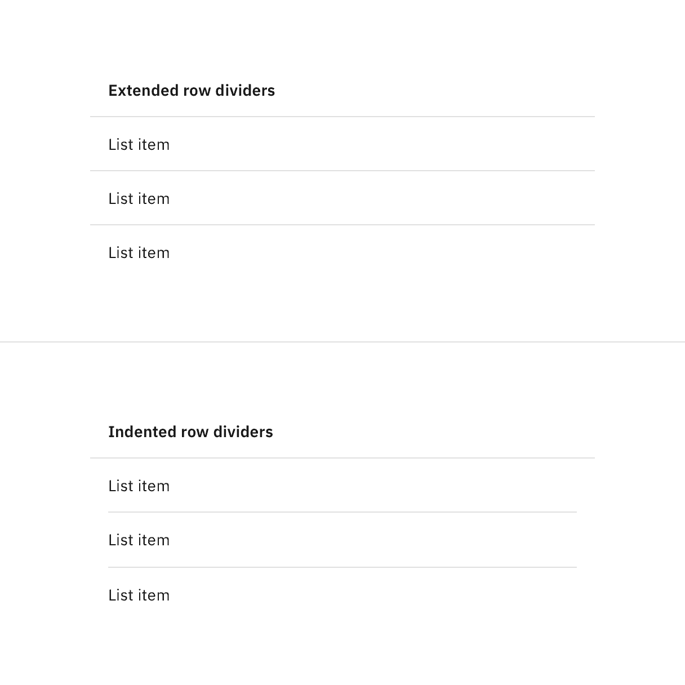

</Column>
</Row>

### Clickable rows

Contained lists support clickable rows as an optional feature.

<Row>
<Column colLg={8}>

</Column>
</Row>

### Inline actions

Contained lists can include inline actions, such as closing or dismissing row
items in the list.

<Row>
<Column colLg={8}>

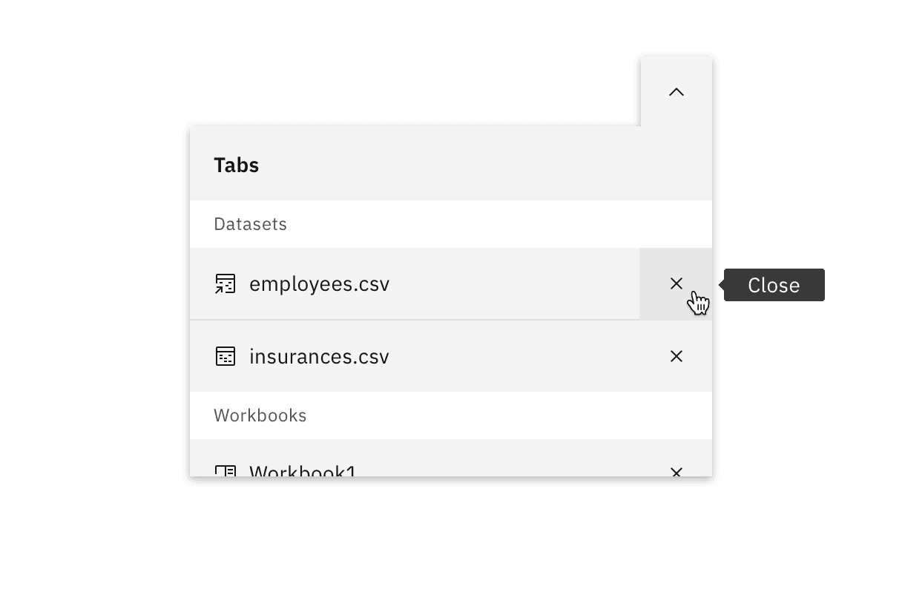

</Column>
</Row>

### Interactive elements

Contained lists can have interactive elements in headers and rows, such as
links, icon buttons, and toggles. Contained lists can also have multiple row
columns. Additional row columns act as list item details pertaining to the first
list item in the row. If your list has an excess of row columns and needs
multiple column headers, we recommend using a data table instead.

<Row>
<Column colLg={8}>

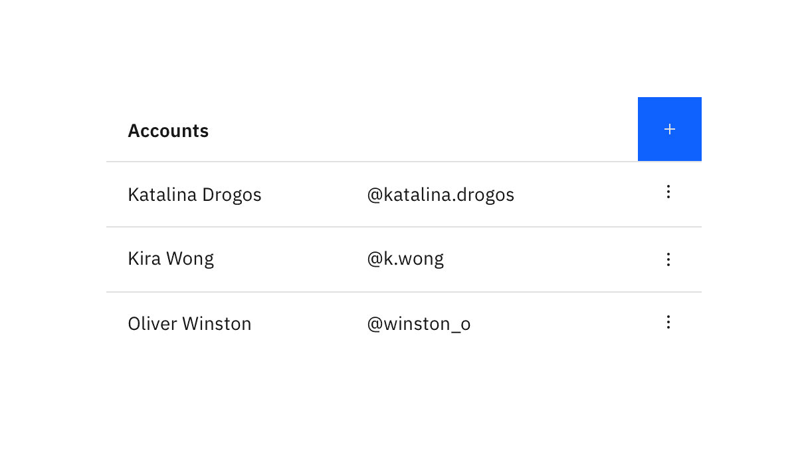

</Column>
</Row>

### Non-interactive icons

Contained lists can have non-interactive icons positioned before the text in
each row to help visually describe the list item, category, or status. These
icons are decorative elements and are used for visual purposes only. Icons
should typically be the same color as the text in the row unless they are status
indicators.

<Row>
<Column colLg={8}>

</Column>
</Row>

### Search and filtering

Contained lists can include a search or filter functionality. The search or
filter can collapse and expand in the list header area or stay persistent on the
page below the list header area, depending on the use case.

<Row>
<Column colLg={8}>

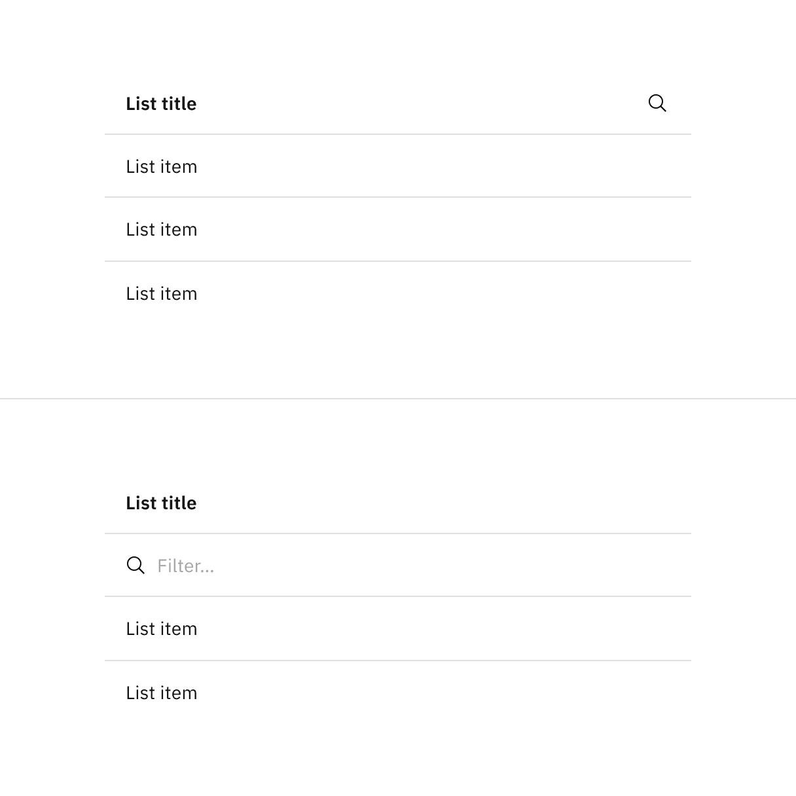

</Column>
</Row>

## Related

- [Accordion](https://carbondesignsystem.com/components/accordion/usage/)
- [Data table](https://carbondesignsystem.com/components/data-table/usage/)
- [List](https://carbondesignsystem.com/components/list/usage/)
- [Structured list](https://carbondesignsystem.com/components/structured-list/usage/)

## Feedback

Help us improve this component by providing feedback, asking questions, and
leaving any other comments on
[GitHub](https://github.com/carbon-design-system/carbon-website/issues/new?assignees=&labels=feedback&template=feedback.md).
