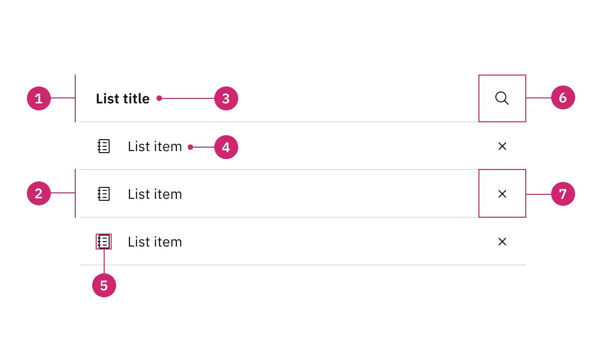
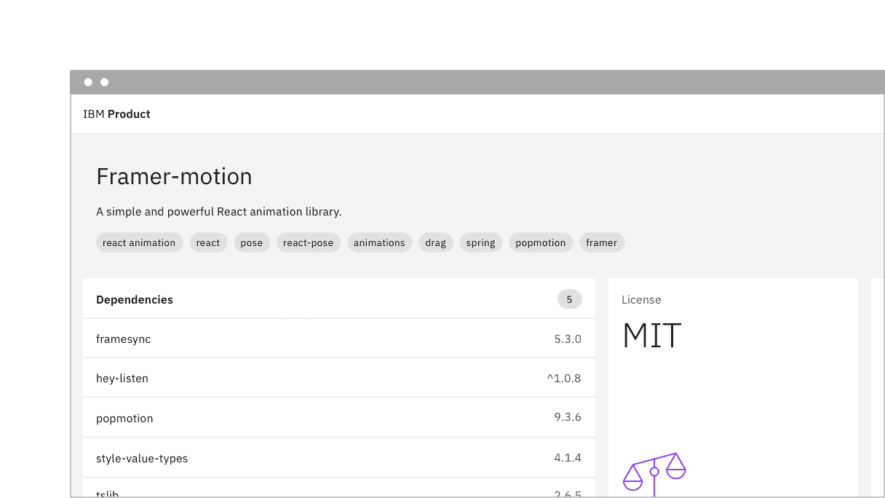
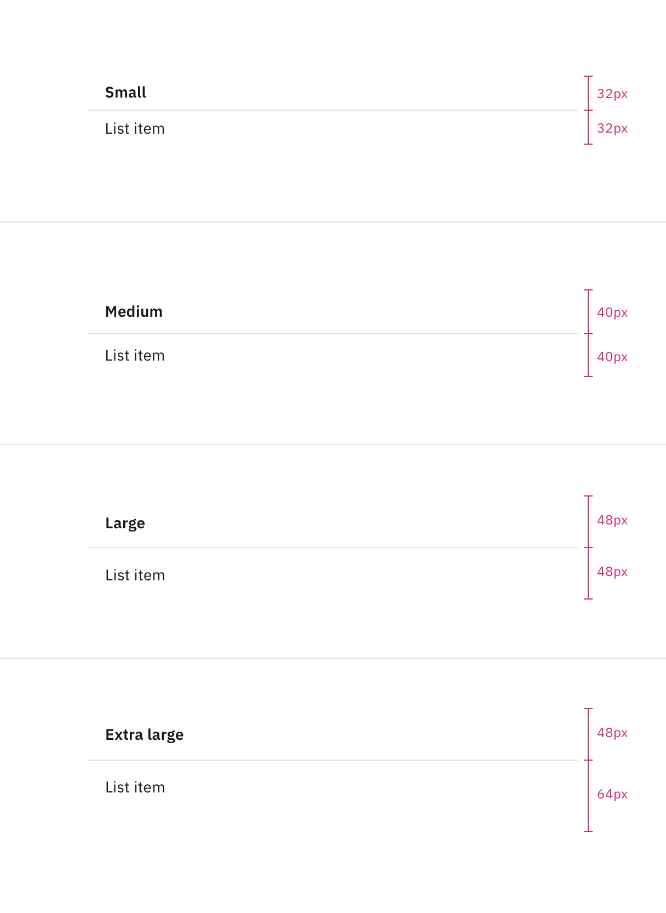

<PageDescription>

Contained lists group content that is similar or related and can contain
read-only or interactive information.

</PageDescription>

<AnchorLinks>

<AnchorLink>Overview</AnchorLink>
<AnchorLink>Live demo</AnchorLink>
<AnchorLink>Formatting</AnchorLink>
<AnchorLink>Content</AnchorLink>
<AnchorLink>On page list</AnchorLink>
<AnchorLink>Disclosed list</AnchorLink>
<AnchorLink>Modifiers</AnchorLink>
<AnchorLink>Related</AnchorLink>
<AnchorLink>Feedback</AnchorLink>

</AnchorLinks>

## Overview

Contained lists are typically used in smaller spaces inside of containers like
cards, sidebars, and disclosure situations. These lists have one column of
information with multiple list item rows. The list header area and individual
list items have the option to include inline actions and interactive elements.

### When to use

- Use on a page inside of small spaces or in disclosure situations.
- Use when including interactive elements or inline actions in a list.
- To logically group items that follow the same content structure.

### When not to use

- Do not use if the list content needs to be nested more than one level deep and
  becomes overly complex and lengthy. For these situations, use the
  [data table](https://carbondesignsystem.com/components/data-table/usage/)
  component instead.
- Do not use if the list needs to contain multiple column headers, instead use
  the
  [structured list](https://carbondesignsystem.com/components/structured-list/usage/)
  component.

### Variants

| Variant                           | Purpose                                                                                                                                                |
| --------------------------------- | ------------------------------------------------------------------------------------------------------------------------------------------------------ |
| [On page list](#on-page-list)     | Use this variant when placing the list in a persistent context like the main area in the user interface, such as on a card or in a sidebar.            |
| [Disclosed list](#disclosed-list) | Use this variant when the list is shown within a temporary context, for example within a popover or layer that is elevated by a drop shadow or border. |

<Row>
<Column colLg={8}>

</Column>
</Row>

## Live demo

<InlineNotification>

**Coming soon:** The live demo for contained list is underdevelopment and will
be available soon.

</InlineNotification>

## Formatting

### Anatomy

Contained lists are made up of a list header, list title, list item rows, and
optional interactive elements.

<Row>
<Column colLg={8}>

</Column>
</Row>

1. **List header:** Area to group the succeeding list items.
2. **List title:** Descriptive name for the group of list items.
3. **List item:** The content with in a list item row.
4. **Interactive element** (optional): An element that you can interact with or
   treat as an inline action, such as links, icons, and toggles.

### Sizing

#### List header area

The list header height is always fixed. The on page variant style list header
has a height of 48px. The disclosed variant style list header has a height of
32px.

<Row>
<Column colLg={8}>

</Column>
</Row>

#### List item row

List item row heights can vary based on the amount of content in each row. The
content in each row is flexible. By default, each list item row height is 48px
for one line of content.

<Row>
<Column colLg={8}>

</Column>
</Row>

### Alignment

Contained lists can have multiple sections. When multiple list sections are
present, they should stack and have 0px padding between each other.

<Row>
<Column colLg={8}>

</Column>
</Row>

### Scrolling

Contained list header areas can be sticky and fixed in place while the list item
rows scroll underneath. This functionality is optional depending on the use
case.

<Row>
<Column colLg={8}>

</Column>
</Row>

## Content

### Main elements

#### List title

- A list title is a descriptive name for the group of list items.
- List titles should be short and clear, ranging from one to three words to
  describe the list item group.
- Use sentence-case capitalization.

#### List item

- List item text can vary but the structure of the content should be similar per
  row in the same contained list.
- List item text can have multiple lines of concise content, but should not
  contain multiple paragraphs of lengthy information.
- Use sentence-case capitalization.

## On page list

Use the on page list variant when placing the list on the general page of a user
interface. On page lists typically appear in smaller spaces, like in a card or
sidebars. The on page list styling has no visible background header with fixed
information. If there are scrolling capabitlies, the header will remain sticky
and have a background layer to differentiate it from the list item rows
scrolling beneath it.

### Placement

On page lists should span the entire width of the container they are placed
within to make the best use of space and to achieve vertical type alignment with
other text and components on the page.

<Row>
<Column colLg={8}>

</Column>
</Row>

## Disclosed list

Use the disclosed list variant when placing the list within a temporary context,
like a popover or disclosure, which is typically accompanied by an enclosed
border or drop shadow. The disclosed list styling has a background layer
underneath the header. Each header has a smaller height than the on page list
styling to take up less real estate in the smaller and scrollable spaces it
usually appears in.

### Placement

Disclosed lists should span the entire width of the container they are placed
within to make the best use of space.

<Row>
<Column colLg={8}>

</Column>
</Row>

## Modifiers

### Inline actions

Contained lists can include inline actions, such as closing or dismissing row
items in the list.

<Row>
<Column colLg={8}>

</Column>
</Row>

### Interactive elements

Contained lists can have interactive elements in headers and rows, such as
links, icon buttons, and toggles.

<Row>
<Column colLg={8}>

</Column>
</Row>

### Clickable rows

Contained lists support clickable rows as an optional feature.

<Row>
<Column colLg={8}>

</Column>
</Row>

## Related

- [Accordion](https://carbondesignsystem.com/components/accordion/usage/)
- [Data table](https://carbondesignsystem.com/components/data-table/usage/)
- [List](https://carbondesignsystem.com/components/list/usage/)
- [Structured list](https://carbondesignsystem.com/components/structured-list/usage/)

## Feedback

Help us improve this component by providing feedback, asking questions, and
leaving any other comments on
[GitHub](https://github.com/carbon-design-system/carbon-website/issues/new?assignees=&labels=feedback&template=feedback.md).
