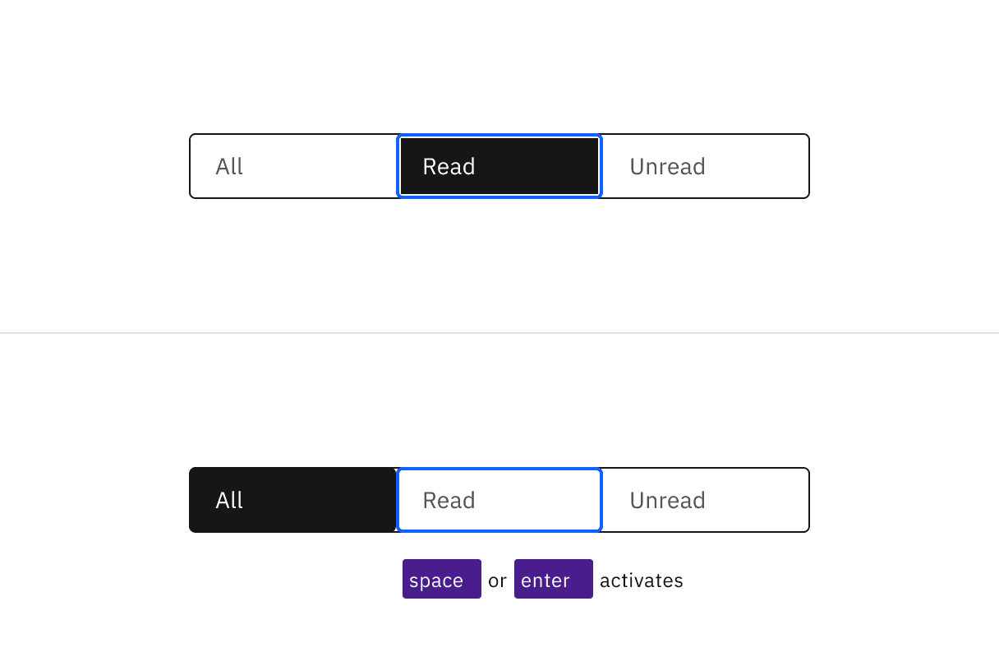
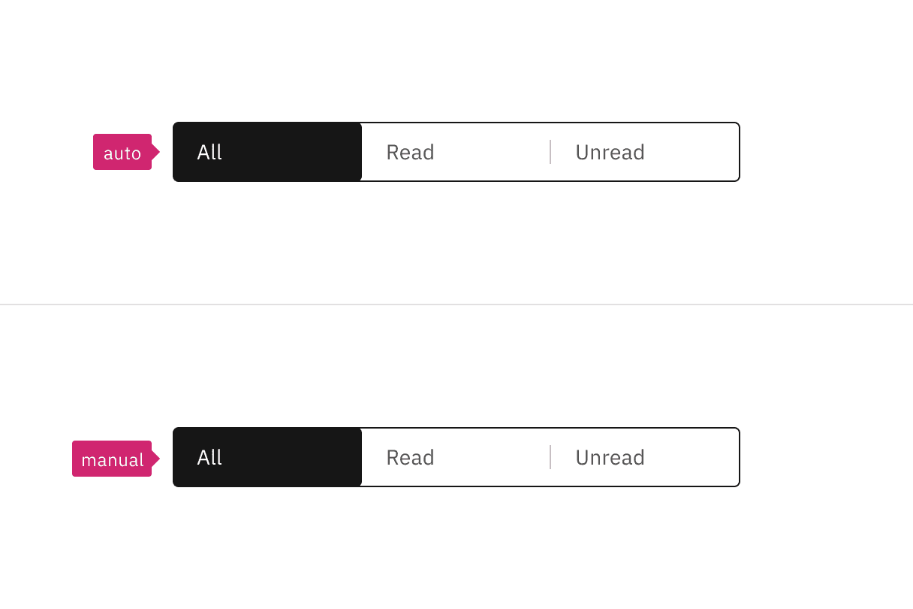

import {
  StructuredListWrapper,
  StructuredListHead,
  StructuredListBody,
  StructuredListRow,
  StructuredListInput,
  StructuredListCell,
  OrderedList,
  ListItem,
} from '@carbon/react';

<PageDescription>

Design annotations are needed for specific instances shown below, but for the
standard content switcher component, Carbon already incorporates accessibility.

</PageDescription>

<AnchorLinks>
  <AnchorLink>What Carbon provides</AnchorLink>
  <AnchorLink>Design recommendations</AnchorLink>
  <AnchorLink>Development considerations</AnchorLink>
</AnchorLinks>

## What Carbon provides

Carbon bakes keyboard operation into its components, improving the experience of
blind users and others who operate via the keyboard. Carbon incorporates many
other accessibility considerations, some of which are described below.

### Keyboard interactions

Like tabs, content switchers can be automatic or manual. In both instances, the
content switcher takes one tab stop, and arrow keys are used to navigate between
content tabs.

<Row>
<Column colLg={8}>

<Caption>
  Manual and automatic content switchers have the same basic keyboard
  interaction.
</Caption>

</Column>
</Row>

Automatic and manual switchers differ in how they are activated. For automatic
switchers, focus and selection are synchronized. The tabs are selected as the
user arrows between them, and the content section under the switcher is updated
in real time.

Manual switchers allow the user to arrow between the content tabs without
updating the content section underneath. In the following illustration, the All
content tab can remain selected while focus moves to the Read tab. A content tab
is selected (and its content section updated) by the user pressing `Enter` or
`Space`.

<Row>
<Column colLg={8}>

<Caption>
  Arrows keys alone update the selected tab in an automatic content switcher.
  The Space and Enter keys are used to select a content tab in a manual variant.
</Caption>

</Column>
</Row>

## Design recommendations

### Indicate which variant to implement

The automatic and manual switchers are visually indistinguishable in a
wireframe, so designers should annotate which variant the team has decided to
implement. Since the choice largely concerns technical considerations about
potential latency when updating the content section’s information, architects or
developers should be involved in the discussion.

<Row>
<Column colLg={8}>

<Caption>
  Annotate whether the switcher should be implemented as automatic or manual.
</Caption>

</Column>
</Row>

## Development considerations

Keep these considerations in mind if you are modifying Carbon or creating a
custom component.

- The Content switcher is implemented as a `tablist`, with each content tab
  implemented as a button with a role of `tab`.
- The selected content tab has attributes `aria-selected="true"` and
  `tabindex="0"`. All other tabs have these attribute values set to `"false"`
  and `"-1"`.
- See the
  [ARIA authoring practices guidance for tabs](https://w3c.github.io/aria-practices/#tabpanel)
  for more considerations.
- See
  [Deciding when to make selection automatically follow focus](https://w3c.github.io/aria-practices/#kbd_selection_follows_focus).
