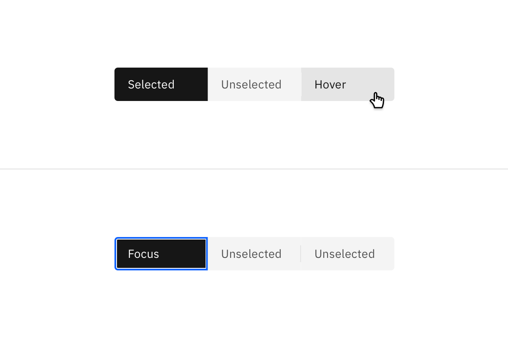
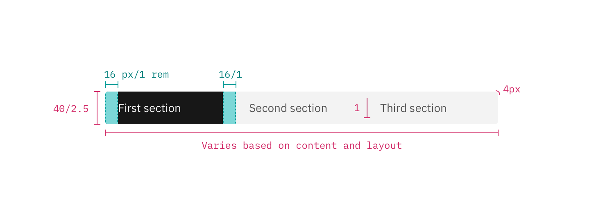
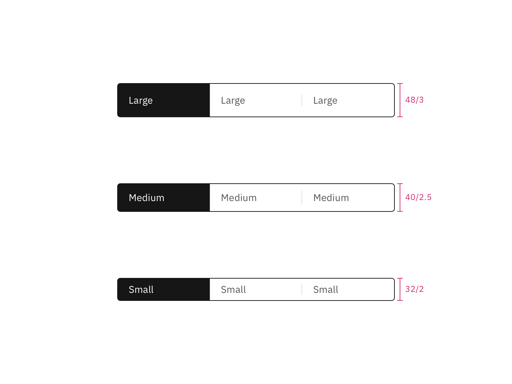

## Color

Content switchers have two main states: `selected` and `unselected`. By default,
content switcher buttons are unselected with the selected state using a high
contrast color.

| Element           | Property         | Color token               |
| ----------------- | ---------------- | ------------------------- |
| Unselected button | background-color | Transparent               |
|                   | text color       | `$text-secondary`         |
|                   | border           | `$border-inverse`         |
| Selected button   | background-color | `$layer-selected-inverse` |
|                   | text color       | `$text-inverse`           |
| Divider           | border           | `$border-subtle`          |

### Interactive states

Hover states only apply to `unselected` buttons.

| State    | Property         | Color token         |
| -------- | ---------------- | ------------------- |
| Hover    | background-color | `$background-hover` |
|          | text color       | `$text-primary`     |
| Focus    | border           | `$focus`            |
| Disabled | background-color | `transparent`       |
|          | text color       | `$text-disabled`    |
|          | border           | `$border-disabled`  |

<Row>
<Column colLg={8}>

</Column>
</Row>

## Typography

Content switcher label text should be set in sentence case, with only the first
word in a phrase and any proper nouns capitalized. The label text should not
exceed three words.

| Element | Font-size (px/rem) | Font-weight   | Type token         |
| ------- | ------------------ | ------------- | ------------------ |
| Label   | 14 / 0.875         | Regular / 400 | `$body-compact-01` |

## Structure

Content switchers must have at least two options for the user to choose from.
Each container that makes up the content switcher is equal in size. The width of
a container is determined by the length of the longest container option text
plus the 16 px / 1rem on both sides of the text.

| Element      | Property                    | px / rem | Spacing token |
| ------------ | --------------------------- | -------- | ------------- |
| Container    | corner radius               | 4px      | –             |
| Divider      | border                      | 1px      | –             |
| Button label | padding-left, padding-right | 16 / 1   | `$spacing-05` |

<Caption>
  Structure and spacing measurements for the default size content switcher | px
  / rem
</Caption>

## Sizes

| Size        | Height px / rem |
| ----------- | --------------- |
| Small (sm)  | 32 / 2          |
| Medium (md) | 40 / 2.5        |
| Large (lg)  | 48 / 3          |

<Caption>Content switcher sizes | px / rem</Caption>
