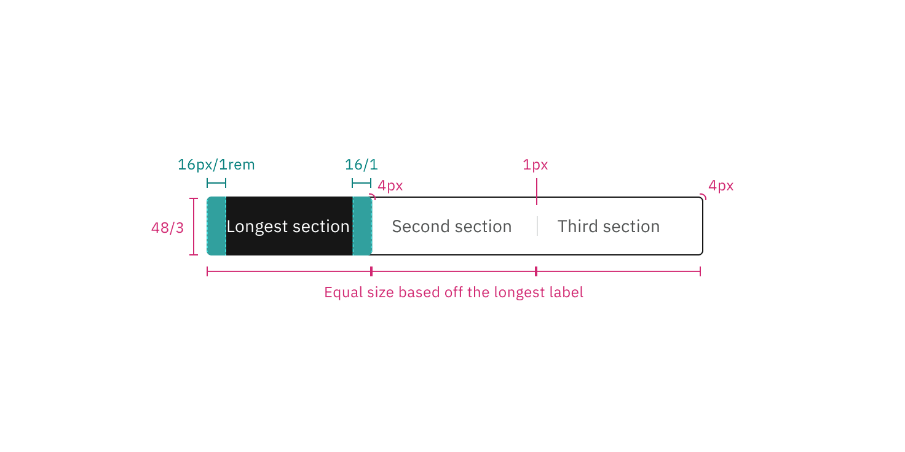
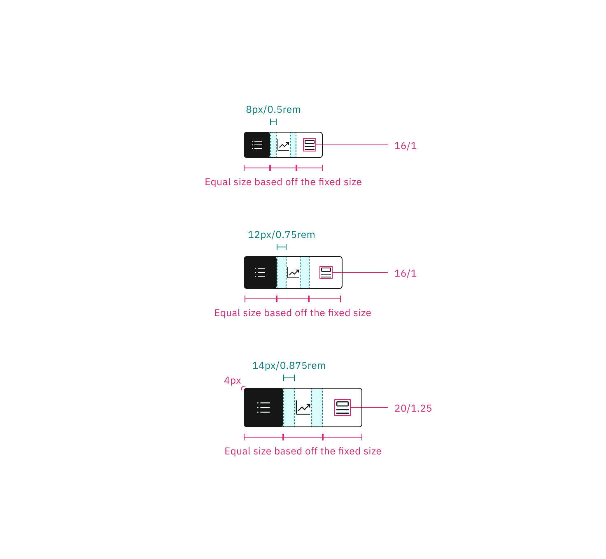
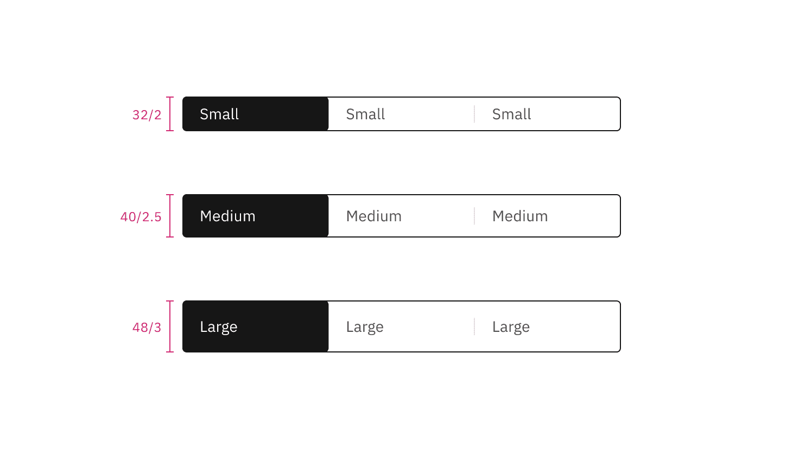
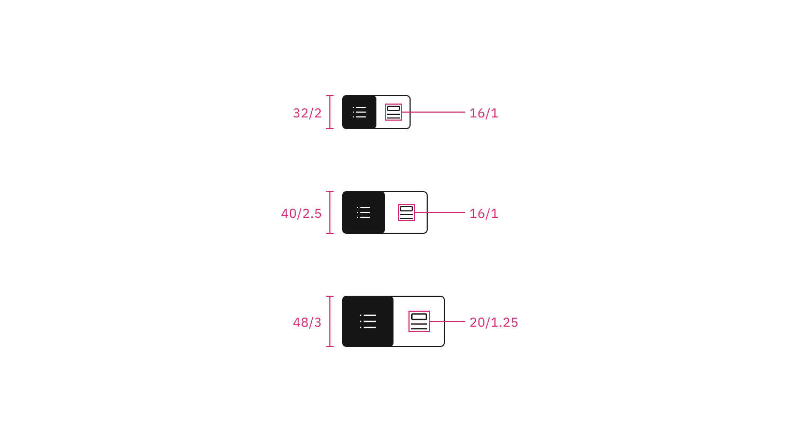

<PageDescription>

The following page documents visual specifications such as color, typography,
structure, and size.

</PageDescription>

<AnchorLinks>

<AnchorLink>Color</AnchorLink>
<AnchorLink>Typography</AnchorLink>
<AnchorLink>Structure</AnchorLink>
<AnchorLink>Size</AnchorLink>
<AnchorLink>Feedback</AnchorLink>

</AnchorLinks>

## Color

Content switcher includes two default-enabled content states: **selected** and
**unselected** with the selected state using a high contrast color.

| Type       | Element    | Property         | Color token               |
| ---------- | ---------- | ---------------- | ------------------------- |
| Selected   | Container  | background-color | `$layer-selected-inverse` |
|            | Label text | text-color       | `$text-inverse`           |
|            | Icon       | svg              | `$icon-inverse`           |
| Unselected | Container  | background-color | transparent               |
|            | Label text | text-color       | `$text-secondary`         |
|            | Icon       | svg              | `$icon-primary`           |
|            | Border     | border           | `$border-inverse`         |
|            | Divider    | border           | `$border-subtle` \*       |

<Caption fullWidth>
  \* Denotes a contextual color token that will change values based on the layer
  it is placed on.
</Caption>

<Row>
<Column colLg={8}>

<Tabs>

<Tab label="Default">

</Tab>

<Tab label="Icon">

</Tab>

</Tabs>

</Column>
</Row>

### Interactive states

Content switcher has three interactive states—**hover**, **focus**, and
**disabled**. Hover states only apply to the unselected state.

| Type       | State    | Element    | Property         | Color token                |
| ---------- | -------- | ---------- | ---------------- | -------------------------- |
| Selected   | Focus    | Container  | background-color | `$layer-selected-inverse`  |
|            |          | Label text | text-color       | `$text-inverse`            |
|            |          | Icon       | svg              | `$text-inverse`            |
|            |          | Border     | inner-border     | `$focus-inset`             |
|            | Disabled | Container  | background-color | `$layer-selected-disabled` |
|            |          | Label text | text-color       | `$text-disabled`           |
|            |          | Icon       | text-color       | `$text-disabled`           |
| Unselected | Hover    | Container  | background-color | `$background-hover`        |
|            |          | Label text | text-color       | `$text-primary`            |
|            |          | Icon       | svg              | `$icon-primary`            |
|            |          | Border     | border           | `$border-inverse`          |
|            | Focus    | Container  | background-color | transparent                |
|            |          | Label text | text-color       | `$text-secondary`          |
|            |          | Icon       | svg              | `$icon-primary`            |
|            |          | Border     | border           | `$focus`                   |
|            | Disabled | Container  | background-color | transparent                |
|            |          | Label text | text-color       | `$text-disabled`           |
|            |          | Icon       | text-color       | `$icon-disabled`           |
|            |          | Border     | border           | `$border-disabled`         |
|            |          | Divider    | border           | `$border-subtle` \*        |

<Caption fullWidth>
  \* Denotes a contextual color token that will change values based on the layer
  it is placed on.
</Caption>

<Row>
<Column colLg={8}>

<Tabs>

<Tab label="Default">

</Tab>

<Tab label="Icon">

</Tab>

</Tabs>

</Column>
</Row>

## Typography

Content switcher label text should be set in sentence case, with only the first
word in a phrase and any proper nouns capitalized. The label text should not
exceed three words.

| Element    | Font size (px/rem) | Font weight   | Type token         |
| ---------- | ------------------ | ------------- | ------------------ |
| Label text | 14 / 0.875         | Regular / 400 | `$body-compact-01` |

## Structure

Content switchers must have at least two options for the user to choose from.
Each container that makes up the content switcher is equal in size.

| Element    | Property                    | px / rem   | Spacing token |
| ---------- | --------------------------- | ---------- | ------------- |
| Container  | corner radius               | 4px        | –             |
| Label text | padding-left, padding-right | 16 / 1     | `$spacing-05` |
| Icon (sm)  | padding-left, padding-right | 8 / 0.5    | `$spacing-03` |
| Icon (md)  | padding-left, padding-right | 12 / 0.75  | `$spacing-04` |
| Icon (lg)  | padding-left, padding-right | 14 / 0.875 | –             |
| Divider    | border                      | 1px        | –             |

### Default structure

The width of a text container is determined by the length of the longest label
text within its content switcher.

<Caption>
  Structure and spacing measurements for the text content switcher | px / rem
</Caption>

### Icon-only structure

The width of an icon container is determined by the fixed size within its
content switcher.

<Caption>
  Structure and spacing measurements for the icon content switcher | px / rem
</Caption>

## Size

There are three content switcher sizes—small (32px), medium (40px), and large
(48px).

| Element   | Size        | Height (px / rem) |
| --------- | ----------- | ----------------- |
| Container | Small (sm)  | 32 / 2            |
|           | Medium (md) | 40 / 2.5          |
|           | Large (lg)  | 48 / 3            |
| Icon      | Small (sm)  | 16 / 1            |
|           | Medium (md) | 16 / 1            |
|           | Large (lg)  | 20 / 1.25         |

<Caption>Text only content switcher sizes | px / rem</Caption>

<Caption>Icon only content switcher sizes | px / rem</Caption>

## Feedback

Help us improve this component by providing feedback, asking questions, and
leaving any other comments on
[GitHub](https://github.com/carbon-design-system/carbon-website/issues/new?assignees=&labels=feedback&template=feedback.md).
