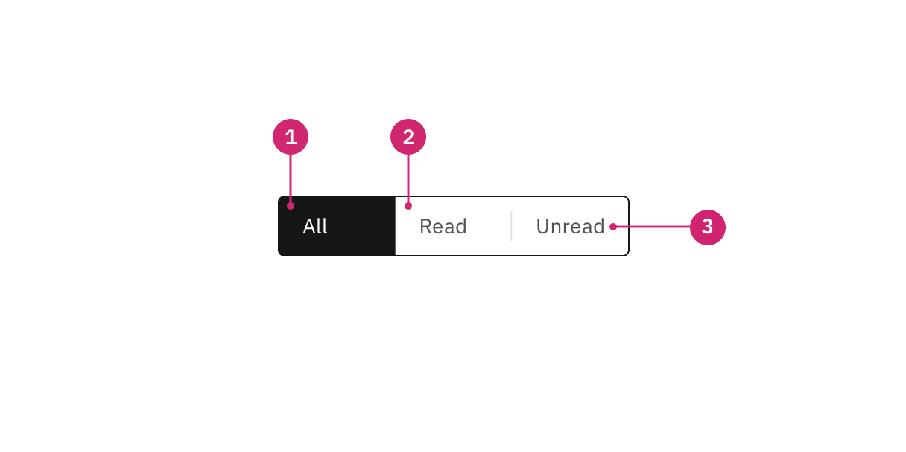
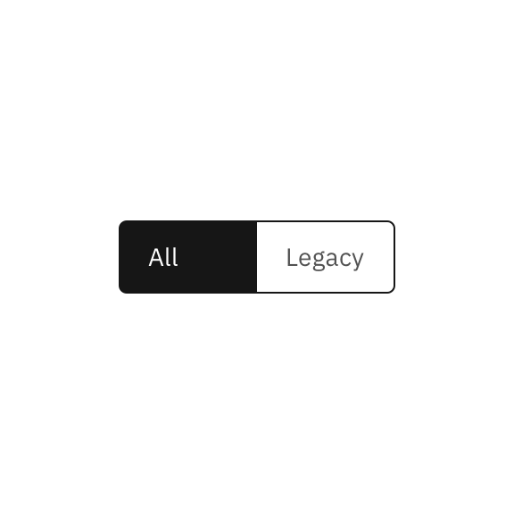
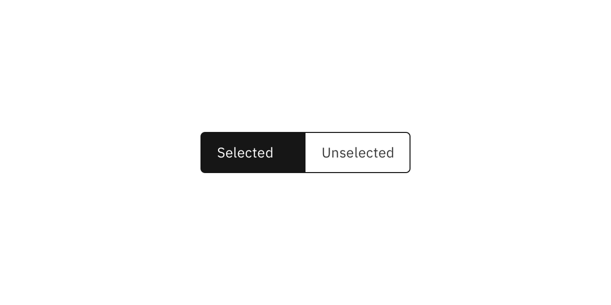
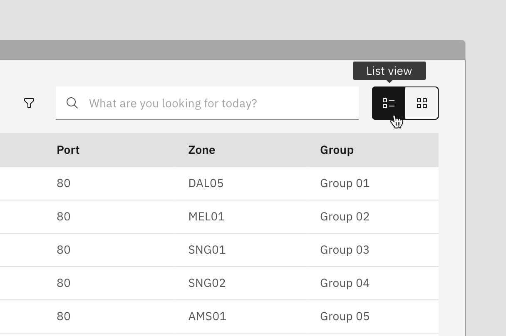

<PageDescription>

Content switchers allow users to toggle between two or more content sections
within the same space on the screen.

</PageDescription>

<AnchorLinks>

<AnchorLink>Overview</AnchorLink>
<AnchorLink>Live demo</AnchorLink>
<AnchorLink>Formatting</AnchorLink>
<AnchorLink>Content</AnchorLink>
<AnchorLink>Behaviors</AnchorLink>
<AnchorLink>Icon content switcher</AnchorLink>
<AnchorLink>Related</AnchorLink>
<AnchorLink>References</AnchorLink>
<AnchorLink>Feedback</AnchorLink>

</AnchorLinks>

## Overview

Content switchers allow users to toggle between alternate views of similar or
related content, showing only one content section at a time.

### variants

| Variant                 | Purpose                                                                                                                                            |
| ----------------------- | -------------------------------------------------------------------------------------------------------------------------------------------------- |
| _Content switcher_      | Uses a text label to represent the content inside each tab.                                                                                        |
| _Icon content switcher_ | Uses an icon to represent the content inside each tab. They are often used when space is limited or if icons can adequately describe the sections. |

<Row>
<Column colLg={12}>

</Column>
</Row>

### When to use

Content switchers are frequently used to let users toggle between different
formattings, like a grid view and a table view. They are also often used to
narrow large content groups. For example, a messaging tool may use a content
switcher to divide messages into three views such as “All,” “Read,” and
“Unread.”

### When not to use

#### Tabs

When navigating between distinct content areas like subpages, use
[tabs](/components/tabs/usage) instead of a content switcher. Tabs follow the
metaphor for sections in a filing cabinet, and two tabs wouldn’t contain the
same sheet of paper, so the role of tabs in the information hierarchy is to
separate content.

#### Toggle

For binary actions or choices, such as “yes/no” or “on/off” use a
[toggle](/components/toggle/usage) instead of a content switcher. A content
switcher can be used for binary views, like switching between a grid and list
view but should not be used as a binary input control.

## Live demo

<ComponentDemo
  components={[
    {
      id: 'content-switcher',
      label: 'Content switcher',
    },
  ]}
>
  <ComponentVariant
    id="content-switcher"
    knobs={{
      Switch: ['disabled'],
      ContentSwitcher: ['size'],
    }}
    links={{
      React:
        'https://react.carbondesignsystem.com/?path=/story/components-contentswitcher--default',
      Angular:
        'https://angular.carbondesignsystem.com/?path=/story/components-content-switcher--basic',
      Vue: 'http://vue.carbondesignsystem.com/?path=/story/components-cvcontentswitcher--default',
      'Web Components':
        'https://web-components.carbondesignsystem.com/?path=/story/components-content-switcher--default',
    }}
  >
    {`
<ContentSwitcher onChange={console.log}>
  <Switch name={'first'} text='First section' />
  <Switch name={'second'} text='Second section' />
  <Switch name={'third'} text='Third section' />
</ContentSwitcher>
`}
  </ComponentVariant>
</ComponentDemo>

## Formatting

### Anatomy

<Row>
<Column colLg={8}>

</Column>
</Row>

1. **Selected content tab:** Only one content tab can be selected at a time and
   there should always be one selected.
2. **Content tab:** Selectable container for each content view.
3. **Label:** Text label or iccon that describes the content view.

### Sizing

#### Height

There are three height sizes for the content switcher: small (32px), medium
(40px), and large (48px). Choose a size that best fits your layout’s density or
the switcher’s prominence.

<Row>
<Column colLg={8}>

</Column>
</Row>

#### Width

Each content tab in the group should be the same width. The content tab with the
longest text label should have at minimum 16px spacing to the right of the
label.

<DoDontRow>
  <DoDont type="do" caption="Do base content tab width on the longest text label.">

  </DoDont>
  <DoDont type="dont" caption="Do not use a different width for each content tab.">

  </DoDont>
</DoDontRow>

### Alignment

A content switcher can align to a grid column or hang in the gutter to create
type alignment. Use layout and hierarchy cues to determine which alignment is
best. In contained space, the content switcher should never be flush to an edge
and instead left-align with other content in the container.

#### Aligning to the grid

For grid-aware width, the content swither spans a set of columns, with each tab
being equal in size. Depending on placement, the first tab or the tab’s label
should align to the first column you are using, with the last tab in the group
always ending at a column’s edge. The tabs in between will flow accordingly and
may or may not align with the grid, but they will always be the same width.

#### Aligning to the content

For content-driven widths, the content tab with the longest text label should
have 16px spacing to the right of the label, and then the widths of all other
tabs should match that widest tab.

### Placement

Place the content switcher above the content area to create a clear hierarchy
for the section that the switcher controls. It can be aligned to the left or
right side of the content area but should never be centered in the content
space.

## Content

### Main elements

#### Text label

- Be concise and specific and limit text labels to two to three words.
- Text labels should clearly communicate the view users will see and the content
  contained in the view.

### Further guidance

For further content guidance, see Carbon's
[content guidelines](/guidelines/content/overview/).

## Behaviors

### Default selection

Only one content section can be shown at a time. The first content tab in the
switcher should be determined based on usage and should always be the default
selection.

### States

The content switcher includes two content tab states: **selected** and
**unselected.** The selected state uses a high contrast color.

<Row>
<Column colLg={8}>

</Column>
</Row>

For detailed visual information about the various interactive states for this
component, see the [Style](/components/content-switcher/style) tab.

### Interactions

#### Mouse

Users can activate and navigate between content switcher tabs by clicking a
content tab.

#### Keyboard

Users can activate and navigate between content switcher tabs by pressing the
`left` or `right` arrow.

## Icon content switcher

Icon content switchers use an icon instead of to text label to indicate
alternative views of similar or related content. Icon content switchers are
often used when space is limited or when icons can adequately describe the
sections (for example, a list view versus a card view).

<Row>
<Column colLg={8}>

</Column>
</Row>

### Responsiveness

Icon content switchers are compact and do not take up much screen space, and
therefore they often work in different screen sizes. Where necessary, icon
content switchers can also be used as a responsive replacement for content
switchers.

## Related

- [Tabs](/components/tabs/usage)
- [Toggle](/components/toggle/usage)

## Feedback

Help us improve this component by providing feedback, asking questions, and
leaving any other comments on
[GitHub](https://github.com/carbon-design-system/carbon-website/issues/new?assignees=&labels=feedback&template=feedback.md).
