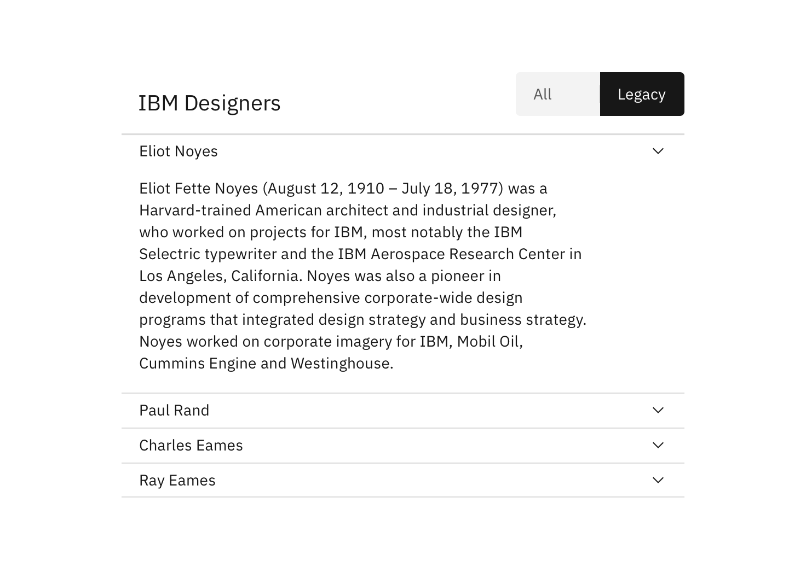
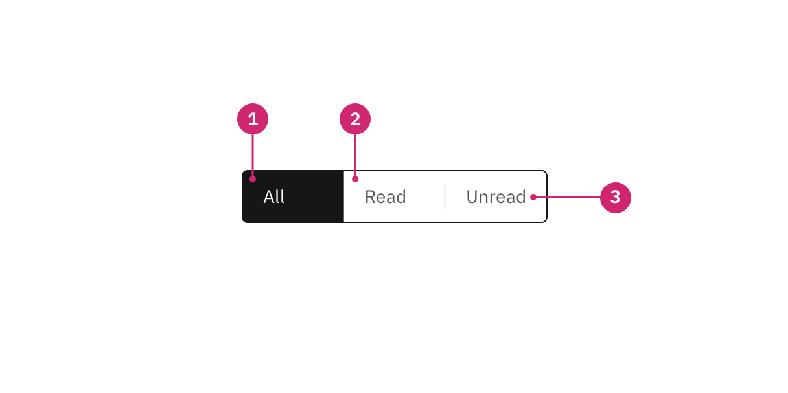
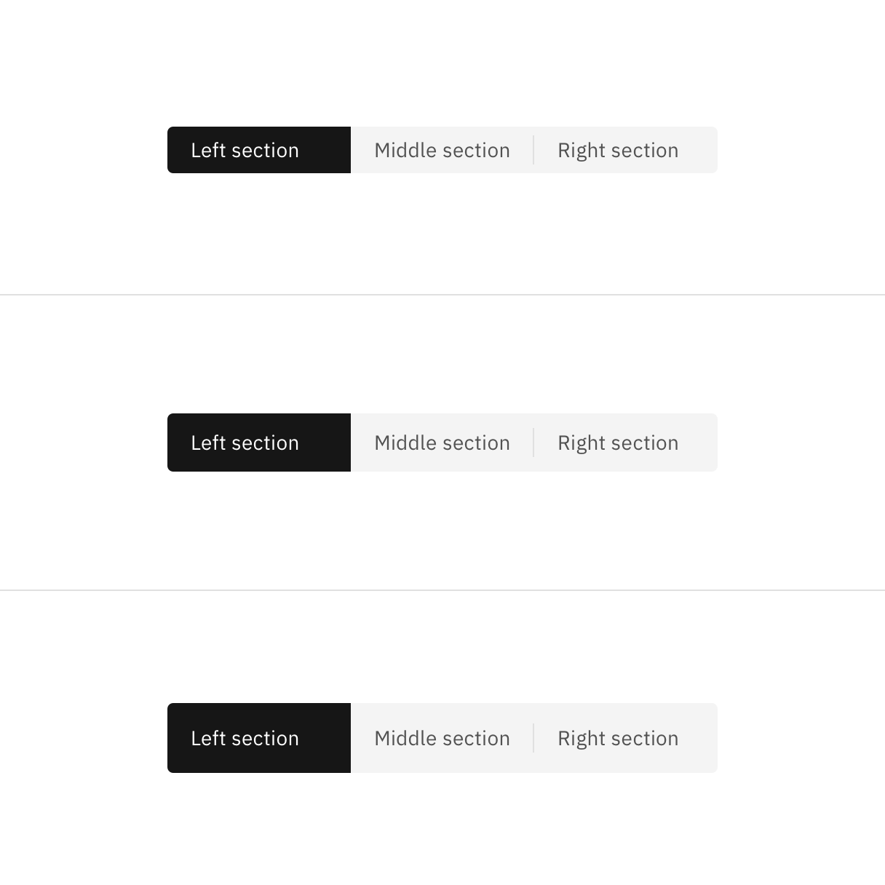
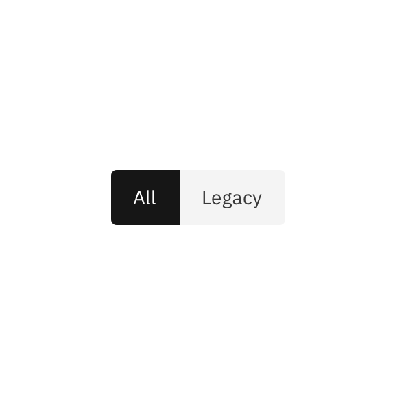
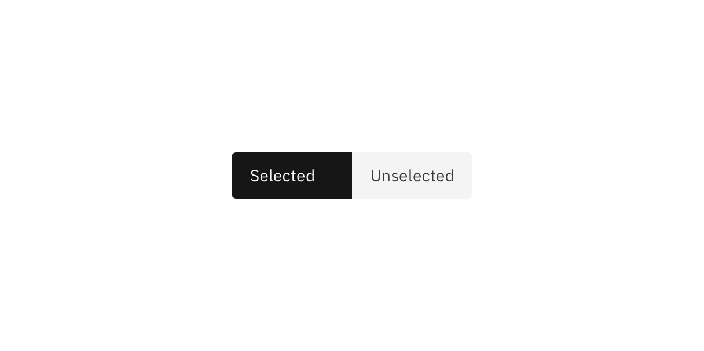

<PageDescription>

Content switchers allow users to toggle between two or more content sections
within the same space on screen.

</PageDescription>

<AnchorLinks>

<AnchorLink>Overview</AnchorLink>
<AnchorLink>Live demo</AnchorLink>
<AnchorLink>Formatting</AnchorLink>
<AnchorLink>Content</AnchorLink>
<AnchorLink>Behaviors</AnchorLink>
<AnchorLink>Related</AnchorLink>
<AnchorLink>References</AnchorLink>
<AnchorLink>Feedback</AnchorLink>

</AnchorLinks>

## Overview

Content switchers allow users to toggle between alternate views of similar or
related content. Only one content section is shown at a time.

### When to use

Content switchers are frequently used to let users toggle between different
formatting, like with a grid view and a table view. They are also often used to
narrow content groups. For example, use a content switcher if you have a single
category, such as “E-mail” and you want to divide it into views such as “All”,
“Read”, and “Unread”.

<Row>
<Column colLg={12}>

</Column>
</Row>

### When not to use

#### Tabs

Use [tabs](/components/tabs/usage) when the content on the page is divided into
related sections, but without any overlap. Tabs follow the metaphor for sections
in a filing cabinet and two tabs wouldn’t contain the same sheet of paper. So
the role of tabs in information hierarchy is to separate content.

#### Toggle

The content switcher is used for large groups of content, as opposed to the
[toggle](/components/toggle/usage) which is meant for a “yes/no” or “on/off”
binary decision.

## Live demo

<ComponentDemo
  components={[
    {
      id: 'content-switcher',
      label: 'Content switcher',
    },
  ]}>
  <ComponentVariant
    id="content-switcher"
    knobs={{
      Switch: ['disabled'],
    }}
    links={{
      React:
        'http://react.carbondesignsystem.com/?path=/story/contentswitcher--default',
      Angular:
        'https://angular.carbondesignsystem.com/?path=/story/components-content-switcher--basic',
      Vue:
        'http://vue.carbondesignsystem.com/?path=/story/components-cvcontentswitcher--default',
      Vanilla:
        'https://the-carbon-components.netlify.com/?nav=content-switcher',
    }}>{`
<ContentSwitcher onChange={console.log}>
  <Switch name={'first'} text='First section' />
  <Switch name={'second'} text='Second section' />
  <Switch name={'third'} text='Third section' />
</ContentSwitcher>
`}</ComponentVariant>
</ComponentDemo>

## Formatting

### Anatomy

<Row>
<Column colLg={8}>

</Column>
</Row>

1. **Selected content tab:** Only one content tab can be selected at a time and
   there should always be one selected.
2. **Content tab:** Selectable container for each content view.
3. **Text label:** Describes the content view.

### Sizing

#### Height

There are three height sizes for the content swithcer: small (32px), default
(40px), and large (48px). Choose a size that best fits the density of your
layout or the prominence of the switcher.

<Row>
<Column colLg={8}>

</Column>
</Row>

#### Width

The overall content switcher width varies based on the content and layout. Each
individual content tab should be the same width. The content tab with the
longest text label should have 16px spacing to the right of the label. The width
of all other tabs should match the widest tab.

<DoDontRow>
  <DoDont caption="Do base content tab width on the longest text label.">

  </DoDont>
  <DoDont type="dont" caption="Do not use a different width for each content tab.">

  </DoDont>
</DoDontRow>

## Content

### Main elements

#### Text label

- Be concise and specific and limit text labels to two to three words.
- Text labels should clearly communicate the view users will see and the content
  contained in the view.

### Further guidance

For further content guidance, see Carbon's
[content guidelines](/guidelines/content/overview/).

## Behaviors

### Default selection

Only one content section can be shown at a time. The first content tab in the
switcher should be determined based on usage and should always be the default
selection.

### States

The content switcher includes two content tab states: **selected** and
**unselected.** The selected state uses a high contrast color.

<Row>
<Column colLg={8}>

</Column>
</Row>

For detailed visual information about the various states for this component, see
the [Style](/components/content-switcher/style) tab.

### Interactions

#### Mouse

Users can activate and navigate between content switcher tabs by clicking a
content tab.

#### Keyboard

Users can activate and navigate between content switcher tabs by pressing the
`left` or `right` arrow.

#### Screen readers

VoiceOver: Users can activate and navigate between content switcher tabs by
pressing the `left` or `right` arrow.

Jaws: Users can activate and navigate between content switcher tabs by pressing
the `left` or `right` arrow.

NVDA: Users can activate and navigate between content switcher tabs by pressing
the `left` or `right` arrow.

## Related

- [Tabs](/components/tabs/usage)
- [Toggle](/components/toggle/usage)

## Feedback

Help us improve this component by providing feedback, asking questions, and
leaving any other comments on
[GitHub](https://github.com/carbon-design-system/carbon-website/issues/new?assignees=&labels=feedback&template=feedback.md).
