import A11yStatus from 'components/A11yStatus';

<PageDescription>

Content switchers allow users to toggle between two or more content sections
within the same space on the screen.

</PageDescription>

<AnchorLinks>

<AnchorLink>Live demo</AnchorLink>
<AnchorLink>Overview</AnchorLink>
<AnchorLink>Formatting</AnchorLink>
<AnchorLink>Content</AnchorLink>
<AnchorLink>Behaviors</AnchorLink>
<AnchorLink>Modifiers</AnchorLink>
<AnchorLink>Related</AnchorLink>
<AnchorLink>Feedback</AnchorLink>

</AnchorLinks>

## Live demo

<StorybookDemo
  themeSelector
  url="https://react.carbondesignsystem.com"
  variants={[
    {
      label: 'Default',
      variant: 'components-contentswitcher--default',
    },
    {
      label: 'Icon only',
      variant: 'components-contentswitcher--icon-only',
    },
  ]}
/>

<A11yStatus layout="cards" components="Content switcher" />

## Overview

Content switchers allow users to toggle between alternate views of similar or
related content, showing only one content section at a time.

<Row>
<Column colLg={12}>

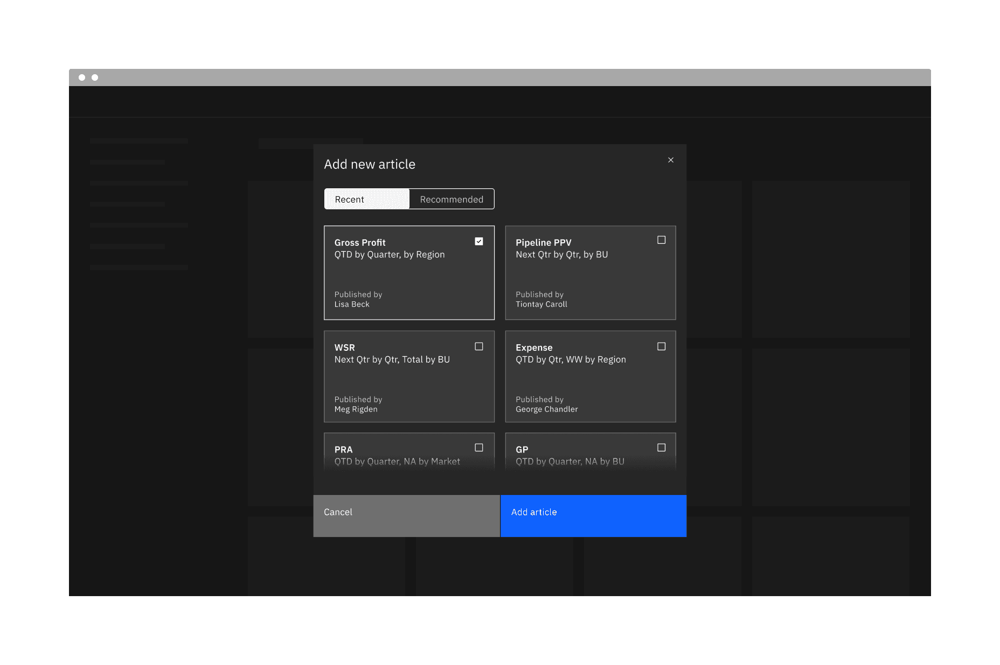

</Column>
</Row>

<Caption>Example of a content switcher in a UI</Caption>

### When to use

Content switchers are frequently used to let users toggle between different
formattings, like a grid view and a table view. They are also often used to
narrow large content groups or to sort related content. For example, a messaging
tool may use a content switcher to divide messages into three views such as
“All,” “Read,” and “Unread.”

### When not to use

#### Distinct content areas

When navigating between distinct content areas like subpages, use
[tabs](/components/tabs/usage) instead of a content switcher. Tabs follow the
metaphor for sections in a filing cabinet, and two tabs wouldn’t contain the
same sheet of paper, so the role of tabs in the information hierarchy is to
separate content.

Content switcher is often used with tabs but at a lower hierarchy to sort
related contents within that tab content.

#### Binary actions

For binary actions or choices, such as “yes/no” or “on/off” use a
[toggle](/components/toggle/usage) instead of a content switcher. A content
switcher can be used for binary views, like switching between a grid and list
view but should not be used as a binary input control.

## Formatting

### Anatomy

<Row>
<Column colLg={8}>

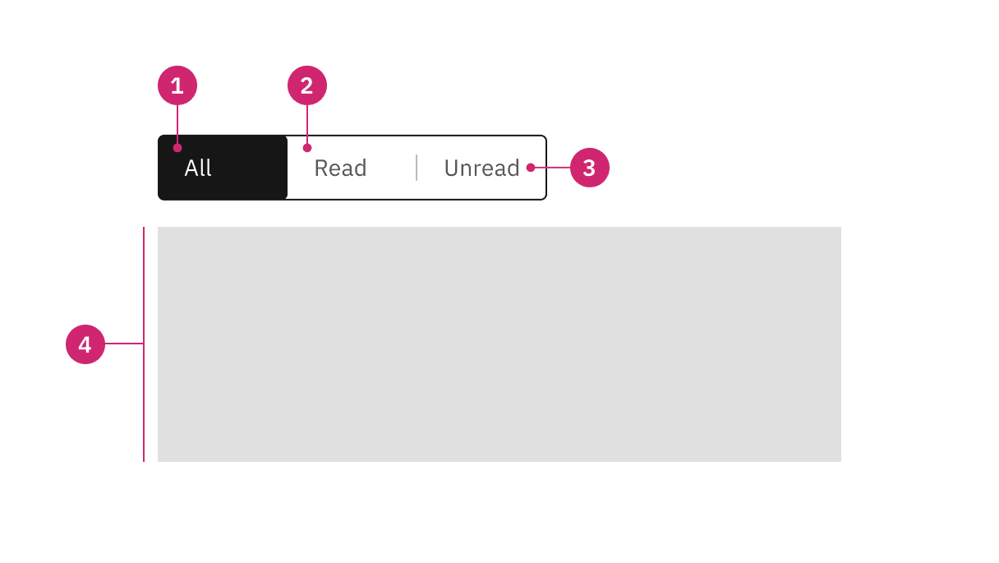

</Column>
</Row>

<Caption>Anatomy of a content switcher</Caption>

1. **Selected content tab:** Only one content tab can be selected at a time and
   there should always be one selected.
2. **Content tab:** Selectable container for each content view.
3. **Label text:** Text or icon that describes the content view.
4. **Content view:** An area that can consist of component(s) and is usually
   right below the content switcher. Its view changes based on the selection.

### Sizing

#### Height

There are three height sizes for the content switcher—small (32px), medium
(40px), and large (48px). Choose a size that best fits your layout’s density or
the switcher’s prominence.

<Row>
<Column colLg={8}>

<Tabs>

<Tab label="Default">

</Tab>

<Tab label="Icon">

</Tab>

</Tabs>

</Column>
</Row>

#### Text width

Each content tab in the group should be the same width. The content tab with the
longest label text should have at minimum 16px spacing to the right of the
label.

<DoDontRow>
  <DoDont type="do" caption="Do base content tab width on the longest label text.">

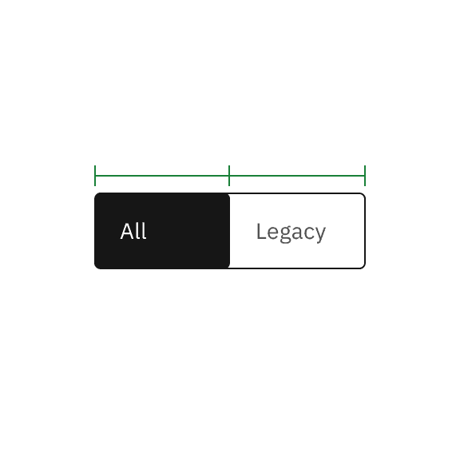

  </DoDont>
  <DoDont type="dont" caption="Do not use a different width for each content tab.">

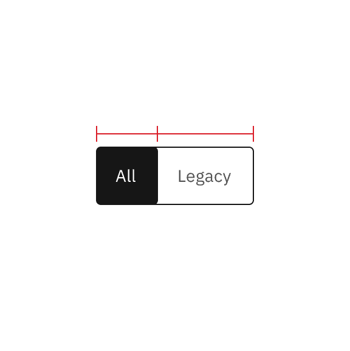

  </DoDont>
</DoDontRow>

#### Icon width

Each content tab in the group should be the same fixed width. Do not stretch the
content tab container to different proportions.

<DoDontRow>
  <DoDont type="do" caption="Do keep a fixed width container so the height always equals the width.">

  </DoDont>
  <DoDont type="dont" caption="Do not use different container sizes or extend the container width so it does not equal the height.">

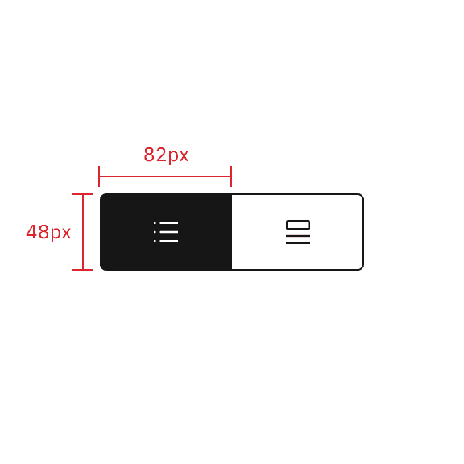

  </DoDont>
</DoDontRow>

### Alignment

A content switcher can align to a grid column or hang in the gutter to create
type alignment. Use layout and hierarchy cues to determine which alignment is
best. In contained space, the content switcher should never be flush to an edge
and instead left-align with other content in the container.

<DoDontRow>
  <DoDont type="do" caption="Do vertically align swichers with other page content.">

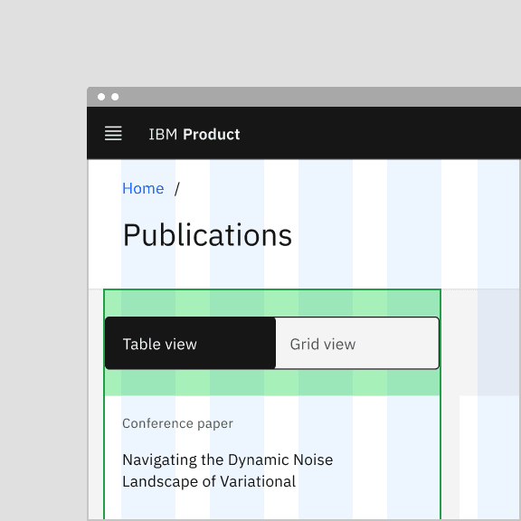

  </DoDont>
  <DoDont type="dont" caption="Do not flush align the switcher to the edges of containers.">

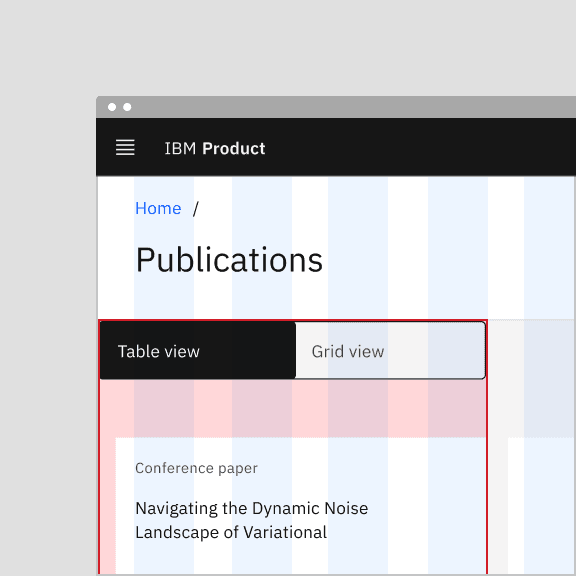

  </DoDont>
</DoDontRow>

#### Aligning to the content

For content-driven widths, the content tab with the longest label text should
have 16px spacing to the right of the label, and then the widths of all other
tabs should match that widest tab.

<Row>
<Column colLg={8}>

</Column>
</Row>

<Caption>
  Example shows the content-driven switcher’s text does not align with the grid.
</Caption>

#### Aligning to the grid

For grid-aware width, the content switcher spans a set of columns, with each tab
being equal in size. Depending on placement, the first tab or the tab’s label
should align with the first column you are using, with the last tab in the group
always ending at a column’s edge. The tabs in between will flow accordingly and
may or may not align with the grid, but they will always be the same width.

<Row>
<Column colLg={8}>

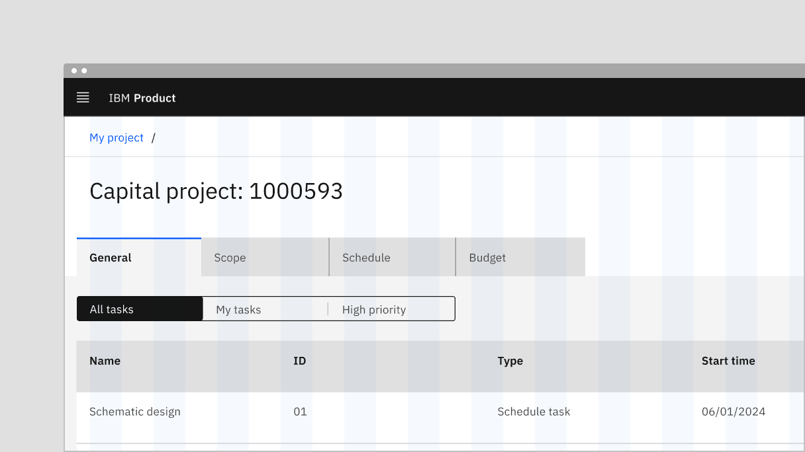

</Column>
</Row>

<Caption>
  Example shows the grid-aware switcher’s text aligns on the grid.
</Caption>

### Placement

Place the content switcher above the content area to create a clear hierarchy
for the section that the switcher controls. It can be aligned to the left or
right side of the content area but should never be centered in the content
space.

## Content

### Main elements

#### Label text

- Be concise and specific and limit label text to two to three words.
- Label text should communicate the view users will see and the content
  contained in the view.
- Label text should be nouns or noun phrases with as few characters as possible.
  Avoid phrasing label text as actions or long strings of text that could be
  mistaken for action buttons.

<DoDontRow>
  <DoDont type="do" caption="Do phrase labels as nouns or noun phrases">

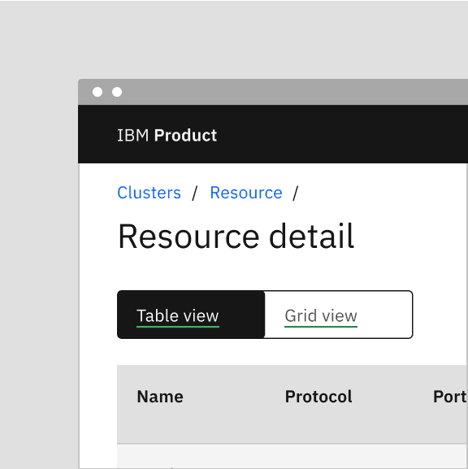

  </DoDont>
  <DoDont type="dont" caption="Do not phrase labels as actions">

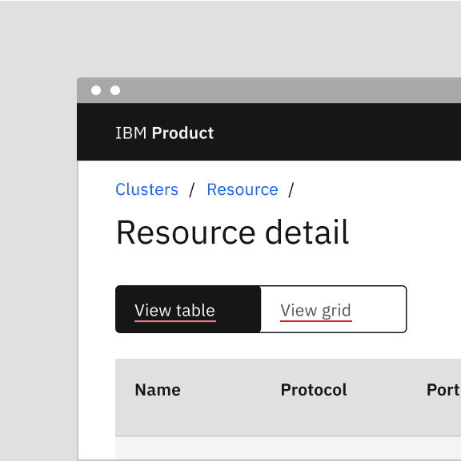

  </DoDont>
</DoDontRow>

### Overflow content

If the label text is too long in a content tab, add an ellipsis and accompany it
with a browser-based tooltip to show the full string of text. If a label is too
long to fit within its control tabs, consider using the icon modifier.

<Row>
<Column colLg={8}>

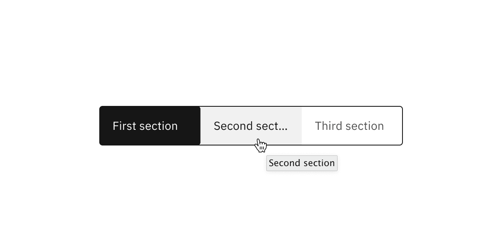

</Column>
</Row>

#### Further guidance

For further content guidance, see Carbon's
[content guidelines](/guidelines/content/overview/).

## Behaviors

### States

Content switchers have two main enabled states: **unselected** and **selected**.
Other interactive states are **hover**, **focus**, and **disabled**. Learn more
about states on the
[Style](https://carbondesignsystem.com/components/content-switcher/style) tab.

| State        | When to use                                                                                                                                                                  |
| ------------ | ---------------------------------------------------------------------------------------------------------------------------------------------------------------------------- |
| _Unselected_ | When the first content tab is automatically selected.                                                                                                                        |
| _Selected_   | When the content tab(s) after the first one is unselected.                                                                                                                   |
| _Hover_      | When the user hovers the cursor over an unselected content tab.                                                                                                              |
| _Focus_      | When the user presses the right or left arrow, or clicks on the content tab, it becomes focused, indicating the user has successfully navigated to the targeted content tab. |
| _Disabled_   | When a user cannot interact with the entire content switcher or a content tab. The entire content switcher or the content tabs could be temporarily inactive or unavailable. |

### Interactions

#### Mouse

Users can activate and navigate between content switcher tabs by clicking a
content tab.

#### Keyboard

Users can activate the content switcher by pressing `tab` and then navigating
between content switcher tabs by pressing the `left` or `right` arrow.

Users can choose to automatically change the selection on focus of the selected
content tab, or manually change the focus state of the unselected content tab
between tabs. For additional keyboard interactions, see the
[Accessibility](https://carbondesignsystem.com/components/content-switcher/accessibility)
tab.

### Responsive behavior

Icon content switchers are compact and do not take up much screen space,
therefore they often work in different screen sizes. Where necessary, icon
content switchers can also be used as a responsive replacement for content
switchers.

<Row>  
<Column colLg={8}>  
<GifPlayer color='dark'>

</GifPlayer>  
</Column>  
</Row>

<Caption>
  Example shows the text content switcher turns into the icon content switcher
  in a smaller screen size.
</Caption>

### Default selection

The default view typically preselects one tab, usually the first tab. Only one
content tab can be selected at a time, displaying its content. When a user
chooses a new item, the previous tab deselects automatically, and the new item
becomes selected. The first content tab in the switcher should be determined by
usage and consistently serve as the default selection.

### Clickable areas

The content tab is clickable anywhere within the container.

<Row>
<Column colLg={8}>

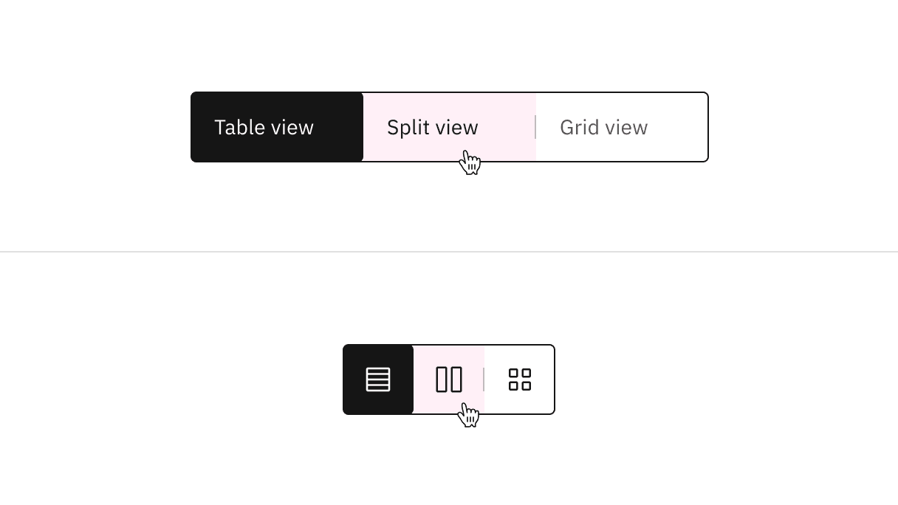

</Column>
</Row>

<Caption>Text and icon content switchers with their clickable areas</Caption>

## Modifiers

### High and low contrast

The content switcher is set to the high contrast style by default. However,
Carbon also supports a low contrast style. High contrast content switchers are
best suited for placement at a higher level in page hierarchy, such as at the
top of a page or within a page header. When in doubt, use the high contrast
style.

<Row>
<Column colLg={8}>

</Column>
</Row>

<Caption>
  High contrast content switcher (top); low contrast content switcher (bottom)
</Caption>

Low contrast content switchers may be used where they need to be less visually
disruptive, such as in cards, modals, and when the component is placed near
primary or secondary buttons.

<Row>
<Column colLg={8}>

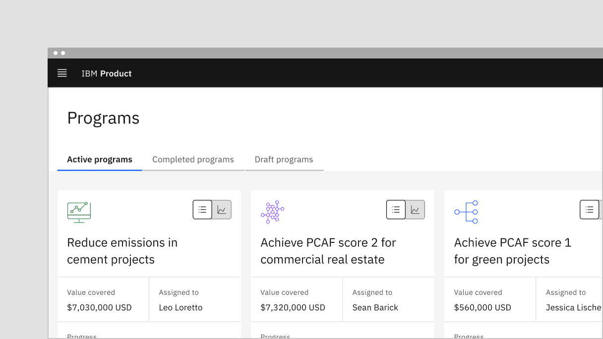

</Column>
</Row>

<Caption>Example of a low contrast content switcher in a UI</Caption>

### Content switcher with icons

Use icons instead of label text to indicate alternative views of similar or
related content. Icon content switchers are often used when space is limited or
when icons can adequately describe the sections (for example, a list view versus
a card view).

<Row>
<Column colLg={8}>

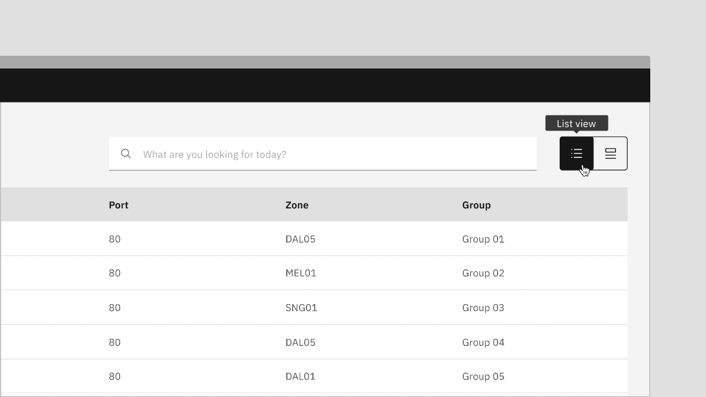

</Column>
</Row>

<DoDontRow>
  <DoDont type="do" caption="Do use consistent icon or text content switcher sections">

  </DoDont>
  <DoDont type="dont" caption="Do not mix icon and text content switcher sections">

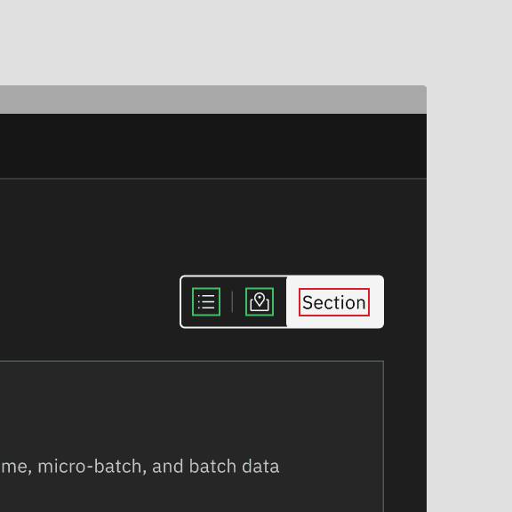

  </DoDont>
</DoDontRow>

## Related

#### Tabs

Tabs are used to organize related content. They allow the user to navigate
between groups of information that appear within the same context. For further
guidance, see Carbon’s [tabs](/components/tabs/usage).

#### Toggle

A toggle is used to quickly switch between two possible states. They are
commonly used for “on/off” switches. For further guidance, see Carbon’s
[toggle](/components/toggle/usage).

## Feedback

Help us improve this component by providing feedback, asking questions, and
leaving any other comments on
[GitHub](https://github.com/carbon-design-system/carbon-website/issues/new?assignees=&labels=feedback&template=feedback.md).
