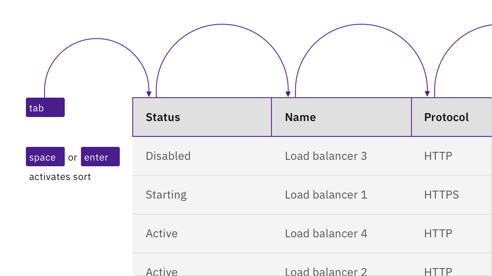
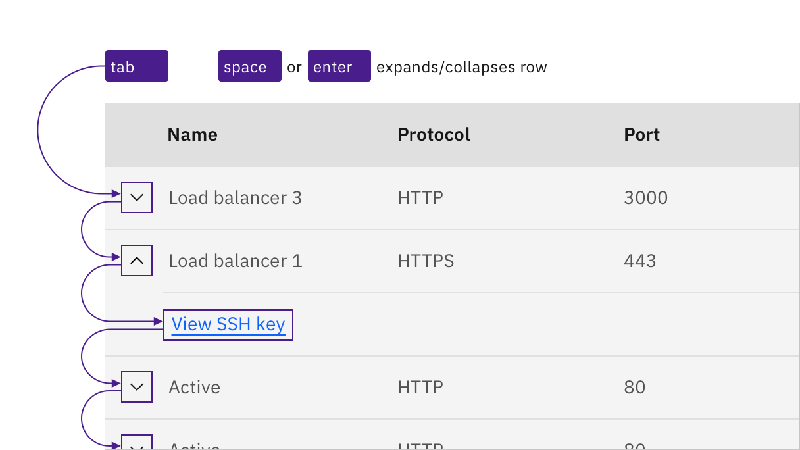
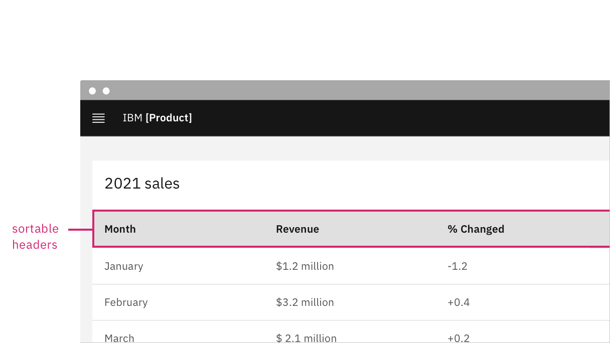

import {
  StructuredListWrapper,
  StructuredListHead,
  StructuredListBody,
  StructuredListRow,
  StructuredListInput,
  StructuredListCell,
  OrderedList,
  ListItem,
} from 'carbon-components-react';

<PageDescription>

Design annotations are needed for specific instances shown below, but for the standard data table component, Carbon already incorporates accessibility.

</PageDescription>

<AnchorLinks>
  <AnchorLink>What Carbon provides</AnchorLink>
  <AnchorLink>Design annotations</AnchorLink>
  <AnchorLink>Developer considerations</AnchorLink>
</AnchorLinks>

## What Carbon provides

Carbon bakes keyboard operation into its components, as well as many other accessibility considerations.

### Keyboard interaction

There are three data table variants with different interactions. Optional features like column sorting can appear in any of the variants. Table [pagination](https://www.carbondesignsystem.com/components/pagination/usage/) is treated as a separate component.

<Row>
<Column colLg={8}>

</Column>
</Row>

For sortable tables, the column headers are reachable by `Tab` and sortable with `Space` or `Enter`.

### Controls inside tables

Any interactive controls in data cells are in the tab order and maintain normal keyboard operation. This also applies to expandable table rows, which operate in the same manner as [accordions](https://www.carbondesignsystem.com/components/accordions/usage/").

<Row>
<Column colLg={8}>

</Column>
</Row>

Links, inputs, and other interactive controls inside tables operate by keyboard as normal.

### Labelling and updates

If columns are sortable, the sort symbols appear on hover or focus. A sorted column retains an indicator until it is no longer sorted. 

<Row>
<Column colLg={8}>

</Column>
</Row>

Sort indicators appear on hover and focus. A sorted column is indicated visually.

## Design annotations

Since there is no persistent visual indicator that a table is sortable, designers need to annotate if a table should be implemented with sortable column headers.

<Row>
<Column colLg={8}>

</Column>
</Row>

Annotate if a table is sortable.

## Developer considerations

Keep this in mind if you’re modifying Carbon or creating a custom component:

* Column sorting indicators are matched programmatically using `aria-sort`
* See the [ARIA authoring practices](https://www.w3.org/TR/wai-aria-practices-1.2/#table) for more considerations
