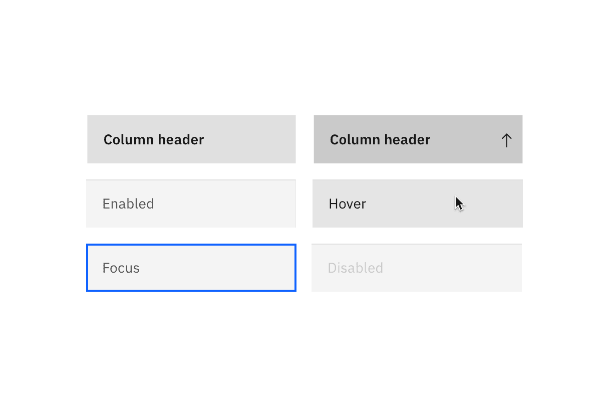
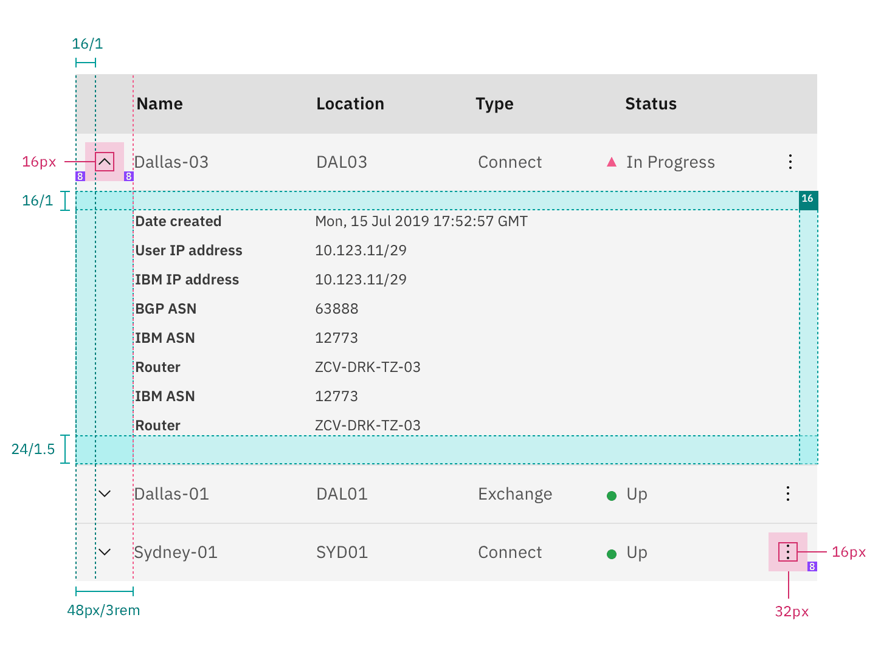
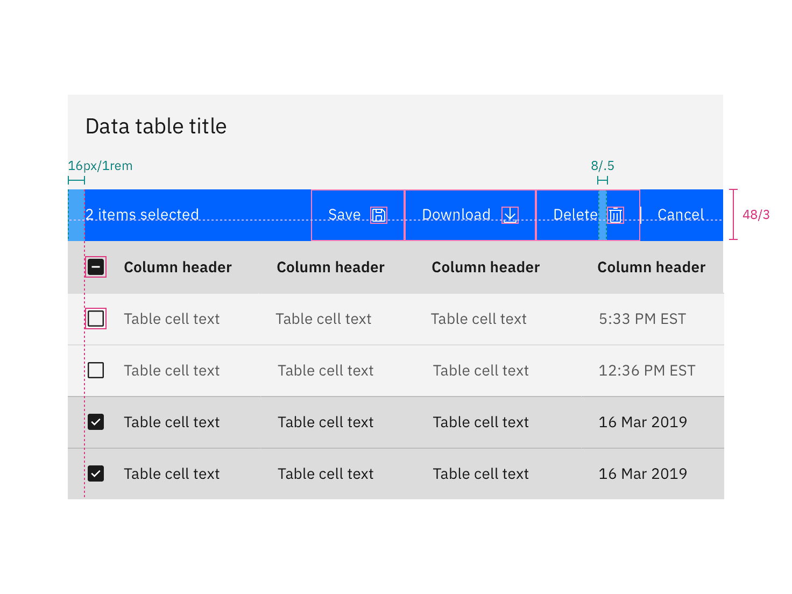

## Color

| Class                     | Property         | Color token |
| ------------------------- | ---------------- | ----------- |
| `.bx--data-table-header`  | background-color | `$ui-01`    |
| `.bx--data-table-header`  | text color       | `$text-01`  |
| `.bx--data-table thead`   | background-color | `$ui-03`    |
| `.bx--table-header-label` | text color       | `$text-01`  |
| `.bx--data-table tbody`   | background-color | `$ui-01`    |
| `.bx--data-table td`      | text color       | `$text-02`  |

<Row>
<Column colLg={8}>

</Column>
</Row>

### Enhancements

| Class                                                                                         | Property         | Color token       |
| --------------------------------------------------------------------------------------------- | ---------------- | ----------------- |
| `.bx--data-table--zebra`                                                                      | background-color | –                 |
| `.bx--expandable-row-v2`                                                                      | background-color | `$ui-01`          |
| `.bx--table-sort-v2__icon`   `.bx--table-expand-v2__svg`   `.bx--overflow-menu__icon` | fill             | `$icon-01`        |
| `.bx--batch-actions--active`                                                                  | background-color | `$interactive-01` |
| `.bx--batch-summary__para`                                                                    | background-color | `$text-04`        |
| `.bx--batch-actions .bx--btn`                                                                 | text-color       | `$text-04`        |
| `.bx--overflow-menu-options`                                                                  | text-color       | `$text-02`        |
| `.bx--overflow-menu-options`                                                                  | background color | `$ui-02`          |

### Interactive states

| Class                               | Property         | Color token          |
| ----------------------------------- | ---------------- | -------------------- |
| `.bx--data-table tr:hover td`       | background-color | `$hover-ui`          |
| `.bx--data-table td:hover`          | text color       | `$text-01`           |
| `.bx--data-table td:focus`          | border           | `$focus`             |
| `.bx--data-table--selected`         | background-color | `$selected-ui`       |
| `.bx--data-table--selected td`      | text color       | `$text-01`           |
| `.bx--data-table--selected:hover`   | background-color | `$hover-selected-ui` |
| `.bx--batch-actions .bx--btn:hover` | background color | `$hover-primary`     |

<Row>
<Column colLg={8}>

</Column>
</Row>

## Typography

| Class                     | Font-size (px/rem) | Font-weight    | Type token               |
| ------------------------- | ------------------ | -------------- | ------------------------ |
| `.bx--data-table-header`  | 20 / 1.25          | Regular / 400  | `$productive-heading-03` |
| `.bx--table-header-label` | 14 / 0.875         | SemiBold / 600 | `$productive-heading-01` |
| `.bx--data-table td`      | 14 / 0.875         | Regular / 400  | `$body-short-01`         |

## Structure

Tables are a configurable and customizable component. Designers can pick and
choose certain elements and interactions. The basic table style is the required
base from which tables can be developed. Basic tables are composed of a header
row followed by rows of data below.

| Class                                                                      | Property                    | px / rem | Spacing token |
| -------------------------------------------------------------------------- | --------------------------- | -------- | ------------- |
| `.bx--data-table-header`                                                   | margin-top                  | 16 / 1   | `$spacing-05` |
| `.bx--data-table-header`                                                   | margin-bottom               | 24 / 1.5 | `$spacing-06` |
| `.bx--data-table-header`                                                   | padding left, padding right | 16 / 1   | `$spacing-05` |
| `.bx--table-sort-v2__icon`                                                 | padding                     | 8 / 0.5  | `$spacing-03` |
| `.bx--data-table td:first-of-type`   `.bx--data-table td:last-of-type` | padding-left, padding-right | 16 / 1   | `$spacing-05` |

<Caption>
  Structure and spacing measurements for a basic data table | px/rem
</Caption>

### Columns

Column widths can vary by content and only require a minimum spacing between
columns. Tables require three or more columns.

| Spacing between | Property | px / rem | Spacing token |
| --------------- | -------- | -------- | ------------- |
| Columns         | padding  | 16 /1    | `$spacing-05` |

<Caption>
  Structure and spacing measurements for columns in a data table | px/rem
</Caption>

### Rows

Row sizes are customizable. The column header row `.bx--data-table thead` should
always match the row size of the table. Tall row heights are only recommended if
your data is expected to have 2 lines of content in a single row.

| Class                      | Size    | Row Height (px/rem) |
| -------------------------- | ------- | ------------------- |
| `.bx--data-table--compact` | Compact | 24 / 1.5            |
| `.bx--data-table--short`   | Short   | 32 / 2              |
| `.bx--data-table tr`       | Default | 48 / 3              |
| `.bx--data-table--tall`    | Tall    | 64 / 4              |

<Row>
<Column colLg={8}>

</Column>
</Row>

### Enhancements

After the simple table structure, tables can be enhanced by adding any of the
following: selectable rows, expanding rows, nested tables, row menus, table
batch actions, overall table menu, and/or table filter.

| Class                           | Property                   | px / rem  | Spacing token |
| ------------------------------- | -------------------------- | --------- | ------------- |
| `.bx--checkbox-appearance`      | height, width              | 20 / 1.25 | –             |
| `.bx--radio-button__appearance` | height, width              | 20 / 1.25 | –             |
| `.bx--overflow-menu-options`    | height                     | 40 / 2.5  | –             |
| `.bx--table-expand__svg`        | icon                       | 16 / 1    | –             |
| `.bx--expandable-row`           | padding-top, padding-right | 16 / 1    | `$spacing-05` |
| `.bx--expandable-row`           | padding-left               | 48 / 3    | `$spacing-09` |
| `.bx--expandable-row`           | padding-bottom             | 24 / 1.5  | `$spacing-06` |

<Caption>Structure and spacing measurements for expanded row | px/rem</Caption>

### Toolbar

The default 48px toolbar is paired with the tall and default row sizes. The
small toolbar is paired with the short and compact row sizes.

| Class                        | Property                  | px/rem  | Spacing token |
| ---------------------------- | ------------------------- | ------- | ------------- |
| `.bx--toolbar-action`        | height, width             | 48 / 3  | –             |
| `.bx--toolbar-action--small` | height, width             | 32 / 2  | –             |
| `.bx--toolbar`               | margin-top, margin-bottom | 16 / 1  | `$spacing-05` |
| `.bx--toolbar--small`        | margin-top, margin-bottom | 8 / 0.5 | `$spacing-03` |

<Caption>Structure and spacing measurements for toolar | px/rem</Caption>

### Batch action bar

The default 48px batch action bar is paired with the tall and default row sizes.
The small batch action bar is paired with the short and compact row sizes.

| Class                       | Property                    | px/rem | Spacing token |
| --------------------------- | --------------------------- | ------ | ------------- |
| `.bx--batch-actions`        | height                      | 48 / 3 | –             |
| `.bx--batch-actions--small` | height                      | 32 / 2 | –             |
| `.bx--batch-actions`        | padding-left, padding-right | 16 / 1 | `$spacing-05` |
| `.bx--btn`                  | default size                | 48px   | –             |
| `.bx--btn`                  | small size                  | 32px   | –             |
| `.bx--btn__icon`            | padding-right               | 16/1   | `$spacing-05` |

<Caption>
  Structure and spacing measurements for batch action bar | px/rem
</Caption>
