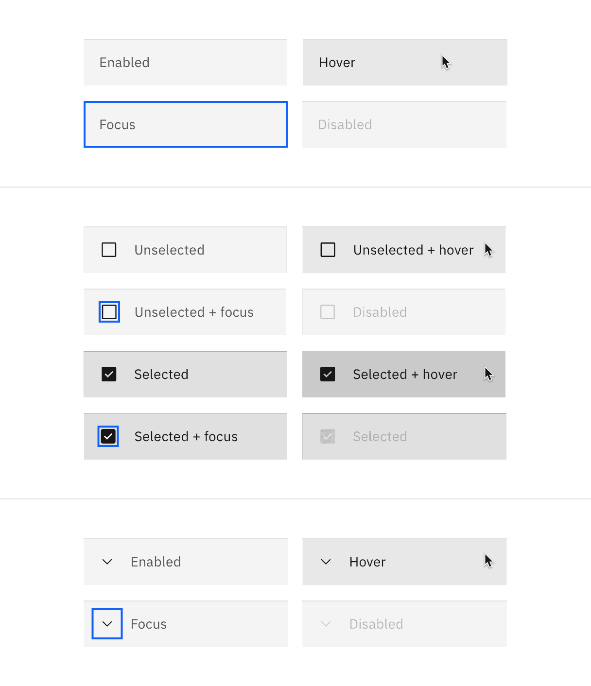
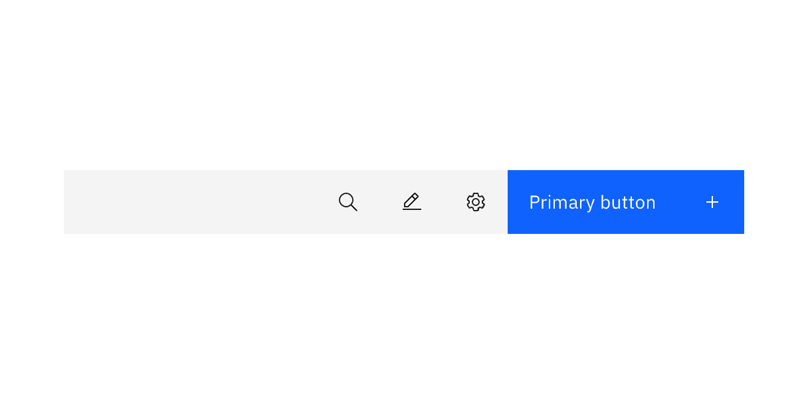
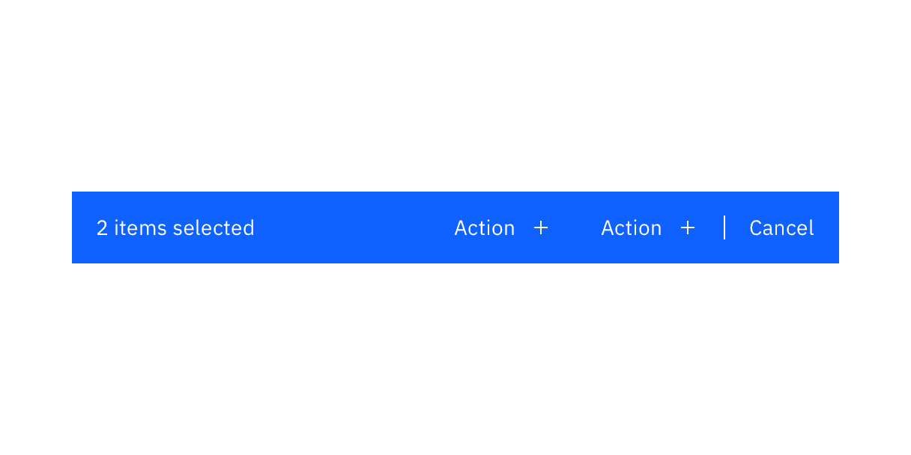
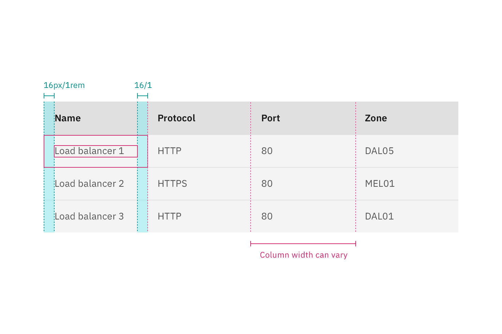
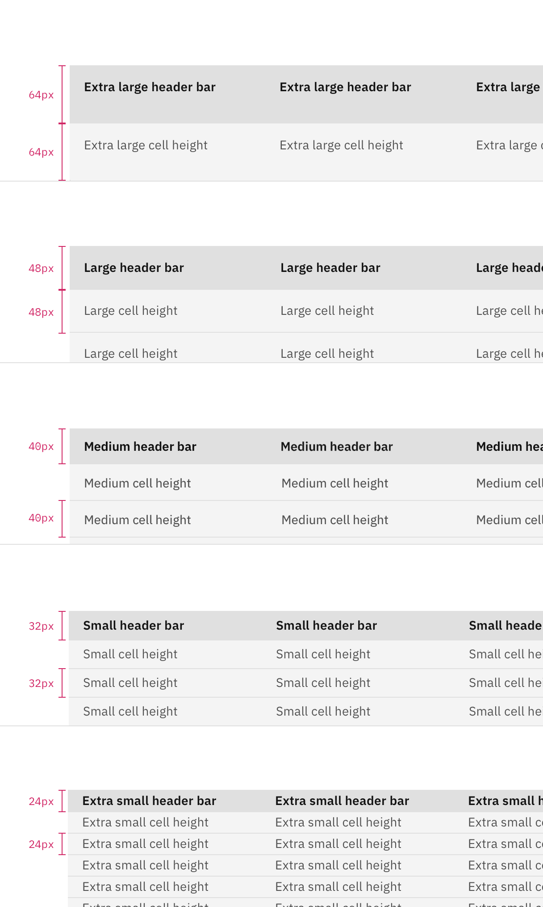
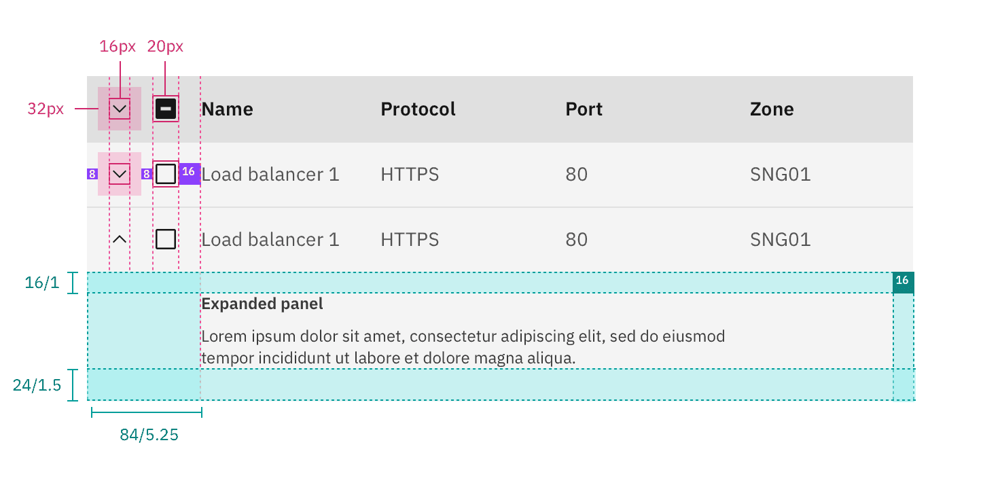
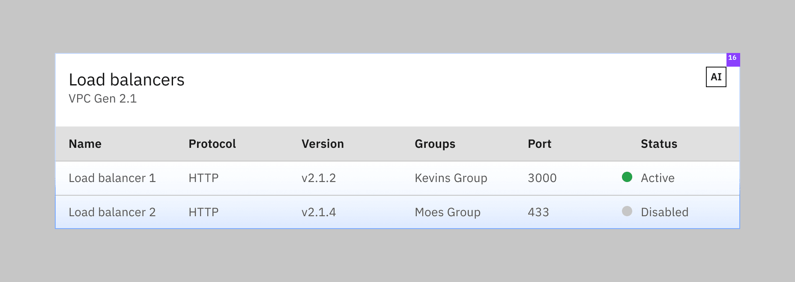
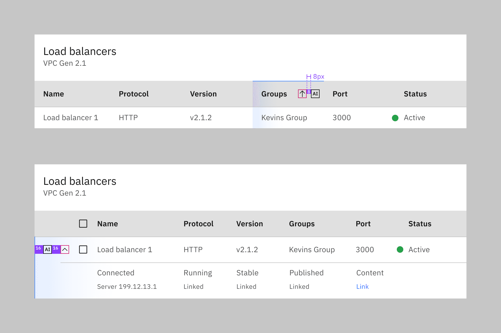
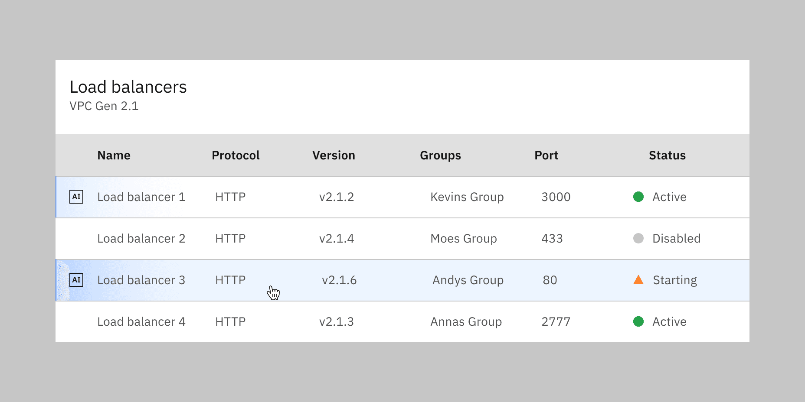

<PageDescription>

The following page documents visual specifications such as color, typography,
structure, and AI presence.

</PageDescription>

<AnchorLinks>

<AnchorLink>Color</AnchorLink>
<AnchorLink>Typography</AnchorLink>
<AnchorLink>Structure</AnchorLink>
<AnchorLink>AI presence</AnchorLink>

</AnchorLinks>

## Color

### Table header

| Element      | Property         | Color token       |
| ------------ | ---------------- | ----------------- |
| Table header | background-color | `$layer` \*       |
| Title        | text-color       | `$text-primary`   |
| Description  | text-color       | `$text-secondary` |

<Caption fullWidth>
  \* Denotes a contextual color token that will change values based on the layer
  it is placed on.
</Caption>

<Row>
<Column colLg={8}>

</Column>
</Row>

### Column header

| State   | Property         | Color token               |
| ------- | ---------------- | ------------------------- |
| Enabled | background-color | `$layer-accent` \*        |
|         | text-color       | `$text-primary`           |
|         | svg              | `$icon-primary`           |
| Hover   | background-color | `$layer-accent-hover` \*  |
|         | text-color       | `$text-primary`           |
| Focus   | border           | `$focus`                  |
| Active  | background-color | `$layer-accent-active` \* |

<Caption fullWidth>
  \* Denotes a contextual color token that will change values based on the layer
  it is placed on.
</Caption>

<Row>
<Column colLg={8}>

</Column>
</Row>

### Row

| State            | Property         | Color token                 |
| ---------------- | ---------------- | --------------------------- |
| Enabled          | background-color | `$layer` \*                 |
|                  | text-color       | `$text-secondary`           |
|                  | border-bottom    | `$border-subtle` \*         |
|                  | svg              | `$icon-secondary`           |
| Hover            | background-color | `$layer-hover` \*           |
|                  | text-color       | `$text-primary`             |
| Focus            | border           | `$focus`                    |
| Selected         | background-color | `$layer-selected` \*        |
|                  | text-color       | `$text-primary`             |
|                  | border-bottom    | `$border-subtle-selected`\* |
|                  | svg              | `$icon-primary`             |
| Selected + hover | background-color | `$layer-selected-hover` \*  |
| Expanded         | background-color | `$layer` \*                 |
|                  | svg              | `$icon-primary`             |
| Zebra            | background-color | `$layer-accent` \*          |

<Caption fullWidth>
  \* Denotes a contextual color token that will change values based on the layer
  it is placed on.
</Caption>

<Row>
<Column colLg={8}>

</Column>
</Row>

### Toolbar

| Element     | Property                                                                                    | Color token |
| ----------- | ------------------------------------------------------------------------------------------- | ----------- |
| Toolbar     | background-color                                                                            | `$layer` \* |
| Icon button | See [ghost button](https://carbondesignsystem.com/components/button/style#ghost-button)     |             |
| Button      | See [primary button](https://carbondesignsystem.com/components/button/style#primary-button) |             |

<Caption fullWidth>
  \* Denotes a contextual color token that will change values based on the layer
  it is placed on.
</Caption>

<Row>
<Column colLg={8}>

</Column>
</Row>

### Batch action bar

| Element | Property                                                                                    | Color token         |
| ------- | ------------------------------------------------------------------------------------------- | ------------------- |
| Bar     | background-color                                                                            | `$background-brand` |
| Summary | text-color                                                                                  | `$text-on-color`    |
| Button  | See [primary button](https://carbondesignsystem.com/components/button/style#primary-button) |                     |

<Row>
<Column colLg={8}>

</Column>
</Row>

## Typography

| Element       | Font-size (px/rem) | Font-weight    | Type token            |
| ------------- | ------------------ | -------------- | --------------------- |
| Table header  | 20 / 1.25          | Regular / 400  | `$heading-03`         |
| Column header | 14 / 0.875         | SemiBold / 600 | `$heading-compact-01` |
| Row text      | 14 / 0.875         | Regular / 400  | `$body-compact-01`    |

## Structure

Tables are a configurable and customizable component. Designers can pick and
choose certain elements and interactions. The basic table style is the required
base from which tables can be developed. Basic tables are composed of a header
row followed by rows of data below.

| Element               | Property                    | px / rem | Spacing token |
| --------------------- | --------------------------- | -------- | ------------- |
| Table header          | margin-top                  | 16 / 1   | `$spacing-05` |
|                       | margin-bottom               | 24 / 1.5 | `$spacing-06` |
|                       | padding left, padding right | 16 / 1   | `$spacing-05` |
| Sort icon             | padding                     | 8 / 0.5  | `$spacing-03` |
| Before and after text | padding-left, padding-right | 16 / 1   | `$spacing-05` |

<Caption>
  Structure and spacing measurements for a basic data table | px/rem
</Caption>

### Columns

Column widths can vary by content and only require a minimum spacing between
columns. Tables require three or more columns.

| Spacing between | Property | px / rem | Spacing token |
| --------------- | -------- | -------- | ------------- |
| Columns         | padding  | 16 /1    | `$spacing-05` |

<Caption>
  Structure and spacing measurements for columns in a data table | px/rem
</Caption>

### Rows

Row sizes are customizable. The column header row should always match the row
size of the table. Column header and row text is always centered in the row with
the exception of the extra large which is offset by `padding-top: 16px`. Extra
large row heights are only recommended if your data is expected to have two
lines of content in a single row.

| Size             | Height (px / rem) |
| ---------------- | ----------------- |
| Extra small (xs) | 24 / 1.5          |
| Small (sm)       | 32 / 2            |
| Medium (md)      | 40 / 2.5          |
| Large (lg)       | 48 / 3            |
| Extra large (xl) | 64 / 4            |

<Row>
<Column colLg={8}>

</Column>
</Row>

### Enhancements

After the simple table structure, tables can be enhanced by adding any of the
following: selectable rows, expanding rows, row menus, table batch actions,
overall table menu, and/or table filter.

| Element            | Property                    | px / rem  | Spacing token |
| ------------------ | --------------------------- | --------- | ------------- |
| Checkbox           | height, width               | 20 / 1.25 | –             |
|                    | padding-left, padding-right | 16 / 1    | `$spacing-05` |
| Radio button       | height, width               | 20 / 1.25 | –             |
|                    | padding-left, padding-right | 16 / 1    | `$spacing-05` |
| Overflow menu (sm) | height                      | 32 / 2    | –             |
| Chevron icon       | svg                         | 16 / 1    | –             |
|                    | click target                | 32 / 2    | `$spacing-07` |
|                    | padding-left, padding-right | 16 / 1    | `$spacing-05` |
| Expanded panel     | padding-top, padding-right  | 16 / 1    | `$spacing-05` |
|                    | padding-left                | 48 / 3    | `$spacing-09` |
|                    | padding-bottom              | 24 / 1.5  | `$spacing-06` |

<Caption>Structure and spacing measurements for selected row | px/rem</Caption>

<Caption>Structure and spacing measurements for expanded row | px/rem</Caption>

<Caption>
  Structure and spacing measurements for expanded and selected row | px/rem
</Caption>

### Toolbar

The large 48px toolbar is paired with the extra large and large row sizes. The
small toolbar is paired with the small and extra small row sizes.

| Element        | Property                  | px / rem | Spacing token |
| -------------- | ------------------------- | -------- | ------------- |
| Toolbar: large | height, width             | 48 / 3   | –             |
|                | margin-top, margin-bottom | 16 / 1   | `$spacing-05` |
| Toolbar: small | height, width             | 32 / 2   | –             |
|                | margin-top, margin-bottom | 8 / 0.5  | `$spacing-03` |

<Caption>Structure and spacing measurements for toolbar | px/rem</Caption>

### Batch action bar

The large 48px batch action bar is paired with the extra large and large row
sizes. The small batch action bar is paired with the small and extra small row
sizes.

| Element                 | Property                    | px / rem | Spacing token |
| ----------------------- | --------------------------- | -------- | ------------- |
| Batch action bar: large | height                      | 48 / 3   | –             |
| Button                  | size                        | 48px     | –             |
| Batch action bar: small | height                      | 32 / 2   | –             |
| Button                  | size                        | 32px     | –             |
| Before and after text   | padding-left, padding-right | 16 / 1   | `$spacing-05` |
| Button: icon            | padding-right               | 16 / 1   | `$spacing-05` |

<Caption>
  Structure and spacing measurements for batch action bar | px/rem
</Caption>

## AI presence

The following are the unique styles applied to the component when the AI label
is present. Unless specified, all other tokens in the component remain the same
as the non-AI variant.

For more information on the AI style elements, see the
[Carbon for AI](/guidelines/carbon-for-ai/) guidelines.

<Title>Entire table</Title>

| Element                    | Property         | Token / Size        |
| -------------------------- | ---------------- | ------------------- |
| Data table:background      | background-color | `$layer` \*         |
|                            | box-shadow       | `$ai-drop-shadow`   |
|                            | inner-shadow     | `$ai-inner-shadow`  |
| Linear gradient:background | start            | `$ai-aura-start-sm` |
|                            | stop             | `$ai-aura-stop`     |
| Linear gradient:border     | top              | `$ai-border-start`  |
|                            | bottom           | `$ai-border-end`    |
| AI label                   | size             | large               |

<Row>
<Column colLg={12}>

<Caption>
  Structure and spacing measurements for entire data table generated by AI.
</Caption>

</Column>
</Row>

<Title>Individual cells</Title>

| Element         | Property | Token / Size |
| --------------- | -------- | ------------ |
| Inline AI label | size     | medium       |

<Row>
<Column colLg={12}>

<Caption>
  Structure and spacing measurements for individual cells of a data table
  generated by AI.
</Caption>

</Column>
</Row>

<Title>Rows and columns</Title>

| Element                    | Property  | Token / Size        |
| -------------------------- | --------- | ------------------- |
| Linear gradient:background | start     | `$ai-aura-start-sm` |
|                            | stop      | `$ai-aura-stop`     |
| Linear gradient:border     | left, top | `$ai-border-strong` |
| AI label                   | size      | mini                |

<Row>
<Column colLg={12}>

<Caption>
  Structure and spacing measurements for rows and columns of a data table
  generated by AI.
</Caption>

</Column>
</Row>

<Row>
<Column colLg={12}>

<Caption>Hover interaction for an AI generated row.</Caption>

</Column>
</Row>
