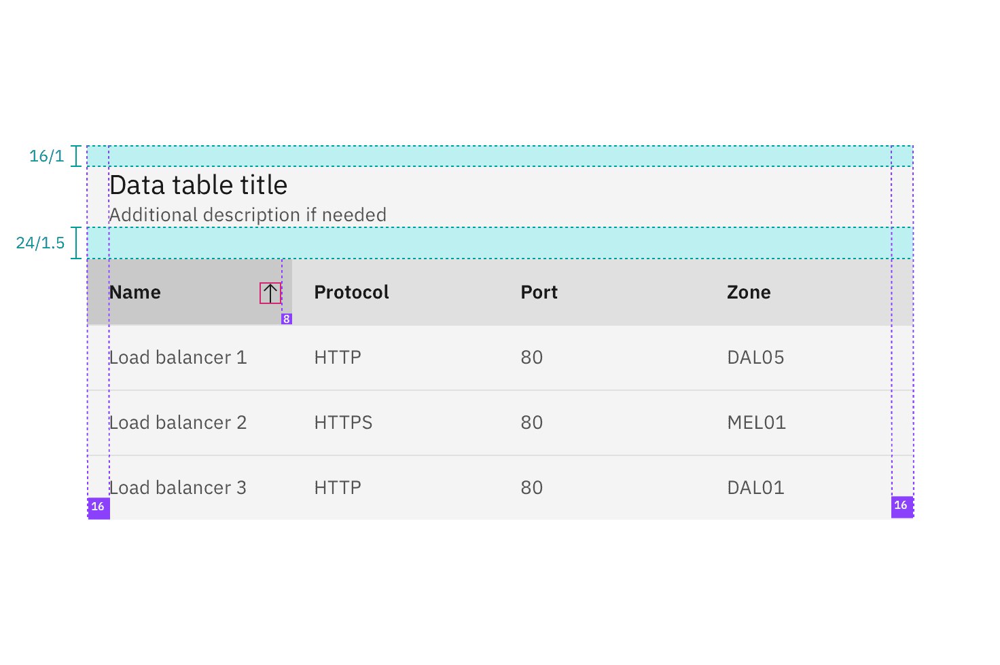
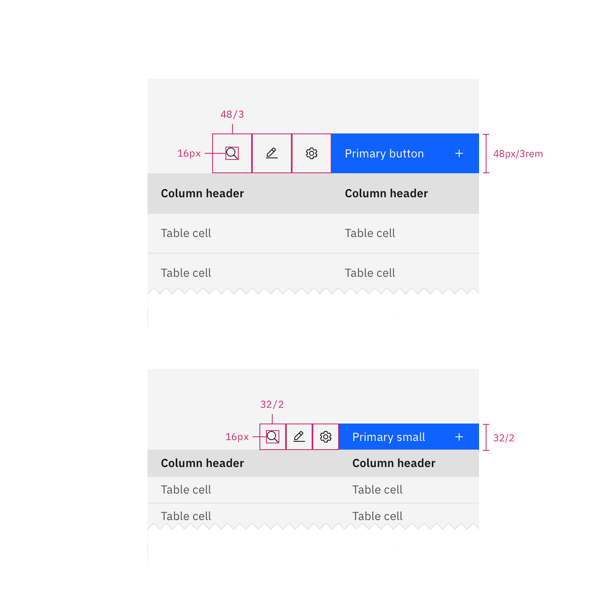

## Color

| Element       | Property         | Color token       |
| ------------- | ---------------- | ----------------- |
| Table header  | background-color | `$layer`          |
| Title         | text-color       | `$text-primary`   |
| Description   | text-color       | `$text-secondary` |
| Column header | background-color | `$layer-accent`   |
|               | text-color       | `$text-primary`   |
| Row           | background-color | `$layer`          |
|               | text-color       | `$text-secondary` |
|               | border-bottom    | `$border-subtle`  |

<Row>
<Column colLg={8}>

</Column>
</Row>

### Enhancements

| Element          | Property         | Color token                     |
| ---------------- | ---------------- | ------------------------------- |
| Zebra row        | background-color | `$layer-accent`                 |
| Expanded row     | background-color | `$layer`                        |
| Sort icon        | svg              | `$icon-primary`                 |
| Chevron icon     | svg              | `$icon-primary`                 |
| Overflow icon    | svg              | `$icon-primary`                 |
| Batch action bar | background-color | `$background-brand`             |
|                  | text-color       | `$text-on-color`                |
|                  | svg              | `icon-on-color`                 |
| Overflow menu    | background-color | `$layer: inline theme`          |
|                  | text-color       | `$text-secondary: inline theme` |

### Interactive states

| Element                  | Property                                                                                | Color token             |
| ------------------------ | --------------------------------------------------------------------------------------- | ----------------------- |
| Row: hover               | background-color                                                                        | `$layer-hover`          |
|                          | text-color                                                                              | `$text-primary`         |
| Row: focus               | border                                                                                  | `$focus`                |
| Row: selected            | background-color                                                                        | `$layer-selected`       |
|                          | text-color                                                                              | `$text-primary`         |
| Row: selected + hover    | background-color                                                                        | `$layer-selected-hover` |
| Batch action bar: button | See [ghost button](https://carbondesignsystem.com/components/button/style#ghost-button) |                         |

<Row>
<Column colLg={8}>

</Column>
</Row>

## Typography

| Element       | Font-size (px/rem) | Font-weight    | Type token               |
| ------------- | ------------------ | -------------- | ------------------------ |
| Table header  | 20 / 1.25          | Regular / 400  | `$productive-heading-03` |
| Column header | 14 / 0.875         | SemiBold / 600 | `$productive-heading-01` |
| Row text      | 14 / 0.875         | Regular / 400  | `$body-short-01`         |

## Structure

Tables are a configurable and customizable component. Designers can pick and
choose certain elements and interactions. The basic table style is the required
base from which tables can be developed. Basic tables are composed of a header
row followed by rows of data below.

| Element               | Property                    | px / rem | Spacing token |
| --------------------- | --------------------------- | -------- | ------------- |
| Table header          | margin-top                  | 16 / 1   | `$spacing-05` |
|                       | margin-bottom               | 24 / 1.5 | `$spacing-06` |
|                       | padding left, padding right | 16 / 1   | `$spacing-05` |
| Sort icon             | padding                     | 8 / 0.5  | `$spacing-03` |
| Before and after text | padding-left, padding-right | 16 / 1   | `$spacing-05` |

<Caption>
  Structure and spacing measurements for a basic data table | px/rem
</Caption>

### Columns

Column widths can vary by content and only require a minimum spacing between
columns. Tables require three or more columns.

| Spacing between | Property | px / rem | Spacing token |
| --------------- | -------- | -------- | ------------- |
| Columns         | padding  | 16 /1    | `$spacing-05` |

<Caption>
  Structure and spacing measurements for columns in a data table | px/rem
</Caption>

### Rows

Row sizes are customizable. The column header row `.bx--data-table thead` should
always match the row size of the table. Tall row heights are only recommended if
your data is expected to have 2 lines of content in a single row.

| Size    | Row Height (px/rem) |
| ------- | ------------------- |
| Compact | 24 / 1.5            |
| Short   | 32 / 2              |
| Default | 48 / 3              |
| Tall    | 64 / 4              |

<Row>
<Column colLg={8}>

</Column>
</Row>

### Enhancements

After the simple table structure, tables can be enhanced by adding any of the
following: selectable rows, expanding rows, nested tables, row menus, table
batch actions, overall table menu, and/or table filter.

| Element         | Property                   | px / rem  | Spacing token |
| --------------- | -------------------------- | --------- | ------------- |
| Checkbox        | height, width              | 20 / 1.25 | –             |
| Radio button    | height, width              | 20 / 1.25 | –             |
| Overflow menu   | height                     | 40 / 2.5  | –             |
| Chevron icon    | svg                        | 16 / 1    | –             |
| Row: expandable | padding-top, padding-right | 16 / 1    | `$spacing-05` |
|                 | padding-left               | 48 / 3    | `$spacing-09` |
|                 | padding-bottom             | 24 / 1.5  | `$spacing-06` |

<Caption>Structure and spacing measurements for expanded row | px/rem</Caption>

### Toolbar

The default 48px toolbar is paired with the tall and default row sizes. The
small toolbar is paired with the short and compact row sizes.

| Element                      | Property                  | px/rem  | Spacing token |
| ---------------------------- | ------------------------- | ------- | ------------- |
| Toolbar: large               | height, width             | 48 / 3  | –             |
|                              | margin-top, margin-bottom | 16 / 1  | `$spacing-05` |        
| Toolbar: small               | height, width             | 32 / 2  | –             |
|                              | margin-top, margin-bottom | 8 / 0.5 | `$spacing-03` |

<Caption>Structure and spacing measurements for toolbar | px/rem</Caption>

### Batch action bar

The default 48px batch action bar is paired with the tall and default row sizes.
The small batch action bar is paired with the short and compact row sizes.

| Element                 | Property                    | px/rem | Spacing token |
| ----------------------- | --------------------------- | ------ | ------------- |
| Batch action bar: large | height                      | 48 / 3 | –             |
| Button                  | size                        | 48px   | –             |
| Batch action bar: small | height                      | 32 / 2 | –             |
| Button                  | size                        | 32px   | –             |
| Before and after text   | padding-left, padding-right | 16 / 1 | `$spacing-05` |
| Button: icon            | padding-right               | 16 / 1 | `$spacing-05` |

<Caption>
  Structure and spacing measurements for batch action bar | px/rem
</Caption>
