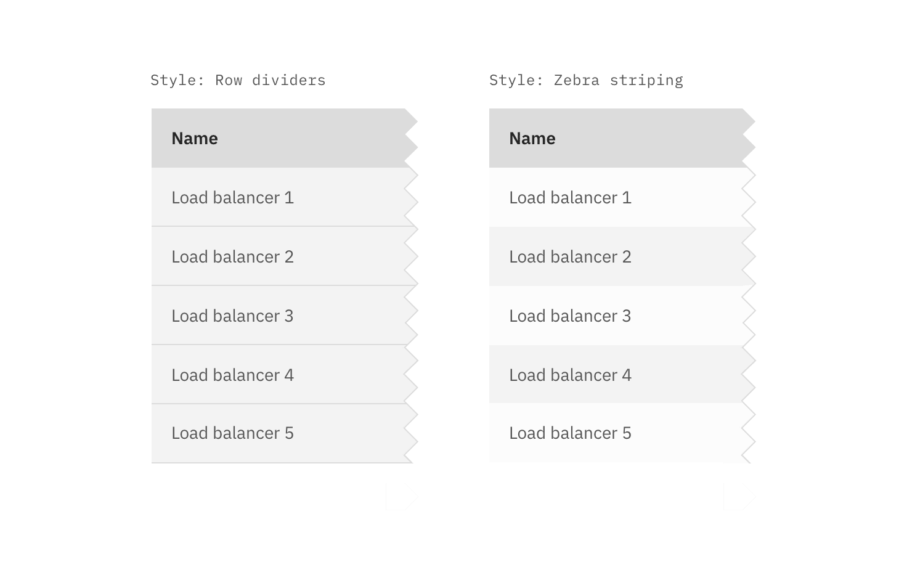
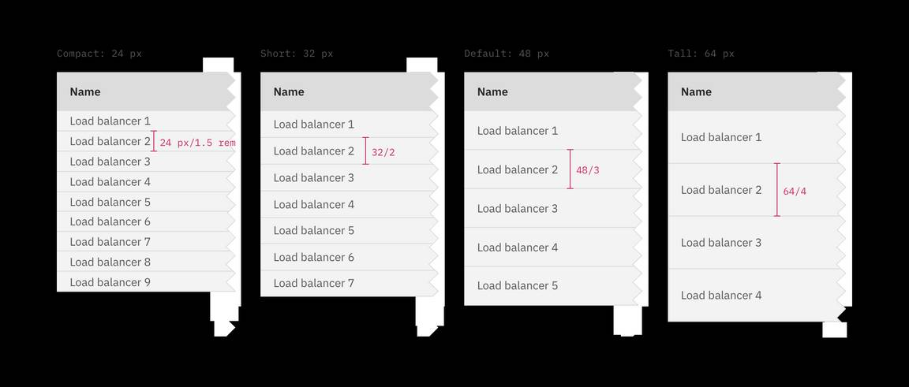

<AnchorLinks>

<AnchorLink>General guidance</AnchorLink>
<AnchorLink>Formatting</AnchorLink>
<AnchorLink>Content</AnchorLink>
<AnchorLink>Behavior</AnchorLink>
<AnchorLink>Accessibility</AnchorLink>
<AnchorLink>Variations</AnchorLink>
<AnchorLink>Style</AnchorLink>
<AnchorLink>Code</AnchorLink>
<AnchorLink>Feedback</AnchorLink>

</AnchorLinks>

## General guidance

The data table component is designed in a way for additional functionality to be added on to fit your team’s needs.

<ComponentCode
  name="Data table"
  component="data-table"
  variation="data-table"
  hasReactVersion="datatable--default"
  hasVueVersion="datatable--default"
  hasAngularVersion="?path=/story/table--default"
  codepen="jRWbZZ"></ComponentCode>

## Formatting

**The basic data table is shipped with a base style, which includes:**

- Borders
- No zebra striping, row dividers instead.
- No Pagination, search, table toolbar, or multi-select

## Content 

## Behavior

## Accessibility

## Variations 

### Pagination

Pagination divides table data into separate pages. Pagination is accompanied by an option that enables the user to change the number of items per page. See the [pagination](/components/Pagination) component for further guidelines.

<Caption>Data table with various Pagination methods</Caption>

### Search

Search returns results based on matches. It is used to locate and display a set of results. Search functionality within a table follows [small search](/components/search) conventions. Search should be closed by default, and live below the table title.

<Caption>Search on data tables.</Caption>

### Sorting

Improve table usability by making data sortable. Clickable headers enable users to sort table data up or down. The specific attribute being sorted is accompanied by a caret icon. The caret will only appear on the column headers once that particular column is being sorted. You can see a demo of this on Carbon's [Codepen.](https://codepen.io/tjegan/pen/PjjyVN)

### Table toolbar

The table toolbar is reserved for global table actions such as table settings, complex filter, export, or editing table data. Additional options can be added if you have an icon to support that function. Icons should be 16x16 px (glyphs). We recommend using no more than 5 icons within the table toolbar.

<Caption>Table toolbar: table settings</Caption>

### Multi-select / batch action

Batch actions are functions that may be performed on multiple items within a table. Once the user selects at least one row from the table, the **batch action bar** appears at the top of the table, presenting the user with actions they can take. To exit or escape "batch action mode," the user can cancel out or deselect the items.

<Caption>Batch action mode on data tables</Caption>

### Inline actions

Inline actions are functions that may be performed on a specific table item. Each row is accompanied by an [overflow menu](/components/overflow-menu) that contains actions related specifically to that table row.

<Caption>Overflow menu example</Caption>

When the overflow menu contains less than three options, keep the actions inline as icon buttons instead. This reduces 1 click and makes available actions visible to users at a glance.

<Caption>Overflow menu example</Caption>

By default, the overflow menu icon appears on hover or focus. This reduces visual clutter and drives user interactions with clear context and results.

Data table also supports persistent overflow menu icons. Overflow icons should only persist if the actions contained within them are core to the function of your table. Enabling persistent overflow icons may complicate data presentation and impact general usability.

<Caption>Overflow menu example</Caption>

### Expandable

The expandable data table is useful for presenting large amounts of data in a small space. Use the expanded section for suplementary information or data that needs additional query time.

<Caption>Expandable data table with one row expanded</Caption>

By default, the expand-all chevron is not shown. Keeping detailed information in expanded section saves user loading time by postponing some data queries until needed. Expanding all rows at once will typically negate this advantages of the expandable table. If additional load time is expected to display expanded information, use skeleton states instead of spinners.

<Caption>Expandabling all rows with skeleton states</Caption>

## Style

### Color

| Class                                                                                         | Property         | Color token       |
| --------------------------------------------------------------------------------------------- | ---------------- | ----------------- |
| `.bx--data-table-header`                                                                      | background-color | `$ui-01`          |
| `.bx--data-table-header`                                                                      | text color       | `$text-01`        |
| `.bx--data-table thead`                                                                       | background-color | `$ui-03`          |
| `.bx--table-header-label`                                                                     | text color       | `$text-01`        |
| `.bx--data-table tbody`                                                                       | background-color | `$ui-01`          |
| `.bx--data-table td`                                                                          | text color       | `$text-02`        |
| `.bx--data-table--zebra`                                                                      | background-color | –                 |
| `.bx--expandable-row-v2`                                                                      | background-color | `$ui-01`          |
| `.bx--table-sort-v2__icon`   `.bx--table-expand-v2__svg`   `.bx--overflow-menu__icon` | fill             | `$icon-01`        |
| `.bx--batch-actions--active`                                                                  | background-color | `$interactive-01` |
| `.bx--batch-summary__para`                                                                    | background-color | `$text-04`        |
| `.bx--batch-actions .bx--btn`                                                                 | text-color       | `$text-04`        |

### Interactive states

| Class                               | Property         | Color token          |
| ----------------------------------- | ---------------- | -------------------- |
| `.bx--data-table tr:hover td`       | background-color | `$hover-row`         |
| `.bx--data-table td:hover`          | text color       | `$text-01`           |
| `.bx--data-table td:focus`          | border           | `$focus`             |
| `.bx--data-table--selected`         | background-color | `$selected-ui`       |
| `.bx--data-table--selected td`      | text color       | `$text-01`           |
| `.bx--data-table--selected:hover`   | background-color | `$hover-selected-ui` |
| `.bx--batch-actions .bx--btn:hover` | background color | `$hover-primary`     |

### Style options

Specific styling on the data table component can be toggled on/off based on user or team preference.

**Row dividers, zebra striping, & table border**

If zebra striping is turned off, you must have row dividers.

<Caption>Data table with various row styling</Caption>

<!-- This section is commented out until themes are ready

**Background colors**

Data tables are built to be accessible against the `$ui-background` color:

-->

### Typography

| Class                     | Font-size (px/rem) | Font-weight    | Type token       |
| ------------------------- | ------------------ | -------------- | ---------------- |
| `.bx--data-table-header`  | 18 / 1.125         | Regular / 400  | `$heading-03`    |
| `.bx--table-header-label` | 14 / 0.875         | SemiBold / 600 | `$heading-01`    |
| `.bx--data-table td`      | 14 / 0.875         | Regular / 400  | `$body-short-01` |

### Structure

Tables are a configurable and customizable component. Designers can pick and choose certain elements and interactions.

#### Row sizes

Short and Default are offered as **user preferences** that can be accessed from the table settings menu.

Row sizes are customizable. The column header row `.bx--data-table thead` should always match the row size of the table. Tall row heights are only recommended if your data is expected to have 2 lines of content in a single row.

| Class                      | Size    | Row Height (px/rem) |
| -------------------------- | ------- | ------------------- |
| `.bx--data-table--compact` | Compact | 24 / 1.5            |
| `.bx--data-table--short`   | Short   | 32 / 2              |
| `.bx--data-table tr`       | Default | 48 / 3              |
| `.bx--data-table--tall`    | Tall    | 64 / 4              |

<Caption>Data table: varying row sizes</Caption>

#### Basics

The basic table style is the required base from which tables can be developed. Basic tables are composed of a header row followed by rows of data below. At a minimum, tables require three or more columns.

Column widths can vary by content and only requires a minimum spacing between columns.

| Class                                                                      | Property                    | px / rem | Spacing token |
| -------------------------------------------------------------------------- | --------------------------- | -------- | ------------- |
| `.bx--data-table-header`                                                   | margin-bottom               | 16 / 1   | `$spacing-05` |
| `.bx--table-sort-v2__icon`                                                 | padding                     | 8 / 0.5  | `$spacing-03` |
| `.bx--data-table td:first-of-type`   `.bx--data-table td:last-of-type` | padding-left, padding-right | 16 / 1   | `$spacing-05` |

#### Enhancements

After the simple table structure, tables can be enhanced by adding any of the following: selectable rows, expanding rows, nested tables, row menus, table batch actions, overall table menu, and/or table filter.

| Class                       | Property      | px / rem  | Spacing token |
| --------------------------- | ------------- | --------- | ------------- |
| `.bx--table-toolbar`        | height        | 48 / 3    | –             |
| `.bx--table-toolbar--small` | height        | 32 / 2    | –             |
| `.bx--table-expand-v2__svg` | height        | 16 / 1    | –             |
| `.bx--checkbox-appearance`  | height, width | 20 / 1.25 | –             |

_Structure and spacing measurements for a basic and an enhanced data table | px / rem_

#### Recommended

| Spacing between | Property | px / rem | Spacing token |
| --------------- | -------- | -------- | ------------- |
| Columns         | padding  | 16 /1    | `$spacing-05` |

#### Toolbar

| Class                        | Property                  | px/rem  | Spacing token |
| ---------------------------- | ------------------------- | ------- | ------------- |
| `.bx--toolbar-action`        | height, width             | 48 / 3  | –             |
| `.bx--toolbar`               | margin-top, margin-bottom | 16 / 1  | `$spacing-05` |
| `.bx--toolbar-action--small` | height, width             | 32 / 2  | –             |
| `.bx--toolbar--small`        | margin-top, margin-bottom | 8 / 0.5 | `$spacing-03` |

_Structure and spacing measurements for toolbar icons | px / rem_

## Code

<ComponentDocs component="data-table" />

## Feedback
