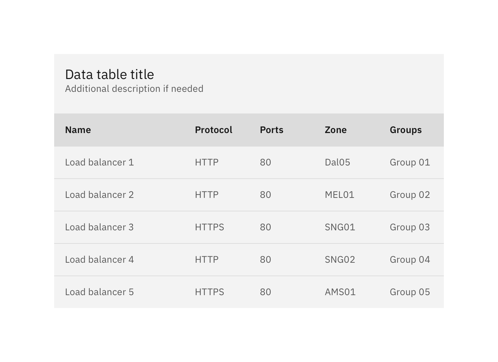
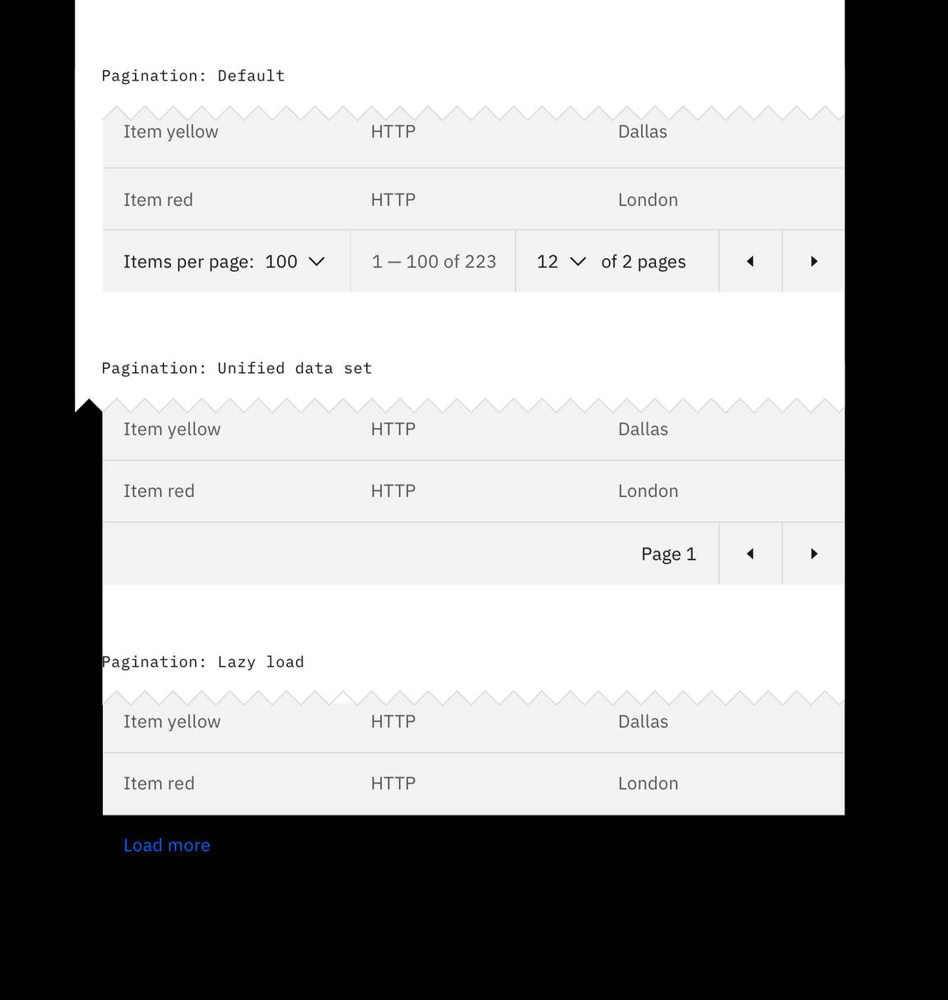
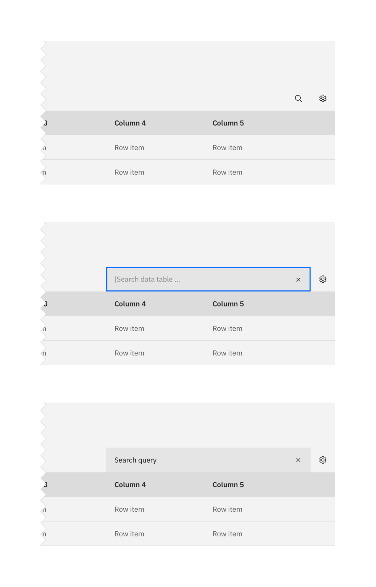
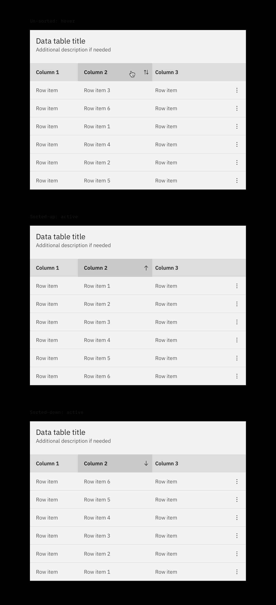
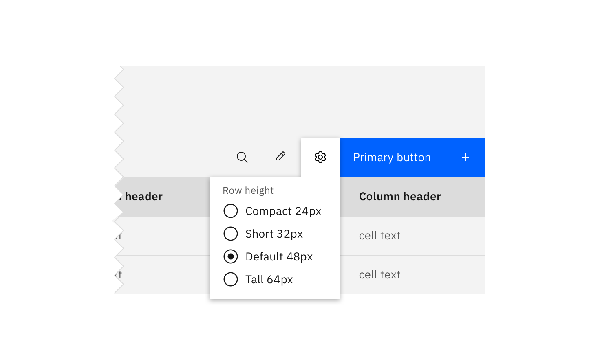
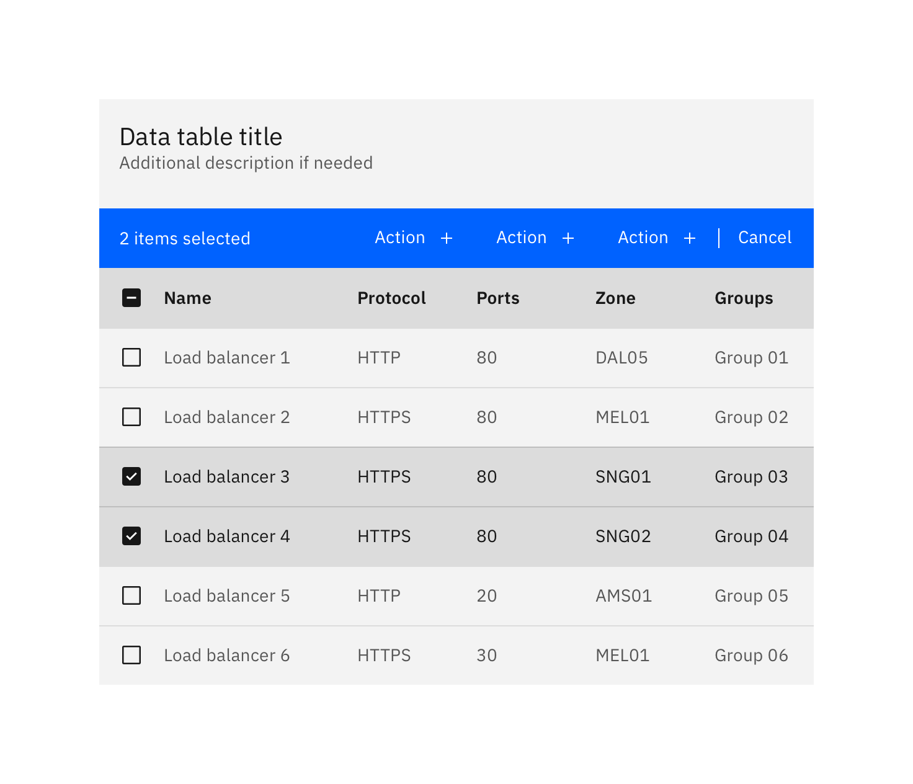
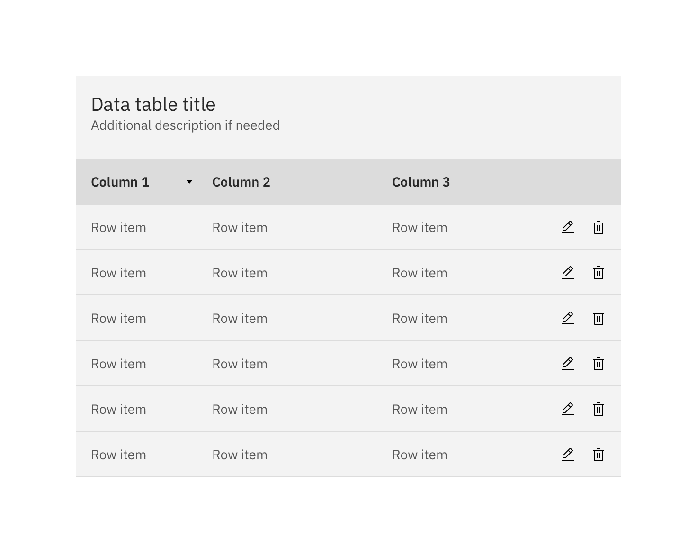
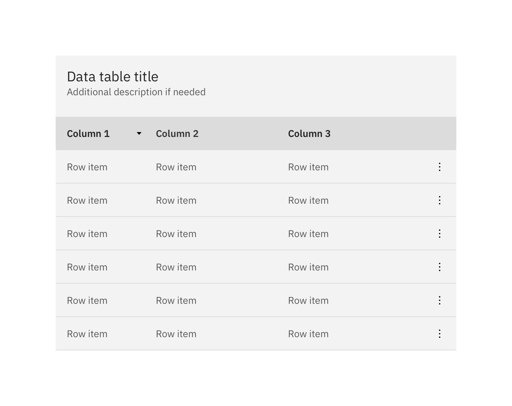
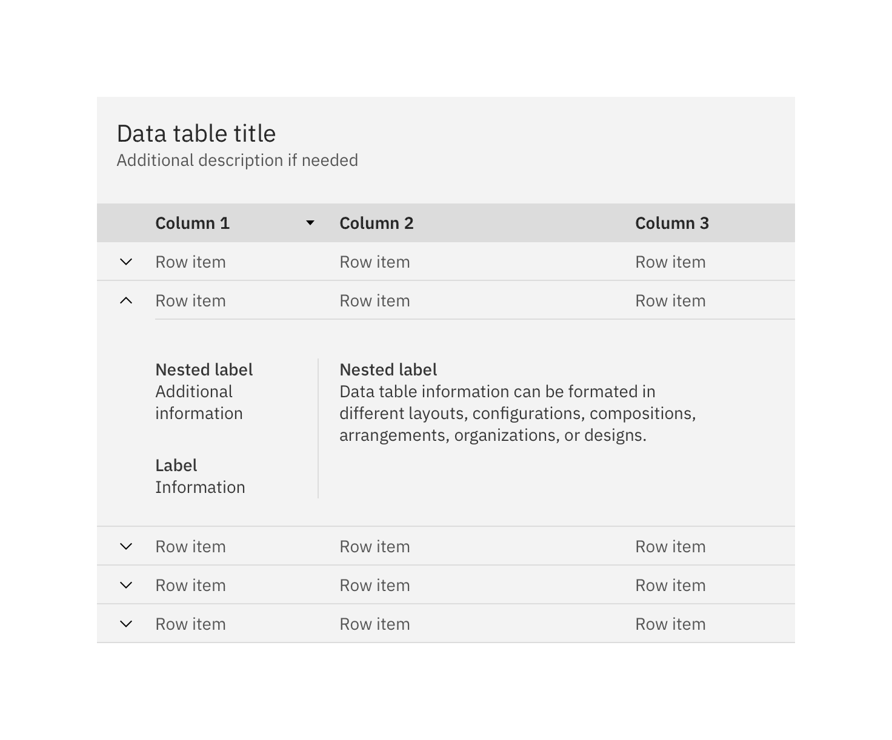
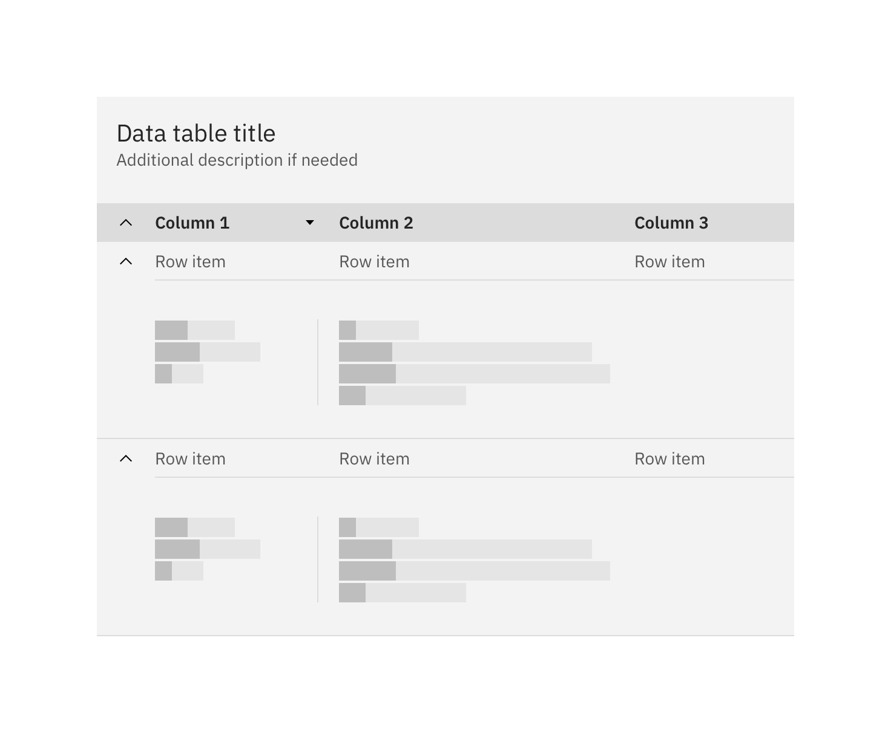

<PageDescription>

Data tables are used to organize and display data efficiently. The data table
component allows for customization with additional functionality, as needed by
your product's users.

</PageDescription>

<AnchorLinks>

<AnchorLink>Basic data table</AnchorLink>
<AnchorLink>Additional functionality</AnchorLink>
<AnchorLink>Feedback</AnchorLink>

</AnchorLinks>

import { rowData, headerData } from '../../../data/components/data-table.js';
import {
  Delete16 as Delete,
  Save16 as Save,
  Download16 as Download,
} from '@carbon/icons-react';

<ComponentDemo
  components={[
    {
      id: 'default-table',
      label: 'Default',
    },
    {
      id: 'with-selection',
      label: 'With selection',
    },
    {
      id: 'with-expansion',
      label: 'With expansion',
    },
    {
      id: 'with-batch-actions',
      label: 'With batch actions',
    },
  ]}
  scope={{ rowData, headerData, React, Delete, Save, Download }}>
  <ComponentVariant
    id="default-table"
    knobs={{ DataTable: ['isSortable'], Table: ['size', 'useZebraStyles'] }}
    links={{
      React:
        'https://react.carbondesignsystem.com/?path=/story/datatable--default',
      Angular:
        'https://angular.carbondesignsystem.com/?path=/story/components-table--basic',
      Vue:
        'http://vue.carbondesignsystem.com/?path=/story/components-cvdatatable--minimal',
      Vanilla: 'https://the-carbon-components.netlify.com/?nav=data-table',
    }}>
    {`<DataTable
    rows={rowData}
    headers={headerData}
    render={({ rows, headers, getHeaderProps }) => (
    <TableContainer title="DataTable">
      <Table>
        <TableHead>
          <TableRow>
            {headers.map(header => (
              <TableHeader {...getHeaderProps({ header })}>
                {header.header}
              </TableHeader>
            ))}
          </TableRow>
        </TableHead>
        <TableBody>
          {rows.map(row => (
            <TableRow key={row.id}>
              {row.cells.map(cell => (
                <TableCell key={cell.id}>{cell.value}</TableCell>
              ))}
            </TableRow>
          ))}
        </TableBody>
      </Table>
    </TableContainer>)}
    />`}
  </ComponentVariant>
  <ComponentVariant
    id="with-selection"
    knobs={{ DataTable: ['isSortable'], Table: ['size', 'useZebraStyles'] }}
    links={{
      React:
        'https://react.carbondesignsystem.com/?path=/story/datatable--with-selection',
      Angular:
        'https://angular.carbondesignsystem.com/?path=/story/components-table--basic',
      Vue:
        'http://vue.carbondesignsystem.com/?path=/story/components-cvdatatable--default',
      Vanilla: 'https://the-carbon-components.netlify.com/?nav=data-table',
    }}>
    {`<DataTable
  rows={rowData}
  headers={headerData}
  render={({ rows, headers, getHeaderProps, getSelectionProps, getRowProps }) => (
  <TableContainer title="DataTable with selection">
    <Table>
      <TableHead>
        <TableRow>
          <TableSelectAll {...getSelectionProps()} />
          {headers.map(header => (
            <TableHeader {...getHeaderProps({ header })}>
              {header.header}
            </TableHeader>
          ))}
        </TableRow>
      </TableHead>
      <TableBody>
        {rows.map(row => (
          <TableRow {...getRowProps({ row })}>
            <TableSelectRow {...getSelectionProps({ row })} />
            {row.cells.map(cell => (
              <TableCell key={cell.id}>{cell.value}</TableCell>
            ))}
          </TableRow>
        ))}
      </TableBody>
    </Table>
  </TableContainer>)}
/>`}
  </ComponentVariant>
  <ComponentVariant
    id="with-expansion"
    knobs={{ DataTable: ['isSortable'] }}
    links={{
      React:
        'https://react.carbondesignsystem.com/?path=/story/datatable--with-expansion',
      Angular:
        'https://angular.carbondesignsystem.com/?path=/story/components-table--with-expansion',
      Vue:
        'http://vue.carbondesignsystem.com/?path=/story/components-cvdatatable--slotted-expanding-data',
      Vanilla: 'https://the-carbon-components.netlify.com/?nav=data-table',
    }}>
    {`<DataTable
  rows={rowData}
  headers={headerData}
  render={({ rows, headers, getHeaderProps, getRowProps, getTableProps }) => (
  <TableContainer title="DataTable with expansion">
    <Table {...getTableProps()}>
      <TableHead>
        <TableRow>
          <TableExpandHeader />
          {headers.map(header => (
            <TableHeader {...getHeaderProps({ header })}>
              {header.header}
            </TableHeader>
          ))}
        </TableRow>
      </TableHead>
      <TableBody>
        {rows.map(row => (
          <React.Fragment key={row.id}>
            <TableExpandRow {...getRowProps({ row })}>
              {row.cells.map(cell => (
                <TableCell key={cell.id}>{cell.value}</TableCell>
              ))}
            </TableExpandRow>
            {row.isExpanded && (
              <TableExpandedRow colSpan={headers.length + 1}>
                
Aux squad rules

              </TableExpandedRow>
            )}
          </React.Fragment>
        ))}
      </TableBody>
    </Table>
  </TableContainer>
)}/>`}
  </ComponentVariant>
  <ComponentVariant
    id="with-batch-actions"
    links={{
      React:
        'https://react.carbondesignsystem.com/?path=/story/datatable--with-batch-actions',
      Angular:
        'https://angular.carbondesignsystem.com/?path=/story/components-table--with-toolbar',
      Vue:
        'http://vue.carbondesignsystem.com/?path=/story/components-cvdatatable--default',
      Vanilla: 'https://the-carbon-components.netlify.com/?nav=data-table',
    }}>
    {`<DataTable
  rows={rowData}
  headers={headerData}
  render={({ rows,
      headers,
      getHeaderProps,
      getRowProps,
      getSelectionProps,
      getBatchActionProps,
      onInputChange,
      selectedRows,}) => (
  <TableContainer title="DataTable with batch actions">
    <TableToolbar>
          <TableBatchActions {...getBatchActionProps()}>
            <TableBatchAction
              tabIndex={getBatchActionProps().shouldShowBatchActions ? 0 : -1}
              renderIcon={Delete}
              onClick={()=>console.log('clicked')}>
              Delete
            </TableBatchAction>
            <TableBatchAction
              tabIndex={getBatchActionProps().shouldShowBatchActions ? 0 : -1}
              renderIcon={Save}
              onClick={()=>console.log('clicked')}>
              Save
            </TableBatchAction>
            <TableBatchAction
              tabIndex={getBatchActionProps().shouldShowBatchActions ? 0 : -1}
              renderIcon={Download}
              onClick={()=>console.log('clicked')}>
              Download
            </TableBatchAction>
          </TableBatchActions>
          <TableToolbarContent>
            <TableToolbarSearch
              tabIndex={getBatchActionProps().shouldShowBatchActions ? -1 : 0}
              onChange={onInputChange}
            />
            <TableToolbarMenu
              tabIndex={getBatchActionProps().shouldShowBatchActions ? -1 : 0}>
              <TableToolbarAction primaryFocus onClick={() => alert('Alert 1')}>
                Action 1
              </TableToolbarAction>
              <TableToolbarAction onClick={() => alert('Alert 2')}>
                Action 2
              </TableToolbarAction>
              <TableToolbarAction onClick={() => alert('Alert 3')}>
                Action 3
              </TableToolbarAction>
            </TableToolbarMenu>
            <Button
              tabIndex={getBatchActionProps().shouldShowBatchActions ? -1 : 0}
              onClick={()=> console.log('clicked')}
              size="small"
              kind="primary">
              Add new
            </Button>
          </TableToolbarContent>
        </TableToolbar>
    <Table>
      <TableHead>
        <TableRow>
          <TableSelectAll {...getSelectionProps()} />
          {headers.map(header => (
            <TableHeader {...getHeaderProps({ header })}>
              {header.header}
            </TableHeader>
          ))}
        </TableRow>
      </TableHead>
      <TableBody>
        {rows.map(row => (
          <TableRow {...getRowProps({ row })}>
            <TableSelectRow {...getSelectionProps({ row })} />
            {row.cells.map(cell => (
              <TableCell key={cell.id}>{cell.value}</TableCell>
            ))}
          </TableRow>
        ))}
      </TableBody>
    </Table>
  </TableContainer>)}
/>`}
  </ComponentVariant>
</ComponentDemo>

## Basic data table

The data table component is designed in a way for additional functionality to be
added on to fit your team's needs.

The basic data table is shipped with a base style, which includes:

- Borders
- No zebra striping, row dividers instead.
- No Pagination, search, table toolbar, or multiselect

<Caption>Basic data table</Caption>

## Additional functionality

The following can be added to the data table to increase its functionality.

### Pagination

Pagination divides table data into separate pages. Pagination is accompanied by
an option that enables the user to change the number of items per page. See the
[pagination](/components/pagination/usage) component for further guidelines.

<Caption>Data table with various Pagination methods</Caption>

### Search

Search returns results based on matches. It is used to locate and display a set
of results. Search functionality within a table follows
[small search](/components/search/usage) conventions. Search should be closed by
default, and live below the table title.

<Caption>Search on data tables.</Caption>

### Sorting

Make data sortable to improve table usability. Sorting controls are located in
the column headers and indicated with an arrow icon.

A sorted data table has three states: unsorted (`arrows`), sorted-up
(`arrow--up`) or sorted-down (`arrow--down`). The icon indicates the current
sorted state and is only shown if sorting is activated. Only the column being
sorted should display an icon, and unsorted icons are only visible on hover. You
can see a demo of table sorting in Carbon’s
[React Storybook](http://react.carbondesignsystem.com/?path=/story/datatable--with-sorting).

<Caption>Sorting on data tables</Caption>

### Table toolbar

The table toolbar is reserved for global table actions such as table settings,
complex filter, export, or editing table data. Additional options can be added
if you have an icon to support that function. Icons should be 16x16 px (glyphs).
We recommend using no more than 5 icons within the table toolbar.

<Caption>Table toolbar: table settings</Caption>

### Multiselect / batch action

Batch actions are functions that may be performed on multiple items within a
table. Once the user selects at least one row from the table, the **batch action
bar** appears at the top of the table, presenting the user with actions they can
take. To exit or escape "batch action mode," the user can cancel out or deselect
the items.

<Caption>Batch action mode on data tables</Caption>

### Inline actions

Inline actions are functions that may be performed on a specific table item.
Each row is accompanied by an [overflow menu](/components/overflow-menu/usage)
that contains actions related specifically to that table row.

<Caption>Overflow menu example</Caption>

When the overflow menu contains less than three options, keep the actions inline
as icon buttons instead. This reduces 1 click and makes available actions
visible to users at a glance.

<Caption>Overflow menu example</Caption>

#### Persistent overflow menu

By default, the overflow menu icon appears on hover or focus. This reduces
visual clutter and drives user interactions with clear context and results.

Data table also supports persistent overflow menu icons. Overflow icons should
only persist if the actions contained within them are core to the function of
your table. Enabling persistent overflow icons may complicate data presentation
and impact general usability.

<Caption>Overflow menu example</Caption>

### Expandable

The expandable data table is useful for presenting large amounts of data in a
small space. Use the expanded section for supplementary information or data that
needs additional query time.

<Caption>Expandable data table with one row expanded</Caption>

By default, the expand-all chevron is not shown. Keeping detailed information in
expanded section saves user loading time by postponing some data queries until
needed. Expanding all rows at once will typically negate this advantages of the
expandable table. If additional load time is expected to display expanded
information, use skeleton states instead of spinners.

<Caption>Expanding all rows with skeleton states</Caption>

## Feedback

Help us improve this component by providing feedback, asking questions, and
leaving any other comments on
[GitHub](https://github.com/carbon-design-system/carbon-website/issues/new?assignees=&labels=feedback&template=feedback.md).
