import A11yStatus from 'components/A11yStatus';

<PageDescription>

Data tables are used to organize and display data efficiently. The data table
component allows for customization with additional functionality, as needed by
your product's users.

</PageDescription>

<InlineNotification>

Data table
[with AI label](https://react.carbondesignsystem.com/?path=/docs/components-datatable-withailabel--overview)
is now stable. This addition changes the visual appearance of the component and
introduces an AI explainability feature when AI is present in the component. See
the [AI presence](/components/data-table/usage/#ai-presence) section for more
details.

</InlineNotification>

<AnchorLinks>

<AnchorLink>Live demo</AnchorLink>
<AnchorLink>Overview</AnchorLink>
<AnchorLink>Formatting</AnchorLink>
<AnchorLink>Content</AnchorLink>
<AnchorLink>Variants</AnchorLink>
<AnchorLink>Universal behaviors</AnchorLink>
<AnchorLink>Modifiers</AnchorLink>
<AnchorLink>AI presence</AnchorLink>
<AnchorLink>Related</AnchorLink>
<AnchorLink>Feedback</AnchorLink>

</AnchorLinks>

## Live demo

<StorybookDemo
  themeSelector
  url="https://react.carbondesignsystem.com"
  wide
  tall
  variants={[
    {
      label: 'Basic',
      variant: 'components-datatable-basic--default',
    },
    {
      label: 'Batch Actions',
      variant: 'components-datatable-batch-actions--default',
    },
    {
      label: 'Dynamic',
      variant: 'components-datatable-dynamic--default',
    },
    {
      label: 'Expansion',
      variant: 'components-datatable-expansion--default',
    },
    {
      label: 'Batch Expansion',
      variant: 'components-datatable-expansion--batch-expansion',
    },
    {
      label: 'Filtering',
      variant: 'components-datatable-filtering--default',
    },
    {
      label: 'Selection',
      variant: 'components-datatable-selection--default',
    },
    {
      label: 'With Radio Selection',
      variant: 'components-datatable-selection--with-radio-selection',
    },
    {
      label: 'With Selection And Sorting',
      variant: 'components-datatable-selection--with-selection-and-sorting',
    },
    {
      label: 'Sorting',
      variant: 'components-datatable-sorting--default',
    },
    {
      label: 'Toolbar',
      variant: 'components-datatable-toolbar--default',
    },
    {
      label: 'Persistent Toolbar',
      variant: 'components-datatable-toolbar--persistent-toolbar',
    },
    {
      label: 'Small Persistent Toolbar',
      variant: 'components-datatable-toolbar--small-persistent-toolbar',
    },
    {
      label: 'With Overflow Menu',
      variant: 'components-datatable-toolbar--with-overflow-menu',
    },
    {
      label: 'AI Label With Expansion',
      variant: 'components-datatable-withailabel--ai-label-with-expansion',
    },
    {
      label: 'AI Label with Radio Selection',
      variant:
        'components-datatable-withailabel--ai-label-with-radio-selection',
    },
    {
      label: 'AI Label with Selection',
      variant: 'components-datatable-withailabel--ai-label-with-selection',
    },
    {
      label: 'AI Label with Selection and Expansion',
      variant:
        'components-datatable-withailabel--ai-label-with-selection-and-expansion',
    },
    {
      label: 'Column AI Label Sort',
      variant: 'components-datatable-withailabel--column-ai-label-sort',
    },
    {
      label: 'Column AI Label with Selection and  Expansion',
      variant:
        'components-datatable-withailabel--column-ai-label-with-selection-and-expansion',
    },
  ]}
/>

<A11yStatus layout="cards" components="Data table" />

## Overview

The data table's features are ideal for organizing and displaying data in a UI.
The column headers can sort data in ascending or descending order, rows can be
expanded to progressively disclose information, and single or batch actions can
be taken on rows.

The data table toolbar gives a location for primary buttons, search, filtering,
table display settings, and other utilities.

### When to use

- To organize and display data.
- If your user must navigate to a specific piece of data to complete a task.
- Displaying all of a user's resources.

### When not to use

- When a more complex display of the data or interactions are required.
- As a replacement for a spreadsheet application.

### Variants

| Variant          | Purpose                                                                                                                                                                                                                                                     |
| ---------------- | ----------------------------------------------------------------------------------------------------------------------------------------------------------------------------------------------------------------------------------------------------------- |
| _Default_        | The basic data table has only the header and table element rows. It is available in five row sizes.                                                                                                                                                         |
| _With selection_ | The selection variant enables users to select individual rows in a data table. Selection options include a single-select radio button option and a multi-select checkbox option. Users can perform a single action or batch actions against selected items. |
| _With expansion_ | The expandable variant helps present large amounts of data in a small space. Users can expand and collapse row panels to reveal and hide additional information.                                                                                            |

## Formatting

### Anatomy

<Row>
<Column colLg={12}>

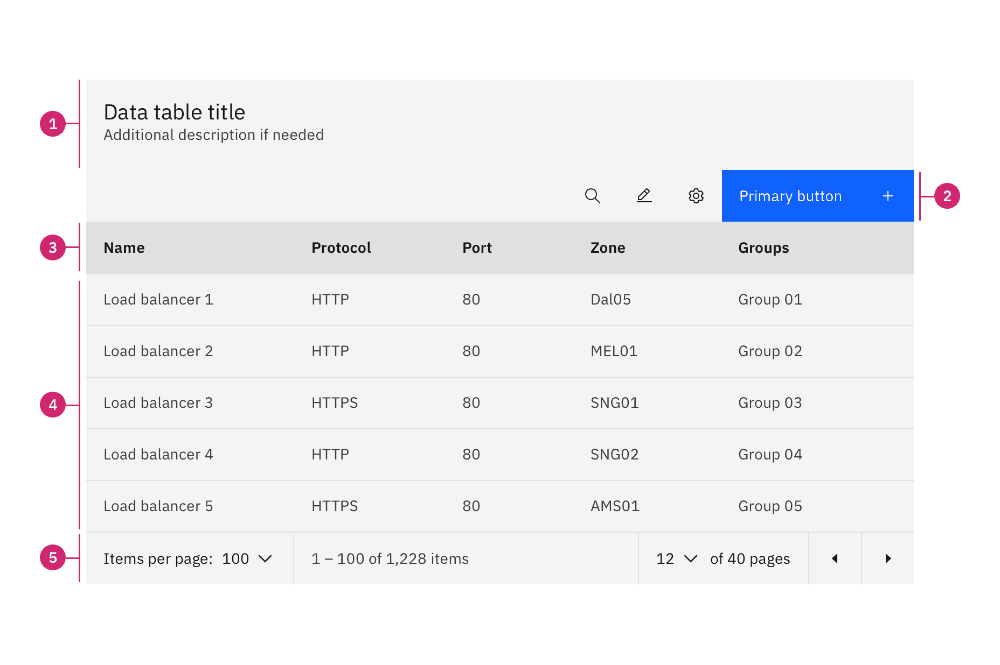

</Column>
</Row>

1. **Title and description**: contains the data table title and an optional
   description.
2. **Toolbar**: global data table controls including search and table settings.
3. **Column header**: title for the row header with the optional sorting
   behavior.
4. **Table row**: can be configured to show different types of data. Rows can be
   selectable, expandable, and modified to show alternating zebra stripe
   background colors.
5. **Pagination table bar**: an optional component that lets a user navigate
   data as pages when the amount of data it too large to be shown at once.

### Sizing

The data table is available in five different row sizes: extra large, large,
medium, small, extra small.

<Row>
<Column colLg={8}>

</Column>
</Row>

The column header row `.cds--data-table thead` should always match the row size
of the table. Extra large row heights are only recommended if your data is
expected to have 2 lines of content in a single row.

<DoDontRow>
<DoDont
type="do"
colMd={4} colLg={4}
caption="Do use the same row height for the table and header rows.">

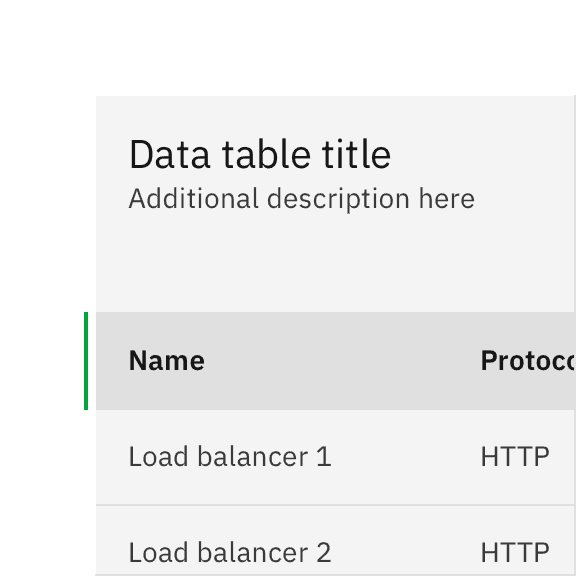

</DoDont>
<DoDont
colMd={4} colLg={4}
type="dont"
caption="Don’t mix row heights for the table and header rows.">

</DoDont>
</DoDontRow>

Two heights are available to be paired with the row heights of the data table.
The tall toolbar should only be paired with the large and extra large row
heights and the small toolbar should only be used with the small and extra small
row heights.

<Row>
<Column colLg={12}>

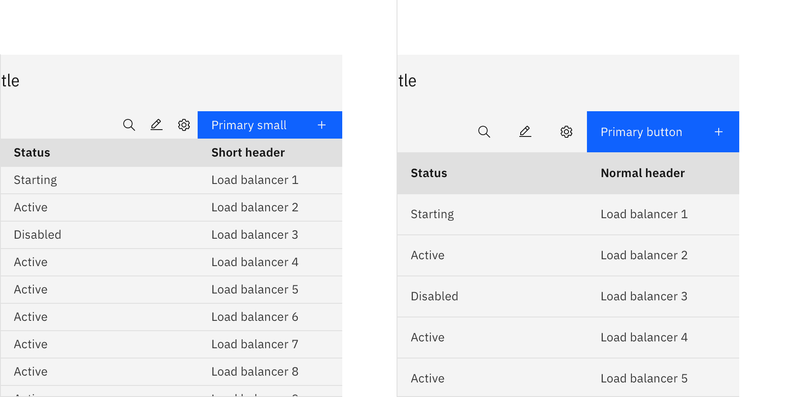

<Caption>
  A small toolbar on a short data table and a tall toolbar on a normal data
  table{' '}
</Caption>

</Column>
</Row>

### Placement

Data tables should be placed in a page's main content area and given plenty of
space to display data without truncation. Avoid placing data tables inside data
tables or smaller containers where the information can feel cramped or needs
truncation.

The data table can be placed on the grid following the three different
[gutter modes](/elements/2x-grid/usage/#gutter-modes) outlined in the 2x grid
guidelines. Although, the data table can share horizontal space with other
components and content, consider giving your data table the most width on the
page to help your user view dense data.

These three examples show the data table on the wide (default), narrow, and
condensed gutter modes. Note the different type alignments and gutter sizes.

#### Wide gutter mode

The wide gutter mode is the default and gives the most breathing room between
the data table and the other components or content.

<Row>
<Column colLg={12}>

<Caption>Data table on a wide (default) grid</Caption>

</Column>
</Row>

#### Narrow gutter mode

Using the data table on a narrow grid will hang the component into the gutter
and create a desirable type alignment between the the data table's title and
other type on the page.

<Row>
<Column colLg={12}>

<Caption>Data table on a narrow grid</Caption>

</Column>
</Row>

#### Condensed gutter mode

The data table can be used on a condensed grid, but care should be taken to
avoid any unintentional relationships with other UI elements. Use a hybrid grid
or a dissimilar background color to avoid the components blending in to each
other.

<Row>
<Column colLg={12}>

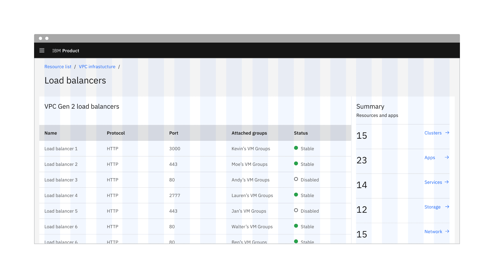

<Caption>Data table on a condensed grid</Caption>

</Column>
</Row>

## Content

### Main elements

#### Data table title and description

- The table title should make it clear to the user what this the data has in
  common and what purpose it serves in the UI.
- A description can be added under the title to provide more information about
  the data or its source.
- A data table's title and description should use
  [sentence-case capitalization.](/guidelines/content/writing-style#use-sentence-case-capitalization)

#### Column titles

- Column titles should stick to one or two words that describe the data in that
  column.
- In cases where a column title is too long, wrap the text to two lines and then
  truncate the rest of the text. The full text should be shown in a tooltip on
  hover.
- Column titles should use
  [sentence-case capitalization.](/guidelines/content/writing-style#use-sentence-case-capitalization)

#### Primary button

- A data table using a primary action should follow the guidance for
  [primary button](/components/button/usage#labels) usage and
  [action labels.](/guidelines/content/action-labels)

For further content guidance, see Carbon's
[content guidelines](/guidelines/content/overview).

## Variants

### Expandable

The expandable data table helps present large amounts of data in a small space.
Use the expanded section for supplementary information or data that needs
additional query time. When the content in the expanded area feels cramped,
consider taking the user to a dedicated page, side panel, or data table to view
the information and complete tasks.

<Row>
<Column colLg={12}>

</Column>
</Row>

#### Batch expansion

When appropriate, a batch expansion feature can be added to the table column
header to allow the user to open all collapsed sections simultaneously. However,
the expand-all chevron is not shown by default in the expandable data table
variant. Keeping detailed information in the expanded section saves user loading
time by postponing some data queries until needed. Expanding all rows at once
will typically negate this advantage of the expandable table.

<Row>
<Column colLg={12}>

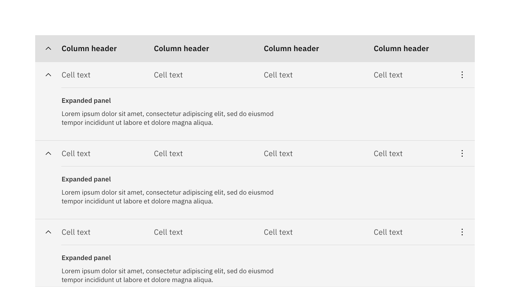

</Column>
</Row>

### Selectable

By default, the selectable variant allows users to select more than one row in a
data table simultaneously. To select a row, the user must select the checkbox
associated with the row. The user can select all rows at once by selecting the
checkbox in the column header. Checkboxes in the rows have only two states,
checked and unchecked. However, the check all checkbox in the column header has
three states, check, unchecked, and indeterminate.

Actions applied to the chosen selected items are found in the default
[table toolbar](/components/data-table/usage/#table-toolbar) or
[batch action mode](/components/data-table/usage/#batch-actions).

<Row>
<Column colLg={12}>

</Column>
</Row>

#### Radio selection

The data table also supports a single-select radio button control, limiting the
user to selecting only one row at a time. The radio button is placed in the
first column on the left side. Single actions applied to the chosen radio item
are often placed on the right side of the table toolbar area. They can manifest
as primary, ghost, or icon-only buttons.

<Row>
<Column colLg={12}>

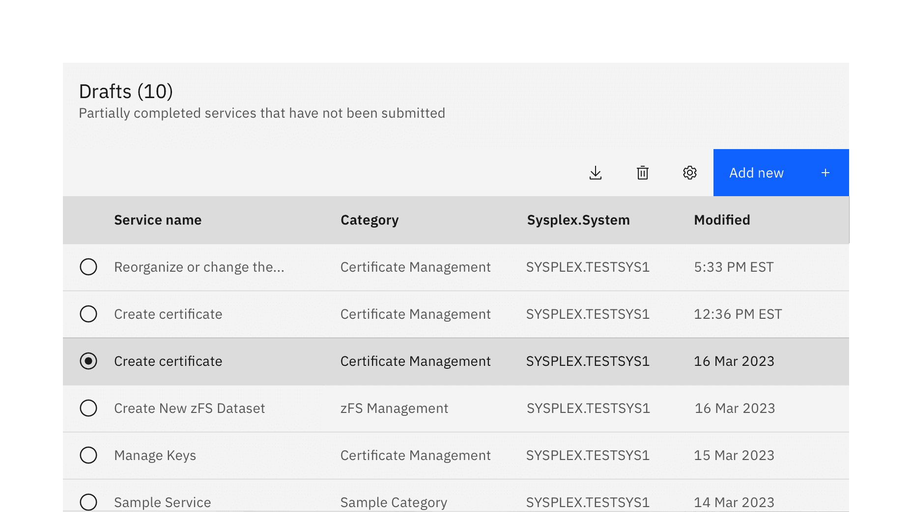

</Column>
</Row>

### Expandable + selectable

Data tables can be configured to have both expandable and selectable features.
The expandable icon always appears first and to the left of the selection icon.

<Row>
<Column colLg={12}>

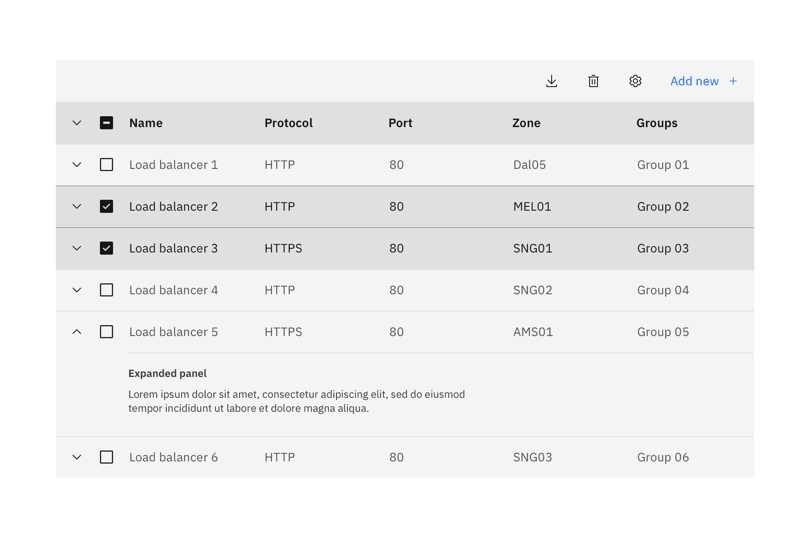

</Column>
</Row>

## Universal behaviors

### Interactions

The data table’s toolbar and rows follow interaction conventions that are found
in other Carbon components. Buttons, checkboxes, radio buttons, overflow menus,
search, and expanding elements are used in the data table, and all behave
according to their guidelines.

#### Mouse

Users can trigger an action or function in the table by clicking the associated
button or component. Each action or function has its own distinct click target.
See the [Accessibility](/components/data-table/accessibility/) tab for more
information.

<Row>
<Column colLg={12}>

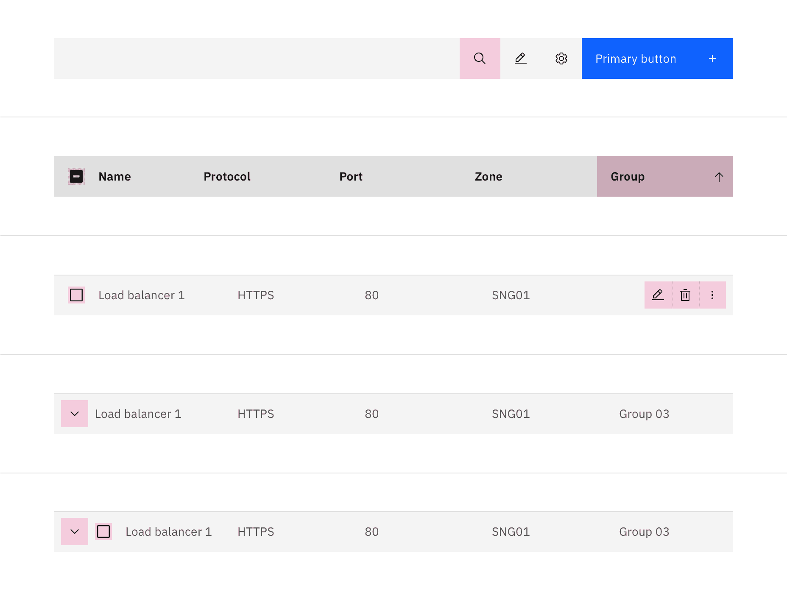

<Caption>Highlighted target areas for data table mouse interactions</Caption>

</Column>
</Row>

#### Hover

The data table’s row hover state should always be enabled as it can help the
user visually scan the columns of data in a row even if the row is not
interactive.

<Row>
<Column colLg={8}>

</Column>
</Row>

### Pagination

Pagination divides a data table into separate pages. Simple pagination indicates
the current page in view and offers controls to go to the previous or next page.
Advanced pagination is accompanied by an option that enables the user to change
the number of items per page and to jump to a specific page number. The
pagination component is always placed at the bottom of the data table. For more
information, see the [pagination](/components/pagination/usage) component.

<Row>
<Column colLg={12}>

<Caption>Simple (top) and advanced (bottom) pagination configurations</Caption>

</Column>
</Row>

### Table toolbar

The table toolbar is reserved for global table actions such as table settings,
complex filters, exporting, or editing table data. Actions in the toolbar can
use primary, ghost, or icon-only buttons. Include up to five actions within the
table toolbar. More actions can be made available through an overflow menu,
combo button, or similar components.

<Row>
<Column colLg={8}>

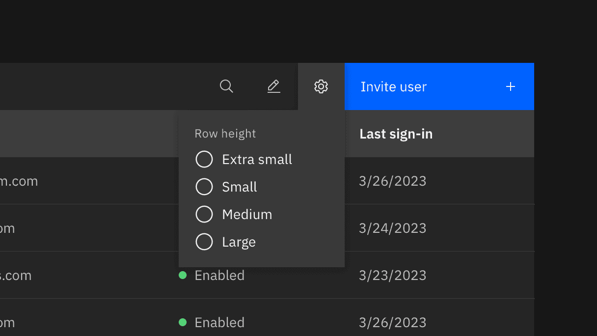

</Column>
</Row>

### Searching

#### Collapsed search

A search field can be triggered through an icon button in the data table
toolbar. By default search follows the
[active search](/patterns/search-pattern/#active-search) pattern. The search is
closed by default, and placed below the table title.

<Row>

<Column colLg={8}>
<GifPlayer color='dark'>

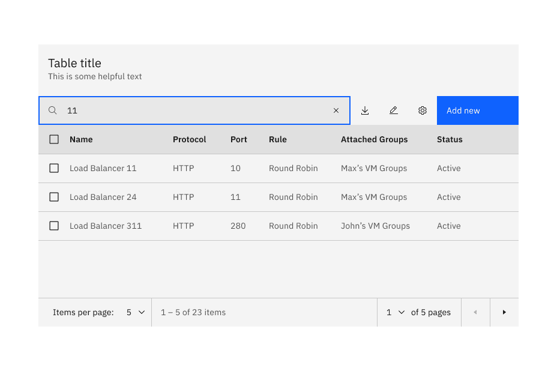

</GifPlayer>
</Column>
</Row>

#### Open search

The search field can appear always open on a data table. The field is placed on
the left side of the table under the table title and stretches until it meets
the actions on the right.

<Row>
<Column colLg={8}>

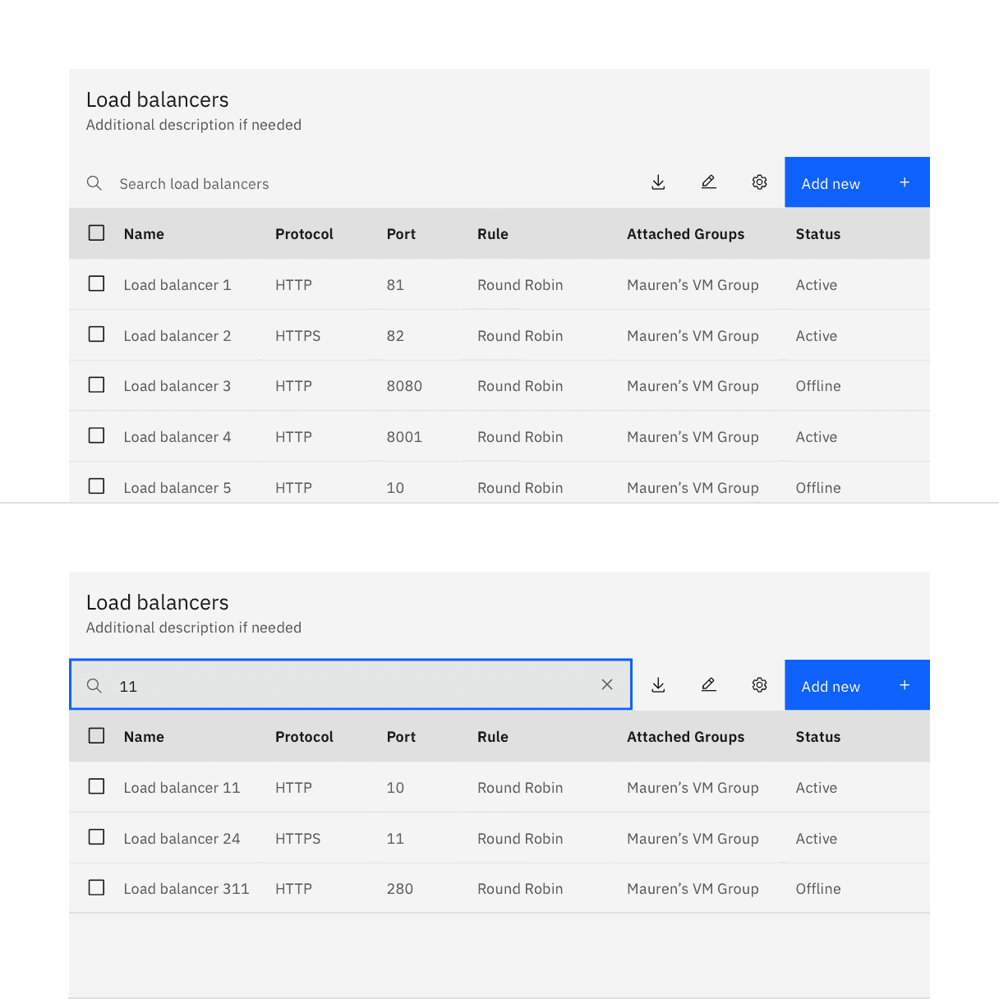

</Column>
</Row>

### Sorting

Columns can be sorted in ascending or descending order. Sorting controls are
located in the column headers and indicated with an arrow icon on hover and when
a column is sorted.

A sorted data table has three states: unsorted (`arrows`), sorted-up
(`arrow--up`) or sorted-down (`arrow--down`). The icon indicates the current
sorted state and is shown only when the sorting is activated. Only the sorted
column displays an icon, and unsorted icons are only visible on hover. You can
see a demo of sorting in
Carbon’s [React Storybook](https://react.carbondesignsystem.com/?path=/story/components-datatable-sorting--default).

<Row>
<Column colLg={12}>

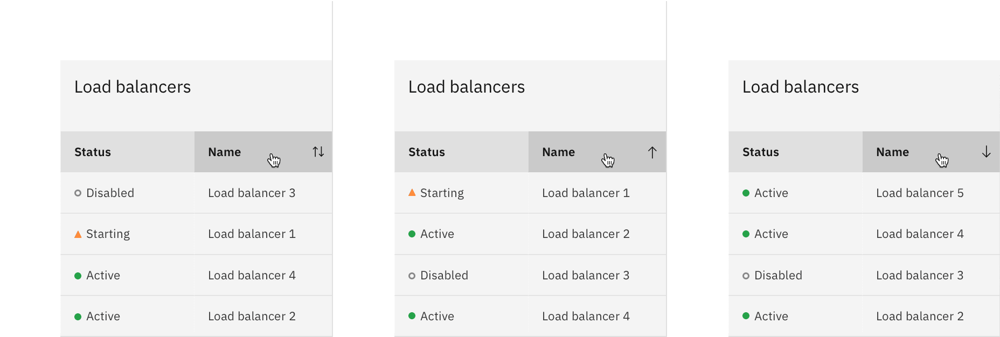

</Column>
</Row>

### Batch actions

Users can perform batch actions on one or more items within a table. Once an
item from the table is selected, the batch action bar appears at the top of the
table, presenting a set of possible actions to apply to all select items. This
feature can increase user efficiency compared to the effort of repetitively
performing the same inline action across multiple table items. When batch mode
is active, single action icons and overflow menus on the row should be disabled.

To exit the batch action mode, the user can select the cancel button on the far
right of the bar or deselect all items.

<Row>
<Column colLg={12}>

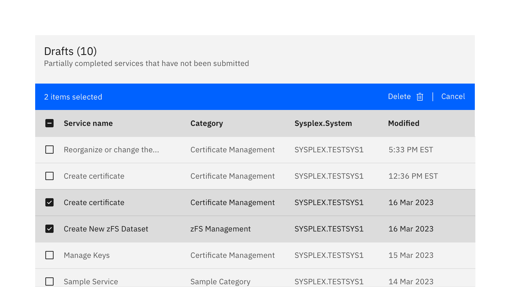

</Column>
</Row>

### Inline actions

Inline actions are functions that might be performed on a specific table row.
Each row is accompanied by
an [overflow menu](https://www.carbondesignsystem.com/components/overflow-menu/code) that
contains actions that are related specifically to that row.

When the overflow menu contains fewer than three options, keep the actions
inline as icon buttons instead. This approach reduces a click and makes
available actions visible at a glance.

<Row>
<Column colLg={8}>

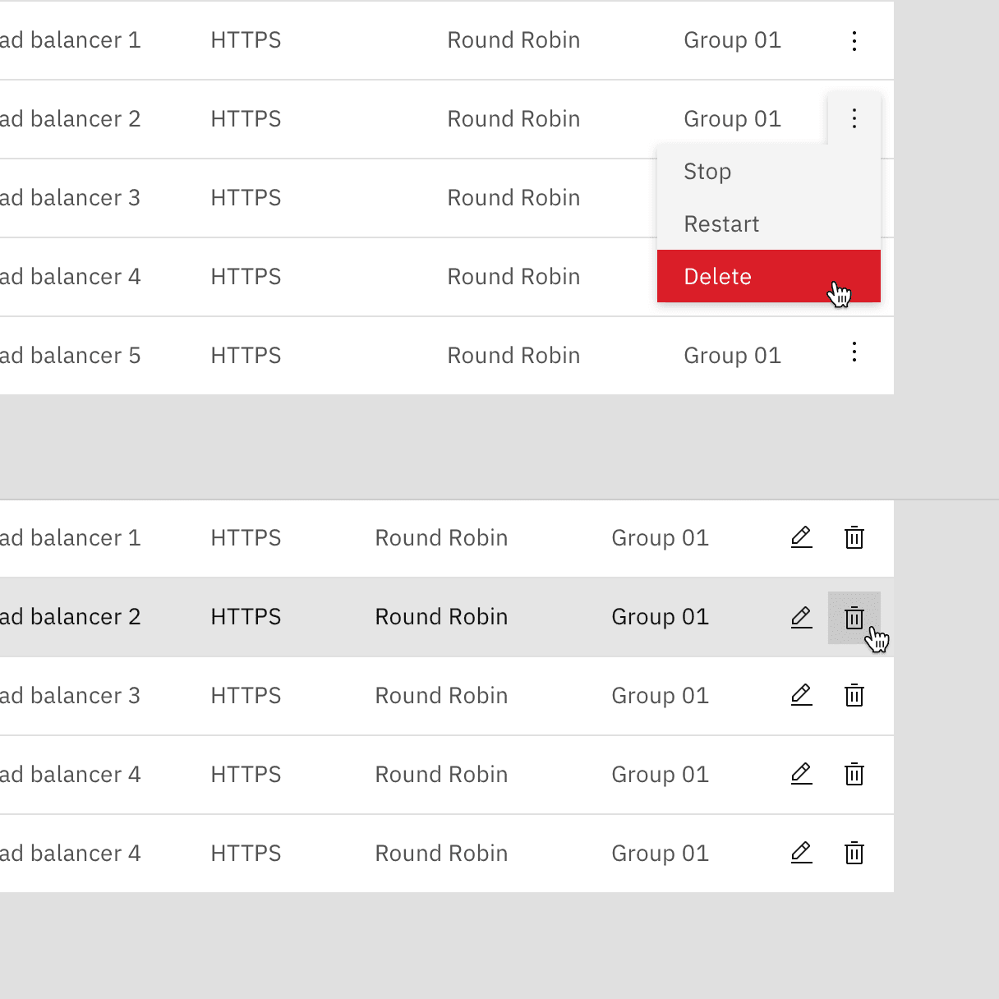

</Column>
</Row>

### Overflow menu

By default, the overflow menu icons are persistent on each row. Having the
overflow menus always visible signals to the user actions can be taken on the
table rows. Alternatively, a product team may use the `overflowMenuOnHover` prop
to only show the overflow menu on hover and focus to reduce the visual clutter
of an overflow menu on every row.

For mobile and touch devices the data table will detect if the user agent
supports hover-over and persist the overflow menus even if the
`overflowMenuOnHover` prop is enabled.

<Row>
<Column colLg={8}>

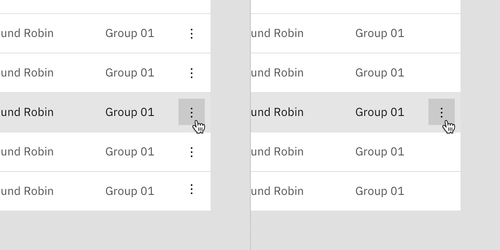

<Caption>Persistent overflow (left), on hover (right).</Caption>

</Column>
</Row>

### Loading

If extra load time is expected to display information, use skeleton states
instead of spinners.

<Row>
<Column colLg={12}>

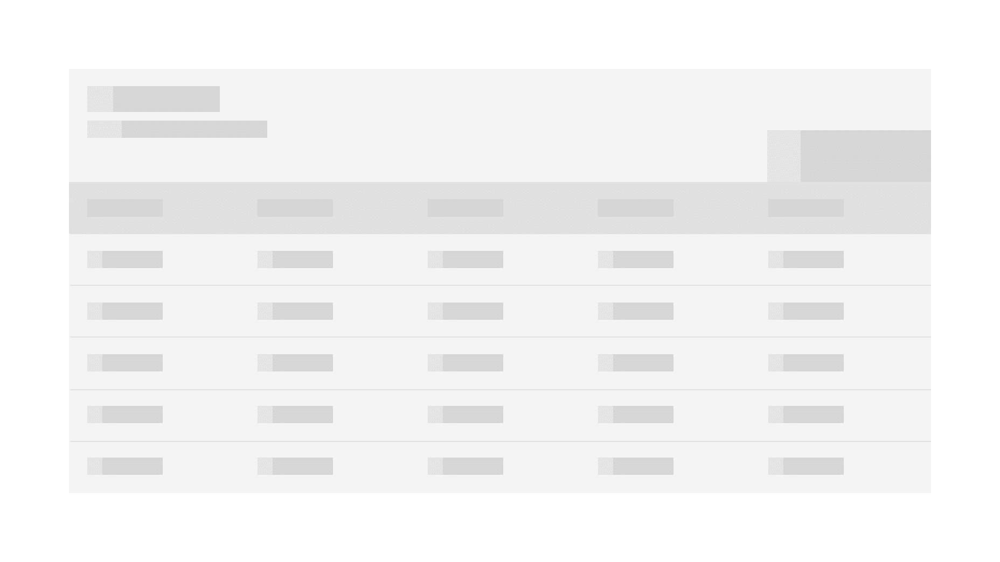

<Caption>Expanding all rows with skeleton states</Caption>

</Column>
</Row>

## Modifiers

### Alternating row color

The data table can use a zebra stripes modifier to style the table rows with
alternating colors to make scanning horizontal information easier for the user.

<Row>
<Column colLg={8}>

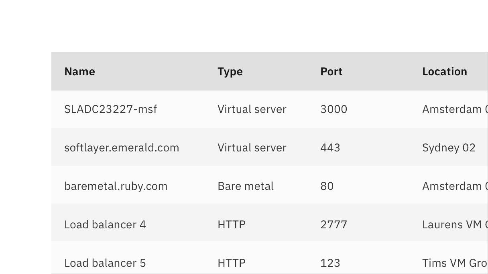

</Column>
</Row>

## AI presence

Data table has a modification that takes on the AI visual styling when AI is
present in the table. The AI variants of a data table function the same as the
normal variants except for the addition of the AI label, which is both a visual
indicator and the trigger for the explainability popover. Where the AI label
goes inside of a data table depends on which parts of the data are AI generated.

For more information on designing for AI, see the
[Carbon for AI](/guidelines/carbon-for-ai/) guidelines.

#### Entire table

When the entire data table is styled for AI, it indicates to the user that AI is
present in all aspects of the data table.

<Row>
<Column colLg={12}>

<Caption>Example of a data table generated by AI.</Caption>

</Column>
</Row>

#### Individual cells

If only some data table cells have content generated by AI, then those cells
have an in-line AI label next to them. These cells do not get any AI layering.

<Row>
<Column colLg={12}>

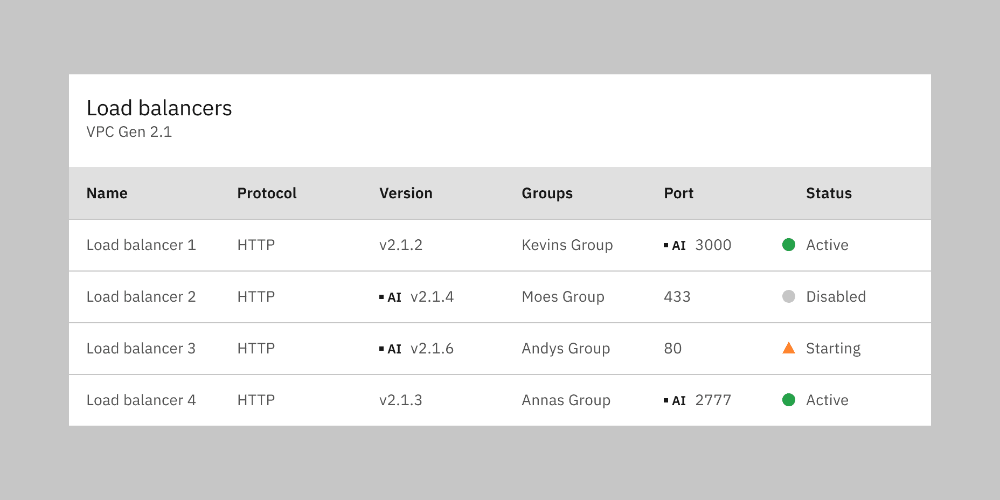

<Caption>
  Example of a data table cell generated by AI represented by the in-line AI
  label.
</Caption>

</Column>
</Row>

#### Rows and columns

If content belonging to only a row or column of the data table is generated by
AI, then only those respective row/s and column/s should receive the AI presence
styling along with the AI label, not the entire data table.

<Row>
<Column colLg={12}>

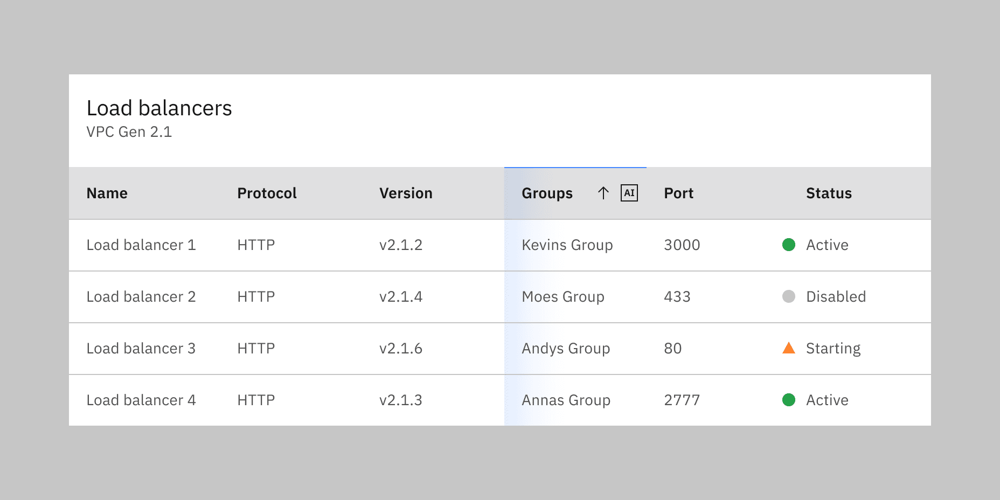

<Caption>Example of a data table column generated by AI.</Caption>

</Column>
</Row>

<Row>
<Column colLg={12}>

<Tabs>

<Tab label="Light mode">

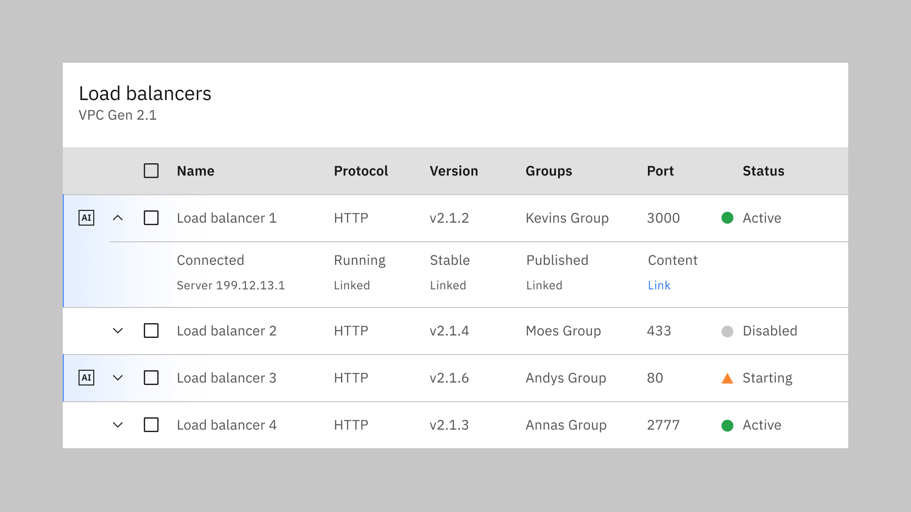

</Tab>

<Tab label="Dark mode">

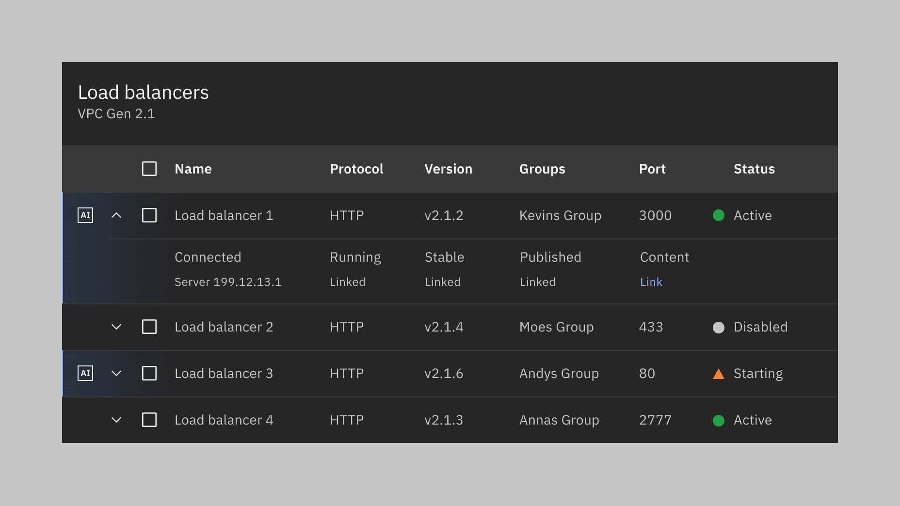

</Tab>

</Tabs>

</Column>
</Row>

## Related

### Community extensions

#### Carbon for IBM Product

_This content is accessible to IBMers only._

- [Data table extensions](https://pages.github.ibm.com/cdai-design/pal/components/data-table/overview)
- [Data table on Cloud](https://pages.github.ibm.com/cdai-design/cloud-pal/components/data-table/usage/)
- [Data spreadsheet](https://pages.github.ibm.com/cdai-design/pal/components/data-spreadsheet/usage/)

### Similar components

The following components are additional ways to organize and navigate data.

- [Accordion](/components/accordion/code/)

- [List](/components/list/code/)

- [Pagination](/components/pagination/code/)

- [Structured list](/components/structured-list/code/)

## Feedback

Help us improve this pattern by providing feedback, asking questions, and
leaving any other comments on
[GitHub](https://github.com/carbon-design-system/carbon-website/issues/new?assignees=&labels=feedback&template=feedback.md).
