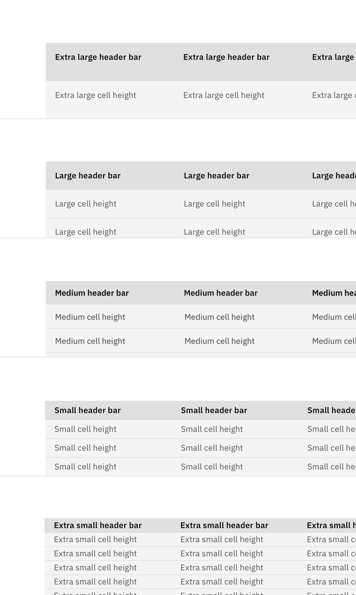
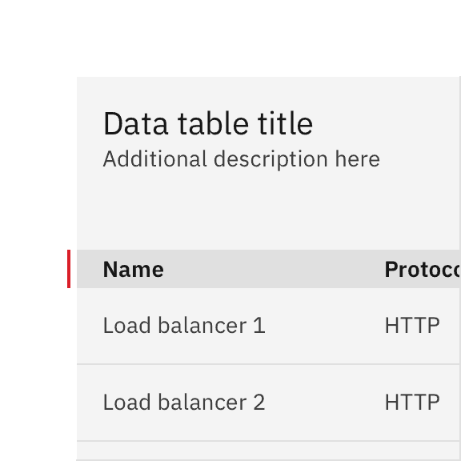
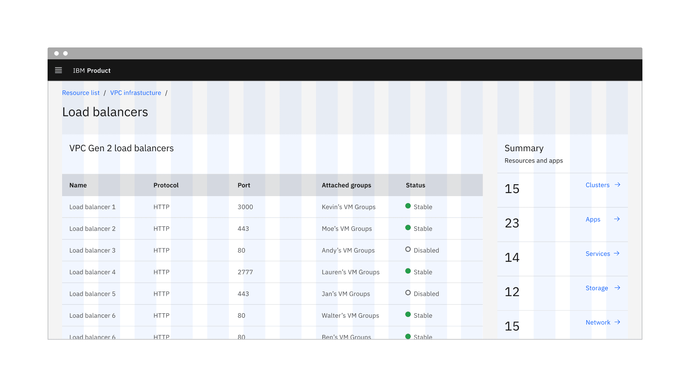
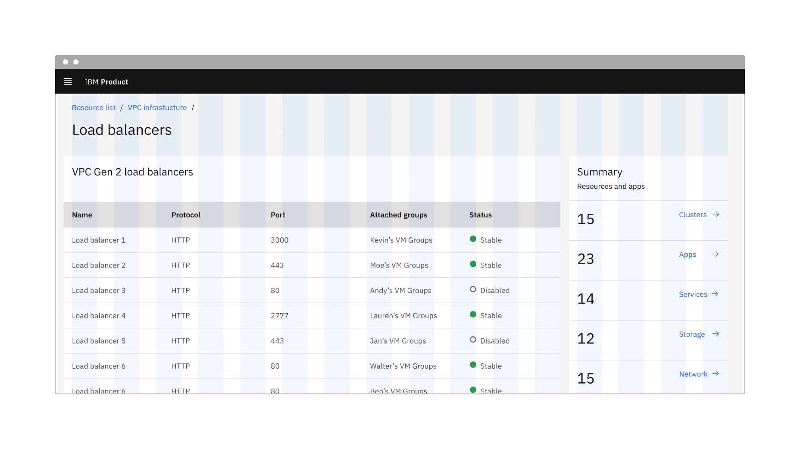
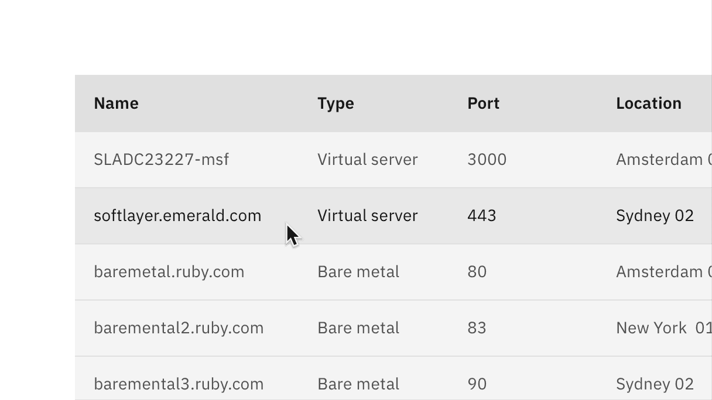
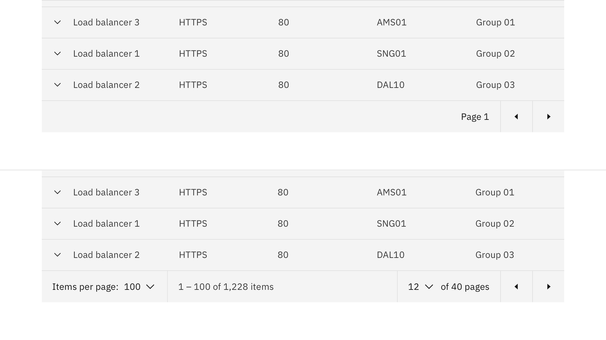
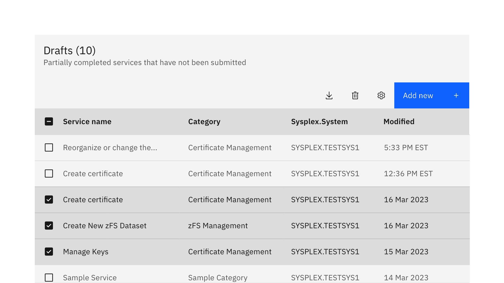
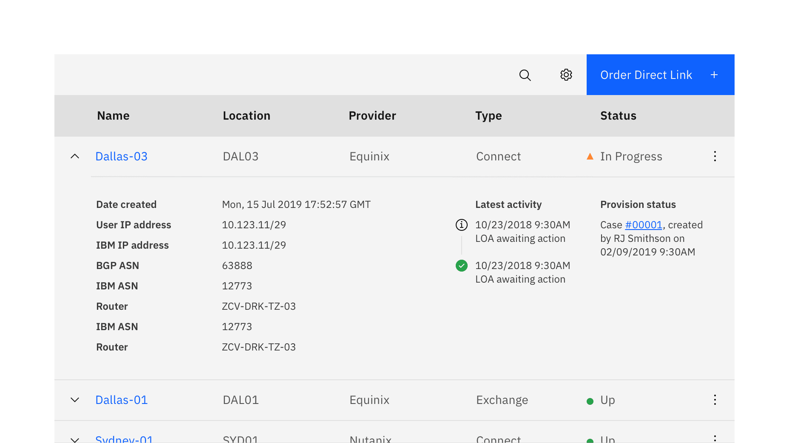

<PageDescription>

Data tables are used to organize and display data efficiently. The data table
component allows for customization with additional functionality, as needed by
your product's users.

</PageDescription>

<AnchorLinks>

<AnchorLink>Overview</AnchorLink>
<AnchorLink>Live demo</AnchorLink>
<AnchorLink>Formatting</AnchorLink>
<AnchorLink>Content</AnchorLink>
<AnchorLink>Behaviors</AnchorLink>
<AnchorLink>Modifiers</AnchorLink>
<AnchorLink>Related</AnchorLink>
<AnchorLink>Feedback</AnchorLink>

</AnchorLinks>

## Overview

The data table's features are ideal for organizing and displaying data in a UI.
The column headers can sort data in ascending or descending order, rows can be
expanded to progressively disclose information, and single or batch actions can
be taken on rows.

The data table toolbar gives a location for primary buttons, search, filtering,
table display settings, and other utilities.

### When to use

- To organize and display data.
- If your user must navigate to a specific piece of data to complete a task.
- Displaying all of a user's resources.

### When not to use

- When a more complex display of the data or interactions are required.
- As a replacement for a spreadsheet application.

### Variants

| Variant          | Purpose                                                                                                                                                                                                                                |
| ---------------- | -------------------------------------------------------------------------------------------------------------------------------------------------------------------------------------------------------------------------------------- |
| _Default_        | The default data table comes with a base style with only the title, header, and table elements. rows.                                                                                                                                  |
| _With selection_ | Batch actions are functions that may be performed on multiple items within a table. This variant of table enables the user to select individual rows and apply an action. A batch action toolbar appears when table rows are selected. |
| _With expansion_ | The expandable data table is useful for presenting large amounts of data in a small space. Rows are collapsed and can be expanded to reveal extra information.                                                                         |

## Live demo

import { rowData, headerData } from '../../../data/components/data-table.js';
import {
  Delete16 as Delete,
  Save16 as Save,
  Download16 as Download,
} from '@carbon/icons-react';

<ComponentDemo
  components={[
    {
      id: 'default-table',
      label: 'Default',
    },
    {
      id: 'with-selection',
      label: 'With selection',
    },
    {
      id: 'with-expansion',
      label: 'With expansion',
    },
    {
      id: 'with-batch-actions',
      label: 'With batch actions',
    },
  ]}
  scope={{ rowData, headerData, React, Delete, Save, Download }}>
  <ComponentVariant
    id="default-table"
    knobs={{ DataTable: ['isSortable'], Table: ['size', 'useZebraStyles'] }}
    links={{
      React:
        'https://react.carbondesignsystem.com/?path=/story/datatable--default',
      Angular:
        'https://angular.carbondesignsystem.com/?path=/story/components-table--basic',
      Vue:
        'http://vue.carbondesignsystem.com/?path=/story/components-cvdatatable--minimal',
      Vanilla: 'https://the-carbon-components.netlify.com/?nav=data-table',
    }}>
    {`<DataTable rows={rowData} headers={headerData}>
  {({ rows, headers, getHeaderProps, getTableProps }) => (
    <TableContainer title="DataTable">
      <Table {...getTableProps()}>
        <TableHead>
          <TableRow>
            {headers.map((header) => (
              <TableHeader {...getHeaderProps({ header })}>
                {header.header}
              </TableHeader>
            ))}
          </TableRow>
        </TableHead>
        <TableBody>
          {rows.map((row) => (
            <TableRow key={row.id}>
              {row.cells.map((cell) => (
                <TableCell key={cell.id}>{cell.value}</TableCell>
              ))}
            </TableRow>
          ))}
        </TableBody>
      </Table>
    </TableContainer>
  )}
</DataTable>`}
  </ComponentVariant>
  <ComponentVariant
    id="with-selection"
    knobs={{ DataTable: ['isSortable'], Table: ['size', 'useZebraStyles'] }}
    links={{
      React:
        'https://react.carbondesignsystem.com/?path=/story/datatable--with-selection',
      Angular:
        'https://angular.carbondesignsystem.com/?path=/story/components-table--basic',
      Vue:
        'http://vue.carbondesignsystem.com/?path=/story/components-cvdatatable--default',
      Vanilla: 'https://the-carbon-components.netlify.com/?nav=data-table',
    }}>
    {`<DataTable rows={rowData} headers={headerData}>
  {({
    rows,
    headers,
    getHeaderProps,
    getSelectionProps,
    getRowProps,
    getTableProps,
  }) => (
    <TableContainer title="DataTable with selection">
      <Table {...getTableProps()}>
        <TableHead>
          <TableRow>
            <TableSelectAll {...getSelectionProps()} />
            {headers.map((header) => (
              <TableHeader {...getHeaderProps({ header })}>
                {header.header}
              </TableHeader>
            ))}
          </TableRow>
        </TableHead>
        <TableBody>
          {rows.map((row) => (
            <TableRow {...getRowProps({ row })}>
              <TableSelectRow {...getSelectionProps({ row })} />
              {row.cells.map((cell) => (
                <TableCell key={cell.id}>{cell.value}</TableCell>
              ))}
            </TableRow>
          ))}
        </TableBody>
      </Table>
    </TableContainer>
  )}
</DataTable>`}
  </ComponentVariant>
  <ComponentVariant
    id="with-expansion"
    knobs={{ DataTable: ['isSortable'] }}
    links={{
      React:
        'https://react.carbondesignsystem.com/?path=/story/datatable--with-expansion',
      Angular:
        'https://angular.carbondesignsystem.com/?path=/story/components-table--with-expansion',
      Vue:
        'http://vue.carbondesignsystem.com/?path=/story/components-cvdatatable--slotted-expanding-data',
      Vanilla: 'https://the-carbon-components.netlify.com/?nav=data-table',
    }}>
    {`<DataTable
  rows={rowData}
  headers={headerData}>
    {({ rows, headers, getHeaderProps, getRowProps, getTableProps }) => (
      <TableContainer title="DataTable with expansion">
        <Table {...getTableProps()}>
          <TableHead>
            <TableRow>
              <TableExpandHeader />
              {headers.map(header => (
                <TableHeader {...getHeaderProps({ header })}>
                  {header.header}
                </TableHeader>
              ))}
            </TableRow>
          </TableHead>
          <TableBody>
            {rows.map(row => (
              <React.Fragment key={row.id}>
                <TableExpandRow {...getRowProps({ row })}>
                  {row.cells.map(cell => (
                    <TableCell key={cell.id}>{cell.value}</TableCell>
                  ))}
                </TableExpandRow>
                {row.isExpanded && (
                  <TableExpandedRow colSpan={headers.length + 1}>
                    
Aux squad rules

                  </TableExpandedRow>
                )}
              </React.Fragment>
            ))}
          </TableBody>
        </Table>
      </TableContainer>
    )}
  </DataTable>`}
  </ComponentVariant>
  <ComponentVariant
    id="with-batch-actions"
    links={{
      React:
        'https://react.carbondesignsystem.com/?path=/story/datatable--with-batch-actions',
      Angular:
        'https://angular.carbondesignsystem.com/?path=/story/components-table--with-toolbar',
      Vue:
        'http://vue.carbondesignsystem.com/?path=/story/components-cvdatatable--default',
      Vanilla: 'https://the-carbon-components.netlify.com/?nav=data-table',
    }}>
    {`<DataTable rows={rowData} headers={headerData}>
  {({
    rows,
    headers,
    getHeaderProps,
    getRowProps,
    getSelectionProps,
    getBatchActionProps,
    onInputChange,
    selectedRows,
  }) => (
    <TableContainer title="DataTable with batch actions">
      <TableToolbar>
        <TableBatchActions {...getBatchActionProps()}>
          <TableBatchAction
            tabIndex={getBatchActionProps().shouldShowBatchActions ? 0 : -1}
            renderIcon={Delete}
            onClick={() => console.log('clicked')}
          >
            Delete
          </TableBatchAction>
          <TableBatchAction
            tabIndex={getBatchActionProps().shouldShowBatchActions ? 0 : -1}
            renderIcon={Save}
            onClick={() => console.log('clicked')}
          >
            Save
          </TableBatchAction>
          <TableBatchAction
            tabIndex={getBatchActionProps().shouldShowBatchActions ? 0 : -1}
            renderIcon={Download}
            onClick={() => console.log('clicked')}
          >
            Download
          </TableBatchAction>
        </TableBatchActions>
        <TableToolbarContent>
          <TableToolbarSearch
            tabIndex={getBatchActionProps().shouldShowBatchActions ? -1 : 0}
            onChange={onInputChange}
          />
          <TableToolbarMenu
            tabIndex={getBatchActionProps().shouldShowBatchActions ? -1 : 0}
          >
            <TableToolbarAction primaryFocus onClick={() => alert('Alert 1')}>
              Action 1
            </TableToolbarAction>
            <TableToolbarAction onClick={() => alert('Alert 2')}>
              Action 2
            </TableToolbarAction>
            <TableToolbarAction onClick={() => alert('Alert 3')}>
              Action 3
            </TableToolbarAction>
          </TableToolbarMenu>
          <Button
            tabIndex={getBatchActionProps().shouldShowBatchActions ? -1 : 0}
            onClick={() => console.log('clicked')}
            size="small"
            kind="primary"
          >
            Add new
          </Button>
        </TableToolbarContent>
      </TableToolbar>
      <Table>
        <TableHead>
          <TableRow>
            <TableSelectAll {...getSelectionProps()} />
            {headers.map((header) => (
              <TableHeader {...getHeaderProps({ header })}>
                {header.header}
              </TableHeader>
            ))}
          </TableRow>
        </TableHead>
        <TableBody>
          {rows.map((row) => (
            <TableRow {...getRowProps({ row })}>
              <TableSelectRow {...getSelectionProps({ row })} />
              {row.cells.map((cell) => (
                <TableCell key={cell.id}>{cell.value}</TableCell>
              ))}
            </TableRow>
          ))}
        </TableBody>
      </Table>
    </TableContainer>
  )}
</DataTable>`}
  </ComponentVariant>
</ComponentDemo>

## Formatting

### Anatomy

<Row>
<Column colLg={12}>

</Column>
</Row>

1. **Title and description**: contains the data table title and an optional
   description.
2. **Toolbar**: global data table controls including search and table settings.
3. **Column header**: title for the row header with the optional sorting
   behavior.
4. **Table row**: can be configured to show different types of data. Rows can be
   selectable, expandable, and modified to show alternating zebra stripe
   background colors.
5. **Pagination table bar**: an optional component that lets a user navigate
   data as pages when the amount of data it too large to be shown at once.

### Sizing

The data table is available in four different
[row sizes](/data-table/style#row-sizes): tall, normal, short, compact.

<Row>
<Column colLg={8}>

</Column>
</Row>

The column header row `.bx--data-table thead` should always match the row size
of the table. Tall row heights are only recommended if your data is expected to
have 2 lines of content in a single row.

<DoDontRow>
<DoDont
colMd={4} colLg={4}
caption="Do use the same row height for the table and header rows.">

</DoDont>
<DoDont
colMd={4} colLg={4}
type="dont"
caption="Don’t mix row heights for the table and header rows.">

</DoDont>
</DoDontRow>

Two heights are available to be paired with the row heights of the data table.
The tall toolbar should only be paired with the normal and tall row heights and
the small toolbar should only be used with the small and compact row heights.

<Row>
<Column colLg={12}>

<Caption>
  A small toolbar on a short data table and a tall toolbar on a normal data
  table{' '}
</Caption>

</Column>
</Row>

### Placement

Data tables should be placed in a page's main content area and given plenty of
space to display data without truncation. Avoid placing data tables inside
modals or smaller containers where the information can feel cramped or needs
truncation.

The data table can be placed on the grid following the three different
[grid modes](/guidelines/2x-grid/implementation#grid-modes) outlined in the 2x
grid guidelines. Although, the data table can share horizontal space with other
components and content, consider giving your data table the most width on the
page to help your user view dense data.

These three examples show the data table on the wide (default), narrow, and
condensed grid modes. Note the different type alignments and gutter sizes.

#### Wide grid mode

The wide grid mode is the default and gives the most breathing room between the
data table and the other components or content.

<Row>
<Column colLg={12}>

<Caption>Data table on a wide (default) grid</Caption>

</Column>
</Row>

#### Narrow grid mode

Using the data table on a narrow grid will hang the component into the gutter
and create a desirable type alignment between the the data table's title and
other type on the page.

<Row>
<Column colLg={12}>

<Caption>Data table on a narrow grid</Caption>

</Column>
</Row>

#### Condensed grid mode

The data table can be used on a condensed grid, but care should be taken to
avoid any unintentional relationships with other UI elements. Use a hybrid grid
or a dissimilar background color to avoid the components blending in to each
other.

<Row>
<Column colLg={12}>

<Caption>Data table on a condensed grid</Caption>

</Column>
</Row>

## Content

### Main elements

#### Data table title and description

- The table title should make it clear to the user what this the data has in
  common and what purpose it serves in the UI.
- A description can be added under the title to provide more information about
  the data or its source.
- A data table's title and description should use
  [sentence-case capitalization.](/guidelines/content/guidance#use-sentence-case-capitalization)

#### Column titles

- Column titles should stick to one or two words that describe the data in that
  column.
- In cases where a column title is too long, wrap the text to two lines and then
  truncate the rest of the text. The full text should be shown in a tooltip on
  hover.
- Column titles should use
  [sentence-case capitalization.](/guidelines/content/guidance#use-sentence-case-capitalization)

#### Primary button

- A data table using a primary action should follow the guidance for
  [primary button](/components/button/usage#labels) usage and
  [action labels.](/guidelines/content/action-labels)

For further content guidance, see Carbon's
[content guidelines](/guidelines/content/overview).

## Behaviors

### Interactions

#### Mouse

The data table's toolbar and rows follow interaction conventions found in other
Carbon components. Buttons, checkboxes, radio buttons, overflow menus, search,
and expanding elements can be found in the data table and all behave the same
way across Carbon components. See the style tab for detailed visual information
about the various states.

<Row>
<Column colLg={12}>

<Caption>Highlighted target areas for data table mouse interactions</Caption>

</Column>
</Row>

### Hover

The data table's row hover state can help your user visually scan the columns of
data in a row even if the row is not interactive.

<Row>
<Column colLg={8}>

</Column>
</Row>

### Pagination

Pagination divides table data into separate pages. Simple pagination indicates
the current page in view and offers controls to incrementally navigate to the
previous or next page. Advanced pagination is accompanied by an option that
enables the user to change the number of items per page and to jump to a
specific page number. The pagination component is always placed at the bottom of
the data table. See the [pagination](/components/pagination/code) component for
further guidelines and configurations.

<Row>
<Column colLg={12}>

<Caption>Simple (top) and advanced (bottom) pagination configurations</Caption>

</Column>
</Row>

### Search

A search field can be triggered through an icon button in the data table
toolbar. By default the search functionality follows the
[active search](/patterns/search-pattern/#active-search) pattern. The search
should be closed by default, and placed below the table title.

<Row>
<Column colLg={12}>

</Column>
</Row>

### Sorting

Columns can be sorted in ascending or descending order. Sorting controls are
located in the column headers and indicated with an arrow icon on hover and when
a column has been sorted.

A sorted data table has three states: unsorted (`arrows`), sorted-up
(`arrow--up`) or sorted-down (`arrow--down`). The icon indicates the current
sorted state and is only shown if sorting is activated. Only the column being
sorted should display an icon, and unsorted icons are only visible on hover. You
can see a demo of table sorting in
Carbon’s [React Storybook](http://react.carbondesignsystem.com/?path=/story/datatable--with-sorting).

<Row>
<Column colLg={12}>

</Column>
</Row>

### Table toolbar

The table toolbar is reserved for global table actions such as table settings,
complex filters, exporting, or editing table data. Additional options can be
added if you have an icon to support that function. Icons should be 16x16 px
(glyphs). We recommend using no more than 5 icons within the table toolbar.

<Row>
<Column colLg={8}>

</Column>
</Row>

### Multi-select / batch action

Batch actions are functions that may be performed on multiple items within a
table. Once the user selects at least one row from the table, the batch action
bar appears at the top of the table, presenting the user with actions they can
take. To exit or escape “batch action mode”, the user can cancel out or deselect
the items.

<Row>
<Column colLg={12}>

</Column>
</Row>

### Inline actions

Inline actions are functions that may be performed on a specific table row. Each
row is accompanied by
an [overflow menu](https://www.carbondesignsystem.com/components/overflow-menu/code) that
contains actions related specifically to that row.

<Row>
<Column colLg={8}>

</Column>
</Row>

When the overflow menu contains less than three options, keep the actions inline
as icon buttons instead. This reduces a click and makes available actions
visible at a glance.

### Overflow menu

By default, the overflow menu icons are persistent on each row. Having the
overflow menus always visible signals to the user actions can be taken on the
table rows. Alternatively, a product team may use the `overflowMenuOnHover` prop
to only show the overflow menu on hover and focus to reduce the visual clutter
of an overflow menu on every row.

For mobile and touch devices the data table will detect if the user agent
supports hover-over and persist the overflow menus even if the
`overflowMenuOnHover` prop is enabled.

<Row>
<Column colLg={8}>

</Column>
</Row>

### Expandable

The expandable data table is useful for presenting large amounts of data in a
small space. Use the expanded section for supplementary information or data that
needs additional query time. When the content in the expanded area begins to
feel cramped, consider taking the user to a dedicated page or opening a modal to
view the information and complete tasks.

<Row>
<Column colLg={12}>

<Caption>Expandable data table with one row expanded</Caption>

</Column>
</Row>

By default, the expand-all chevron is not shown. Keeping detailed information in
the expanded section saves user loading time by postponing some data queries
until needed. Expanding all rows at once will typically negate this advantage of
the expandable table. If additional load time is expected to display expanded
information, use skeleton states instead of spinners.

<Row>
<Column colLg={12}>

<Caption>Expanding all rows with skeleton states</Caption>

</Column>
</Row>

## Modifiers

The data table features a zebra stripes modifier that styles the table rows with
alternating colors to make scanning horizontal information easier for the user.

<Row>
<Column colLg={8}>

</Column>
</Row>

### Related

The following components are additional ways to organize and navigate data.

- [Accordion](/components/accordion/code/)

- [List](/components/list/code/)

- [Pagination](/components/pagination/code/)

- [Structured list](/components/structured-list/code/)

### Feedback

Help us improve this pattern by providing feedback, asking questions, and
leaving any other comments on
[GitHub](https://github.com/carbon-design-system/carbon-website/issues/new?assignees=&labels=feedback&template=feedback.md).
