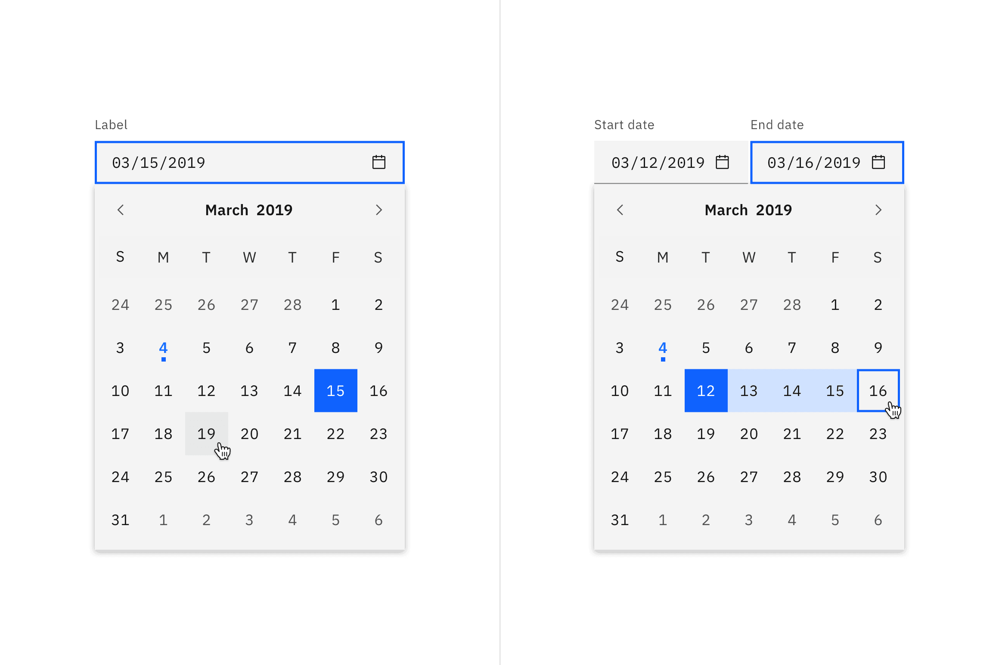
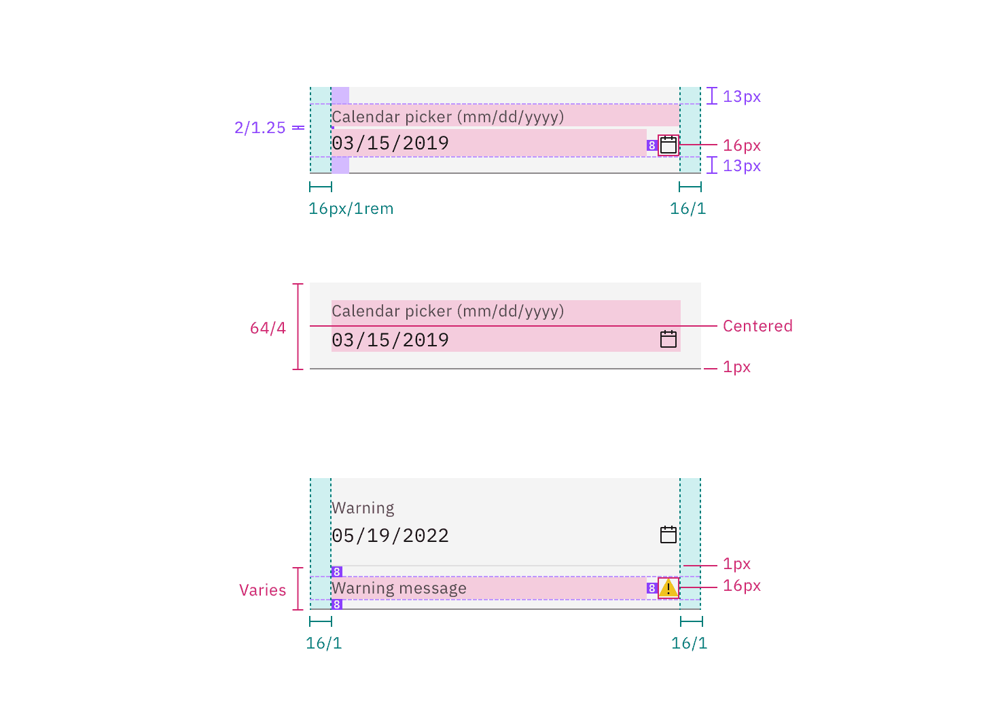
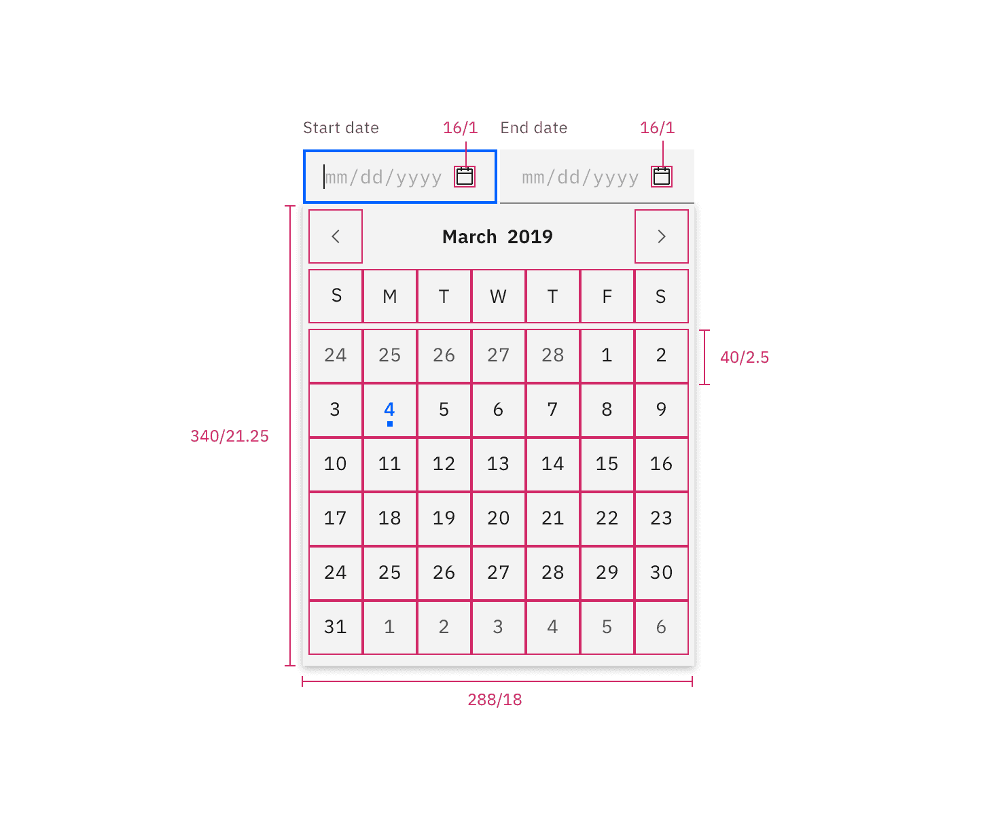
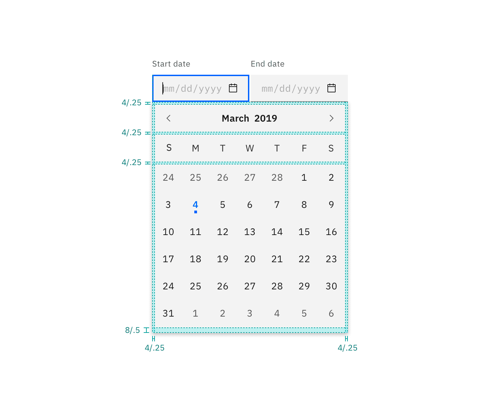
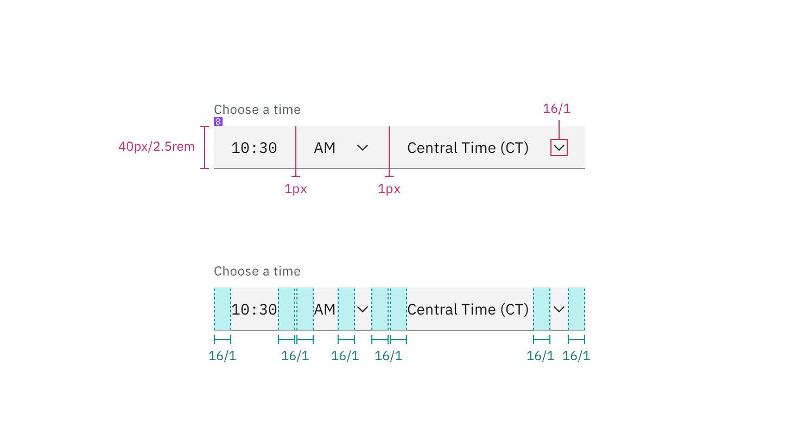
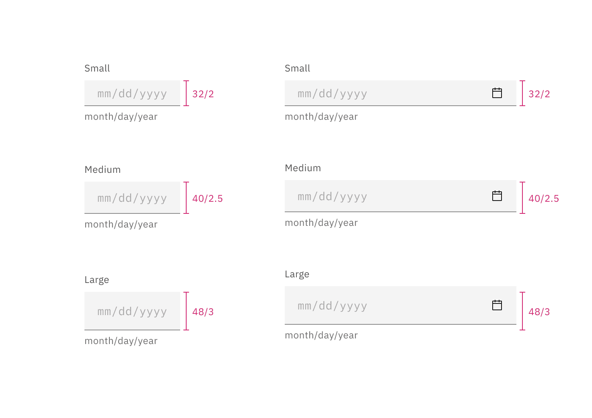

## Color

### Date input

| Element          | Property         | Color token         |
| ---------------- | ---------------- | ------------------- |
| Label            | text-color       | `$text-secondary`   |
| Field            | background-color | `$field` \*         |
|                  | border-bottom    | `$border-strong` \* |
| Field text       | text-color       | `$text-primary`     |
| Placeholder text | text-color       | `$text-placeholder` |
| Helper text      | text-color       | `$text-helper`      |
| Calendar icon    | svg              | `$icon-primary`     |

<Caption>
  * Denotes a contextual color token that will change values based on the layer
  it is placed on.
</Caption>

<Row>
<Column colLg={8}>

<Tabs>

<Tab label="Fixed">

</Tab>

<Tab label="Fluid">

</Tab>

</Tabs>

</Column>
</Row>

 

#### Interactive states

 

| State    | Element         | Property         | Color token        |
| -------- | --------------- | ---------------- | ------------------ |
| Focus    | Field           | border           | `$focus`           |
| Invalid  | Field           | border           | `$support-error`   |
|          | Error message   | text-color       | `$text-error`      |
|          | Error icon      | svg              | `$support-error`   |
| Warning  | Warning message | text-color       | `$text-primary`    |
|          | Warning icon    | svg              | `$support-warning` |
| Disabled | Label           | text-color       | `$text-disabled`   |
|          | Field           | background-color | `$field`           |
|          | Field           | border-bottom    | transparent        |
|          | Field text      | text-color       | `$text-disabled`   |
|          | Calendar icon   | svg              | `$icon-disabled`   |

<Row>
<Column colLg={12}>

<Tabs>

<Tab label="Fixed">

</Tab>

<Tab label="Fluid">

</Tab>

</Tabs>

</Column>
</Row>

<Caption>Examples of date picker input states</Caption>

### Calendar menu

| Element             | Property         | Color token                      |
| ------------------- | ---------------- | -------------------------------- |
| Calendar            | background-color | `$layer` \*                      |
| Calendar menu       | box-shadow       | `0 2px 6px 0 rgba(0, 0, 0, 0.2)` |
| Today               | text-color       | `$link-01`                       |
| Day                 | text-color       | `$text-primary`                  |
| Day: hover          | background-color | `$layer-hover` \*                |
| Day: focus          | border           | `$focus`                         |
| Day: disabled       | text-color       | `$text-disabled`                 |
| Day: selected       | text-color       | `$text-on-color`                 |
|                     | background-color | `$background-brand`              |
| Day: in range       | text-color       | `$text-primary`                  |
|                     | background-color | `$highlight`                     |
| Day: end range      | text-color       | `$text-primary`                  |
|                     | border           | `$focus`                         |
| Day: next month day | text-color       | `$text-secondary`                |

<Caption>
  * Denotes a contextual color token that will change values based on the layer
  it is placed on.
</Caption>

<Row>
<Column colLg={12}>

</Column>
</Row>

<Caption>
  Example of a single date calendar picker (left) and a date range calendar
  picker (right).
</Caption>

## Typography

Labels should be set in sentence case, with only the first word in a phrase and
any proper nouns capitalized, and no more than three words.

| Element         | Font-size  | Font-weight    | Type token            |
| --------------- | ---------- | -------------- | --------------------- |
| Label           | 12 / 0.75  | Regular / 400  | `$label-01`           |
| Field text      | 14 / 0.875 | Regular / 400  | `$code-02`            |
| Helper text     | 12 / 0.75  | Regular / 400  | `$label-01`           |
| Error message   | 12 / 0.75  | Regular / 400  | `$label-01`           |
| Warning message | 12 / 0.75  | Regular / 400  | `$label-01`           |
| Month and year  | 14 / 0.875 | SemiBold / 600 | `$heading-compact-01` |
| Day             | 14 / 0.875 | Regular / 400  | `$body-compact-01`    |

## Structure

### Date inputs

#### Fixed input

The widths of the date inputs may vary based on the grid and layout.

| Element       | Property                    | px / rem | Spacing token |
| ------------- | --------------------------- | -------- | ------------- |
| Label         | margin-bottom               | 8 / 0.5  | `$spacing-03` |
| Field         | padding-left, padding-right | 16 / 1   | `$spacing-05` |
|               | border-bottom               | 1px      | –             |
| Helper text   | margin-top                  | 4 / .25  | `$spacing-02` |
| Calendar icon | height, width               | 16 / 1   | –             |
|               | padding-left                | 8 / 0.5  | `$spacing-03` |

<Caption>Structure and spacing for fixed date picker inputs | px / rem</Caption>

#### Fluid input

The widths of the date inputs may vary based on the grid and layout.

| Element       | Property                    | px / rem    | Spacing token |
| ------------- | --------------------------- | ----------- | ------------- |
| Label         | padding-bottom              | 4 / 0.25    | `$spacing-02` |
| Field         | height                      | 64 / 4      | `$spacing-10` |
|               | padding-left, padding-right | 16 / 1      | `$spacing-05` |
|               | padding-top, padding-bottom | 13 / 0.8125 | –             |
|               | border-bottom               | 1px         | –             |
| Calendar icon | height, width               | 16 / 1      | –             |
|               | padding-left                | 8 / 0.5     | `$spacing-03` |
| Focus         | border                      | 2px         | –             |
| Error         | border                      | 2px         | –             |

<Caption>Structure and spacing for fluid date picker inputs | px / rem</Caption>

### Calendar menu

| Element       | Property                                 | px / rem | Spacing token |
| ------------- | ---------------------------------------- | -------- | ------------- |
| Calendar menu | height                                   | 336 / 21 | –             |
|               | width                                    | 288 / 18 | –             |
|               | padding-top, padding-right, padding-left | 4 / 0.25 | `$spacing-02` |
|               | padding-bottom                           | 8 / 0.5  | `$spacing-03` |
| Day           | height, width                            | 40 / 2.5 | –             |
| Today: dot    | height, width                            | 4 / 0.25 | –             |

<Caption>Structure for date picker | px / rem</Caption>

<Caption>Spacing for date picker | px / rem</Caption>

### Time picker

The time picker is a combination of a
[text input](/components/text-input/style#structure) and
[select](/components/select/style#structure) component. Refer to each component
page for further details.

#### Fixed input

The widths of the time picker may vary based on the grid and layout.

| Element | Property                    | px / rem | Spacing token |
| ------- | --------------------------- | -------- | ------------- |
| Label   | padding-bottom              | 8 / 0.5  | `$spacing-03` |
| Field   | height                      | 40 / 2.5 | –             |
|         | padding-right, padding-left | 16 / 1   | `$spacing-05` |
| Select  | padding-right, padding-left | 16 / 1   | `$spacing-05` |

<Caption>Structure and spacing for a time picker | px / rem</Caption>

#### Fluid input

The width of each component in the fluid time picker is a percentage of the
group. Time picker's total width will vary based on the grid and layout

| Element         | Property                    | px / rem   | Spacing token |
| --------------- | --------------------------- | ---------- | ------------- |
| Label           | padding-bottom              | 4 / 0.25   | `$spacing-02` |
| Field           | height                      | 64 / 4     | –             |
|                 | padding-right, padding-left | 16 / 1     | `$spacing-05` |
| Divider         | width                       | 1px        | –             |
| Time input      | width                       | 25% or 50% | –             |
| Clock select    | width                       | 25% or 50% | –             |
| Timezone select | width                       | 50%        | –             |

<Caption>Structure and spacing for a time picker | px / rem</Caption>

<Caption>
  The width of each component in the fluid time picker is a percentage of the
  group.
</Caption>

## Sizes

### Fixed inputs

| Element | Size        | Height px / rem |
| ------- | ----------- | --------------- |
| Field   | Small (sm)  | 32 / 2          |
|         | Medium (md) | 40 / 2.5        |
|         | Large (lg)  | 48 / 3          |

<Caption>Sizes for simple and single date calendar sizes | px / rem</Caption>
