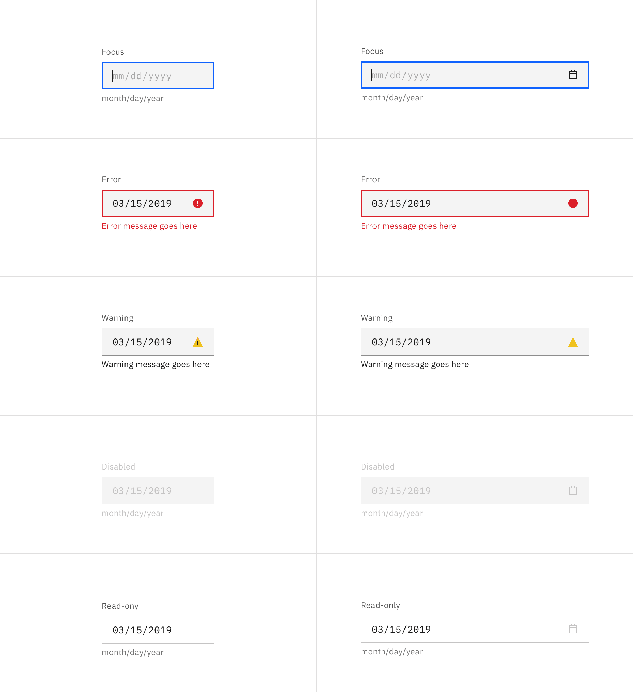
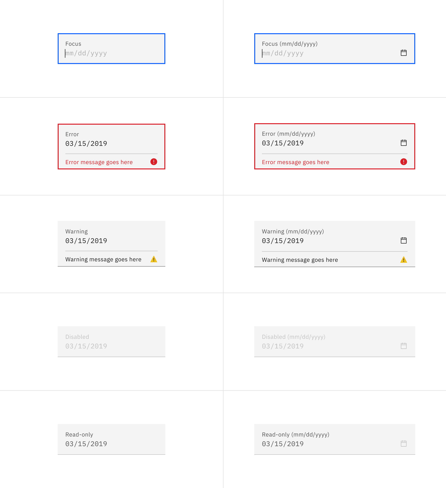
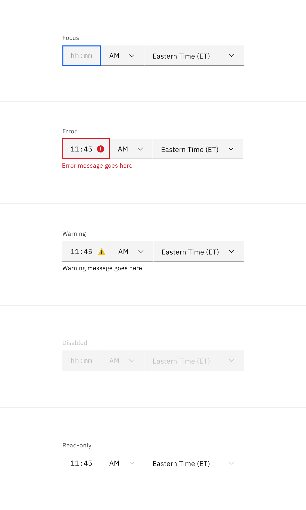
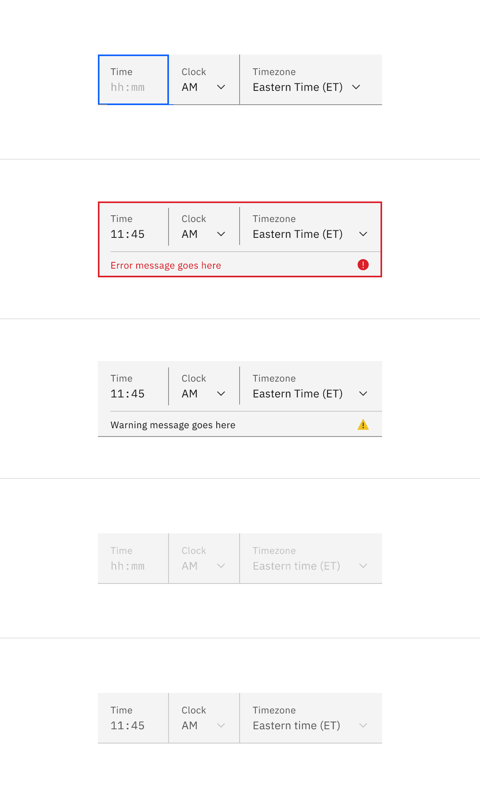
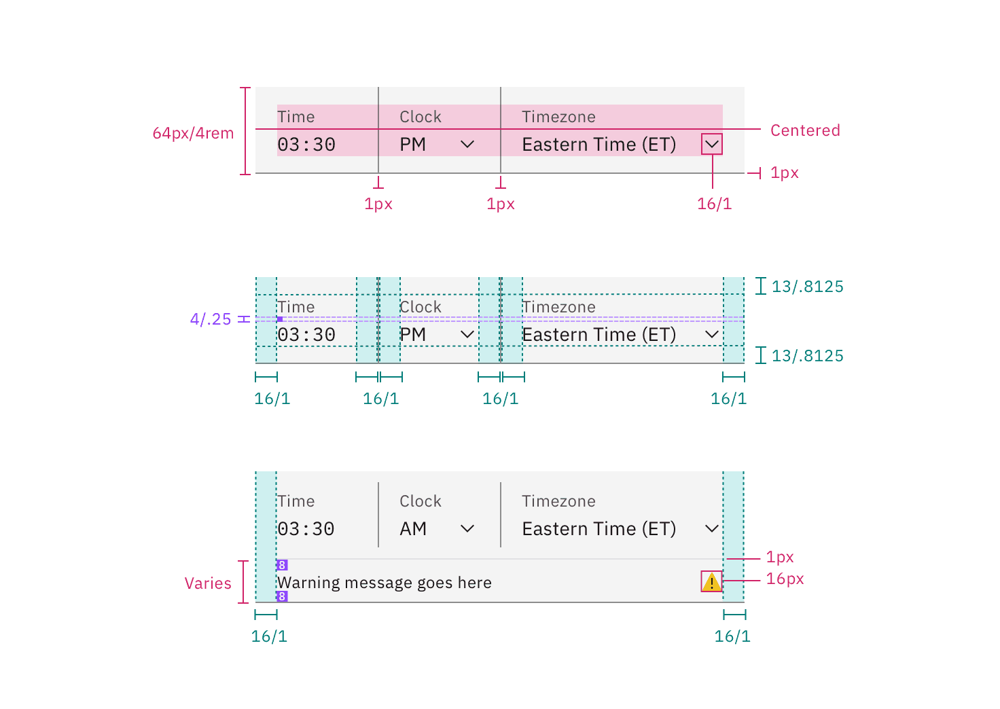
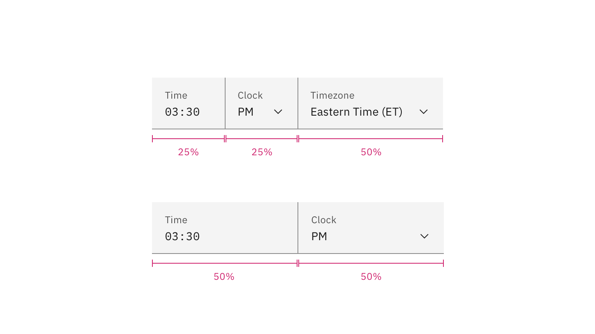
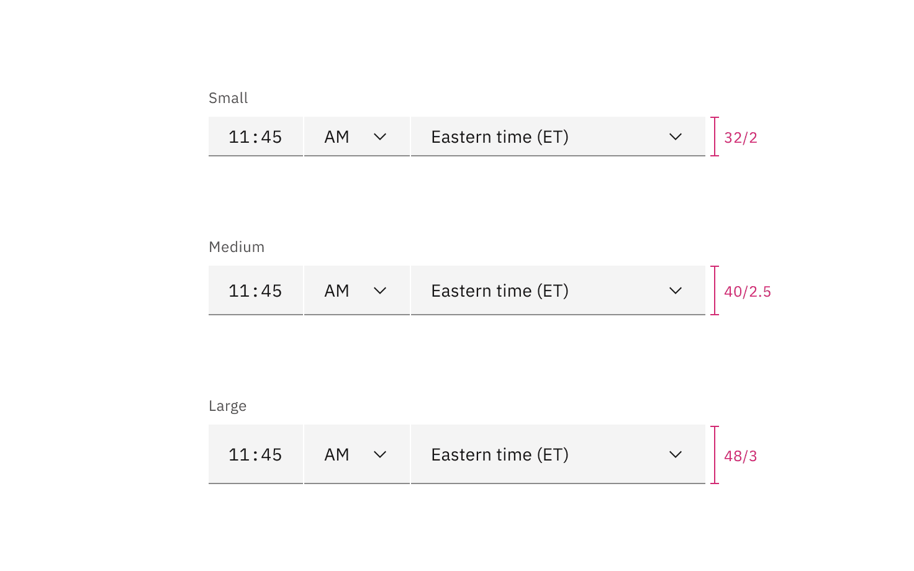
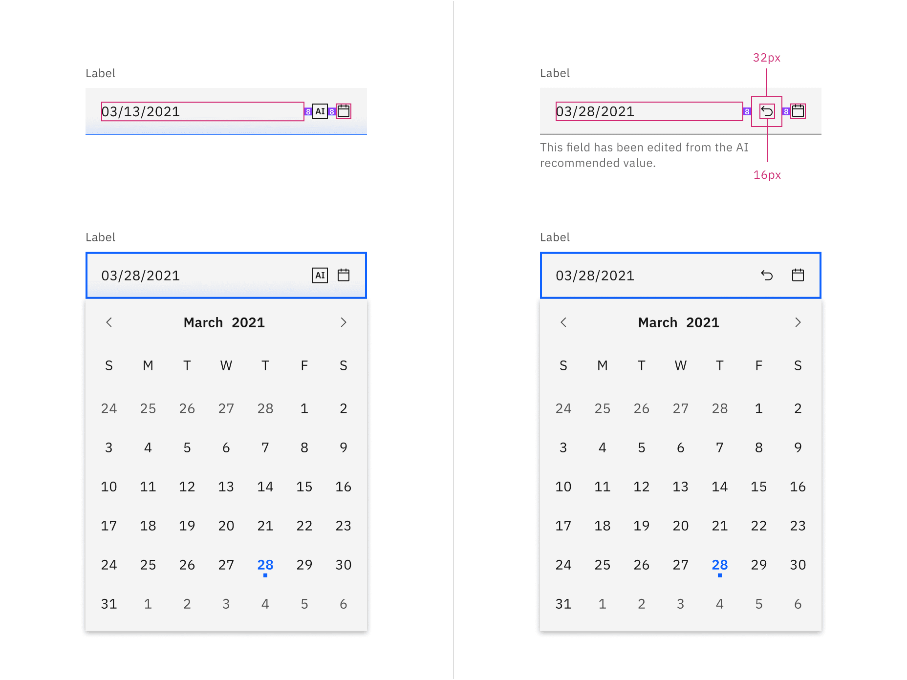
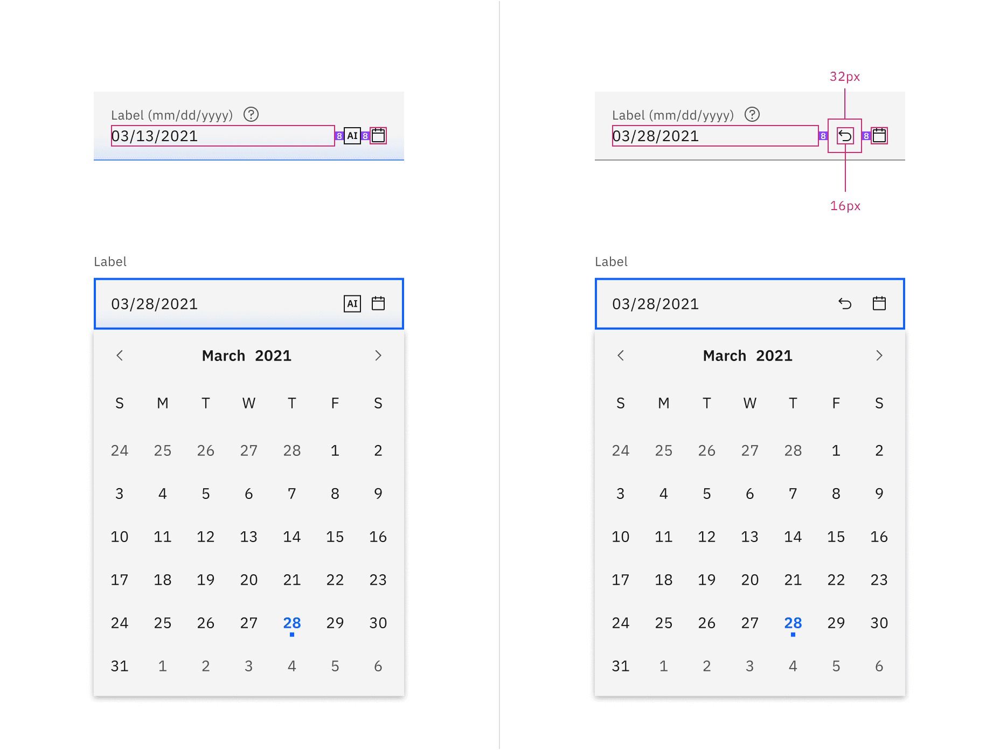

<PageDescription>

The following page documents visual specifications such as color, typography,
structure, size, and AI presence.

</PageDescription>

<AnchorLinks>

<AnchorLink>Color</AnchorLink>
<AnchorLink>Typography</AnchorLink>
<AnchorLink>Structure</AnchorLink>
<AnchorLink>Size</AnchorLink>
<AnchorLink>AI presence</AnchorLink>
<AnchorLink>Feedback</AnchorLink>

</AnchorLinks>

## Color

### Date picker color

| Element          | Property         | Color token         |
| ---------------- | ---------------- | ------------------- |
| Label            | text-color       | `$text-secondary`   |
| Field            | background-color | `$field` \*         |
|                  | border-bottom    | `$border-strong` \* |
| Field text       | text-color       | `$text-primary`     |
| Placeholder text | text-color       | `$text-placeholder` |
| Helper text      | text-color       | `$text-helper`      |
| Calendar icon    | svg              | `$icon-primary`     |

<Caption fullWidth>
  \* Denotes a contextual color token that will change values based on the layer
  it is placed on.
</Caption>

<Row>
<Column colLg={8}>

<Tabs>

<Tab label="Default">

</Tab>

<Tab label="Fluid">

</Tab>

</Tabs>

</Column>
</Row>

 

#### Interactive state color

 

| State     | Element              | Property         | Color token         |
| --------- | -------------------- | ---------------- | ------------------- |
| Focus     | Field                | border           | `$focus`            |
| Error     | Field                | border           | `$support-error`    |
|           | Error message        | text-color       | `$text-error`       |
|           | Error icon           | svg              | `$support-error`    |
| Warning   | Warning message      | text-color       | `$text-primary`     |
|           | Warning icon         | svg              | `$support-warning`  |
| Disabled  | Label                | text-color       | `$text-disabled`    |
|           | Field                | background-color | `$field`            |
|           | Field text           | text-color       | `$text-disabled`    |
|           | Field (default)      | border-bottom    | transparent         |
|           | Field (fluid)        | border-bottom    | `$border-subtle` \* |
|           | Calendar icon        | svg              | `$icon-disabled`    |
| Read-only | Label                | text-color       | `$text-secondary`   |
|           | Field text (default) | text-color       | `$text-primary`     |
|           | Field (default)      | background-color | transparent         |
|           | Field text (fluid)   | text-color       | `$text-secondary`   |
|           | Field (fluid)        | background-color | `$field` \*         |
|           | Chevron icon         | svg              | `$icon-disabled`    |

<Caption fullWidth>
  \* Denotes a contextual color token that will change values based on the layer
  it is placed on.
</Caption>

<Row>
<Column colLg={12}>

<Tabs>

<Tab label="Default">

</Tab>

<Tab label="Fluid">

</Tab>

</Tabs>

</Column>
</Row>

<Caption>Examples of date picker input states</Caption>

### Calendar menu color

| Element       | Property         | Color token                      |
| ------------- | ---------------- | -------------------------------- |
| Calendar      | background-color | `$layer` \*                      |
| Calendar menu | box-shadow       | `0 2px 6px 0 rgba(0, 0, 0, 0.2)` |
| Today         | text-color       | `$link-01`                       |

<Caption fullWidth>
  \* Denotes a contextual color token that will change values based on the layer
  it is placed on.
</Caption>

<Row>
<Column colLg={8}>

</Column>
</Row>

<Caption>Example of a date picker calendar menu.</Caption>

 

#### Interactive state color

 

| State      | Element | Property         | Color token         |
| ---------- | ------- | ---------------- | ------------------- |
| Hover      | Day     | background-color | `$layer-hover` \*   |
| Focus      | Day     | border           | `$focus`            |
| Disabled   | Day     | text-color       | `$text-disabled`    |
| Selected   | Day     | text-color       | `$text-on-color`    |
|            |         | background-color | `$background-brand` |
| In range   | Day     | text-color       | `$text-primary`     |
|            |         | background-color | `$highlight`        |
| End range  | Day     | text-color       | `$text-primary`     |
|            |         | border           | `$focus`            |
| Next month | Day     | text-color       | `$text-secondary`   |

<Caption fullWidth>
  \* Denotes a contextual color token that will change values based on the layer
  it is placed on.
</Caption>

<Row>
<Column colLg={12}>

</Column>
</Row>

<Caption>
  Example of a single date calendar picker (left) and a date range calendar
  picker (right).
</Caption>

### Time picker color

The time picker is made up of text input and select input components.

| Element          | Property         | Color token         |
| ---------------- | ---------------- | ------------------- |
| Label            | text-color       | `$text-secondary`   |
| Field            | background-color | `$field` \*         |
|                  | border-bottom    | `$border-strong` \* |
|                  | dividers (fluid) | `$border-strong` \* |
| Field text       | text-color       | `$text-primary`     |
| Placeholder text | text-color       | `$text-placeholder` |
| Chevron icon     | svg              | `$icon-primary`     |

<Caption fullWidth>
  \* Denotes a contextual color token that will change values based on the layer
  it is placed on.
</Caption>

<Row>
<Column colLg={8}>

<Tabs>

<Tab label="Default">

</Tab>

<Tab label="Fluid">

</Tab>

</Tabs>

</Column>
</Row>

 

#### Interactive state color

The interactive state color example shown below is specifically for text input.
See the [select input](https://carbondesignsystem.com/components/select/style)
style tab for more details on select component interactive state colors.

 

| State     | Element              | Property         | Color token         |
| --------- | -------------------- | ---------------- | ------------------- |
| Focus     | Field                | border           | `$focus`            |
| Error     | Field                | border           | `$support-error`    |
|           | Error message        | text-color       | `$text-error`       |
|           | Error icon           | svg              | `$support-error`    |
| Warning   | Warning message      | text-color       | `$text-primary`     |
|           | Warning icon         | svg              | `$support-warning`  |
| Disabled  | Label                | text-color       | `$text-disabled`    |
|           | Field                | background-color | `$field` \*         |
|           | Field text           | text-color       | `$text-disabled`    |
|           | Field (default)      | border-bottom    | transparent         |
|           | Field (fluid)        | border-bottom    | `$border-subtle` \* |
|           | Chevron icon         | svg              | `$icon-disabled`    |
| Read-only | Label                | text-color       | `$text-secondary`   |
|           | Field text (default) | text-color       | `$text-primary`     |
|           | Field (default)      | background-color | transparent         |
|           | Field text (fluid)   | text-color       | `$text-secondary`   |
|           | Field (fluid)        | background-color | `$field` \*         |
|           | Chevron icon         | svg              | `$icon-disabled`    |

<Caption fullWidth>
  \* Denotes a contextual color token that will change values based on the layer
  it is placed on.
</Caption>

<Row>
<Column colLg={8}>

<Tabs>

<Tab label="Default">

</Tab>

<Tab label="Fluid">

</Tab>

</Tabs>

</Column>
</Row>

<Caption>Examples of time picker input states</Caption>

## Typography

Labels should be set in sentence case, with only the first word in a phrase and
any proper nouns capitalized, and no more than three words.

| Element         | Font-size  | Font-weight    | Type token            |
| --------------- | ---------- | -------------- | --------------------- |
| Label           | 12 / 0.75  | Regular / 400  | `$label-01`           |
| Field text      | 14 / 0.875 | Regular / 400  | `$code-02`            |
| Helper text     | 12 / 0.75  | Regular / 400  | `$label-01`           |
| Error message   | 12 / 0.75  | Regular / 400  | `$label-01`           |
| Warning message | 12 / 0.75  | Regular / 400  | `$label-01`           |
| Month and year  | 14 / 0.875 | SemiBold / 600 | `$heading-compact-01` |
| Day             | 14 / 0.875 | Regular / 400  | `$body-compact-01`    |

## Structure

### Date picker input structure

#### Default input

The widths of the date inputs may vary based on the grid and layout.

| Element       | Property                    | px / rem | Spacing token |
| ------------- | --------------------------- | -------- | ------------- |
| Label         | margin-bottom               | 8 / 0.5  | `$spacing-03` |
| Field         | padding-left, padding-right | 16 / 1   | `$spacing-05` |
|               | border-bottom               | 1px      | –             |
| Helper text   | margin-top                  | 4 / .25  | `$spacing-02` |
| Calendar icon | height, width               | 16 / 1   | –             |
|               | padding-left                | 8 / 0.5  | `$spacing-03` |

<Caption>
  Structure and spacing for default date picker inputs | px / rem
</Caption>

#### Fluid input

The widths of the date inputs may vary based on the grid and layout.

| Element       | Property                    | px / rem    | Spacing token |
| ------------- | --------------------------- | ----------- | ------------- |
| Label         | padding-bottom              | 4 / 0.25    | `$spacing-02` |
| Field         | height                      | 64 / 4      | `$spacing-10` |
|               | padding-left, padding-right | 16 / 1      | `$spacing-05` |
|               | padding-top, padding-bottom | 13 / 0.8125 | –             |
|               | border-bottom               | 1px         | –             |
| Calendar icon | height, width               | 16 / 1      | –             |
|               | padding-left                | 8 / 0.5     | `$spacing-03` |
| Focus         | border                      | 2px         | –             |
| Error         | border                      | 2px         | –             |

<Caption>Structure and spacing for fluid date picker inputs | px / rem</Caption>

### Calendar menu structure

| Element       | Property                                 | px / rem | Spacing token |
| ------------- | ---------------------------------------- | -------- | ------------- |
| Calendar menu | height                                   | 336 / 21 | –             |
|               | width                                    | 288 / 18 | –             |
|               | padding-top, padding-right, padding-left | 4 / 0.25 | `$spacing-02` |
|               | padding-bottom                           | 8 / 0.5  | `$spacing-03` |
| Day           | height, width                            | 40 / 2.5 | –             |
| Today: dot    | height, width                            | 4 / 0.25 | –             |

<Caption>Structure for date picker | px / rem</Caption>

<Caption>Spacing for date picker | px / rem</Caption>

### Time picker structure

The time picker is a combination of a
[text input](/components/text-input/style#structure) and
[select](/components/select/style#structure) component. Refer to each component
page for further details.

#### Default input

The widths of the time picker may vary based on the grid and layout.

| Element | Property                    | px / rem | Spacing token |
| ------- | --------------------------- | -------- | ------------- |
| Label   | padding-bottom              | 8 / 0.5  | `$spacing-03` |
| Field   | height                      | 40 / 2.5 | –             |
|         | padding-right, padding-left | 16 / 1   | `$spacing-05` |
| Select  | padding-right, padding-left | 16 / 1   | `$spacing-05` |

<Caption>Structure and spacing for a time picker | px / rem</Caption>

#### Fluid input

The width of each component in the fluid time picker is a percentage of the
group. Time picker's total width will vary based on the grid and layout

| Element         | Property                    | px / rem   | Spacing token |
| --------------- | --------------------------- | ---------- | ------------- |
| Label           | padding-bottom              | 4 / 0.25   | `$spacing-02` |
| Field           | height                      | 64 / 4     | –             |
|                 | padding-right, padding-left | 16 / 1     | `$spacing-05` |
| Divider         | width                       | 1px        | –             |
| Time input      | width                       | 25% or 50% | –             |
| Clock select    | width                       | 25% or 50% | –             |
| Timezone select | width                       | 50%        | –             |

<Caption>Structure and spacing for a time picker | px / rem</Caption>

<Caption>
  The width of each component in the fluid time picker is a percentage of the
  group.
</Caption>

## Size

### Default date picker input

| Element | Size        | Height px / rem |
| ------- | ----------- | --------------- |
| Field   | Small (sm)  | 32 / 2          |
|         | Medium (md) | 40 / 2.5        |
|         | Large (lg)  | 48 / 3          |

<Caption>Sizes for simple and single date calendar sizes | px / rem</Caption>

### Default time picker input

| Element | Size        | Height px / rem |
| ------- | ----------- | --------------- |
| Field   | Small (sm)  | 32 / 2          |
|         | Medium (md) | 40 / 2.5        |
|         | Large (lg)  | 48 / 3          |

<Caption>Sizes for default style time picker input | px / rem</Caption>

## AI presence

The following are the unique styles applied to the components when the AI label
is present. Unless specified, all other tokens in the components remain the same
as the non-AI variants.

For more information on the AI style elements, see the
[Carbon for AI](/guidelines/carbon-for-ai/) guidelines.

| Element         | Property         | Token / Size        |
| --------------- | ---------------- | ------------------- |
| Linear-gradient | start            | `$ai-aura-start-sm` |
|                 | stop             | `$ai-aura-stop`     |
| Field           | border-bottom    | `$ai-border-strong` |
|                 | background color | `$field` \*         |
| AI label        | size             | mini                |

<Caption fullWidth>
  \* Denotes a contextual color token that will change values based on the layer
  it is placed on.
</Caption>

<Row>
<Column colLg={12}>

<Tabs>

<Tab label="Default">

</Tab>

<Tab label="Fluid">

</Tab>

</Tabs>

</Column>
</Row>

## Feedback

Help us improve this component by providing feedback, asking questions, and
leaving any other comments on
[GitHub](https://github.com/carbon-design-system/carbon-website/issues/new?assignees=&labels=feedback&template=feedback.md).
