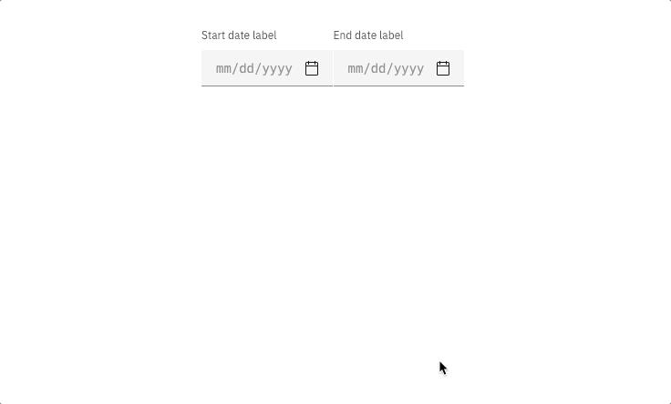

<PageDescription>

Date and time pickers allow users to select a single or a range of dates and
times.

</PageDescription>

<AnchorLinks>

<AnchorLink>Variations</AnchorLink>
<AnchorLink>Content</AnchorLink>
<AnchorLink>Interaction</AnchorLink>
<AnchorLink>Time picker</AnchorLink>
<AnchorLink>Feedback</AnchorLink>

</AnchorLinks>

<ComponentDemo
  components={[
    {
      id: 'default-datepicker',
      label: 'Default',
    },
    {
      id: 'single-calendar',
      label: 'Single with calendar',
    },
    {
      id: 'range-calendar',
      label: 'Range with calendar',
    },
  ]}>
  <ComponentVariant id="default-datepicker" knobs={{
      DatePicker: ['light']
    }}
    links={{
      React:
        'https://react.carbondesignsystem.com/?path=/story/datepicker--simple',
      Angular:
        'https://angular.carbondesignsystem.com/?path=/story/components-date-picker--simple',
      Vue:
        'http://vue.carbondesignsystem.com/?path=/story/components-cvdatepicker--default',
      Vanilla: 'https://the-carbon-components.netlify.com/?nav=date-picker',
    }}>{`
    <DatePicker dateFormat="m/d/Y" datePickerType="simple">
      <DatePickerInput
        id="date-picker-default-id"
        placeholder="mm/dd/yyyy"
        labelText="Date Picker label"
        type="text"
      />
    </DatePicker>
  `}</ComponentVariant>
  <ComponentVariant id="single-calendar" knobs={{
      DatePicker: ['light']
    }}
    links={{
      React:
        'https://react.carbondesignsystem.com/?path=/story/datepicker--single-with-calendar',
      Angular:
        'https://angular.carbondesignsystem.com/?path=/story/components-date-picker--single',
      Vue:
        'http://vue.carbondesignsystem.com/?path=/story/components-cvdatepicker--single',
      Vanilla: 'https://the-carbon-components.netlify.com/?nav=date-picker',
    }}>{`
    <DatePicker dateFormat="m/d/Y" datePickerType="single">
      <DatePickerInput
        id="date-picker-calendar-id"
        placeholder="mm/dd/yyyy"
        labelText="Date Picker label"
        type="text"
      />
    </DatePicker>
  `}</ComponentVariant>
  <ComponentVariant id="range-calendar" knobs={{
      DatePicker: ['light']
    }}
    links={{
      React:
        'https://react.carbondesignsystem.com/?path=/story/datepicker--range-with-calendar',
      Angular:
        'https://angular.carbondesignsystem.com/?path=/story/components-date-picker--range',
      Vue:
        'http://vue.carbondesignsystem.com/?path=/story/components-cvdatepicker--range',
      Vanilla: 'https://the-carbon-components.netlify.com/?nav=date-picker',
    }}>{`
    <DatePicker dateFormat="m/d/Y" datePickerType="range">
      <DatePickerInput
        id="date-picker-range-start"
        placeholder="mm/dd/yyyy"
        labelText="Date Picker label"
        type="text"
      />
      <DatePickerInput
        id="date-picker-range-end"
        placeholder="mm/dd/yyyy"
        labelText="Date Picker label"
        type="text"
      />
    </DatePicker>
  `}</ComponentVariant>

  </ComponentDemo>

## Variations

| Type                 | Purpose                                                                                    |
| -------------------- | ------------------------------------------------------------------------------------------ |
| _Range date picker_  | To select a range of dates, accompanied by a calendar widget.                              |
| _Single date picker_ | When a user needs to select one date, accompanied by a calendar widget.                    |
| _Simple date picker_ | When the date is known by the user and they don't need a calendar to anticipate the dates. |

<Row>
<Column colLg={8}>

<Caption>Types of date pickers</Caption>

</Column>
</Row>

## Content

#### Labels

Both date and time pickers are accompanied by labels, and follow the same
accessibility guidelines for all [forms](/components/form/usage).

#### Format

For date pickers, use placeholder text so users input the date in the correct
format. It can be formatted in a variety of ways. See the date picker code
[documentation](https://github.com/carbon-design-system/carbon/blob/master/packages/components/src/components/date-picker/README.md)
for more info.

## Interaction

#### Calendar widget

It is recommended to use the date picker with a calendar widget when the user is
browsing between a range of dates. Aid the user in making the proper choices by
providing a visual reference of dates to choose from. The calendar widget
appears once the user has interacted with the date input field (typically on
`:focus`).

<Row>
<Column colLg={8}>

<Caption>Selecting dates from the range date picker</Caption>

</Column>
</Row>

#### Simple date picker

The simple date picker provides the user with a text input in which they can
input month/day/year. Simple date pickers are typically used when the date is
known by the user, such as a birthday or credit card expiration.

## Time picker

Time pickers provide the user with a text input in which they can input
hours/minutes. Additionally, they can be accompanied by an “AM/PM” selection and
a time zone selection, which is styled as an
[inline select](/components/select/usage).

## Feedback

Help us improve this component by providing feedback, asking questions, and
leaving any other comments on
[GitHub](https://github.com/carbon-design-system/carbon-website/issues/new?assignees=&labels=feedback&template=feedback.md).
