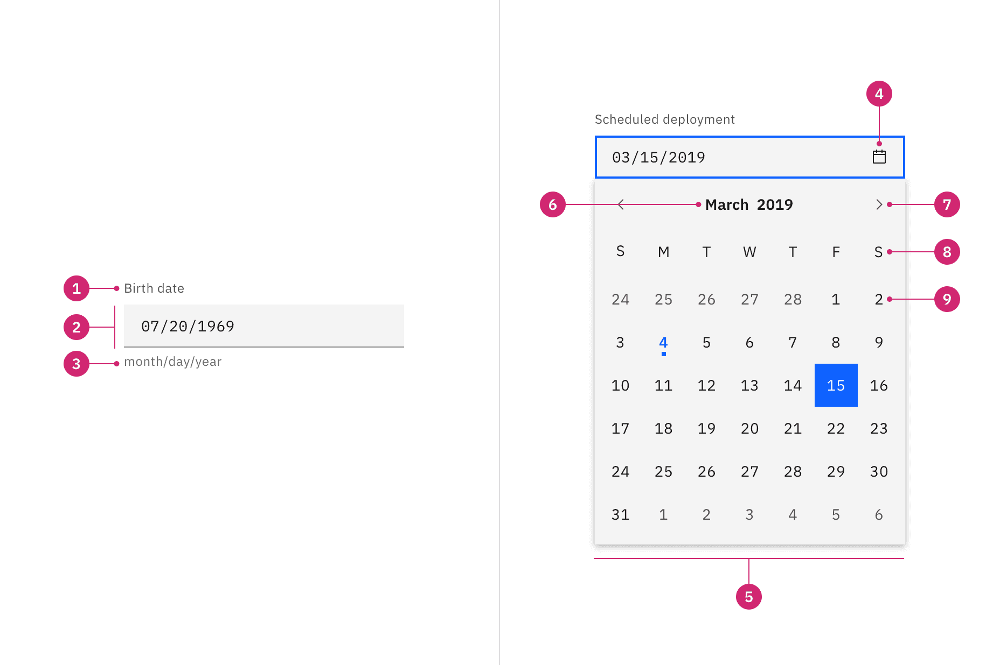
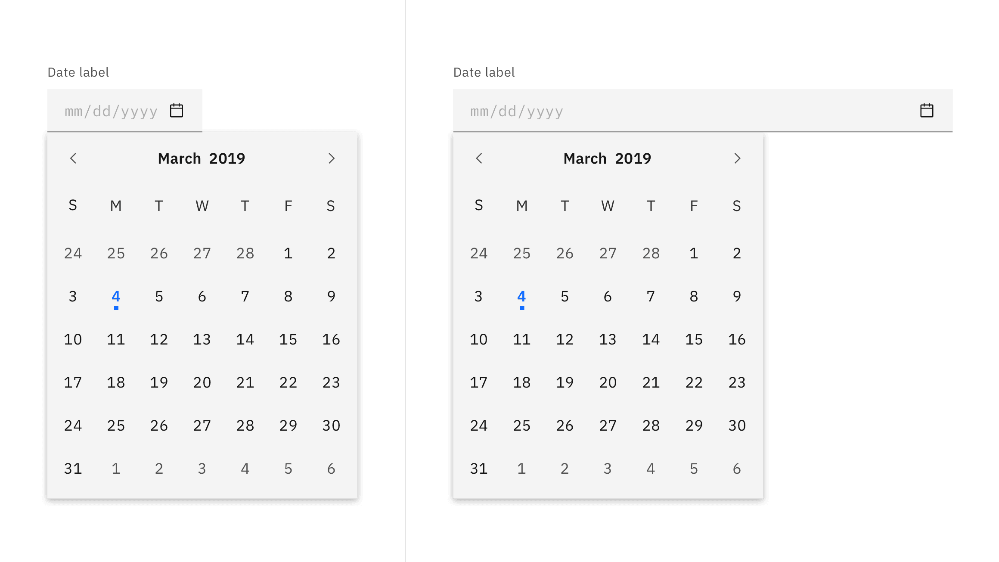
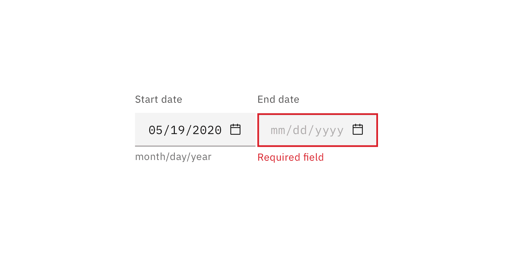
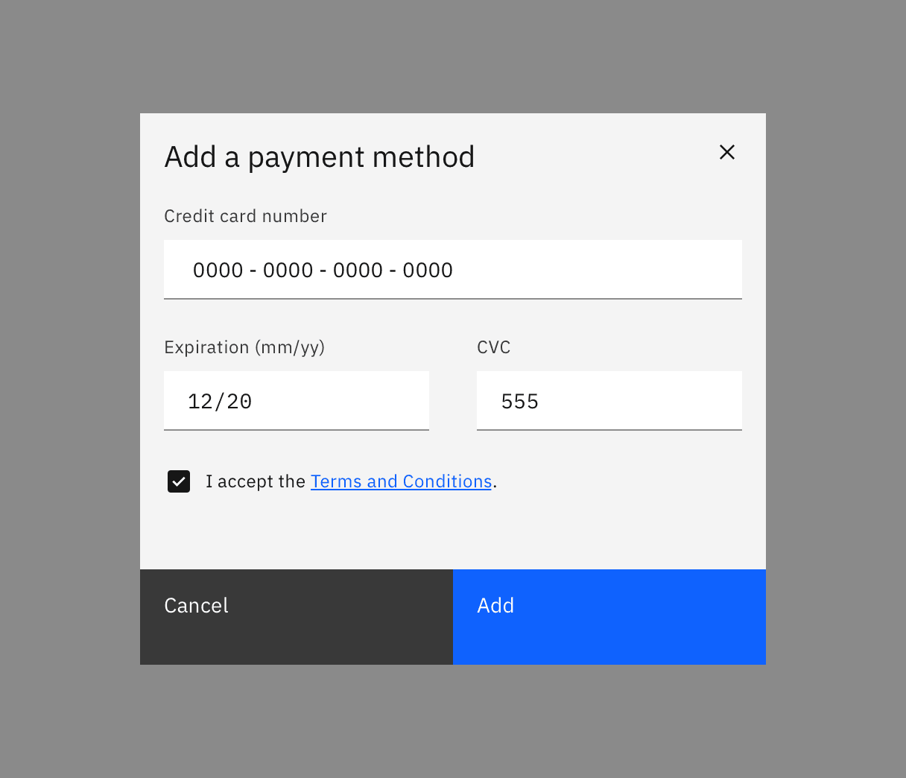
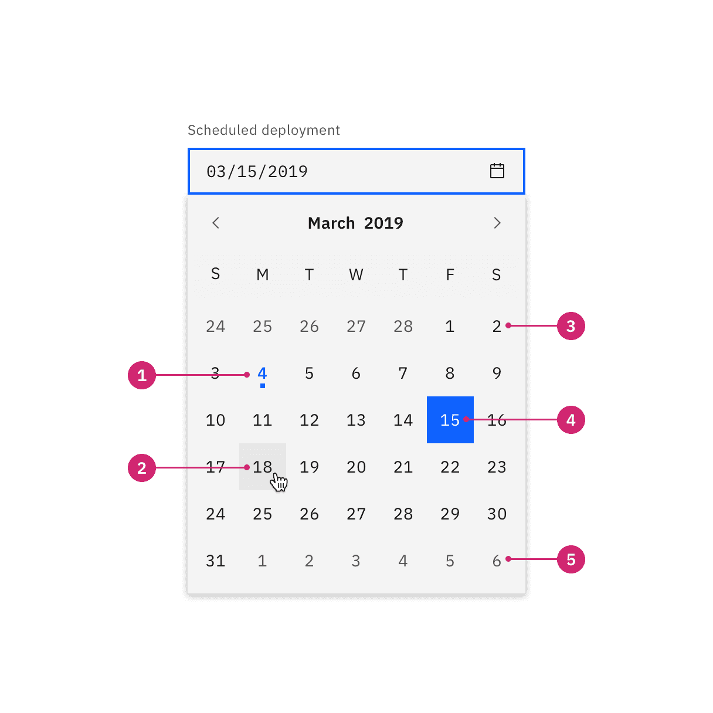
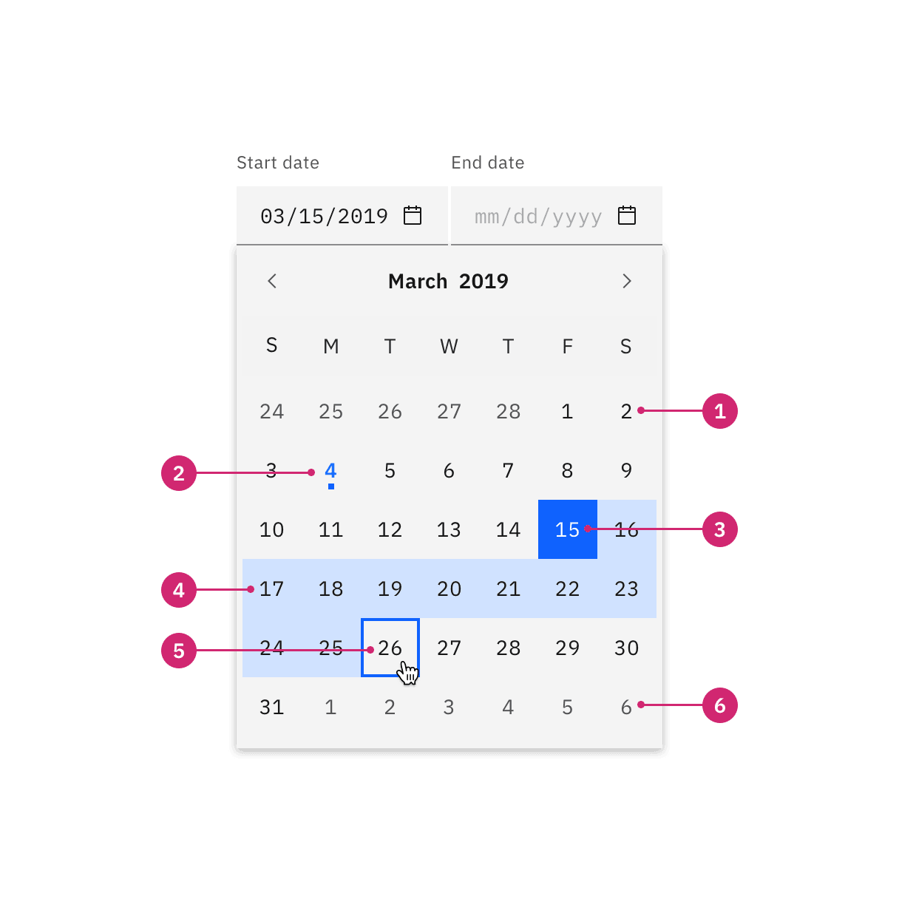
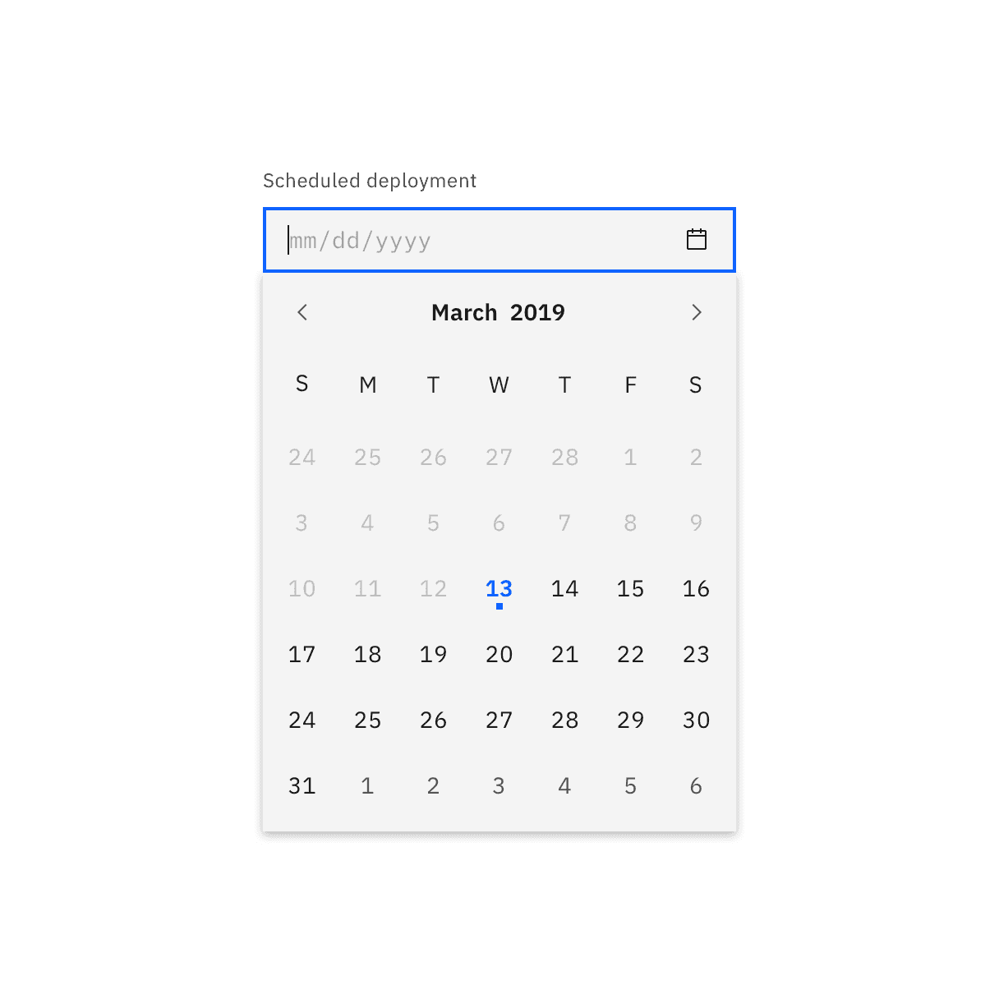
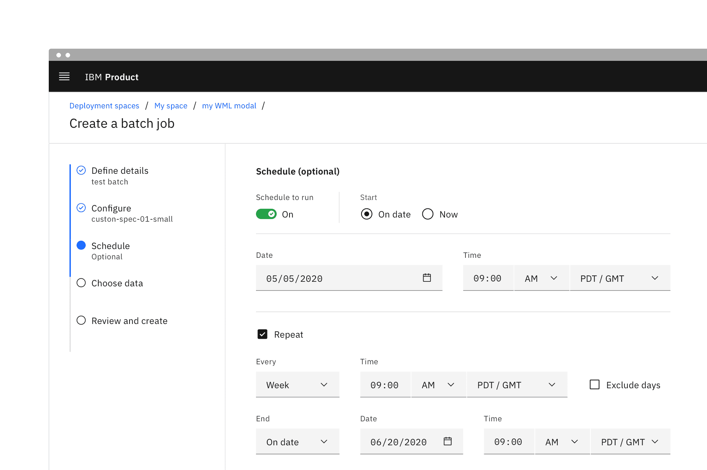
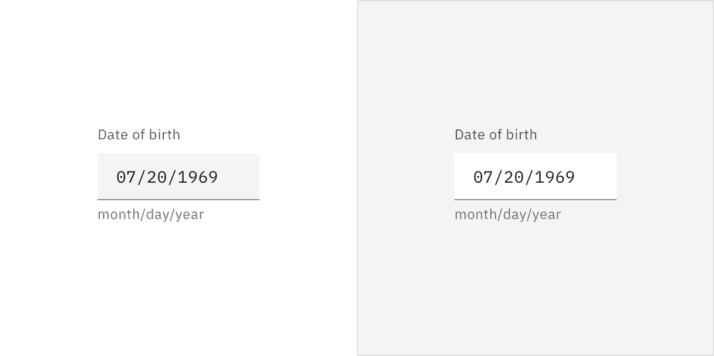

<PageDescription>

Date and time pickers allow users to select a single or a range of dates and
times.

</PageDescription>

<AnchorLinks>

<AnchorLink>Overview</AnchorLink>
<AnchorLink>Live demo</AnchorLink>
<AnchorLink>Formatting</AnchorLink>
<AnchorLink>Content</AnchorLink>
<AnchorLink>Universal behaviors</AnchorLink>
<AnchorLink>Simple date input</AnchorLink>
<AnchorLink>Calendar pickers</AnchorLink>
<AnchorLink>Time pickers</AnchorLink>
<AnchorLink>Related</AnchorLink>
<AnchorLink>Feedback</AnchorLink>

</AnchorLinks>

## Overview

Pickers are used to display past, present, or future dates or times. The kind of
date (exact, approximate, memorable) you are requesting from the user will
determine which picker is best to use. Each picker's format can be customized
depending on location or need.

### When to use

Use date and time pickers when you are asking the user for a time or date, or
for scheduling tasks.

### Variants

| Variant             | Purpose                                                                                                                                                                                                                               |
| ------------------- | ------------------------------------------------------------------------------------------------------------------------------------------------------------------------------------------------------------------------------------- |
| _Simple date input_ | Use if the date can be remembered by the user easily, such as a date of birth, and they don’t need a calendar to anticipate the dates. It consists only of input fields.                                                              |
| _Calendar pickers_  | Use a calendar picker when the user needs to know a date's relationship to other days or when a date could be variable. It allows the user to view and pick dates from a calendar widget or manually type the date in the text field. |
| _Time picker_       | Use when asking the user to input a specific time.                                                                                                                                                                                    |

## Live demo

<ComponentDemo
  components={[
    {
      id: 'default-datepicker',
      label: 'Default',
    },
    {
      id: 'single-calendar',
      label: 'Single with calendar',
    },
    {
      id: 'range-calendar',
      label: 'Range with calendar',
    },
    ,
    {
      id: 'time-picker',
      label: 'Time picker',
    },
  ]}>
  <ComponentVariant
    id="default-datepicker"
    knobs={{
      DatePicker: ['light'],
    }}
    links={{
      React:
        'https://react.carbondesignsystem.com/?path=/story/datepicker--simple',
      Angular:
        'https://angular.carbondesignsystem.com/?path=/story/components-date-picker--simple',
      Vue:
        'http://vue.carbondesignsystem.com/?path=/story/components-cvdatepicker--default',
      Vanilla: 'https://the-carbon-components.netlify.com/?nav=date-picker',
    }}>{`
    <DatePicker dateFormat="m/d/Y" datePickerType="simple">
      <DatePickerInput
        id="date-picker-default-id"
        placeholder="mm/dd/yyyy"
        labelText="Date picker label"
        type="text"
      />
    </DatePicker>
  `}</ComponentVariant>
  <ComponentVariant
    id="single-calendar"
    knobs={{
      DatePicker: ['light'],
    }}
    links={{
      React:
        'https://react.carbondesignsystem.com/?path=/story/datepicker--single-with-calendar',
      Angular:
        'https://angular.carbondesignsystem.com/?path=/story/components-date-picker--single',
      Vue:
        'http://vue.carbondesignsystem.com/?path=/story/components-cvdatepicker--single',
      Vanilla: 'https://the-carbon-components.netlify.com/?nav=date-picker',
    }}>{`
    <DatePicker dateFormat="m/d/Y" datePickerType="single">
      <DatePickerInput
        id="date-picker-calendar-id"
        placeholder="mm/dd/yyyy"
        labelText="Date picker label"
        type="text"
      />
    </DatePicker>
  `}</ComponentVariant>
  <ComponentVariant
    id="range-calendar"
    knobs={{
      DatePicker: ['light'],
    }}
    links={{
      React:
        'https://react.carbondesignsystem.com/?path=/story/datepicker--range-with-calendar',
      Angular:
        'https://angular.carbondesignsystem.com/?path=/story/components-date-picker--range',
      Vue:
        'http://vue.carbondesignsystem.com/?path=/story/components-cvdatepicker--range',
      Vanilla: 'https://the-carbon-components.netlify.com/?nav=date-picker',
    }}>{`
    <DatePicker dateFormat="m/d/Y" datePickerType="range">
      <DatePickerInput
        id="date-picker-range-start"
        placeholder="mm/dd/yyyy"
        labelText="Date picker label"
        type="text"
      />
      <DatePickerInput
        id="date-picker-range-end"
        placeholder="mm/dd/yyyy"
        labelText="Date picker label"
        type="text"
      />
    </DatePicker>
  `}</ComponentVariant>
  <ComponentVariant
    id="time-picker"
    knobs={{
      TimePicker: ['light'],
    }}
    links={{
      React:
        'https://react.carbondesignsystem.com/?path=/story/timepicker--default',
      Angular:
        'https://angular.carbondesignsystem.com/?path=/story/components-time-picker--simple',
      Vue:
        'http://vue.carbondesignsystem.com/?path=/storycomponents-cvdatepicker--default',
      Vanilla: 'https://the-carbon-components.netlify.com/?nav=date-picker',
    }}>{`
    <TimePicker id="time-picker">
      <TimePickerSelect id="time-picker-select-1">
        <SelectItem value="AM" text="AM" />
        <SelectItem value="PM" text="PM" />
      </TimePickerSelect>
      <TimePickerSelect id="time-picker-select-2" >
        <SelectItem value="Time zone 1" text="Time zone 1" />
        <SelectItem value="Time zone 2" text="Time zone 2" />
      </TimePickerSelect>
    </TimePicker>
  `}</ComponentVariant>
</ComponentDemo>

## Formatting

### Anatomy of date pickers

<Row>
<Column colLg={12}>

<Caption>
  Anatomy of a simple date input and a single date calendar picker
</Caption>

</Column>
</Row>

1. **Label**: Instructs the user what to do with the control.
2. **Date field**: A text input field where the user can manually type in the
   date.
3. **Icon**: `calendar` icon indicates the calendar menu is available.
4. **Calendar**: The menu where a date may be selected.
5. **Month and year controls**: Allows the user to navigate through past and
   future time frames.
6. **Previous and next month controls**: Allows the user to move forward or
   backward one month at a time.
7. **Day**: Days in the month.

### Anatomy of a time picker

<Row>
<Column colLg={8}>

</Column>
</Row>

<Caption>Anatomy of a time picker</Caption>

1. **Label**: Instructs the user what to do with the control.
2. **Hour and minute field**: A text input field where the user types the hours
   and minutes of the desired time.
3. **AM/PM selector**: A select control that allows the user to choose time
   period.
4. **Timezone selector**: A select control that allows the user to set the
   associated time zone.

### Alignment

By default, the pickers have fixed widths. If you are placing the picker inline
with other inputs, such as in form, then the widths can be adjusted to match the
other inputs. The picker can either increase or decrease in width as needed. If
you adjust the size, be aware that pickers have minimum widths and the date
content should never horizontal scroll or overflow.

<Row>
<Column colLg={8}>

</Column>
</Row>

The calendar itself will always remain a fixed width and is not adjustable. It
should always be aligned to the left edge of its assigned text field.

<Row>
<Column colLg={12}>

</Column>
</Row>

## Content

### Main elements

#### Label

- Both date and time pickers must be accompanied with labels.
- The labels should be clear and descriptive.
- Range inputs should be being properly labeled with a start and end label.

#### Date format

- The date format can be displayed differently depending on your location. For
  example, some countries use month/day/year while other use day/month/year.
- When using a simple date input include the date format in parentheses inline
  with the label or as helper text below the label.
- When using calendar picker the date format will be automated if the user
  selects from the calendar menu.
- Only including the date format as placeholder text inside the field is
  problematic because it will disappear from view once the user begins typing.

<Row>
<Column colLg={8}>

</Column>
</Row>

#### Time format

- Both the 12-hour and 24-hour time systems are allowed.
- If using the 12-hour format it must be accompanied by an AM/PM selection.
- Use uppercase letters and no periods for the abbreviations AM and PM.
- Specific times should specify a timezone.

### Further guidance

For further content guidance, see
Carbon’s [content guidelines](https://www.carbondesignsystem.com/guidelines/content/overview/).

## Universal behaviors

The behaviors listed in this section are universal across all of the variants.
For behaviors that are unique to each variant, see each of the component variant
sections below.

### States

#### Validation

Invalid fields should be clearly marked. In pickers with more than one field,
the invalid state should only be set on the individual factor that is triggering
the error so the user can clearly understand which to address.

<Row>
<Column colLg={8}>

</Column>
</Row>

### Internationalization

Internationalization, also referred to as globalization, refers to software
adapting to different languages, regional peculiarities, and technical
requirements of a target locale without additional code changes. This means that
if the location is known, then formatting of a date or time can automatically
change to the acceptable local format. You should always try to design for
internationalization.

## Simple date input

The simple date input provides the user with only a text field in which they can
manually input a date. It allows dates to be entered without adding unnecessary
interactions that come with the calendar menu or a dropdown.

The simple date input can include _month/year_ or _month/day/year._ The
formatting may be localized and rearranged in sequence of appearance.

<Row>
<Column colLg={8}>

</Column>
</Row>

### When to use

#### Use for memorable dates

Simple date inputs are typically used when the date is known by the user, such
as a date of birth or credit card expiration.

#### Use for approximate dates

Simple date inputs are best for when asking the user for an approximate date
instead of an exact date, especially in regards to past dates. For example, when
was asking a user when a purchase was made they will most likely easily recall
the month and year (November 2019) versus the specific date (November 22, 2019).

### States

The simple date input is a [text input](/components/text-input/usage) and has
the same interactive state and behaviors. See the
[style tab](/components/date-picker/style) for more details.

<Row>
<Column colLg={8}>

</Column>
</Row>

## Calendar pickers

Calendar pickers default to showing today's date when opened and only one month
is shown at a time. Calendar pickers allow users to navigate through months and
years, however they work best when used for recent or near future dates. If a
user needs to input a far distant or future date consider having the calendar
default open to a more convenient day.

Keep in mind that some users may find calendar pickers difficult to use. There
should always be a simple way to enter dates in a text field when using calendar
pickers.

#### Use for scheduling

Use a calendar picker when the user needs to know a date's relation to other
days such as the day of the week it falls on or its proximity to today. They are
optimal for scheduling tasks.

### Variants

#### Single date picker

In a single date picker a user has the option to either manually input a date in
the text field or select one specific date from the menu calendar. It requires a
day, month, and year to be selected.

<Row>
<Column colLg={8}>

</Column>
</Row>

1. Today's date
2. Hover
3. Day in month
4. Selected day
5. Day in next/previous month

#### Date range picker

The date range picker functions much like the single date picker but instead of
choosing just one date the user can choose a `start` and `end` date. For each
date in the range, users have the option to manually enter the date in a text
field or select the date in the calendar. Each point requires a day, month, and
year to be selected.

<Row>
<Column colLg={8}>

</Column>
</Row>

1. Day in month
2. Today
3. Selected start date
4. Day in range
5. End date hover and focus
6. Day in next/previous month

### Calendar behaviors

#### Opening the calendar

The calendar can be opened in two ways:

- Clicking the `calendar` icon on the far right of the field opens the calendar
  menu.
- When the text field receives focus the calendar menu also appears and remains
  open until a date is selected or the focus is removed from the picker.

#### Selecting a date

A date can be selected by:

- Manually entering a date in the text input field.
- Clicking on a date in the calendar menu.
- Navigating to a date by using the `Arrow` keys and then pressing `Enter`.

#### Next and previous month

A user can navigate between the months in a year by:

- Clicking on `chevron` icons at the top left and right of the calendar.
- Using the `Arrow` keys to move through the into the next or previous month.

#### Selecting a year

By default the current date and year appears in the calendar. To navigate to
another year the user can do one of the following:

- Manually typing the year in the date text field.
- Clicking the up and down arrows that appear when you focus or hover on the
  year input in the calendar.
- Selecting then typing into the year input.

#### Closing the calendar

The calendar can be closed in one of the following ways:

- Selecting a single date or the end date in a range. This will automatically
  close it.
- Clicking anywhere outside of the calendar menu.
- Removing focus from the picker.
- Pressing `Esc`.

#### Selecting a range

There are several ways in which a range can be selected:

- Manually type the start and end dates in the text field.
- Once the calendar is open the first date you click becomes the start date and
  second date you click becomes the end date.
- Navigating to the start date by using the `Arrow` keys and pressing `Enter`.
  Then continue using the `Arrow` keys to navigate to a second date and press
  `Enter` again.

#### Min and max dates

In order to constrain the possible selectable dates in a calendar, a min and max
date may be set. Once set, only the dates that fall within the min/max range
will be selectable with the dates outside of the range being disabled.

Use min and max dates to help prevent user error. If a user cannot select dates
in the past when scheduling, then set a min date to today.

<Row>
<Column colLg={8}>

</Column>
</Row>

<Caption>The dates before today are out of range and disabled. </Caption>

## Time pickers

Time pickers provide the user with a text field in which they can input the hour
and minutes. Additionally, they can be accompanied by an AM/PM and a time zone
control, both styled as selects.

The time field format should include the hour and minutes, for example 11:30. It
may be localized accommodate the 12-hour or 24-hour format.

#### Use for scheduling

Use the time picker when a specific time needs to be scheduled, such as planning
a meeting time.

<Row>
<Column colLg={12}>

</Column>
</Row>

## Modifiers

### Light variant

Use the `light` prop modifier when placing date pickers on alternate
backgrounds. The light prop will change the background color token of the inputs
from `field-01` to `field-02`. This is frequently used in form modals or when on
a tile.

<Row>
<Column colLg={8}>

</Column>
</Row>

<Caption>
  {' '}
  Both inputs are displayed in the white theme but the one on the right is using
  the light prop on the alternate UI background.{' '}
</Caption>

## Related

#### Asking for relative times and dates

Another common use case not accounted for in the above pickers is setting a time
or date relative to today or now, such as with a reminder. For example, setting
an install to begin now, in one hour, or tonight. This variant of picker can
made by using the standard [select](/components/select/usage/) component.

#### Using individual inputs

Another acceptable form of a time or date experience would be using individual
inputs for each factor. Using an individual field for each factor of a date or
time can help reduce formatting errors. This is especially beneficial when
localization cannot be used to reformat dates.

Instead of having one input for an exact date (month/day/year), you could have
three separate inputs and a clear label for each.

## Feedback

Help us improve this component by providing feedback, asking questions, and
leaving any other comments on
[GitHub](https://github.com/carbon-design-system/carbon-website/issues/new?assignees=&labels=feedback&template=feedback.md).
