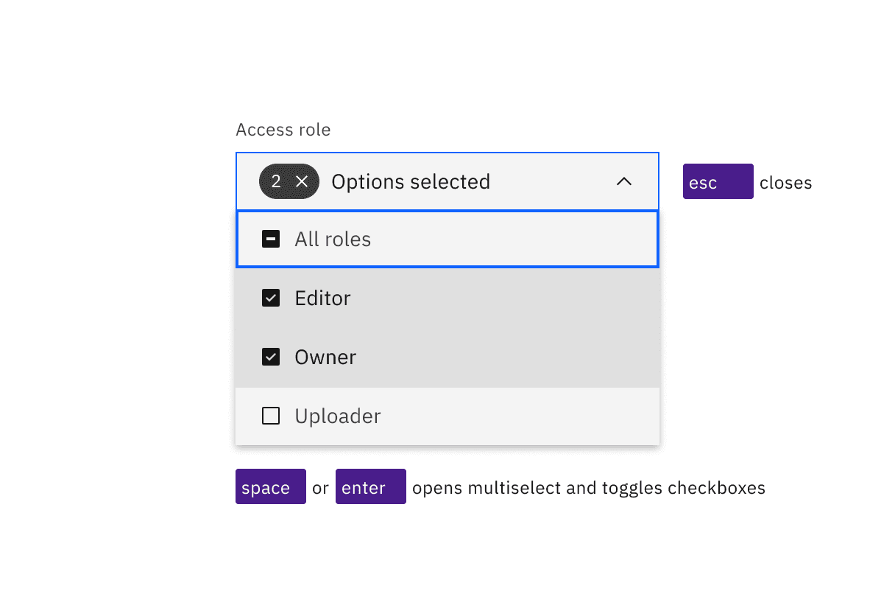
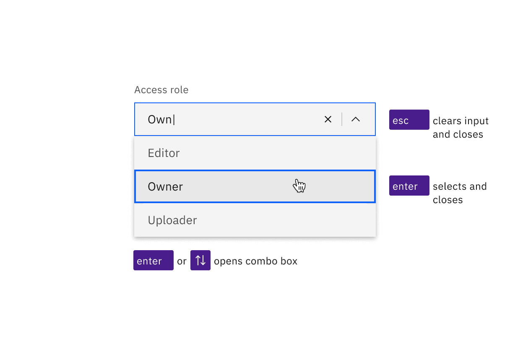

<PageDescription>

No accessibility annotations are needed for dropdowns, but keep these
considerations in mind if you are modifying Carbon or creating a custom
component.

</PageDescription>

<AnchorLinks>

<AnchorLink>What Carbon provides</AnchorLink>
<AnchorLink>Development considerations</AnchorLink>

</AnchorLinks>

## What Carbon provides

Carbon bakes keyboard operation into its components, improving the experience of
blind users and others who operate via the keyboard. Carbon incorporates many
other accessibility considerations, some of which are described below.

### Keyboard interactions

A dropdown component and its variants multiselect and combo box are reached by
`Tab`, with navigation of the options by `Up` and `Down` arrow keys. However,
the keys for opening the component and selecting its options are different for
each variant.

<Row>
<Column colLg={8}>

<Caption>

Dropdowns are in the tab order and operable by Up and Down arrow keys, once
opened.

</Caption>

</Column>
</Row>

#### Dropdown

The default dropdown opens with `Enter`, `Space` or `Down arrow`, with focus
moving to the currently selected option. Arrow keys change options, and any
option with focus is selected with `Space` or `Enter`, which also closes the
dropdown. Pressing `Esc` or `Tab` closes a dropdown without changing the
selected option.

<Row>
<Column colLg={8}>

<Caption>
  The Space and Enter keys can be used to open dropdowns and also select an
  option with focus. Pressing Esc cancels and closes the interaction.
</Caption>

</Column>
</Row>

#### Multiselect

The multiselect opens with the `Enter` or `Space` keys, which are also used to
toggle the selection of any option. Once items are selected, a tag appears in
the field, showing a numerical representation of the number of items selected
along with an ‘x’. Pressing `Esc` closes the multiselect. Pressing `Delete`
while focus is in the collapsed field will clear all selected options.

<Row>
<Column colLg={8}>

<Caption>
  Space and Enter keys open multiselects and toggle the state of the checkboxes
  in the list. Esc closes the list.
</Caption>

</Column>
</Row>

#### Combo box

The combo box has significantly different operation, since it is a combination
of a text input and a dropdown. `Enter` or the `Up` or `Down` arrow keys will
open the list of options, as will typing any character or string of characters
(which will also filter the list to only show items that match the typed
string). Pressing `Esc` will clear the input and collapse the list. Pressing
`Enter` will select a highlighted option and collapse the list. (If nothing is
highlighted in the list, pressing `Enter` will just toggle the combo box open
and closed.) `Space` cannot be used for selecting, as pressing it will submit a
space character into the filter string.

<Row>
<Column colLg={8}>

<Caption>
  Combo boxes can be opened with the Enter or Up and Down arrow keys. Enter
  selects the highlighted option in the list. Esc clears the input and closes
  the combo box.
</Caption>

</Column>
</Row>

## Development considerations

Keep these considerations in mind if you are modifying Carbon or creating a
custom component.

- The dropdown and multiselect variant use a `button` with
  `aria-haspopup="listbox"`.
- The combo box uses an input with `role="combo box"`,
  `aria-autocomplete="list"`, `aria-haspopup="listbox"` and
  `autocomplete="off"`.
- The combo box uses `aria-controls` for a div with `role="listbox"`.
- All variants use `aria-expanded` to track the state of the listbox.
- See the [ARIA authoring practices for combo
  box](https://w3c.github.io/aria-practices/#combo box) for more considerations.
