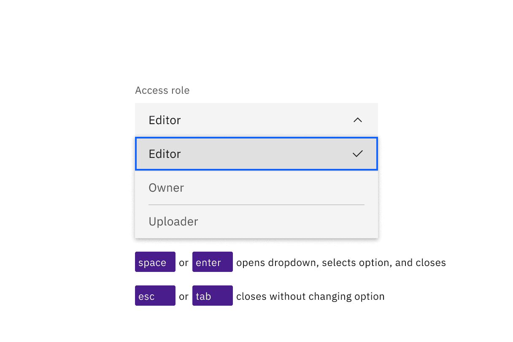

<PageDescription>

CNo accessibility annotations are needed for dropdowns, but keep these
considerations in mind if you are modifying Carbon or creating a custom
component.

</PageDescription>

<AnchorLinks>

<AnchorLink>What Carbon provides</AnchorLink>
<AnchorLink>Design recommendations</AnchorLink>
<AnchorLink>Development considerations</AnchorLink>

</AnchorLinks>

## What Carbon provides

Carbon bakes keyboard operation into its components, improving the experience of
blind users and others who operate via the keyboard. Carbon incorporates many
other accessibility considerations, some of which are described below.

### Keyboard interactions

A dropdown component and its variants multiselect and combobox are reached by
`Tab`, with navigation of the options by `Up` and `Down` arrow keys. However,
the keys for opening the component and selecting its options are different for
each variant.

<Row>
<Column colLg={8}>

<Caption>

Dropdowns are in the tab order and operable by Up and Down arrow keys, once
opened.

</Caption>

</Column>
</Row>

The dropdown opens with `Enter`, `Space` or `Down arrow`, with focus moving to
the selected option. Options are selected with `Space` or `Enter`, which also
closes the dropdown. Pressing `Esc` or `Tab` closes a dropdown without changing
the selected option.

<Row>
<Column colLg={8}>

<Caption>Need to update</Caption>

</Column>
</Row>

The multiselect opens with `Enter` or `Space`, which are also used to toggle the
selection of any option. Once items are selected, a tag appears in the field,
showing a numerical representation of the number of items selected along with an
‘x’. Pressing `Esc` closes the multiselect. Pressing `Delete` while focus is in
the collapsed field will clear all selected options.

<Row>
<Column colLg={8}>

<Caption>Need to update</Caption>

</Column>
</Row>

## Development considerations

Keep these considerations in mind if you are modifying Carbon or creating a
custom component.

- The dropdown and multiselect variant use a `button` with
  `aria-haspopup="listbox"`.
- The combobox uses an input with `role="combobox"`, `aria-autocomplete="list"`,
  `aria-haspopup="listbox"` and `autocomplete="off"`.
- The combobox uses `aria-controls` for a div with `role="listbox"`.
- All variants use `aria-expanded` to track the state of the listbox.
- See the
  [ARIA authoring practices for combobox](https://w3c.github.io/aria-practices/#combobox)
  for more considerations.
