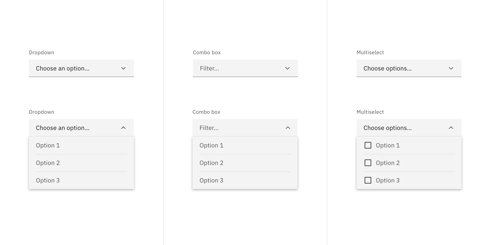
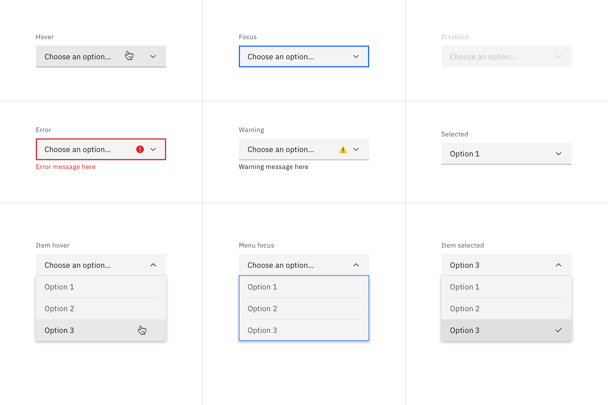
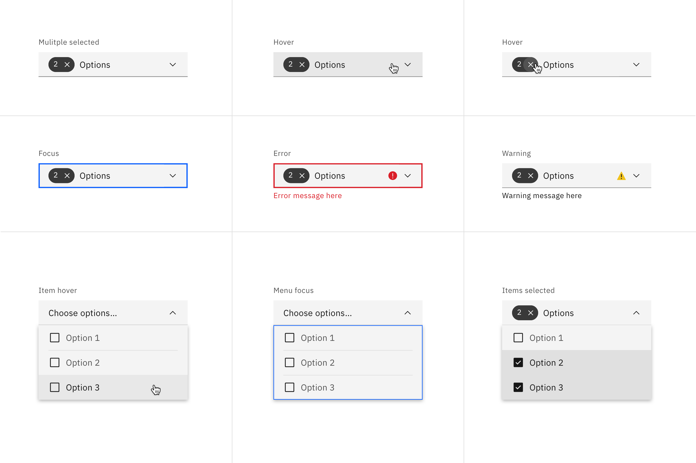
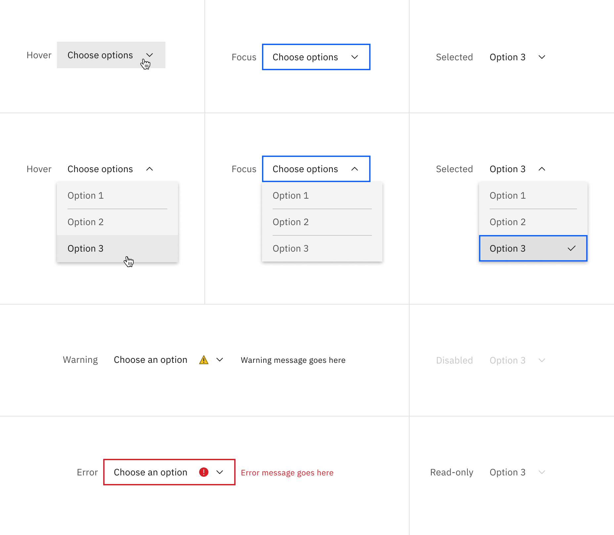
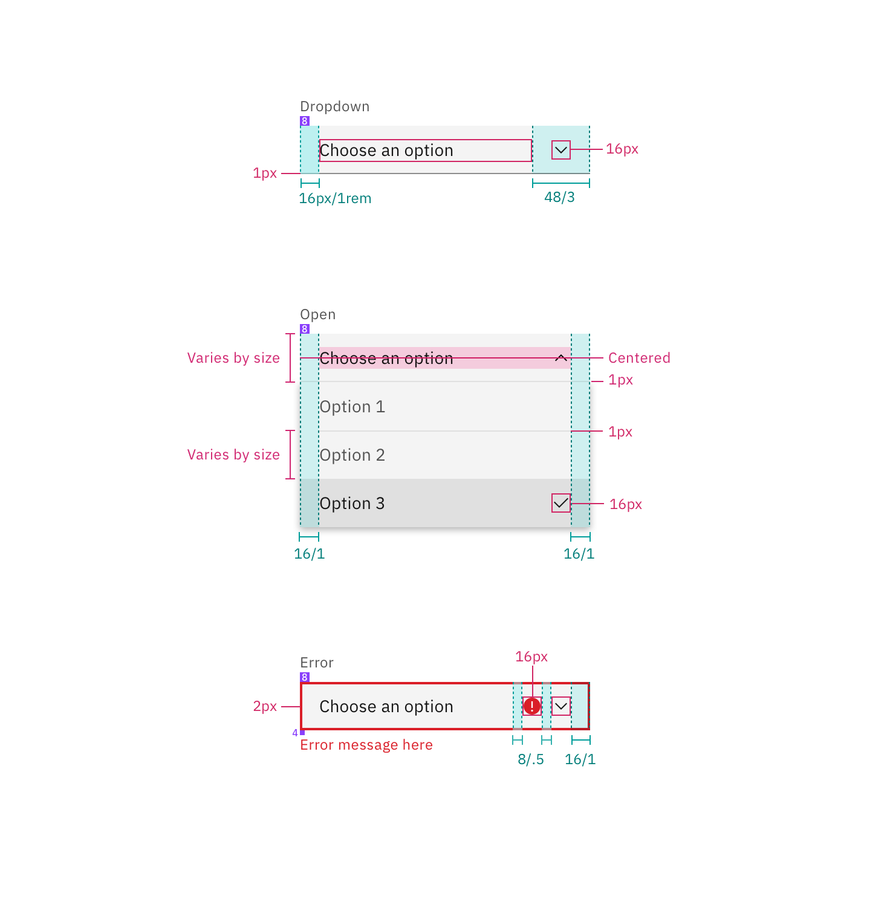
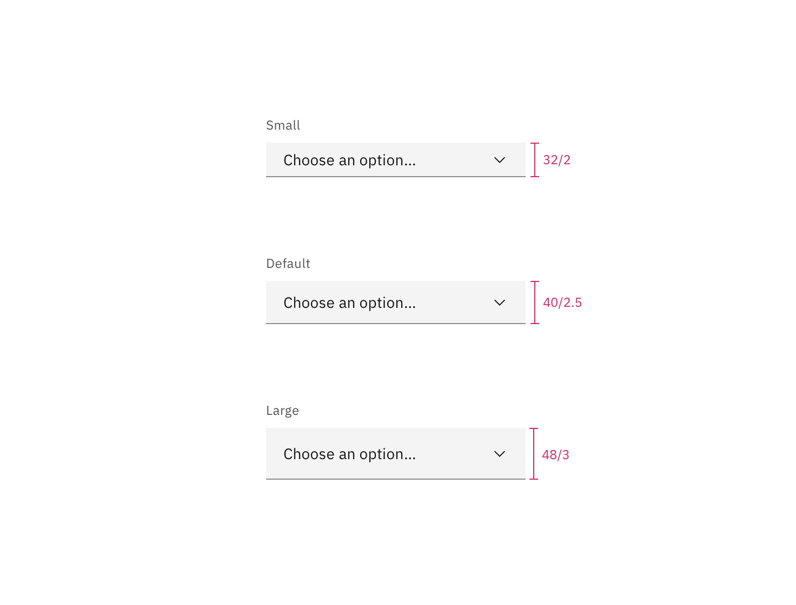
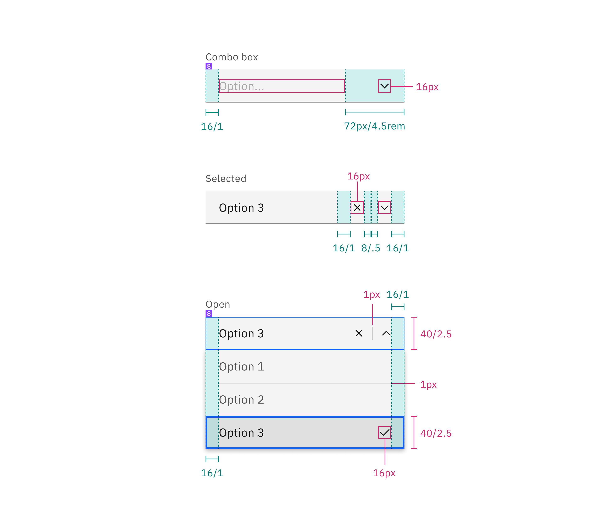
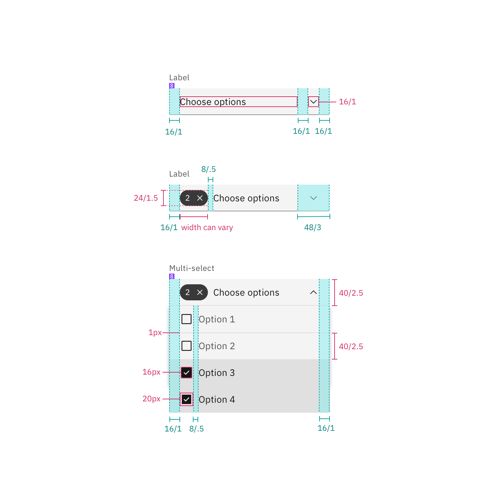
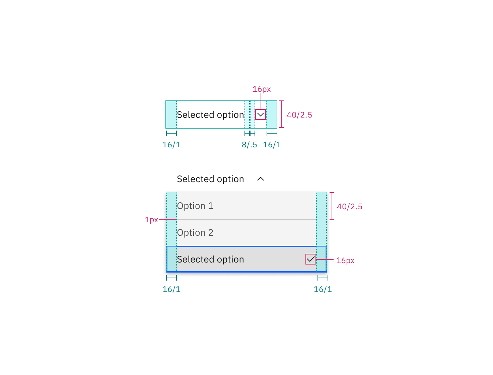

## Color

| Element            | Property         | Color token                  |
| ------------------ | ---------------- | ---------------------------- |
| Label              | text-color       | `$text-secondary`            |
| Field text         | text-color       | `$text-primary`              |
| Field text: prompt | text-color       | `$text-helper`               |
| Helper text        | text-color       | `$text-helper`               |
| Field              | background-color | `$field`                     |
|                    | border-bottom    | `$border-strong`             |
| Chevron icon       | svg              | `$icon-primary`              |
| Menu option        | text-color       | `$text-secondary`            |
|                    | background-color | `$field`                     |
|                    | border-top       | `$border-subtle`             |
| Menu               | box-shadow       | `0 2px 6px 0 rgba(0,0,0,.2)` |
| Checkbox icon      | background-color | `$icon-primary`              |
|                    | check            | `$icon-inverse`              |
|                    | border           | `$icon-primary`              |

<Row>
<Column colLg={12}>

</Column>
</Row>

<Caption>
  Dropdown variant examples: default, inline, multiselect, combo box.
</Caption>

### Interactive states

| State          | Element         | Property         | Color token           |
| -------------- | --------------- | ---------------- | --------------------- |
| Focus          | Field           | border           | `$focus`              |
| Hover          | Field           | background-color | `$layer-hover`        |
|                | Menu option     | background-color | `$layer-hover`        |
|                | Menu option     | text-color       | `$text-primary`       |
| Invalid        | Error icon      | svg              | `$support-error`      |
|                | Field           | border           | `$support-error`      |
|                | Error message   | text-color       | `$text-error`         |
| Warning        | Warning message | text-color       | `$text-primary`       |
|                | Warning icon    | svg              | `$support-warning`    |
| Active         | Menu option     | background-color | `$layer-selected`     |
| Selected       | Menu option     | background-color | `$layer-selected`     |
|                | Menu option     | checkmark        | `$icon-primary`       |
| Multi-selected | Tag             | background-color | `$background-inverse` |
|                | Tag             | text-color       | `$text-inverse`       |
| Disabled       | Field           | background-color | `$field-disabled`     |
|                | Field           | text-color       | `$text-disabled`      |
|                | Label           | text-color       | `$text-disabled`      |
|                | Chevron icon    | svg              | `$icon-disabled`      |

<Row>
<Column colLg={12}>

</Column>
</Row>

<Caption>Dropdown and combo box states</Caption>

<Row>
<Column colLg={12}>

</Column>
</Row>

<Caption>Multiselect dropdown states</Caption>

### Inline dropdown

| State    | Element       | Property         | Color token            |
| -------- | ------------- | ---------------- | ---------------------- |
| Enabled  | Field         | background-color | `transparent`          |
|          | Field text    | text-color       | `$text-primary`        |
|          | Chevron icon  | svg              | `$icon-primary`        |
|          | Menu option   | text-color       | `$text-secondary`      |
|          | Menu option   | background-color | `$field`               |
| Hover    | Field         | background-color | `$background-hover`    |
|          | Menu option   | background-color | `$background-hover`    |
|          | Menu option   | text-color       | `$text-primary`        |
| Active   | Menu option   | background-color | `$background-selected` |
| Selected | Menu option   | background-color | `$background-selected` |
|          | Menu option   | checkmark        | `$icon-primary`        |
| Invalid  | Field         | border           | `$support-error`       |
|          | Error message | text-color       | `$text-error`          |
|          | Error icon    | svg              | `$support-error`       |

<Row>
<Column colLg={12}>

</Column>
</Row>

<Caption>Inline dropdown states</Caption>

## Typography

All dropdown text should be set in sentence case, with only the first word in a
phrase and any proper nouns capitalized. Dropdown options should not exceed
three words.

| Element          | Font-size  | Font-weight   | Type token        |
| ---------------- | ---------- | ------------- | ------------------|
| Label            | 12 / 0.75  | Regular / 400 | `$label-01`       |
| Field text       | 14 / 0.875 | Regular / 400 | `$body-short-01`  |
| Menu option text | 14 / 0.875 | Regular / 400 | `$body-short-01`  |
| Error message    | 12 / 0.75  | Regular / 400 | `$label-01`       |
| Helper text      | 12 / 0.75  | Regular / 400 | `$helper-text-01` |

## Structure

Dropdowns have two states, open and closed. An open and closed dropdown should
be the same width and appropriately fit the design, layout, and content. The
height of a closed dropdown stays consistent while the height of an open
dropdown will vary based on the amount of options it has. Please note the
various color differences for closed and open dropdowns.

| Element      | Property                    | px / rem | Spacing token |
| ------------ | --------------------------- | -------- | ------------- |
| Label        | margin-bottom               | 8 / 0.5  | `$spacing-03` |
| Field        | padding-left                | 16 / 1   | `$spacing-05` |
|              | padding-right               | 48 / 3   | `$spacing-09` |
|              | border-bottom               | 1px      | –             |
| Chevron icon | padding-right, padding-left | 16 / 1   | `$spacing-05` |
| Helper text  | margin-top                  | 4 / 0.25 | `$spacing-02` |
| State icon   | padding-right, padding-left | 16 / 1   | `$spacing-05` |

<Caption>Structure and spacing measurements for dropdown | px / rem</Caption>

### Sizes

The field height and menu option height should always match. These sizes options
can be applied to all variants of dropdown.

| Element     | Property | Size    | px / rem |
| ----------- | -------- | ------- | -------- |
| Field       | height   | Small   | 32 / 2   |
|             | height   | Default | 40 / 2.5 |
|             | height   | Large   | 48 / 3   |
| Menu option | height   | Small   | 32 / 2   |
|             | height   | Default | 40 / 2.5 |
|             | height   | Large   | 48 / 3   |

<Caption>Dropdown sizes | px / rem</Caption>

### Combo box

| Element      | Property      | px / rem | Spacing token |
| ------------ | ------------- | -------- | ------------- |
| Label        | margin-bottom | 8 / 0.5  | `$spacing-03` |
| Field        | padding-left  | 16 / 1   | `$spacing-05` |
|              | padding-right | 72 / 4.5 | –             |
| Chevron icon | padding-right | 16 / 1   | `$spacing-05` |
| Clear icon   | padding-right | 8 / 0.5  | `$spacing-03` |

<Caption>Spacing for combo box dropdown | px / rem</Caption>

### Multiselect dropdown

| Element       | Property                    | px / rem | Spacing token |
| ------------- | --------------------------- | -------- | ------------- |
| Label         | margin-bottom               | 8 / 0.5  | `$spacing-03` |
| Field         | padding-left                | 16 / 1   | `$spacing-05` |
|               | padding-right               | 48 / 3   | `$spacing-09` |
| Chevron icon  | padding-left, padding-right | 16 / 1   | `$spacing-05` |
| Tag           | height                      | 24 / 1.5 | –             |
|               | padding-right               | 8 / 0.5  | `$spacing-03` |
| Checkbox icon | padding-left                | 16 / 1   | `$spacing-05` |
|               | padding-right               | 8 / 0.5  | `$spacing-03` |

<Caption>
  Structure and spacing measurements for a multiselect dropdown | px / rem
</Caption>

### Inline dropdown

| Element      | Property                    | px / rem | Spacing token |
| ------------ | --------------------------- | -------- | ------------- |
| Field text   | padding-right, padding-left | 16 / 1   | `$spacing-05` |
| Menu option  | padding-right, padding-left | 16 / 1   | `$spacing-05` |
| Chevron icon | padding-left                | 16 / 1   | `$spacing-05` |

<Caption>Structure and spacing for inline dropdown | px / rem</Caption>
