<PageDescription>

The following page documents visual specifications such as color, typography,
structure, and size and AI presence.

</PageDescription>

<AnchorLinks>

<AnchorLink>Color</AnchorLink>
<AnchorLink>Typography</AnchorLink>
<AnchorLink>Structure</AnchorLink>
<AnchorLink>Sizes</AnchorLink>
<AnchorLink>AI presence</AnchorLink>

</AnchorLinks>

## Color

| Element            | Property         | Color token                  |
| ------------------ | ---------------- | ---------------------------- |
| Label              | text-color       | `$text-secondary`            |
| Field text         | text-color       | `$text-primary`              |
| Field text: prompt | text-color       | `$text-helper`               |
| Helper text        | text-color       | `$text-helper`               |
| Field              | background-color | `$field` \*                  |
|                    | border-bottom    | `$border-strong` \*          |
| Chevron icon       | svg              | `$icon-primary`              |
| Vertical divider   | border           | `$border-subtle` \*          |
| Menu option        | text-color       | `$text-secondary`            |
|                    | background-color | `$layer` \*                  |
|                    | border-top       | `$border-subtle` \*          |
| Menu               | box-shadow       | `0 2px 6px 0 rgba(0,0,0,.2)` |
| Checkbox icon      | background-color | `$icon-primary`              |
|                    | check            | `$icon-inverse`              |
|                    | border           | `$icon-primary`              |

<Caption fullWidth>
  \* Denotes a contextual color token that will change values based on the layer
  it is placed on.
</Caption>

<Row>
<Column colLg={12}>

<Tabs>

<Tab label="Default">

</Tab>

<Tab label="Fluid">

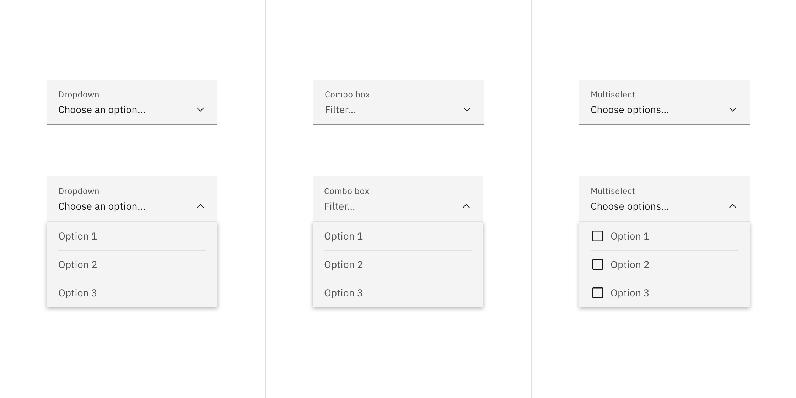

</Tab>

</Tabs>

</Column>
</Row>

<Caption>Color states of dropdown, combo box, and multiselect.</Caption>

### Interactive states

| State         | Element              | Property         | Color token           |
| ------------- | -------------------- | ---------------- | --------------------- |
| Focus         | Field                | border           | `$focus`              |
| Hover         | Field                | background-color | `$field-hover` \*     |
|               | Menu option          | background-color | `$layer-hover` \*     |
|               | Menu option          | text-color       | `$text-primary`       |
| Invalid       | Error icon           | svg              | `$support-error`      |
|               | Field                | border           | `$support-error`      |
|               | Error message        | text-color       | `$text-error`         |
| Warning       | Warning message      | text-color       | `$text-primary`       |
|               | Warning icon         | svg              | `$support-warning`    |
| Active        | Menu option          | background-color | `$layer-active` \*    |
| Selected      | Chevron icon         | svg              | `$icon-primary`       |
|               | Vertical divider     | border           | `$border-subtle` \*   |
|               | Close icon           | svg              | `$icon-primary`       |
|               | Menu option          | background-color | `$layer-selected` \*  |
|               | Menu option          | checkmark        | `$icon-primary`       |
| Multiselected | Tag                  | background-color | `$background-inverse` |
|               | Tag                  | text-color       | `$text-inverse`       |
| Disabled      | Field                | background-color | `$field` \*           |
|               | Field (default)      | border-bottom    | transparent           |
|               | Field (fluid)        | border-bottom    | `$border-subtle` \*   |
|               | Field                | text-color       | `$text-disabled`      |
|               | Label                | text-color       | `$text-disabled`      |
|               | Chevron icon         | svg              | `$icon-disabled`      |
| Read-only     | Field                | border-bottom    | `$border-subtle` \*   |
|               | Field (default)      | background-color | transparent           |
|               | Field (fluid)        | background-color | `$field` \*           |
|               | Label                | text-color       | `$text-secondary`     |
|               | Field text (default) | text-color       | `$text-primary`       |
|               | Field text (fluid)   | text-color       | `$text-secondary`     |
|               | Tag                  | background-color | transparent           |
|               | Tag                  | border           | `$border-subtle`      |
|               | Tag (default)        | text-color       | `$text-primary`       |
|               | Tag (fluid)          | text-color       | `$text-secondary`     |
|               | Tag                  | svg              | `$icon-disabled`      |

<Caption fullWidth>
  \* Denotes a contextual color token that will change values based on the layer
  it is placed on.
</Caption>

<Row>
<Column colLg={12}>

<Tabs>

<Tab label="Default">

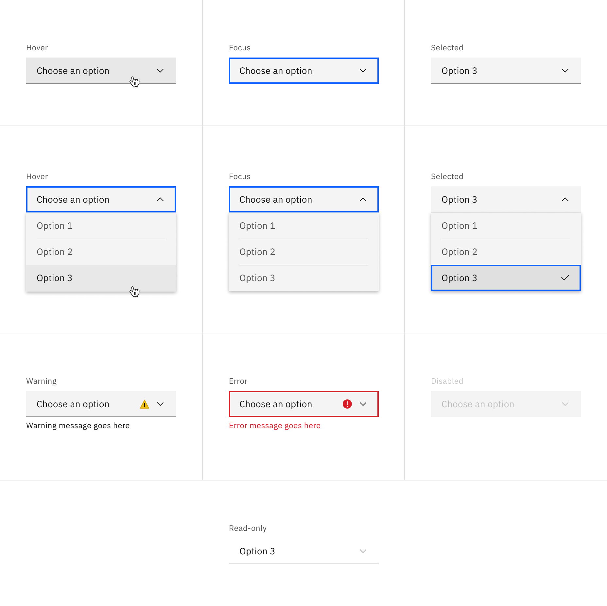

</Tab>

<Tab label="Fluid">

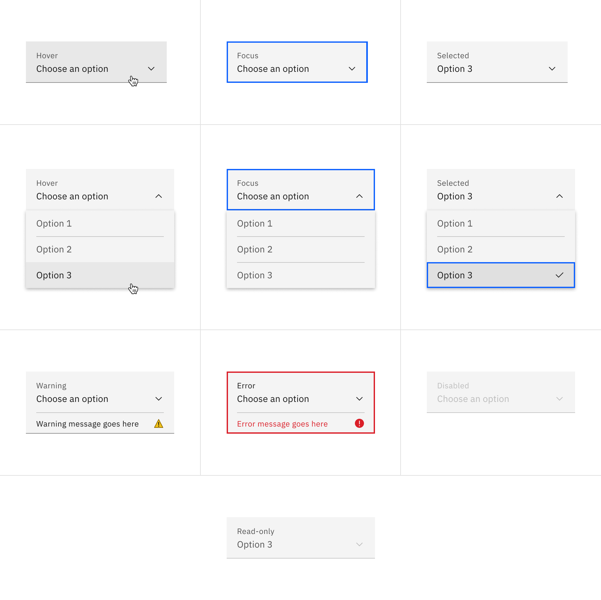

</Tab>

</Tabs>

</Column>
</Row>

<Caption>Dropdown interactive states</Caption>

<Row>
<Column colLg={12}>

<Tabs>

<Tab label="Default">

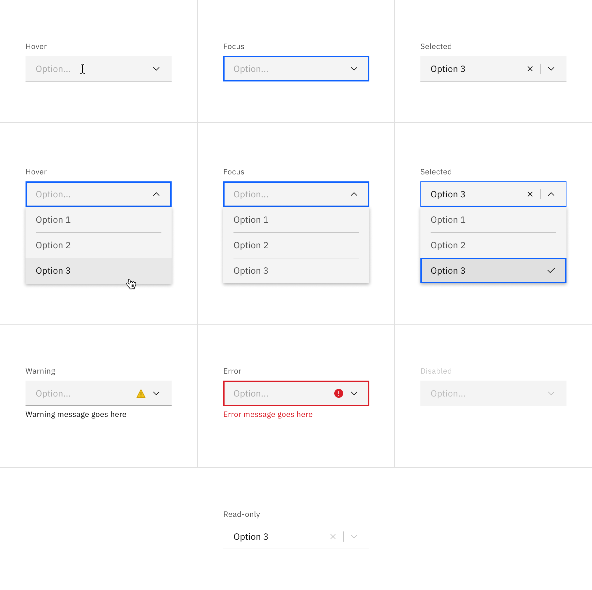

</Tab>

<Tab label="Fluid">

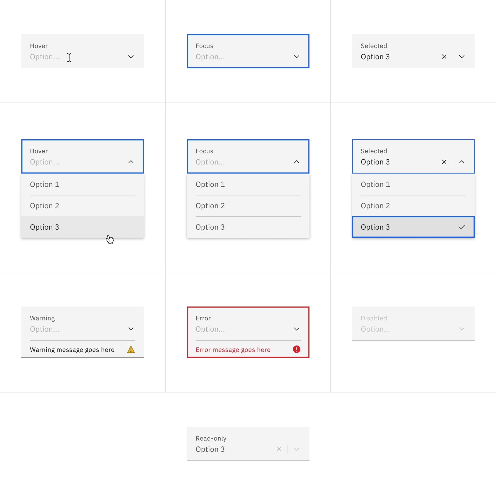

</Tab>

</Tabs>

</Column>
</Row>

<Caption>Combo box interactive states</Caption>

<Row>
<Column colLg={12}>

<Tabs>

<Tab label="Default">

</Tab>

<Tab label="Fluid">

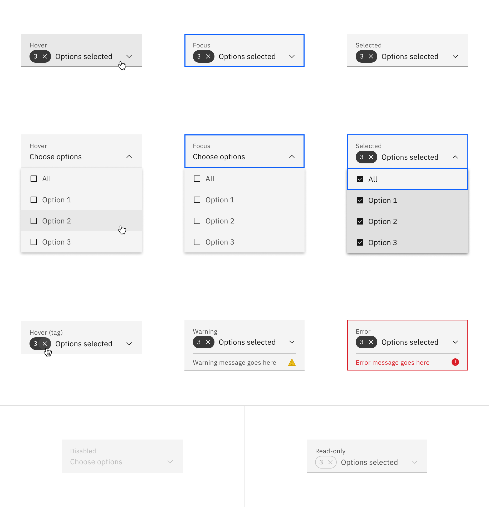

</Tab>

</Tabs>

</Column>
</Row>

<Caption>Multiselect interactive states</Caption>

### Inline dropdown

| State    | Element       | Property         | Color token          |
| -------- | ------------- | ---------------- | -------------------- |
| Enabled  | Field         | background-color | transparent          |
|          | Field text    | text-color       | `$text-primary`      |
|          | Chevron icon  | svg              | `$icon-primary`      |
|          | Menu option   | text-color       | `$text-secondary`    |
|          | Menu option   | background-color | `$layer` \*          |
| Hover    | Field         | background-color | `$field-hover` \*    |
|          | Menu option   | background-color | `$layer-hover` \*    |
|          | Menu option   | text-color       | `$text-primary`      |
| Active   | Menu option   | background-color | `$layer-active` \*   |
| Selected | Menu option   | background-color | `$layer-selected` \* |
|          | Menu option   | checkmark        | `$icon-primary`      |
| Invalid  | Field         | border           | `$support-error`     |
|          | Error message | text-color       | `$text-error`        |
|          | Error icon    | svg              | `$support-error`     |

<Caption fullWidth>
  \* Denotes a contextual color token that will change values based on the layer
  it is placed on.
</Caption>

<Row>
<Column colLg={12}>

</Column>
</Row>

<Caption>Inline dropdown states</Caption>

## Typography

All dropdown text should be set in sentence case, with only the first word in a
phrase and any proper nouns capitalized. Dropdown menu option text should not
exceed three words.

| Element          | Font-size (px/rem) | Font-weight   | Type token         |
| ---------------- | ------------------ | ------------- | ------------------ |
| Label            | 12 / 0.75          | Regular / 400 | `$label-01`        |
| Field text       | 14 / 0.875         | Regular / 400 | `$body-compact-01` |
| Menu option text | 14 / 0.875         | Regular / 400 | `$body-compact-01` |
| Helper text      | 12 / 0.75          | Regular / 400 | `$helper-text-01`  |
| Error message    | 12 / 0.75          | Regular / 400 | `$label-01`        |

## Structure

Dropdowns have two states, open and closed. An open and closed dropdown should
be the same width and appropriately fit the design, layout, and content.

### Default dropdown

| Element      | Property                    | px / rem | Spacing token |
| ------------ | --------------------------- | -------- | ------------- |
| Label        | margin-bottom               | 8 / 0.5  | `$spacing-03` |
| Field        | padding-left                | 16 / 1   | `$spacing-05` |
|              | padding-right               | 48 / 3   | `$spacing-09` |
|              | border-bottom               | 1px      | –             |
| Chevron icon | padding-right, padding-left | 16 / 1   | `$spacing-05` |
| Helper text  | margin-top                  | 4 / 0.25 | `$spacing-02` |
| State icon   | padding-right, padding-left | 16 / 1   | `$spacing-05` |

<Caption fullwidth>
  Structure and spacing measurements for default dropdown | px / rem
</Caption>

### Fluid dropdown

Fluid components for all dropdown variants would adhere to the same specs as the
dropdown fluid component.

| Element      | Property                    | px / rem   | Spacing token |
| ------------ | --------------------------- | ---------- | ------------- |
| Label        | margin-bottom               | 4 / 0.25   | `$spacing-02` |
| Field        | padding-left                | 16 / 1     | `$spacing-05` |
|              | padding-right               | 48 / 3     | `$spacing-09` |
|              | border-bottom               | 1px        | –             |
|              | margin-top, margin-bottom   | 13 / .8125 | –             |
| Chevron icon | padding-right, padding-left | 16 / 1     | `$spacing-05` |
| State icon   | padding-right, padding-left | 16 / 1     | `$spacing-05` |

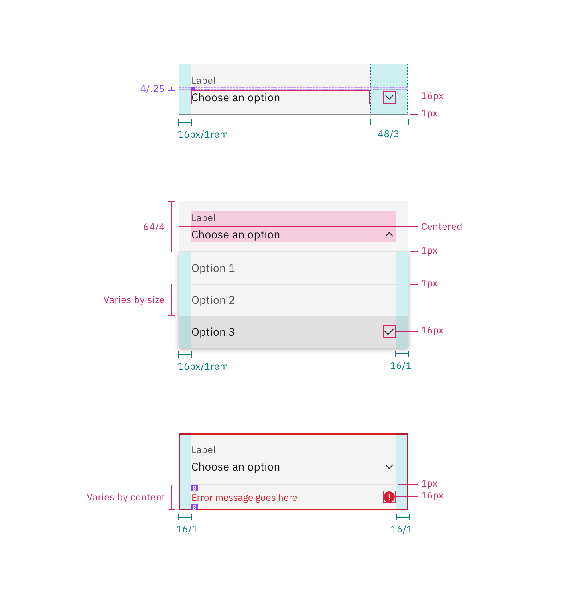

<Caption fullwidth>
  Structure and spacing measurements for a fluid dropdown | px / rem
</Caption>

### Combo box

| Element          | Property                    | px / rem | Spacing token |
| ---------------- | --------------------------- | -------- | ------------- |
| Label            | margin-bottom               | 8 / 0.5  | `$spacing-03` |
| Field            | padding-left                | 16 / 1   | `$spacing-05` |
|                  | padding-right               | 72 / 4.5 | –             |
| Chevron icon     | padding-right               | 16 / 1   | `$spacing-05` |
| Vertical divider | padding-right, padding-left | 8 / 0.5  | `$spacing-03` |
| Clear icon       | padding-right               | 8 / 0.5  | `$spacing-03` |

<Caption>Spacing for combo box dropdown | px / rem</Caption>

### Multiselect dropdown

| Element       | Property                    | px / rem | Spacing token |
| ------------- | --------------------------- | -------- | ------------- |
| Label         | margin-bottom               | 8 / 0.5  | `$spacing-03` |
| Field         | padding-left                | 16 / 1   | `$spacing-05` |
|               | padding-right               | 48 / 3   | `$spacing-09` |
| Chevron icon  | padding-left, padding-right | 16 / 1   | `$spacing-05` |
| Tag           | height                      | 24 / 1.5 | –             |
|               | padding-right               | 8 / 0.5  | `$spacing-03` |
| Checkbox icon | padding-left                | 16 / 1   | `$spacing-05` |
|               | padding-right               | 8 / 0.5  | `$spacing-03` |

<Caption fullwidth>
  Structure and spacing measurements for a multiselect dropdown | px / rem
</Caption>

### Inline dropdown

| Element      | Property                    | px / rem | Spacing token |
| ------------ | --------------------------- | -------- | ------------- |
| Field text   | padding-right, padding-left | 16 / 1   | `$spacing-05` |
| Menu option  | padding-right, padding-left | 16 / 1   | `$spacing-05` |
| Chevron icon | padding-left                | 16 / 1   | `$spacing-05` |

<Caption>Structure and spacing for inline dropdown | px / rem</Caption>

## Sizes

### Default inputs

The field height and menu option height should always match. These size options
can be applied to all variants of dropdown.

| Element   | Size        | Height px / rem |
| --------- | ----------- | --------------- |
| Field     | Small (sm)  | 32 / 2          |
|           | Medium (md) | 40 / 2.5        |
|           | Large (lg)  | 48 / 3          |
| Menu item | Small (sm)  | 32 / 2          |
|           | Medium (md) | 40 / 2.5        |
|           | Large (lg)  | 48 / 3          |

<Row>
<Column colLg={12}>

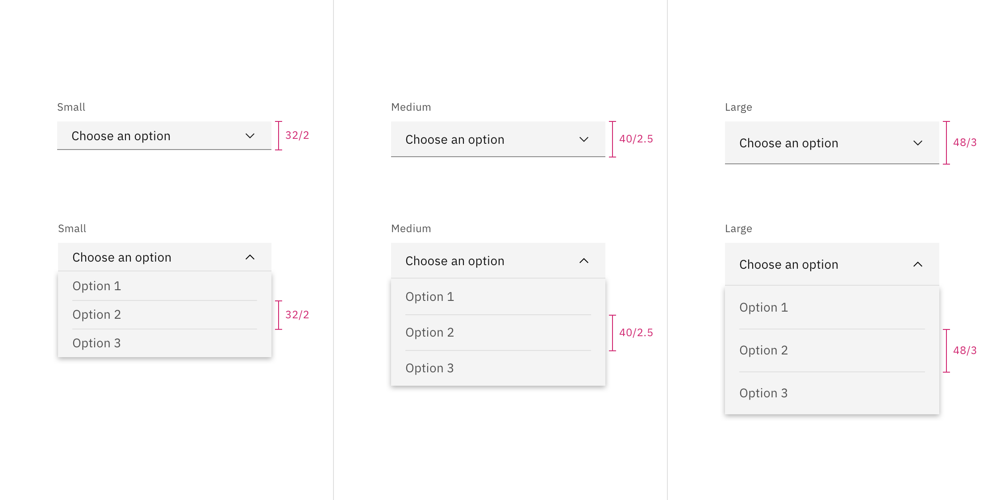

</Column>
</Row>

<Caption>Default dropdown sizes | px / rem</Caption>

### Fluid inputs

There is only one input height but there are two menu item sizes–default and
condensed.

| Element   | Size      | Height px / rem |
| --------- | --------- | --------------- |
| Field     | Default   | 64 / 4          |
| Menu item | Default   | 64 / 4          |
|           | Condensed | 40 / 2.5        |

<Row>
<Column colLg={8}>

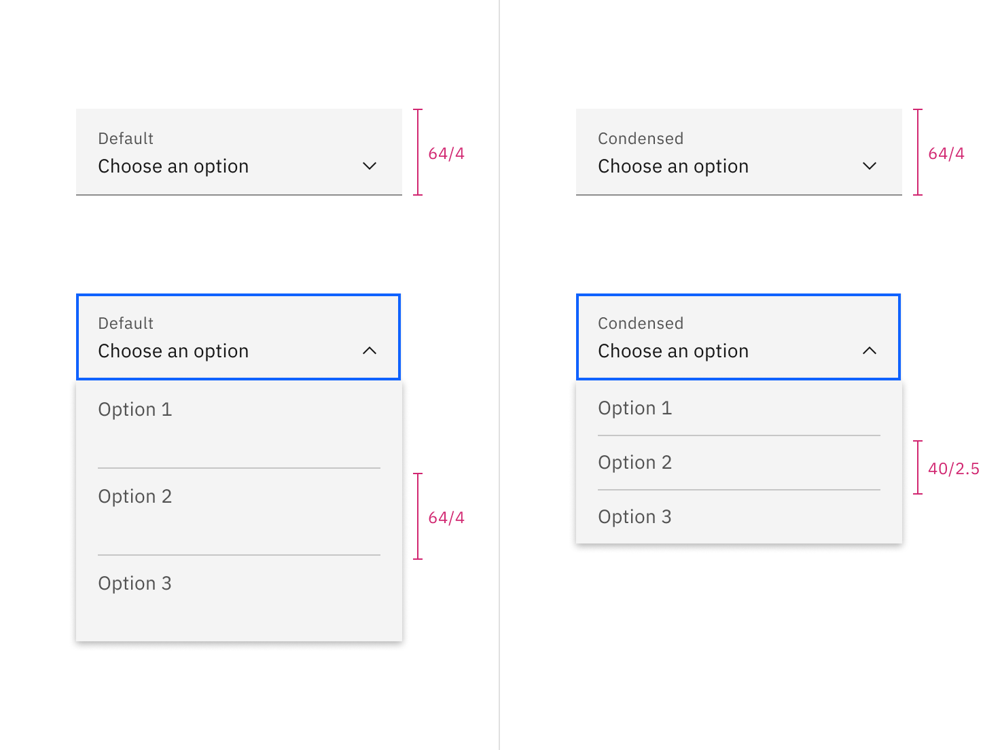

</Column>
</Row>

<Caption>Fluid dropdown sizes | px / rem</Caption>

## AI presence

The following are the unique styles applied to the component when the AI label
is present. Unless specified, all other tokens in the component remain the same
as the non-AI variant.

For more information on the AI style elements, see the
[Carbon for AI](/guidelines/carbon-for-ai/) guidelines.

| Element         | Property         | Token / Size        |
| --------------- | ---------------- | ------------------- |
| Linear gradient | start            | `$ai-aura-start-sm` |
|                 | stop             | `$ai-aura-stop`     |
| Field           | border-bottom    | `$ai-border-strong` |
|                 | background color | `$field`\*          |
| AI label        | size             | mini                |

<Caption fullWidth>
  \* Denotes a contextual color token that will change values based on the layer
  it is placed on.
</Caption>

<Row>
<Column colLg={8}>

<Tabs>

<Tab label="Default">

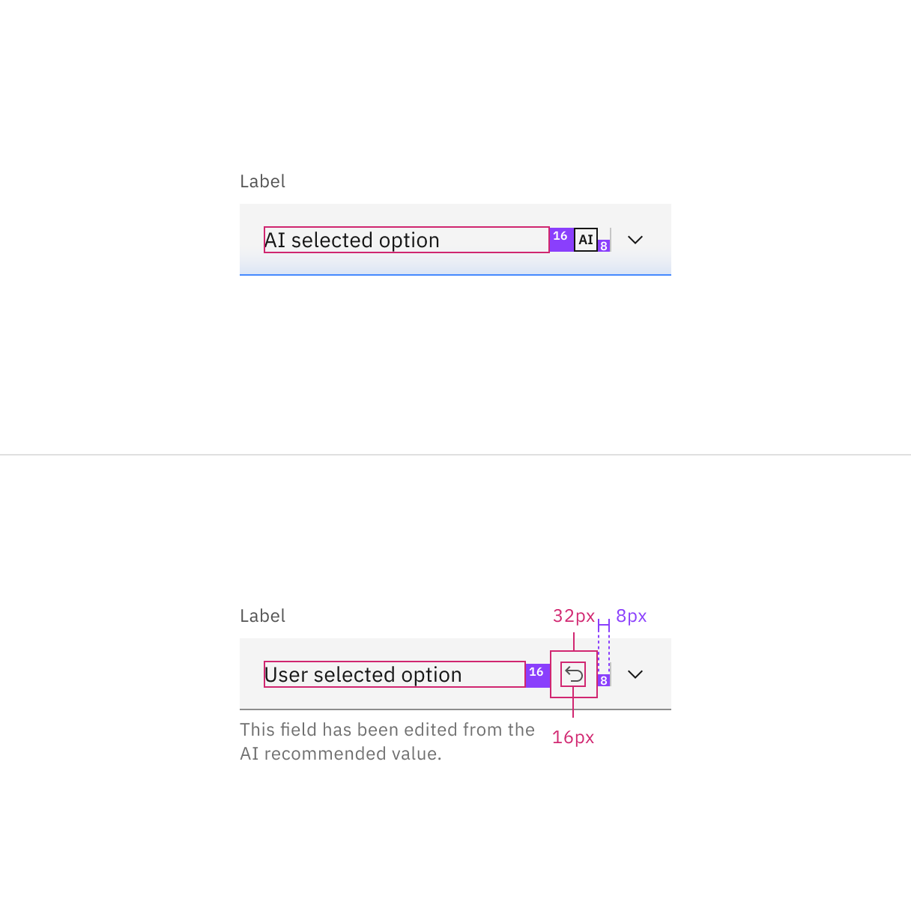

</Tab>

<Tab label="Fluid">

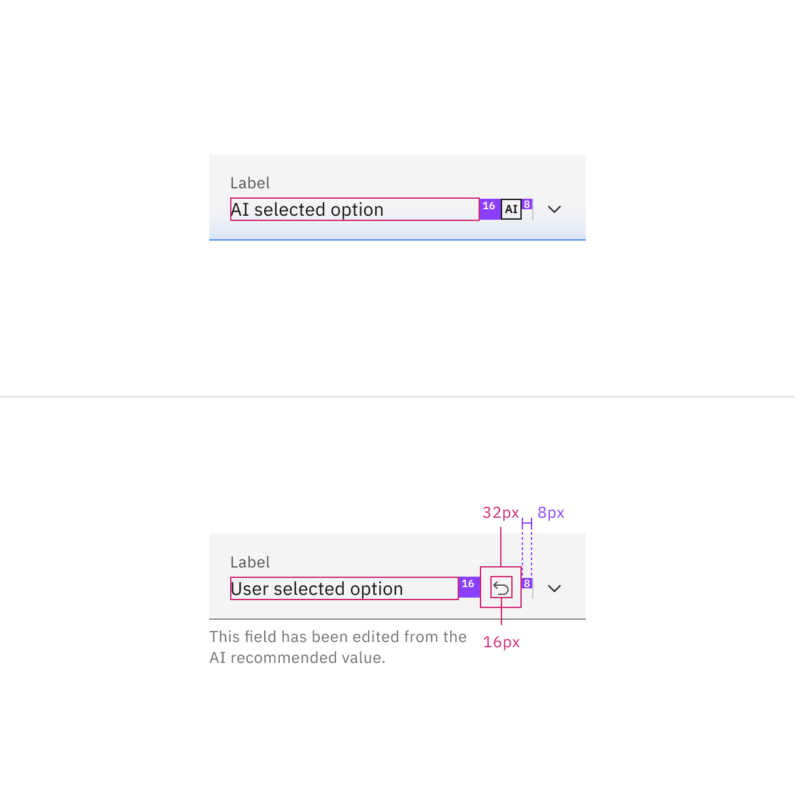

</Tab>

</Tabs>

</Column>
</Row>
