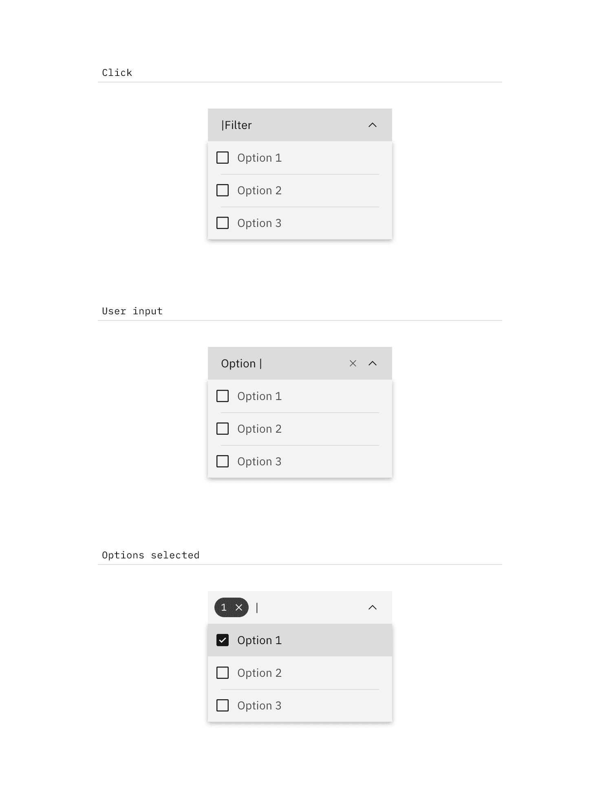

<PageDescription>

Dropdowns present a list of options that can be used to filter or sort existing
content.

</PageDescription>

<AnchorLinks>

<AnchorLink>Overview</AnchorLink>
<AnchorLink>Live demo</AnchorLink>
<AnchorLink>Variations</AnchorLink>
<AnchorLink>Content</AnchorLink>
<AnchorLink>Interactions</AnchorLink>
<AnchorLink>Feedback</AnchorLink>

</AnchorLinks>

import items from '../../../data/components/dropdown.js';

## Overview

Dropdowns present a list of options that can be used to filter or sort existing content.

They can also be used as menus. Their use as menus can be seen in [tabs](/components/tabs/usage). At a smaller screen size, the tabs collapse into a dropdown.

### Dropdown versus Select

While the dropdown and select components look similar, they have different functions.

- Use the dropdown component to filter or sort content on a page.
- Use the select component inside a form where users are selecting from a list of options and submitting data.

Another important difference between the two components is the underlying code. The dropdown component is styled to match the design system, while the select component's appearance will be determined by the browser being used.

## Live demo

<ComponentDemo
  components={[
    {
      id: 'default-dropdown',
      label: 'Default',
    },
    {
      id: 'combo-box',
      label: 'Combo box',
    },
    {
      id: 'multiselect',
      label: 'Multiselect',
    },
    {
      id: 'filter-multiselect',
      label: 'Filterable multiselect',
    },
  ]}
  scope={{ items }}>
  <ComponentVariant
    id="default-dropdown"
    knobs={{
      Dropdown: ['light', 'disabled'],
    }}
    links={{
      React:
        'https://react.carbondesignsystem.com/?path=/story/dropdown--default',
      Angular:
        'https://angular.carbondesignsystem.com/?path=/story/components-dropdown--basic',
      Vue:
        'http://vue.carbondesignsystem.com/?path=/story/components-cvdropdown--default',
      Vanilla: 'https://the-carbon-components.netlify.com/?nav=dropdown',
    }}>{`
    <Dropdown
      ariaLabel="Dropdown"
      id="carbon-dropdown-example"
      items={items}
      label="Dropdown menu options"
      titleText="This is a dropdown title."
    />
  `}</ComponentVariant>
  <ComponentVariant
    id="combo-box"
    knobs={{
      ComboBox: ['light', 'disabled'],
    }}
    links={{
      React:
        'https://react.carbondesignsystem.com/?path=/story/combobox--default',
      Angular:
        'https://angular.carbondesignsystem.com/?path=/story/components-dropdown--basic',
      Vue:
        'http://vue.carbondesignsystem.com/?path=/story/components-cvcombobox--default',
      Vanilla: 'https://the-carbon-components.netlify.com/?nav=dropdown',
    }}>{`
    <ComboBox
      ariaLabel="ComboBox"
      id="carbon-combobox-example"
      items={items}
      label="ComboBox menu options"
      titleText="This is a dropdown title."
    />
  `}</ComponentVariant>
  <ComponentVariant
    id="multiselect"
    knobs={{
      MultiSelect: ['light', 'disabled'],
    }}
    links={{
      React:
        'https://react.carbondesignsystem.com/?path=/story/multiselect--default',
      Angular:
        'https://angular.carbondesignsystem.com/?path=/story/components-dropdown--basic',
      Vue:
        'http://vue.carbondesignsystem.com/?path=/story/components-cvmultiselect--default',
      Vanilla: 'https://the-carbon-components.netlify.com/?nav=dropdown',
    }}>{`
    <MultiSelect
      ariaLabel="MultiSelect"
      id="carbon-multiselect-example"
      items={items}
      label="MultiSelect menu options"
      titleText="This is a dropdown title."
    />
  `}</ComponentVariant>
  <ComponentVariant
    id="filter-multiselect"
    links={{
      React:
        'https://react.carbondesignsystem.com/?path=/story/multiselect--filterable',
      Angular:
        'https://angular.carbondesignsystem.com/?path=/story/components-dropdown--basic',
      Vue:
        'http://vue.carbondesignsystem.com/?path=/story/components-cvmultiselect--user-filter-and-or-highlight',
      Vanilla: 'https://the-carbon-components.netlify.com/?nav=dropdown',
    }}>{`
    <MultiSelect.Filterable
      ariaLabel="Filterable MultiSelect"
      id="carbon--filterable-multiselect-example"
      items={items}
      label="Filterable MultiSelect options"
      titleText="This is a MultiSelect title."
    />
 `}</ComponentVariant>
</ComponentDemo>

## Sample data

```javascript
const items = [
  {
    id: 'option-1',
    text: 'Option 1',
  },
  {
    id: 'option-2',
    text: 'Option 2',
  },
  {
    id: 'option-3',
    text: 'Option 3',
  },
  {
    id: 'option-4',
    text: 'Option 4',
  },
];
```

## Variations

| Type                          | Purpose                                                                                                                                                                                 |
| ----------------------------- | --------------------------------------------------------------------------------------------------------------------------------------------------------------------------------------- |
| _Dropdown_                    | User needs to pick one option from a list.                                                                                                                                              |
| _Filter dropdown_             | When a list contains more than 25 items, use filtering to help find options from the list. May only be used with dropdown or multiselect dropdown. Cannot be used with inline dropdown. |
| _Multiselect dropdown_        | User needs to select multiple options from a dropdown.                                                                                                                                  |
| _Inline dropdown_             | A stylized dropdown that can be formatted to appear inline with other content and allows the user to select one option.                                                                 |
| _Inline multiselect dropdown_ | A stylized dropdown that can be formatted to appear inline with other content and allows the user to select more than one option.                                                       |

## Content

#### Labels

Labels inform users what to expect in the list of dropdown options. Use clear
labels for the dropdown trigger so that users understand the purpose. Keep the
label short and concise by limiting it to a single line of text.

#### Dropdown options

Describe the dropdown option succinctly in one line of text. Never use images or
icons within a dropdown. Avoid having multiple lines of text in a dropdown, but
if text wrapping is necessary, limit it to two lines and an ellipsis (...) for
overflow content. We recommend presenting the options in alphabetical order.

## Interactions

By default, the dropdown displays a label when closed. An open dropdown appears
on click rather than on hover. Open dropdown drawers should appear above all
other UI elements. They can be dismissed by clicking outside of the dropdown
item or on the parent element.

Interactions for _inline dropdown_ are the same as above, however we currently
don't support an _inline filter dropdown_ (single or multiselect).

### Dropdown

Selecting an item from the dropdown will close the drawer and the selected
option will replace the label.

### Multiselect dropdown

The label remains persistent within the dropdown. Once the user chooses an
option from the list, a number badge will appear to the left of the label
containing the total number of selected items. Selected options float to the top
of the list in alphanumeric order.

<Row>
<Column colLg={8}>


</Column>
</Row>

#### Clear all

To clear all selected items from a list, hover over the number badge and click
the "x" icon next to the value. To help with clarity, a browser tooltip appears
when the user hovers over the "x" (or `close`) icon to indicate the click action
results.

<Row>
<Column colLg={8}>


</Column>
</Row>

### Filter dropdown

By default, the dropdown displays a label when closed. When the user hovers over
the label area, a text cursor will appear. The drawer opens on click (anywhere
in the field) and the user can type to filter through the list of options below.
Once the user begins typing, the `close` (x) icon will appear to the right of
the label. This will clear any user-inputted text. Selecting an item from the
dropdown will close the drawer and the selected option will replace the default
label.

<Row>
<Column colLg={8}>


</Column>
</Row>

### Multiselect filter dropdown

This variation of dropdown follows the same interaction patterns described above
with the following exceptions:

- The label will remain persistent except when the user is inputting text.
- Selected options will appear at the top of the list.
- The drawer does not close once the user makes a selection. The user will need
  to click outside of the dropdown or on the parent element to close the drawer.

<Row>
<Column colLg={8}>



</Column>
</Row>

## Feedback

Help us improve this component by providing feedback, asking questions, and
leaving any other comments on
[GitHub](https://github.com/carbon-design-system/carbon-website/issues/new?assignees=&labels=feedback&template=feedback.md).
