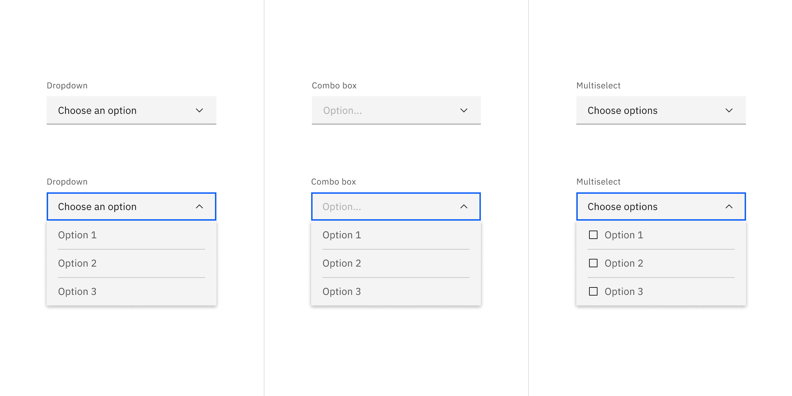
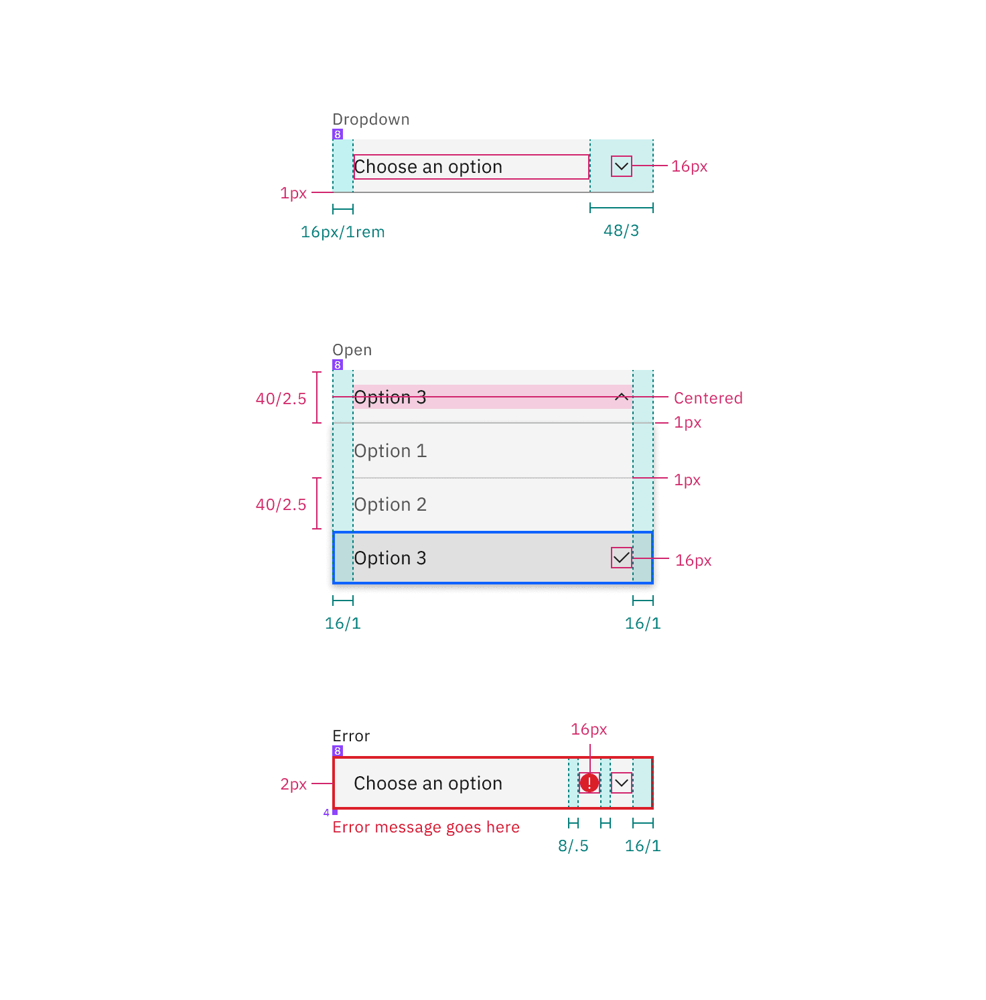
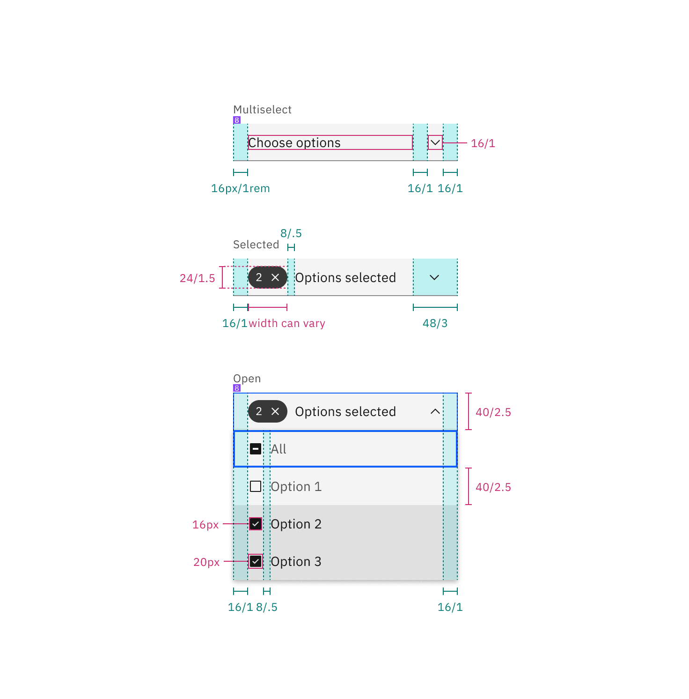

<AnchorLinks>

<AnchorLink>General guidance</AnchorLink>
<AnchorLink>Formatting</AnchorLink>
<AnchorLink>Content</AnchorLink>
<AnchorLink>Behavior</AnchorLink>
<AnchorLink>Accessibility</AnchorLink>
<AnchorLink>Variations</AnchorLink>
<AnchorLink>Style</AnchorLink>
<AnchorLink>Code</AnchorLink>
<AnchorLink>Feedback</AnchorLink>

</AnchorLinks>

## General guidance

Dropdowns present a list of options that can be used to filter or sort existing content.

They can also be used as menus. Their use as menus can be seen in [tabs](/components/tabs). At a smaller screen size, the tabs collapse into a dropdown.

While the dropdown and select components look similar, they have different functions.

- Use the dropdown component to filter or sort content on a page.
- Use the select component inside a form where users are selecting from a list of options and submitting data.

Another important difference between the two components is the underlying code. The dropdown component can be styled as needed, while the select component's appearance will be determined by the browser being used.

## Formatting

## Content 

**Use clear labels for the dropdown trigger so that users understand the purpose.** Labels inform users what to expect in the list of dropdown options. Keep the label short and concise by limiting it to a single line of text.

**Describe the dropdown option succinctly in one line of text.** Never use images or icons within a dropdown. Avoid having multiple lines of text in a dropdown, but if text wrapping is necessary, limit it to two lines and an ellipsis (...) for overflow content. We recommend presenting the options in alphabetical order.

## Behavior

**By default, the dropdown displays a label when closed.** An open dropdown appears on click rather than on hover. Open dropdown drawers should appear above all other UI elements. They can be dismissed by clicking outside of the dropdown item or on the parent element.

**Selecting an item from the dropdown will close the drawer and the selected option will replace the label.**

Interactions for inline dropdown are the same as above, however we currently don't support an inline filter dropdown (single or multi-select).

## Accessibility

## Variations 

| Type                           | Purpose                                                                                                                                                                                  |
| ------------------------------ | ---------------------------------------------------------------------------------------------------------------------------------------------------------------------------------------- |
| _Dropdown_                     | User needs to pick one option from a list.                                                                                                                                               |
| _Filter dropdown_              | When a list contains more than 25 items, use filtering to help find options from the list. May only be used with dropdown or multi-select dropdown. Cannot be used with inline dropdown. |
| _Multi-select dropdown_        | User needs to select multiple options from a dropdown.                                                                                                                                   |
| _Inline dropdown_              | A stylized dropdown that can be formatted to appear inline with other content and allows the user to select one option.                                                                  |
| _Inline multi-select dropdown_ | A stylized dropdown that can be formatted to appear inline with other content and allows the user to select more than one option.                                                        |

### Multi-select dropdown

The label remains persistent within the dropdown. Once the user chooses an option from the list, a number badge will appear to the left of the label containing the total number of selected items. Selected options float to the top of the list in alphanumeric order.

<Row>
<Column colLg={8}>

</Column>
</Row>

To clear all selected items from a list, hover over the number badge and click the "x" icon next to the value. To help with clarity, a browser tooltip appears when the user hovers over the "x" (or `close`) icon to indicate the click action results.

<Row>
<Column colLg={8}>

</Column>
</Row>

### Filter dropdown

By default, the dropdown displays a label when closed. When the user hovers over the label area, a text cursor will appear. The drawer opens on click (anywhere in the field) and the user can type to filter through the list of options below. Once the user begins typing, the `close` (x) icon will appear to the right of the label. This will clear any user-inputted text. Selecting an item from the dropdown will close the drawer and the selected option will replace the default label.

<Row>
<Column colLg={8}>

</Column>
</Row>

### Multi-select filter dropdown

This variation of dropdown follows the same interaction patterns described above with the following exceptions:

- The label will remain persistent except when the user is inputting text.
- Selected options will appear at the top of the list.
- The drawer does not close once the user makes a selection. The user will need to click outside of the dropdown or on the parent element to close the drawer.

<Row>
<Column colLg={8}>

</Column>
</Row>

## Style

### Color

Inputs come in two different colors. The default input color is `$field-01` and is used on `$ui-background` and `$ui-02` page backgrounds. The `--light` version input color is `$field-02` and is used on `$ui-01` page backgrounds.

| Class                             | Property         | SCSS                            |
| --------------------------------- | ---------------- | ------------------------------- |
| `.bx--label`                      | text color       | `$text-02`                      |
| `.bx--dropdown`                   | background-color | `$field-01`                     |
| `.bx--dropdown`                   | border-bottom    | `$ui-04`                        |
| `.bx--dropdown--light`            | background-color | `$field-02`                     |
| `.bx--dropdown-list`              | background-color | `$ui-01`                        |
| `.bx--dropdown-text`              | text color       | `$text-01`                      |
| `:placeholder`                    | text color       | `$text-03`                      |
| `.bx--dropdown-item`              | background-color | `$hover-ui`                     |
| `.bx--dropdown-item`              | text color       | `$text-02`                      |
| `.bx--dropdown__arrow`            | fill             | `$icon-01`                      |
| `.bx--list-box__selection--multi` | background-color | `$ui-05`                        |
| `.bx--dropdown--open`             | box-shadow       | `0 4px 8px 0 rgba(0,0,0,0.10);` |

<Caption>Example of a closed and opened dropdown</Caption>

#### Interactive states

| Class                         | Property         | SCSS           |
| ----------------------------- | ---------------- | -------------- |
| `:focus`                      | border           | `$focus`       |
| `.bx--dropdown-item:hover`    | background-color | `$hover-ui`    |
| `.bx--dropdown-item:hover`    | text color       | `$text-01`     |
| `.bx--form-requirement`       | text color       | `$support-01`  |
| `[data-invalid]`              | border-bottom    | `$support-01`  |
| `.bx--label:disabled`         | text color       | `$disbaled-02` |
| `.bx--dropdown:disabled`      | background-color | `$disbaled-01` |
| `.bx--dropdown-text:disabled` | text color       | `$disbaled-02` |

**Active:** Placeholder text should remain when the user clicks into the text input and gets a cursor. Once the user starts typing, the hint text is replaced with the user input text.

**Help text:** Help text appears below the label when the input is active. Help text remains visible while the input is focused and disappears after focus away.

**Error:** Error messages appear below the input field and are always present while invalid.

**Disabled:** Disabled state should has a `.not-allowed` cursor on hover.

### Typography

All dropdown text should be set in sentence case, with only the first word in a phrase and any proper nouns capitalized. Dropdown options should not exceed three words.

| Class                   | Font-size  | Font-weight   | Type style       |
| ----------------------- | ---------- | ------------- | ---------------- |
| `.bx--dropdown-text`    | 14 / 0.875 | Regular / 400 | `$body-short-01` |
| `.bx--dropdown-link`    | 14 / 0.875 | Regular / 400 | `$body-short-01` |
| `.bx--label`            | 14 / 0.875 | Regular / 400 | `$label-01`      |
| `.bx--form-requirement` | 12 / 0.75  | Regular / 400 | `$label-01`      |

### Structure

Dropdowns have two states, open and closed. An open and closed dropdown should be the same width and appropriately fit the design, layout, and content. The height of a closed dropdown stays consistent while the height of an open dropdown will vary based on the amount of options it has. Please note the various color differences for closed and open dropdowns.

| Class                  | Property                    | px / rem | Spacing tokens |
| ---------------------- | --------------------------- | -------- | -------------- |
| `.bx--label`           | margin-bottom               | 8 / 0.5  | `$spacing-03`  |
| `.bx--dropdown`        | height                      | 40 / 2.5 | –              |
| `.bx--dropdown-text`   | padding-left                | 16 / 1   | `$spacing-05`  |
| `.bx--dropdown__arrow` | padding-right, padding-left | 16 / 1   | `$spacing-05`  |
| `.bx--dropdown`        | border-bottom               | 1px      | –              |
| `.bx--dropdown-item`   | height                      | 40 / 2.5 | –              |

<Caption>Structure and spacing measurements for dropdown | px / rem</Caption>

### Multi-select dropdown

| Class                             | Property                    | px / rem | Spacing tokens |
| --------------------------------- | --------------------------- | -------- | -------------- |
| `.bx--list-box`                   | height                      | 40 / 2.5 | –              |
| `.bx--list-box__menu-item`        | height                      | 40 / 2.5 | –              |
| `.bx--list-box__field`            | padding-left, padding-right | 16 / 1   | `$spacing-05`  |
| `.bx--checkbox-label`             | padding-left                | 16 / 1   | `$spacing-05`  |
| `.bx--list-box__menu-icon`        | padding-left, padding-right | 16 / 1   | `$spacing-05`  |
| `.bx--list-box__selection--multi` | height                      | 24 / 1.5 | –              |
| `.bx--list-box__selection--multi` | margin-right                | 16 / 1   | `$spacing-05`  |

<Caption>
  Structure and spacing measurements for a multi-select dropdown | px / rem
</Caption>

### Inline dropdown

| Class                                | Property                    | px / rem | Spacing token |
| ------------------------------------ | --------------------------- | -------- | ------------- |
| `.bx--list-box.bx--list-box--inline` | height                      | 32 / 2   | -             |
| `.bx--list-box__menu-item`           | height                      | 40 / 2.5 | -             |
| `.bx--list-box__menu-item`           | padding-right, padding-left | 16 / 1   | `$spacing-05` |
| `.bx--checkbox-label`                | padding-left                | 16 / 1   | `$spacing-05` |
| `.bx--list-box__menu-icon`           | padding-left, padding-right | 16 / 1   | `$spacing-05` |

<Caption>Structure and spacing for inline dropdown | px / rem</Caption>

#### Inline dropdown states

Inline select has two different states; one for mouse hover and one for keyboard focus.

<Caption>Hover and focus states for inline dropdown</Caption>

### Filtering

Filtering can be used with dropdown and multi-select dropdown but not inline dropdown.

| Class                             | Property                    | px / rem | Spacing token |
| --------------------------------- | --------------------------- | -------- | ------------- |
| `.bx--list-box__selection`        | height                      | 40 / 2.5 | –             |
| `.bx--list-box__selection svg`    | height                      | 16 / 1   | –             |
| `.bx--list-box__menu-icon`        | padding-left, padding-right | 16 / 1   | `$spacing-05` |
| `.bx--list-box__selection`        | padding-left, padding-right | 16 / 1   | `$spacing-05` |
| `.bx--list-box__selection--multi` | height                      | 24 / 1.5 | –             |

<Caption>Spacing for multi-select dropdown with filtering | px / rem</Caption>

<Caption>
  Interaction states for multi-select dropdown with filtering | px / rem
</Caption>

## Code

<ComponentDocs component="dropdown" />

## Feedback
