import A11yStatus from 'components/A11yStatus';

<PageDescription>

Dropdowns have a list of options that a user can select from. These selections
can fill in a form, filter, or sort content.

</PageDescription>

<InlineNotification>

[Dropdown](https://react.carbondesignsystem.com/?path=/story/components-dropdown--with-ai-label),
[combo box](https://react.carbondesignsystem.com/?path=/story/components-combobox--with-ai-label),
and
[multiselect](https://deploy-preview-16803--v11-carbon-react.netlify.app/?path=/story/components-multiselect--with-ai-label)
with AI label are now stable. These additions change the visual appearance of
the component and introduce an AI explainability feature when AI is present in
the components. See the [AI presence](/components/dropdown/usage/#ai-presence)
section for more details.

</InlineNotification>

<AnchorLinks>

<AnchorLink>Live demo</AnchorLink>
<AnchorLink>Overview</AnchorLink>
<AnchorLink>Formatting</AnchorLink>
<AnchorLink>Content</AnchorLink>
<AnchorLink>Universal behaviors</AnchorLink>
<AnchorLink>Dropdown</AnchorLink>
<AnchorLink>Multiselect</AnchorLink>
<AnchorLink>Combo box</AnchorLink>
<AnchorLink>Modifiers</AnchorLink>
<AnchorLink>AI presence</AnchorLink>
<AnchorLink>Related</AnchorLink>
<AnchorLink>References</AnchorLink>
<AnchorLink>Feedback</AnchorLink>

</AnchorLinks>

## Live demo

<StorybookDemo
  themeSelector
  url="https://react.carbondesignsystem.com"
  tall
  variants={[
    {
      label: 'Dropdown',
      variant: 'components-dropdown--default',
    },
    {
      label: 'Inline dropdown',
      variant: 'components-dropdown--inline',
    },
    {
      label: 'Fluid dropdown (unstable)',
      variant: 'experimental-fluid-components-unstable-fluiddropdown--default',
    },
    {
      label: 'Fluid Condensed dropdown (unstable)',
      variant:
        'experimental-fluid-components-unstable-fluiddropdown--condensed',
    },
    {
      label: 'Dropdown with AI Label',
      variant: 'components-dropdown--with-ai-label',
    },
    {
      label: 'Multiselect',
      variant: 'components-multiselect--default',
    },
    {
      label: 'Filterable multiselect',
      variant: 'components-multiselect--filterable',
    },
    {
      label: 'Filterable multiselect with AI Label',
      variant: 'components-multiselect--filterable-with-ai-label',
    },
    {
      label: 'Fluid multiselect (unstable)',
      variant:
        'experimental-fluid-components-unstable-fluidmultiselect--default',
    },
    {
      label: 'Fluid condensed multiselect (unstable)',
      variant:
        'experimental-fluid-components-unstable-fluidmultiselect--condensed',
    },
    {
      label: 'Combobox',
      variant: 'components-combobox--default',
    },
    {
      label: 'Fluid combobox (unstable)',
      variant: 'experimental-fluid-components-unstable-fluidcombobox--default',
    },
    {
      label: 'Fluid condensed combobox (unstable)',
      variant:
        'experimental-fluid-components-unstable-fluidcombobox--condensed',
    },
    {
      label: 'Combobox with AI Label',
      variant: 'components-combobox--with-ai-label',
    },
  ]}
/>

<A11yStatus
  layout="cards"
  components={[
    'Dropdown',
    'Multiselect',
    'Combo box',
    'Fluid dropdown',
    'Fluid multiselect',
    'Fluid combo box',
  ]}
/>

## Overview

There are three different variants of dropdowns that support various kinds of
functionality—dropdown, multiselect, and combo box.

### When to use

Dropdowns can be used in forms on full pages, in modals, or on side panels. The
dropdown component is used to filter or sort contents on a page. It is a
stylized version of the select component, and can be styled as needed.

### When not to use

#### Limited options

It is best practice not to use a dropdown if there are two options to choose
from. In this case, use a [radio button](/components/radio-button/code) group
instead.

#### Nesting

Do not nest dropdowns or use them to display overly complex information. Keep
option selections as straight forward as possible.

#### Form-based or mobile platform

Consider using a [select](/components/select/usage) if most of your experience
is form-based or frequently used on mobile platforms. The native HTML select
works more easily when submitting data and is also easier to use on a mobile
platform.

### Variants

| Variant                     | Purpose                                                                                         |
| --------------------------- | ----------------------------------------------------------------------------------------------- |
| [Dropdown](#dropdown)       | Allows the user to select one option from a list.                                               |
| [Multiselect](#multiselect) | Allows the user to select multiple options from a list and filter.                              |
| [Combo box](#combo-box)     | Allows the user to either select an option from a large list or type in their own custom value. |

## Formatting

### Anatomy

Dropdowns are composed of four distinct sections—assistive text like labels or
helper text, a field, a menu, and options contained within the menu. Labels and
helper text can guide the user to make an informed decision when making a
selection.

<Row>
<Column colLg={8}>

<Tabs>

<Tab label="Default">

</Tab>

<Tab label="Fluid">

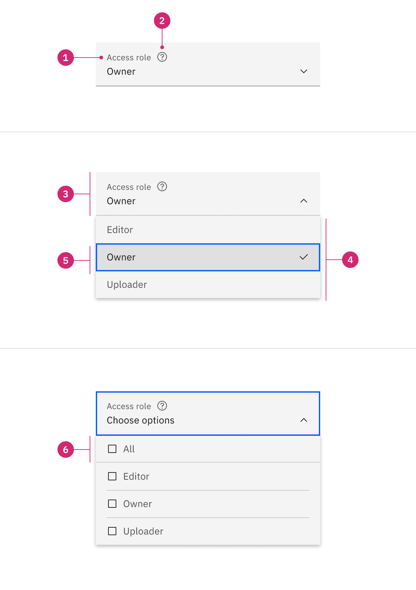

</Tab>

</Tabs>

</Column>
</Row>

1. **Label:** Text that informs the user what to expect in the list of dropdown
   options.
2. **Helper text:** Assistive text to help the user choose the right selection.
3. **Field:** Persists when the dropdown is open or closed.
4. **Menu:** A list of options to choose from, displayed as an open state.
5. **Option:** A choice for the user, shown with other choices in a menu.
6. **Parent checkbox:** Used to select all the options from within the menu in
   multiselect dropdowns.

### Styling

There are two styles of dropdown inputs: default and fluid. They share the same
functionality but look visually different, influencing where to use them.

| Style   | Appearance                                                                                                               | Use case                                                                                                                                         |
| ------- | ------------------------------------------------------------------------------------------------------------------------ | ------------------------------------------------------------------------------------------------------------------------------------------------ |
| Default | A traditional style where the label is positioned outside and above the input field.                                     | Use when white space is needed between input components or in productive moments where space is at a premium, and smaller components are needed. |
| Fluid   | An alternative style where the label is placed inside of the input field and is stacked inline with the user input text. | Use in expressive moments, fluid forms, contained spaces, or attached to complex components, like a toolbar.                                     |

<Row>
<Column colLg={8}>

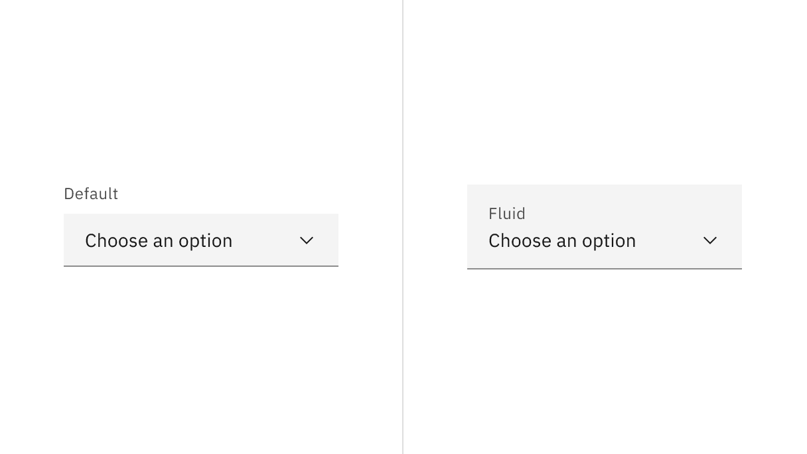

</Column>
</Row>

<Caption>
  A default style input is shown on the left and fluid style is on the right.
</Caption>

### Sizing

There are three default dropdown height sizes: small, medium, and large.
Supporting three different dropdown sizes gives you more flexibility when
structuring layouts. However, use a consistent size for all form components on
the same page. For example, if you are using a medium size dropdown also use the
same size text inputs, buttons, and so on. When in doubt, use the default medium
size height.

| Size        | Height (px/rem) | Use case                                                                                                                                                                           |
| ----------- | --------------- | ---------------------------------------------------------------------------------------------------------------------------------------------------------------------------------- |
| Small (sm)  | 32 / 2          | Use when space is constricted or when placing a dropdown in a form that is long and complex.                                                                                       |
| Medium (md) | 40 / 2.5        | This is the default size and the most commonly used size.                                                                                                                          |
| Large (lg)  | 48 / 3          | Choose this size when there is a lot of space to work with. This size is typically used in simple forms or when a dropdown is placed by itself on a page, for example as a filter. |

<Row>
<Column colLg={8}>

</Column>
</Row>

When the menu is open, each option in the menu should be the same height as the
field.

<Row>
<Column colLg={8}>

</Column>
</Row>

#### Fluid inputs heights

In the fluid dropdown, there is only one input height but there are two menu
item sizes–default and condensed.

| Fluid size | Height (px/rem) | Use case                                                                              |
| ---------- | --------------- | ------------------------------------------------------------------------------------- |
| Default    | 64 / 4          | Use when there are fewer menu options in expressive moments.                          |
| Condensed  | 40 / 2.5        | Use when there are many menu options so more can be viewed at once without scrolling. |

<Row>
<Column colLg={12}>

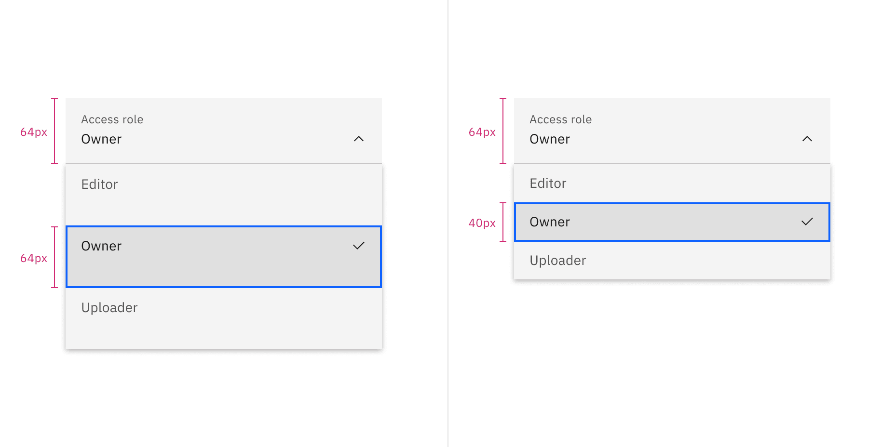

</Column>
</Row>

#### Width

There is no minimum or maximum width for a dropdown. The width can be customized
appropriately for its context.

### Placement

Field containers should vertically align with other form components on a page.
Whether it aligns flush to grid columns or hangs in the gutters depends on the
style of dropdown you are using.

<DoDontRow>
  <DoDont caption="Do align default style dropdown containers flush to the grid so the input label aligns with other type on the page.">

  </DoDont>
  <DoDont type="dont" caption="Don't hang default style dropdowns into the grid gutters.">

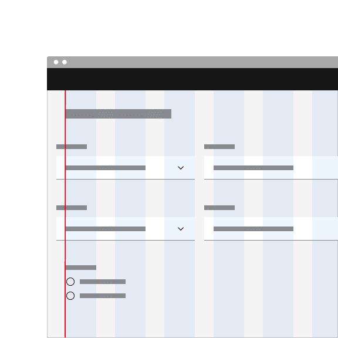

  </DoDont>
</DoDontRow>

<DoDontRow>
  <DoDont caption="Do place fluid components flush to on another with no spacing between them.">

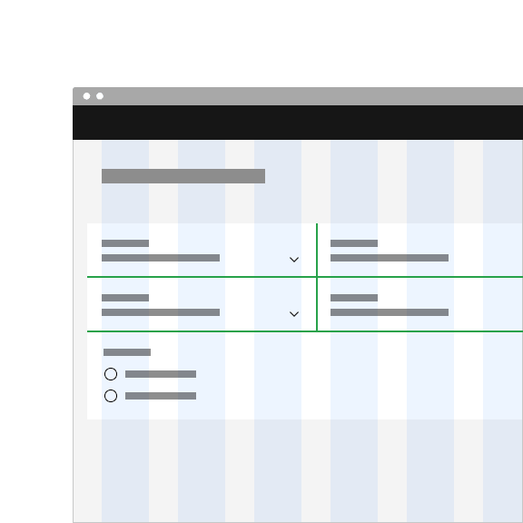

  </DoDont>
  <DoDont type="dont" caption="Do not use fluid components with vertical or horizontal spacing between them.">

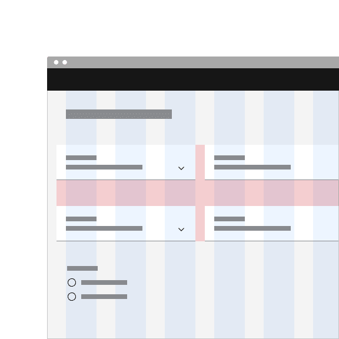

  </DoDont>
</DoDontRow>

## Content

### Main elements

#### Label text

- Label text informs users what to expect in the list of dropdown options.
- Keep the label text short and concise by limiting it to a single line of text.
- Do not remove label text in favor of using placeholder text in the dropdown
  field. Labels are always strongly encouraged to be included when possible.

#### Helper text

- Helper text is pertinent information that assists the user in choosing the
  right selection from the dropdown menu.
- Helper text is always available when the dropdown field is focused and appears
  underneath the label.

<Row>
<Column colLg={8}>

</Column>
</Row>

#### Field placeholder text

- Placeholder text is optional to display in the dropdown field if no option has
  been selected yet from the list. Do not put important information in
  placeholder text because the text disappears once an option is selected from
  the list. Reserve important information for dropdown label text or helper
  text, which always remains visible.
- Use clear and concise placeholder text in the dropdown field to indicate how
  to interact with the dropdown. For example, "Choose an option" is commonly
  used as placeholder text in dropdowns.

#### Option text

- Dropdown option text should be brief, accurate, and not descriptive.
- Never use decorative images or icons within a dropdown.
- We recommend presenting the options in alphabetical order.

#### Parent checkbox text

- Since the parent checkbox text is one among the options, do not describe it as
  an action.
- Use the word “All” to describe the parent checkbox.
- Alternatively, add a secondary descriptive word, for example, “All roles,” to
  describe the options in the menu.

<Row>
<Column colLg={12}>

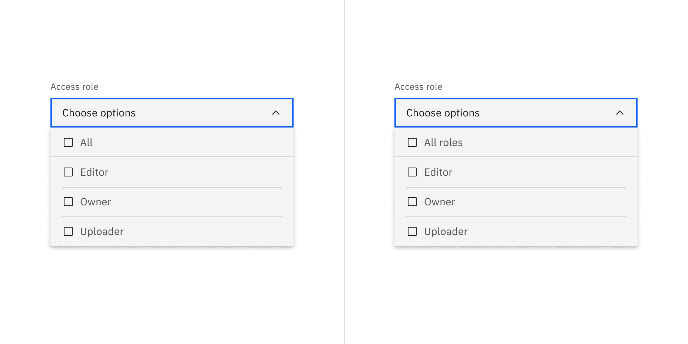

</Column>
</Row>

### Optional versus required fields

Dropdowns can be labeled as either optional or required depending on several
factors. For more information, see the form
[Usage](/components/form/usage/#optional-versus-required-fields) tab guidance.

### Overflow content

Avoid multiple lines of text in a dropdown. If the text is too long for a single
line, add an ellipsis (…) for overflow, and use a tooltip to display the full
text—preferably a Carbon tooltip for keyboard accessibility where possible.

<Row>
<Column colLg={8}>

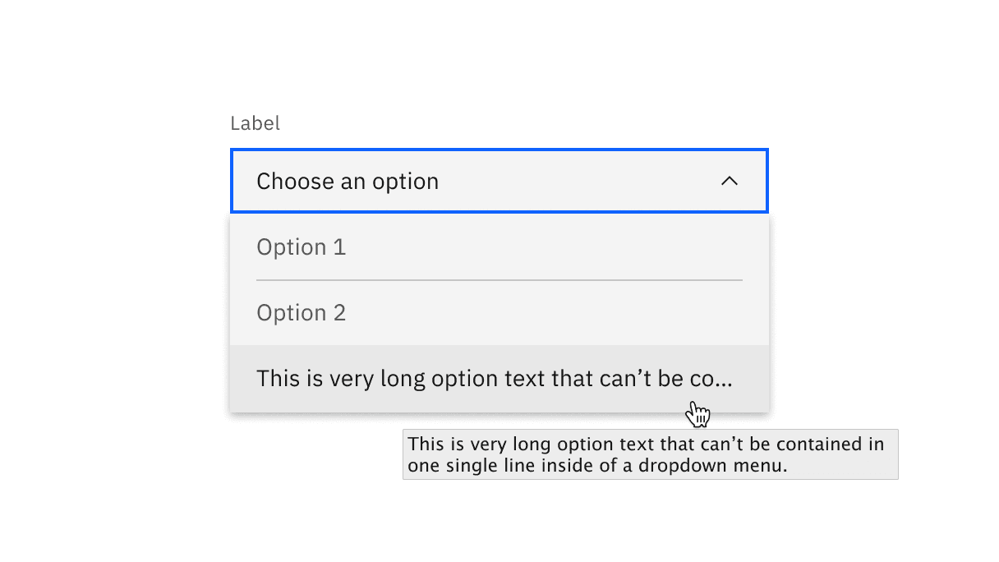

</Column>
</Row>

### Further guidance

For further content guidance, see Carbon's
[content guidelines](/guidelines/content/overview).

## Universal behaviors

The behaviors listed in this section are universal across all of the variants.
For behaviors that are unique to each variant, see the sections below.

### Direction

A dropdown can open up or down depending on its position on the screen. For
example, if the dropdown appears at the bottom and close to the edge of the
interface, the menu expands upward to avoid being cropped. By default, our
dropdowns open downward.

### Elevation

The dropdown menu has a style called `box-shadow` that is placed behind the menu
when open to give the menu a perceived higher elevation than the content that
may fall behind it. Box-shadow is also used in other components that have
overlayed menus, such as the overflow menu and date picker calendar. The SCSS
for box-shadow is `0 2px 6px 0 rgba(0,0,0,.2)`.

### Scrolling behavior

Scroll bars may not always be enabled so we recommend showing 50% of the last
option's container height to indicate there is more to see within the menu. We
recommend starting a scroll at the sixth option in the menu list, but this may
vary based on your specific use case.

<Row>
<Column colLg={8}>

</Column>
</Row>

### States

Dropdowns, combo boxes, and multiselects have a series of states for both their
fields and menus: **enabled**, **hover**, **focus**, **error**, **warning**,
**disabled**, **skeleton**, and **read-only**. For more information on states,
visit the
[interactive states](https://carbondesignsystem.com/components/dropdown/style#interactive-states)
guidance on the style tab.

### Vertical dividers in input fields

Vertical dividers act as a visual separator between interactive elements in an
input field. These vertical dividers are only present between two interactive
elements, they should not be introduced between non-interactive elements like
error states, other non-interactive icons, or buttons.

A divider will also be present to the left of the leftmost interactive item set,
even if it's next to a non-interactive item.

<DoDontRow>
  <DoDont caption="Do introduce a vertical divider between two interactive elements in an input field.">

  </DoDont>
  <DoDont type="dont" caption="Do not introduce a vertical divider between interactive and non-interactive elements in an input field.">

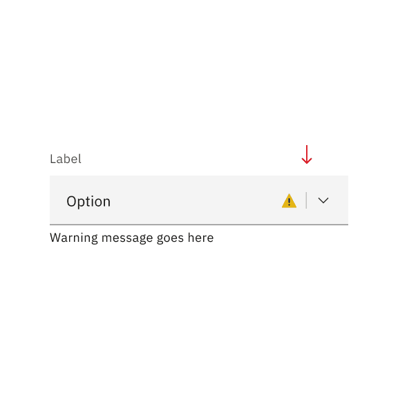

  </DoDont>
</DoDontRow>

<DoDontRow>
  <DoDont caption="Do introduce a vertical divider to the left of the leftmost interactive set in an input field.">

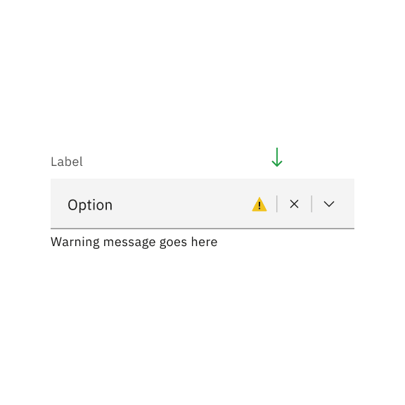

  </DoDont>
  <DoDont type="dont" caption="Do not use vertical dividers inconsistently in the same icon set, where some icons have vertical dividers and some do not.">

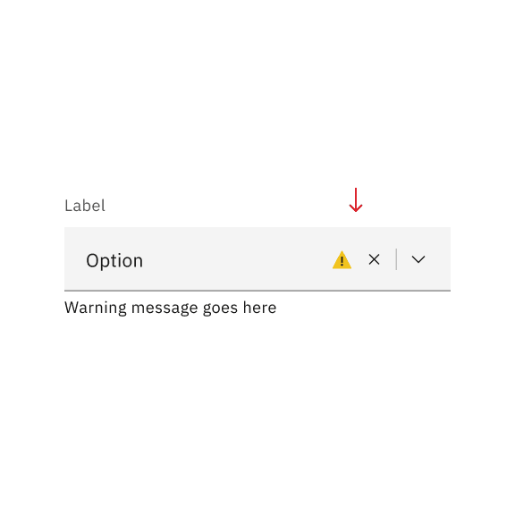

  </DoDont>
</DoDontRow>

<DoDontRow>
  <DoDont caption="Do introduce a vertical divider to the left of the leftmost interactive set in an input field.">

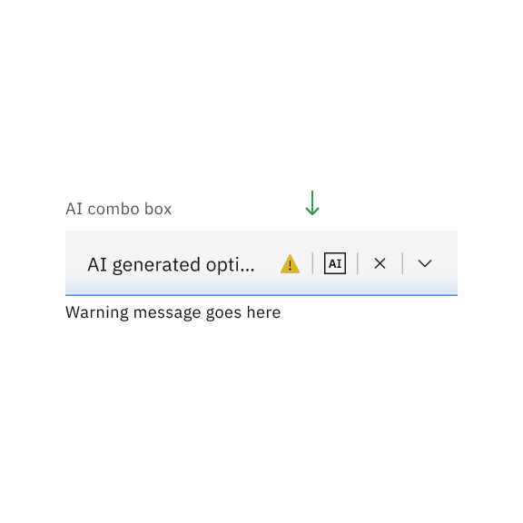

  </DoDont>
  <DoDont type="dont" caption="Do not use vertical dividers inconsistently in the same icon set, where some icons have vertical dividers and some do not.">

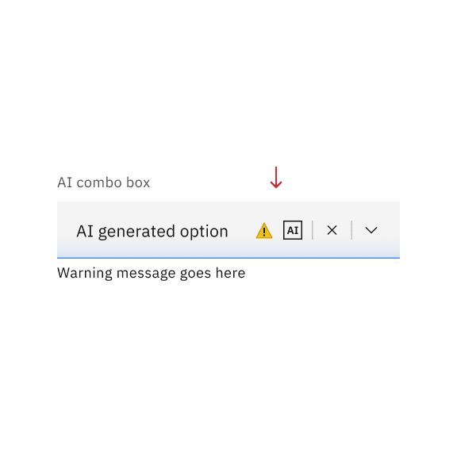

  </DoDont>
</DoDontRow>

### Interactions

#### Mouse

Users trigger a dropdown menu to open by clicking the chevron icon or clicking
anywhere within the field. Users can close the menu by clicking the chevron icon
or clicking outside of the menu.

<Row>
<Column colLg={8}>

<Tabs>

<Tab label="Default">

</Tab>

<Tab label="Fluid">

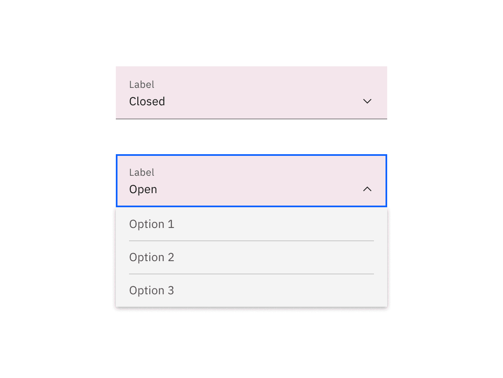

</Tab>

</Tabs>

</Column>
</Row>

- To select an option the user can click anywhere inside an option container.

<Row>
<Column colLg={8}>

<Tabs>

<Tab label="Default">

</Tab>

<Tab label="Fluid">

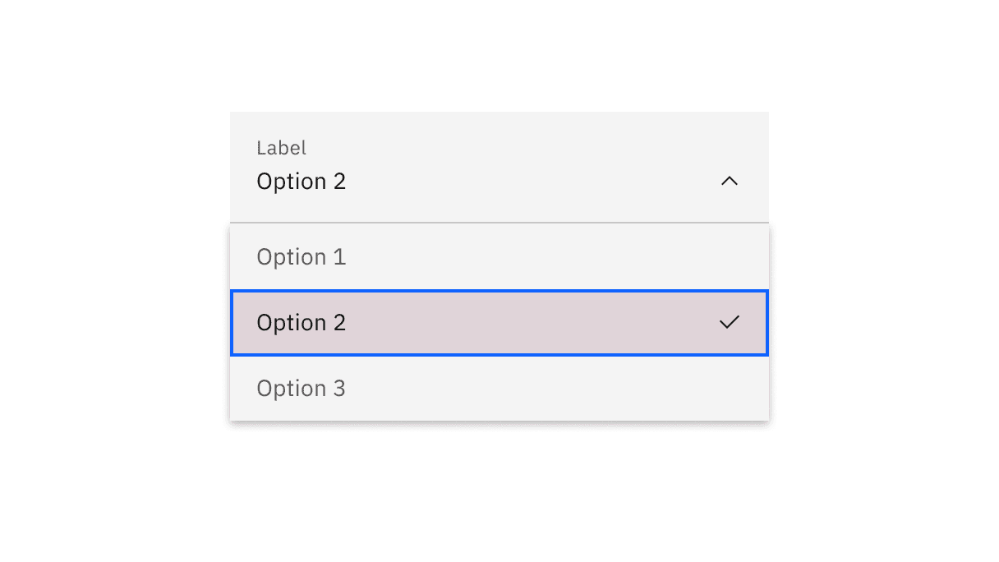

</Tab>

</Tabs>

</Column>
</Row>

- To clear all selected options from a list in a `multiselect` dropdown, click
  the “x” icon next to the value inside the tag.

<Row>
<Column colLg={8}>

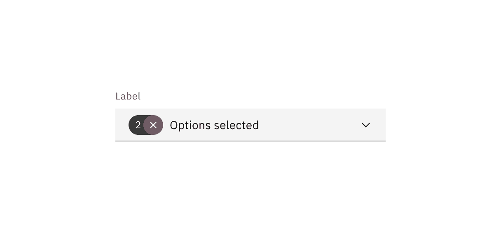

</Column>
</Row>

- To clear a selected value in a `combo box` or a filterable multiselect
  dropdown, click the “x” icon to the right of the field input text.

<Row>
<Column colLg={8}>

</Column>
</Row>

#### Keyboard

A dropdown component and its variants multiselect and combo box are reached by
`Tab`, with navigation of the options by `Up` and `Down` arrow keys. However,
the keys for opening the component and selecting its options are different for
each variant. For more information on keyboard interactions, see the
[accessibility tab](https://carbondesignsystem.com/components/dropdown/accessibility/?_ga=2.84465055.789214944.1712051588-758524008.1712051588&_gl=1*16jmo7x*_ga*NzU4NTI0MDA4LjE3MTIwNTE1ODg.*_ga_FYECCCS21D*MTcxMjEzODc0OC4zLjEuMTcxMjE0MTQ5OC4wLjAuMA..#what-carbon-provides).

## Dropdown

Use a dropdown when the user needs to select one option from a list of
predefined options. Dropdowns are the optimal default option to provide
alternative choices. They are also a good choice when screen space is limited.

<Row>
<Column colLg={8}>

<Tabs>

<Tab label="Default">

</Tab>

<Tab label="Fluid">

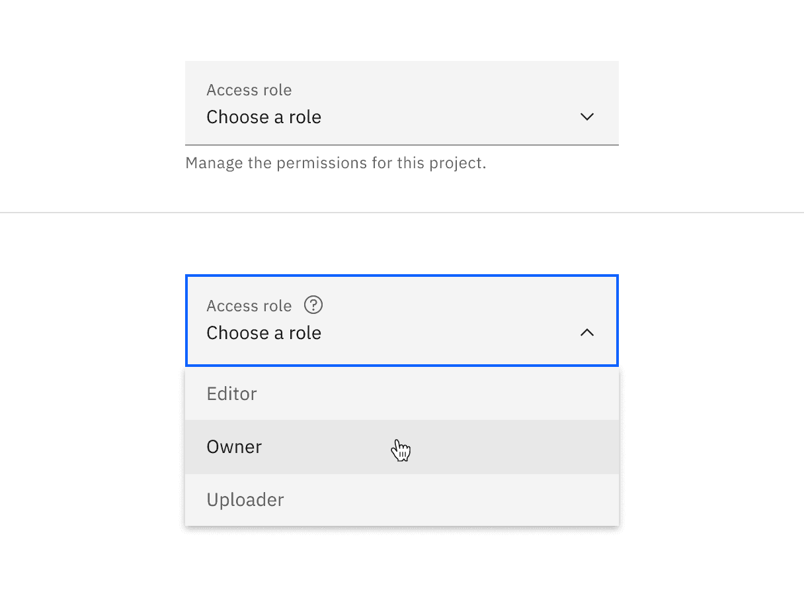

</Tab>

</Tabs>

</Column>
</Row>

- Selecting an option from the menu closes it and the selected option text
  replaces the placeholder text in the field and also remains as an option in
  place if the menu is open.

<Row>
<Column colLg={8}>

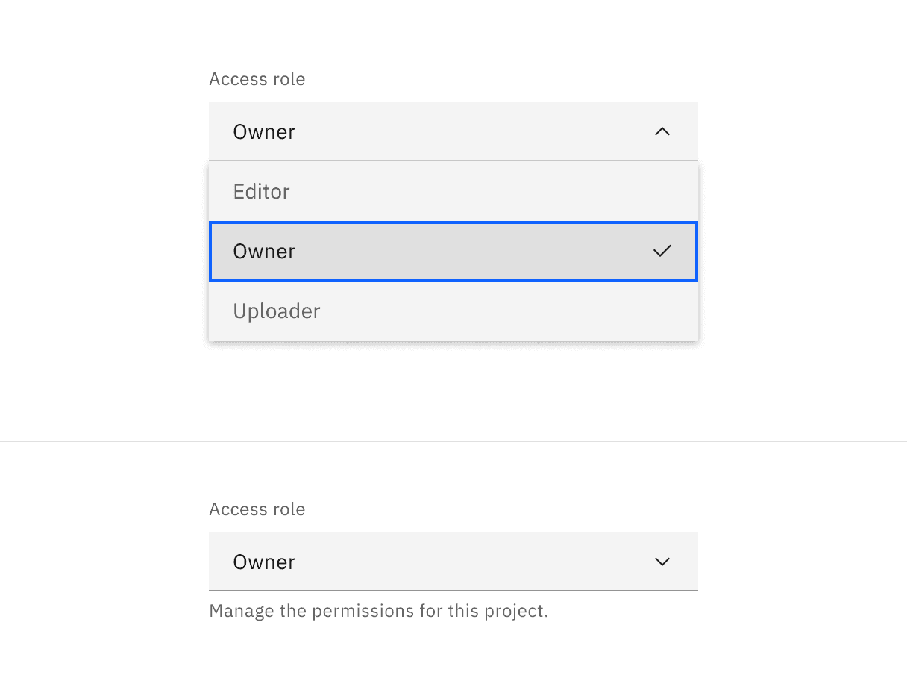

</Column>
</Row>

## Multiselect

Use a multiselect when the user needs to select multiple options from a list of
predefined options. Multiselects are a good option when the user needs to filter
or sort content on a page based on multiple criteria. A checkbox icon is
included for each option in the list to enable multiselection.

#### Making a selection

- By default, the dropdown displays any placeholder text in the field when
  closed. Activating a closed field opens a menu of options.
- Each option contains a checkbox input to the left of the option text.
- The menu stays open while options are being selected. The menu closes by
  clicking the field or outside of the dropdown, or by pressing `Esc` or tabbing
  away from the component.

<Row>
<Column colLg={8}>

<Tabs>

<Tab label="Default">

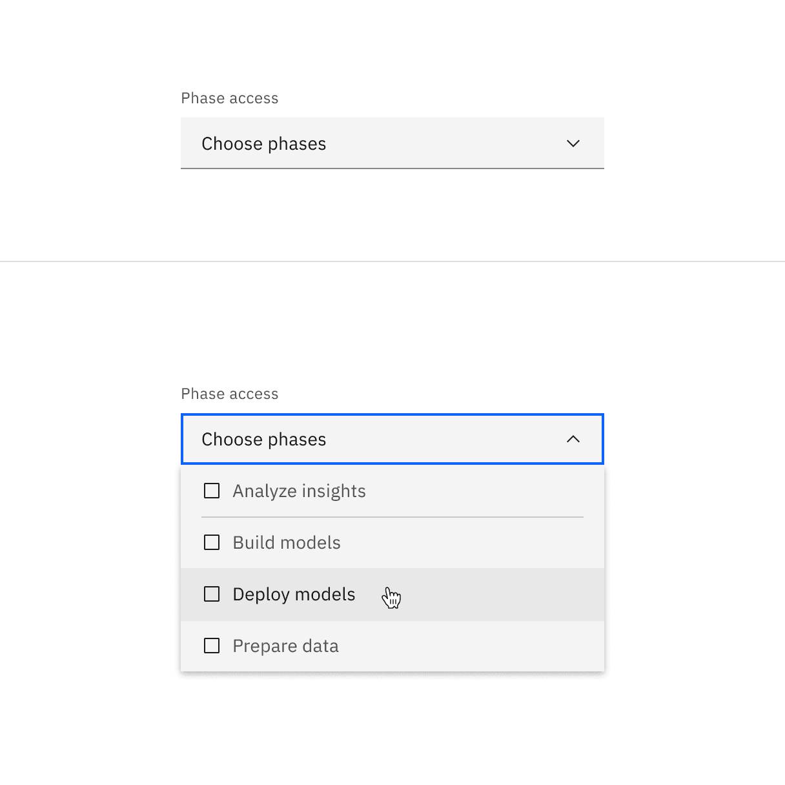

</Tab>

<Tab label="Fluid">

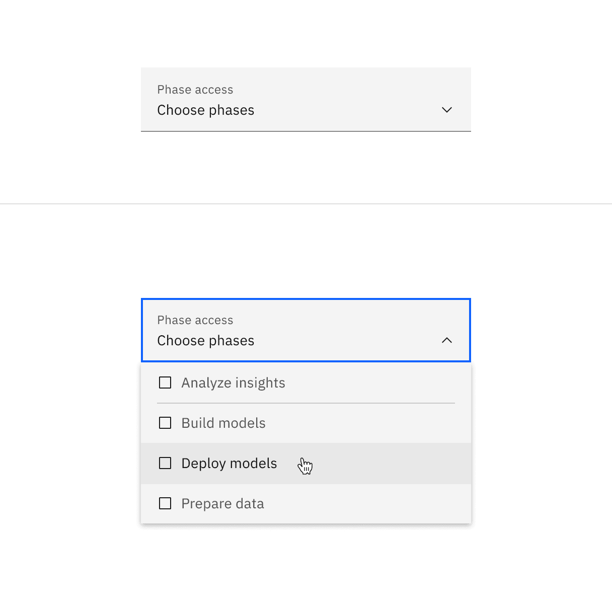

</Tab>

</Tabs>

</Column>
</Row>

#### Feedback

- Once options have been selected from the menu, a tag appears to the left of
  the text in the field containing the total number of selected options, and
  also provides a functionality to clear all the selected options.
- The placeholder text can change to text that better reflects what is selected.
- Selected options shift to the top of the menu in an alphanumeric order when
  revisiting the menu after closing it.
- Unlike dropdown and combo box, the menu does not close once the user makes
  selections. Because multiple selections are possible, the user needs to click
  outside of the dropdown or on the parent element to close the menu.

<Row>
<Column colLg={8}>

<Tabs>

<Tab label="Default">

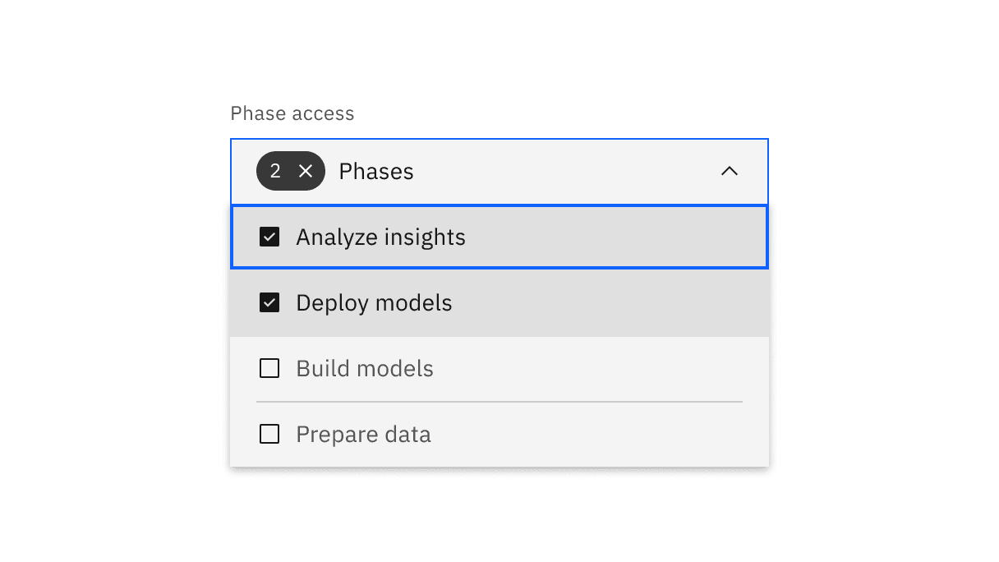

</Tab>

<Tab label="Fluid">

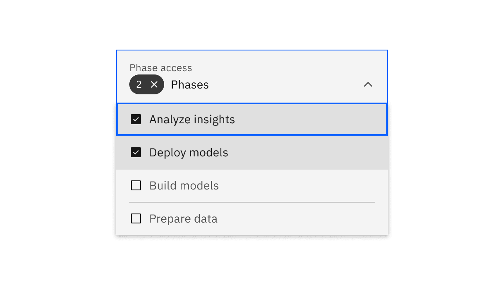

</Tab>

</Tabs>

</Column>
</Row>

#### Selecting all

The parent checkbox associated to the parent option makes it possible for the
user to select all options from the list. Although the parent checkbox element
is used only for multiselect dropdowns, it is not mandated to be present in all
multiselect dropdowns.

- The bottom stroke for the parent option has no padding and bleeds to the end
  of the dropdown menu.
- The background fill for the all button does not change when selected and will
  continue to have the same background as the enabled state

The parent checkbox has a third indeterminate state and appears when some and
not all options have been selected.

- Clicking on the indeterminate state clears all options.
- Clicking on the unselected checkbox selects all options.
- Clicking on the selected checkbox clears all options.

We recommend not to use the parent checkbox in scenarios like filters when
choosing all and choosing none means the same.

<Row>
<Column colLg={12}>

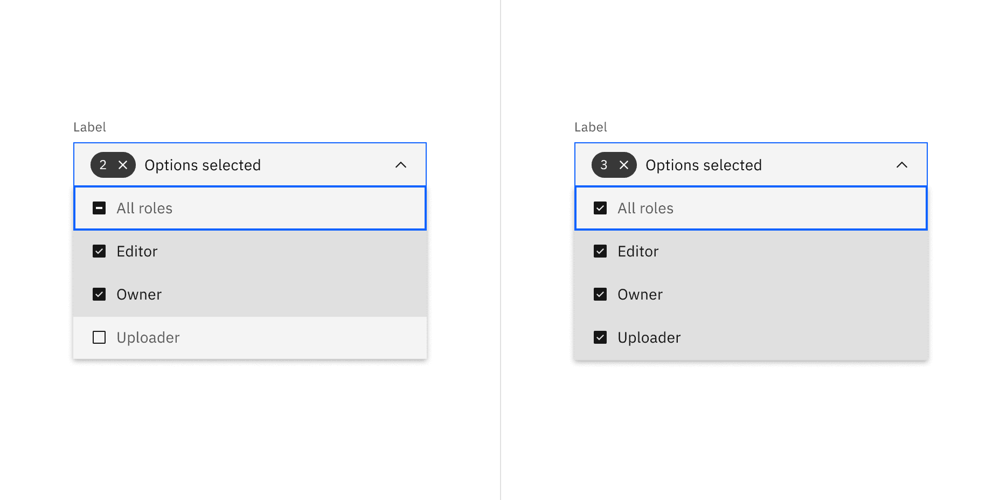

</Column>
</Row>

#### Clearing all

To clear all selected options from a list, hover over the filterable tag and
click the “x” (or `close`) icon next to the value. To help with clarity, a
browser tooltip appears when the user hovers over the “x” icon to indicate the
click action results. If you want to unselect individual options, you can do so
by unselecting the checkbox of each option.

<Row>
<Column colLg={8}>

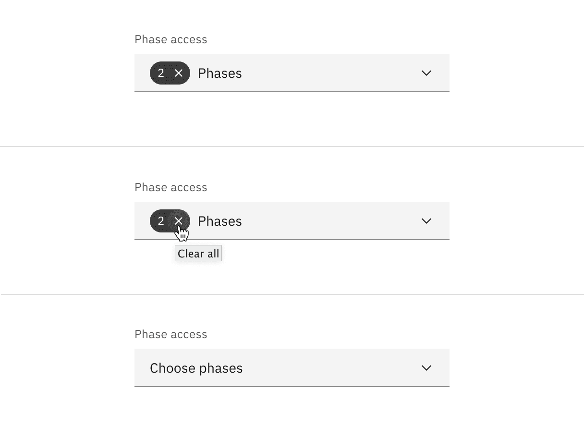

</Column>
</Row>

#### Filtering

Use filtering to narrow down a long list of options to find the option you want
to select.

- By default, the filterable multiselect dropdown displays placeholder text in
  the field when closed.
- When hovering over the field, a text cursor appears.

<Row>
<Column colLg={8}>

<Tabs>

<Tab label="Default">

</Tab>

<Tab label="Fluid">

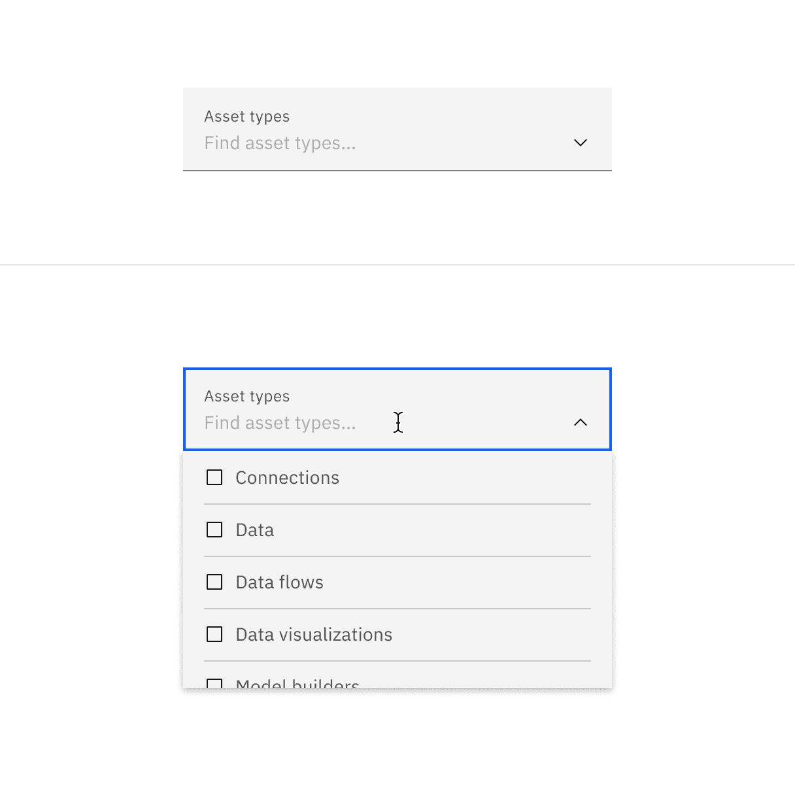

</Tab>

</Tabs>

</Column>
</Row>

- The menu opens by clicking anywhere in the field and you can start typing to
  filter the list of options. The options that start to match your entry remain
  in the list while other existing options are temporarily removed.
- After typing text in the field, the close (x) icon appears to the right of the
  text in the field. This clears any text that’s been entered in the field.

<Row>
<Column colLg={8}>

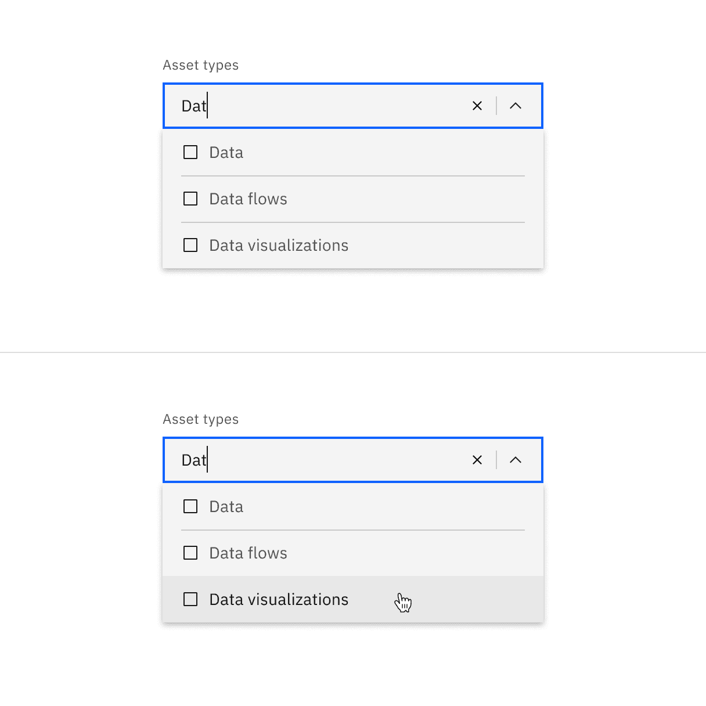

</Column>
</Row>

- Once options have been selected from the menu, a tag appears to the left of
  the text in the field containing the total number of selected options. The
  placeholder text can change to text that better reflects what is selected.
- Selected options shift to the top of the menu in alphanumeric order.
- Like the default multiselect dropdown, the menu does not close once the user
  makes selections.

<Row>
<Column colLg={8}>

<Tabs>

<Tab label="Default">

</Tab>

<Tab label="Fluid">

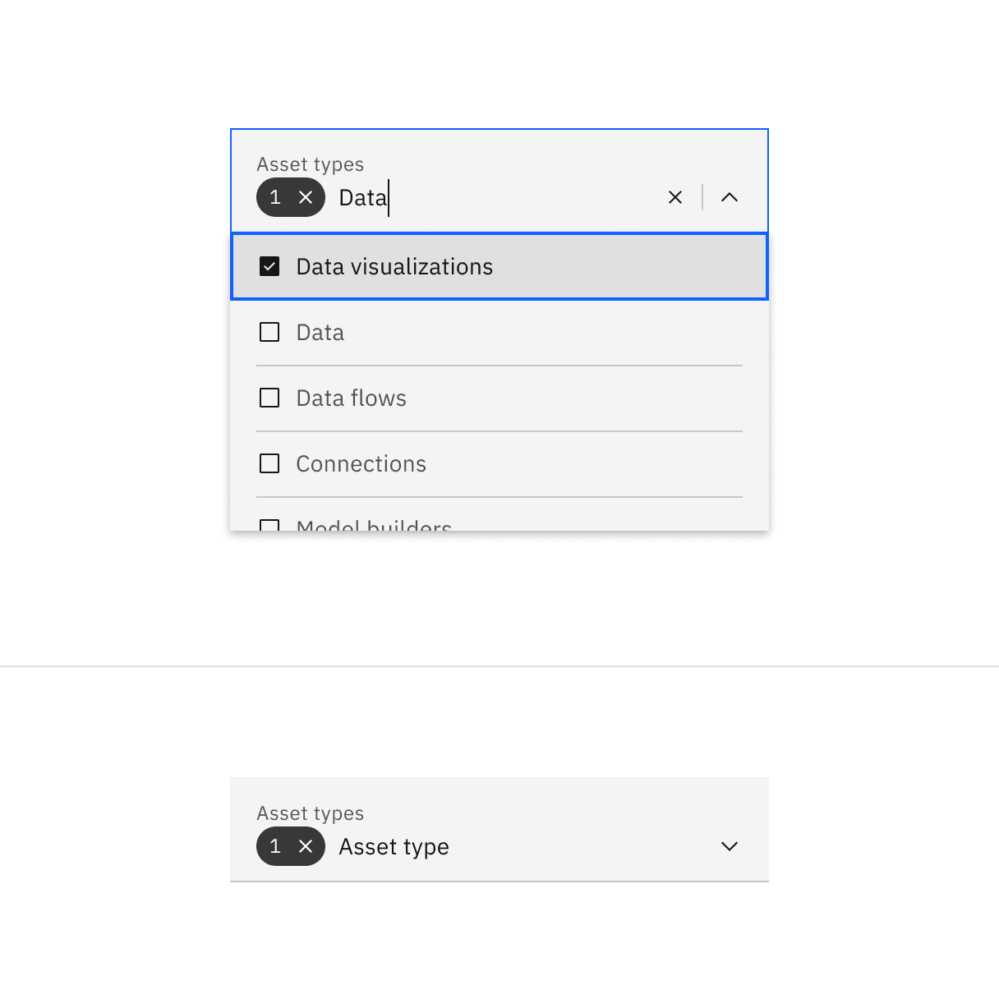

</Tab>

</Tabs>

</Column>
</Row>

## Combo box

Use a combo box when the user needs to select one option, but the list of
options may be very long or not predefined. Combo boxes allow the user to either
select from a list of suggested options or type in their own custom value. Combo
boxes are useful when the data populating the list may come from a database.

<Row>
<Column colLg={8}>

</Column>
</Row>

- The menu opens by clicking anywhere in the field, allowing users to type and
  sort through the list of options. The best-matching option is highlighted as
  users type.
- A close (x) icon clears the input, and autocomplete refines options as users
  type.

<Row>
<Column colLg={8}>

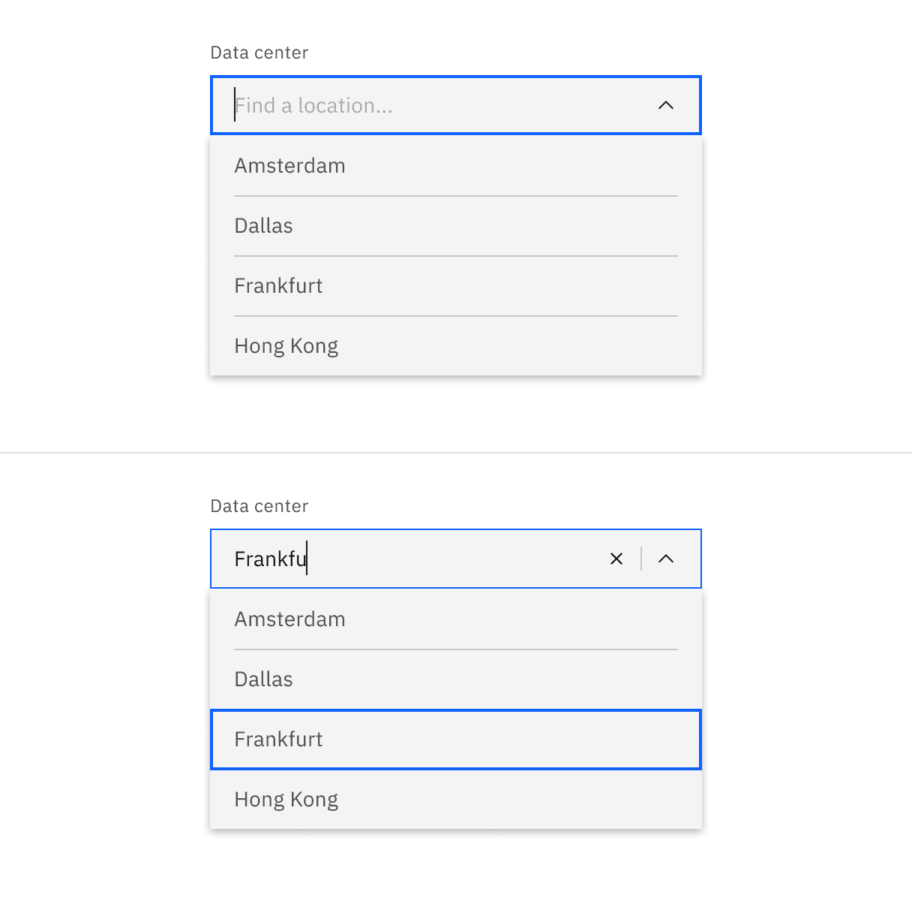

</Column>
</Row>

- Selecting an option closes the menu and the selected option replaces the
  placeholder text.

<Row>
<Column colLg={8}>

<Tabs>

<Tab label="Default">

</Tab>

<Tab label="Fluid">

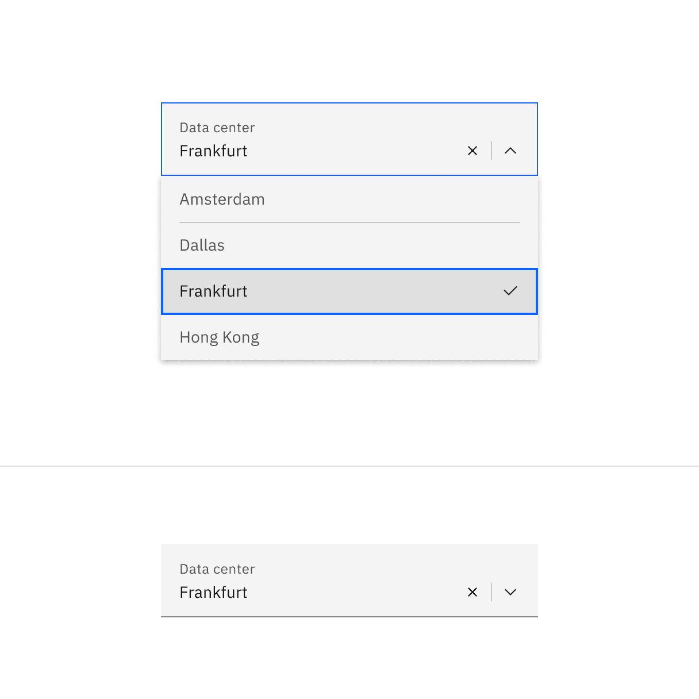

</Tab>

</Tabs>

</Column>
</Row>

#### Entering a custom value

In a combo box, users can type in a custom or unique value that is not included
in the list of predefined options.

- If the desired option isn’t available in the list, users can start typing
  their custom value directly in the field, filtering out options as they type.
- To save the new custom value, click outside the field with the mouse or press
  `Tab` or `Enter` on the keyboard.
- Once saved, the placeholder text changes to display the custom typed value.

<Row>
<Column colLg={8}>

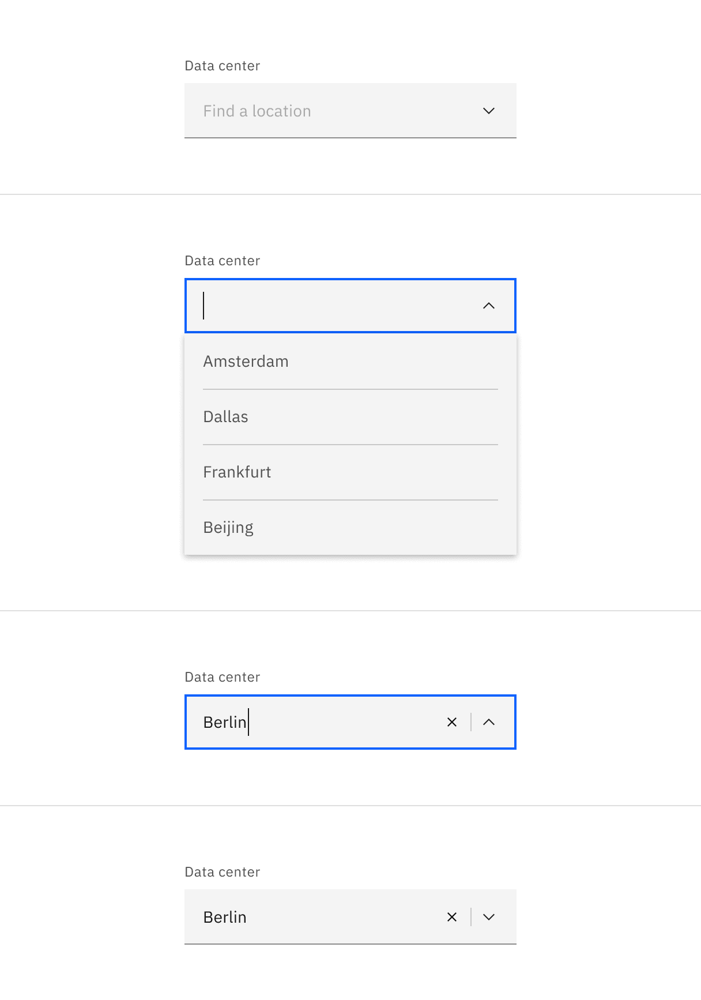

</Column>
</Row>

## Modifiers

#### Inline

When placing a dropdown inline with other content use the inline modifier. If
adding a visual label to an inline dropdown it should appear inline to the left
of the dropdown. If there is no visual label present you must supply an
appropriate accessibility label to the inline dropdown. _Note: Inline is only a
modifier for dropdown and does not have filtering functionality._

<Row>
<Column colLg={8}>

</Column>
</Row>

## AI presence

Dropdown and its variants have a modification that takes on the AI visual
styling when the AI label is present in the input. The AI variant of these
components function the same as the normal version except with the addition of
the AI label which is both a visual indicator and the trigger for the
explainability popover.

For more information on designing for AI, see the
[Carbon for AI](/guidelines/carbon-for-ai/) guidelines.

<Row>
<Column colLg={8}>

<Tabs>

<Tab label="Default">

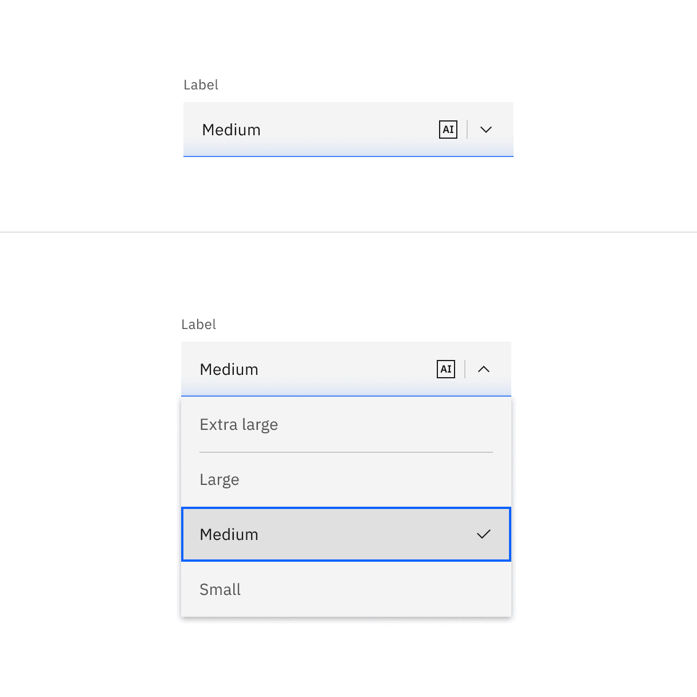

</Tab>

<Tab label="Fluid">

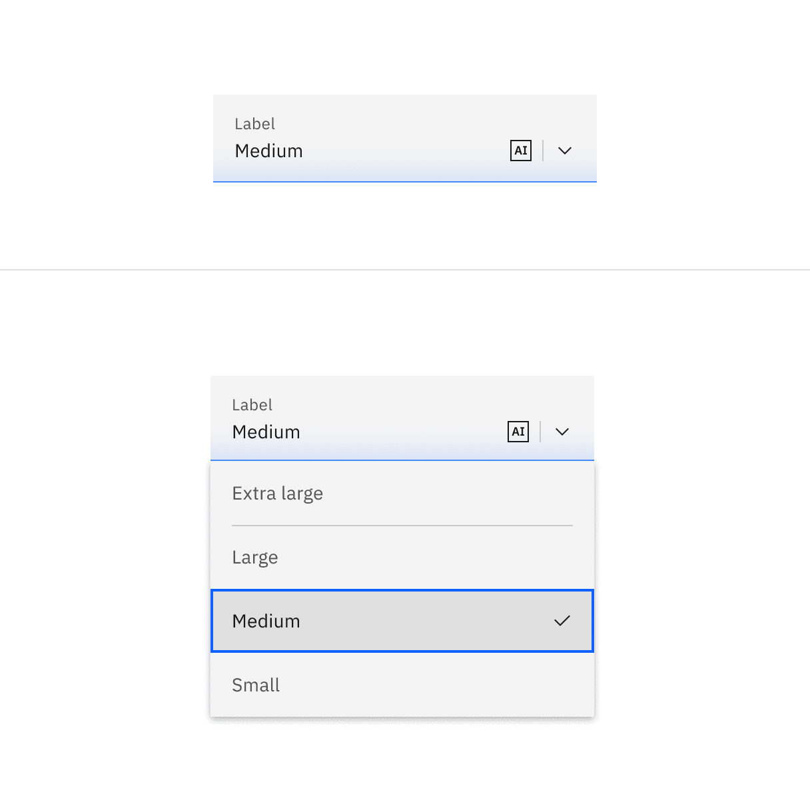

</Tab>

</Tabs>

</Column>
</Row>

### Revert to AI

A dropdown can toggle between the AI variant and the non-AI variant depending on
the user’s interaction. If the user manually overrides the AI-suggested content
then the input will change from the AI variant to the non-AI variant. Once
edited, the user should still be able to switch back to the initially AI
generated content via a revert to AI button.

<Row>
<Column colLg={8}>

<Tabs>

<Tab label="Default">

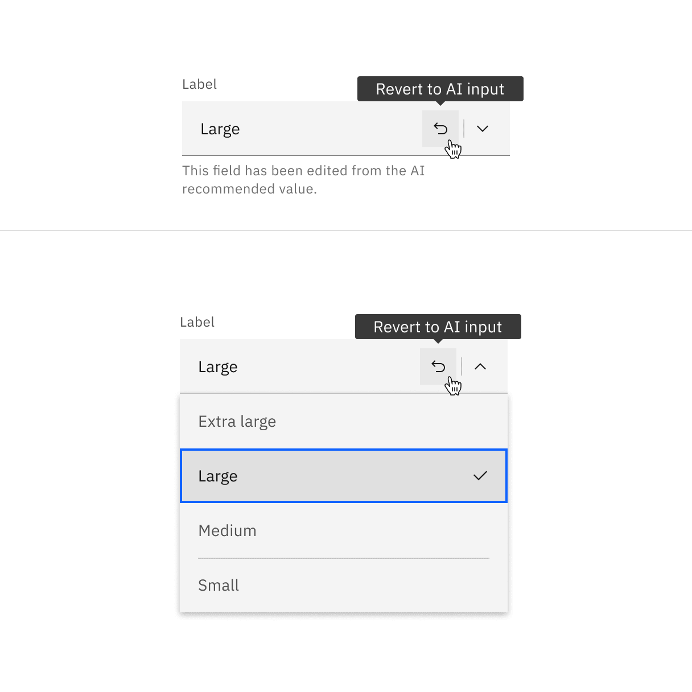

</Tab>

<Tab label="Fluid">

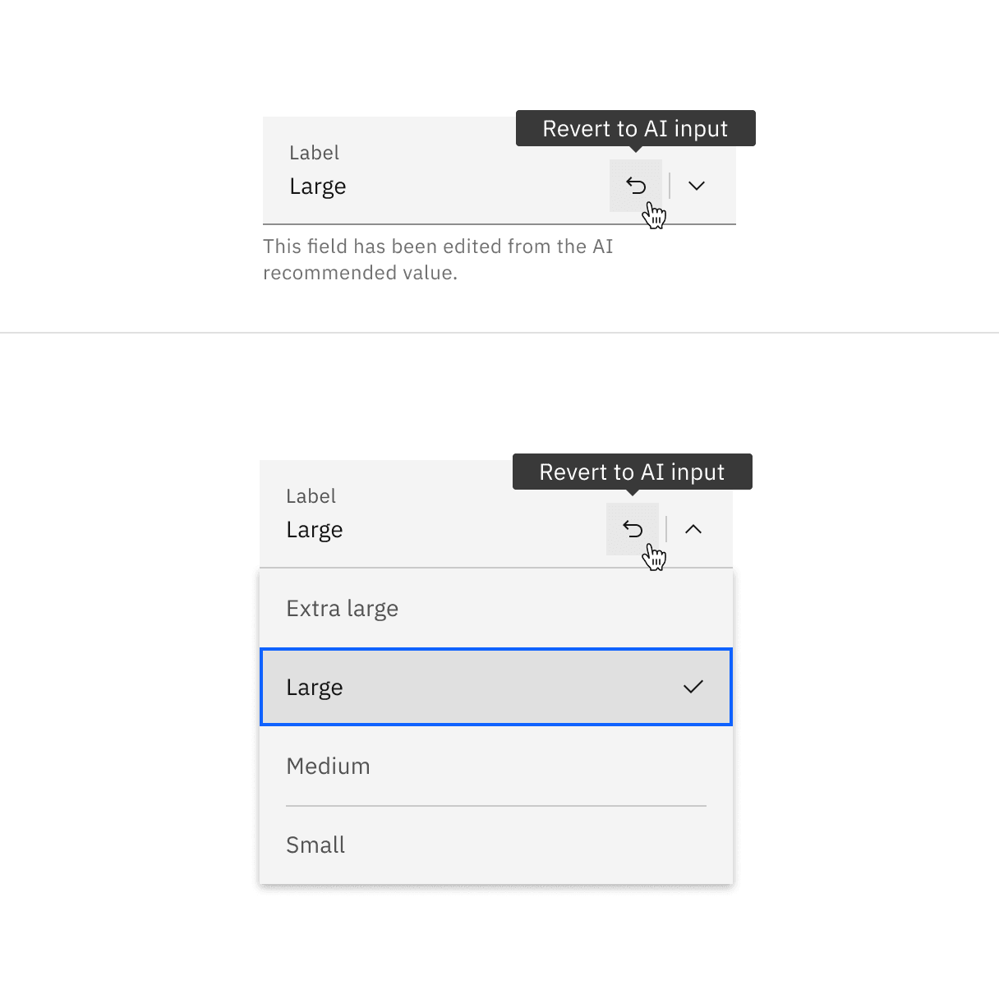

</Tab>

</Tabs>

</Column>
</Row>

## Related

#### Checkbox

Checkboxes are used when there are multiple options to select in a list. Users
can select zero, one, or any number of options. For further guidance, see
Carbon’s [checkbox](/components/checkbox/code).

#### Form

A form is a group of related input controls that allows users to provide data or
configure options. For further guidance, see Carbon’s
[form](/components/form/code).

#### Radio button

Radio buttons are used when there is a group of mutually exclusive choices and
only one selection from the group is allowed. For further guidance, see
Carbon’s[radio button](/components/radio-button/code).

[select](https://www.carbondesignsystem.com/components/select/code)

#### Dropdown versus Select

Dropdown and select components have functionality and style differences.

- The underlying code of a dropdown component is styled to match the design
  system, while the select component’s appearance is determined by the browser
  being used.
- Use a dropdown component in forms, to select multiple options at a time and to
  filter or sort content on a page. The select dropdown does not have filtering
  or multiselect functionality.
- Use a select dropdown component if most of your experience is form based.
  Custom dropdowns can be used in these situations, but the native select works
  more easily with a native form when submitting data.
- Use a select dropdown component if your experience will be frequently used on
  mobile. The native select dropdown uses the native control for the platform
  which makes it easier to use.

#### Dropdown versus Combo box

While the dropdown and combo box look similar they have different functions.

- With a dropdown list, the selected option is always visible, and the other
  options are visible by clicking and opening the list.
- A combo box is a combination of a standard list box or a dropdown list that
  lets users type inside the input field to find an option that matches their
  inputted value.

## References

Angie Li,
[Dropdown: Design Guidelines](https://www.nngroup.com/articles/drop-down-menus/)
(Nielsen Norman Group, 2017)

## Feedback

Help us improve this pattern by providing feedback, asking questions, and
leaving any other comments on
[GitHub](https://github.com/carbon-design-system/carbon-website/issues/new?assignees=&labels=feedback&template=feedback.md).
