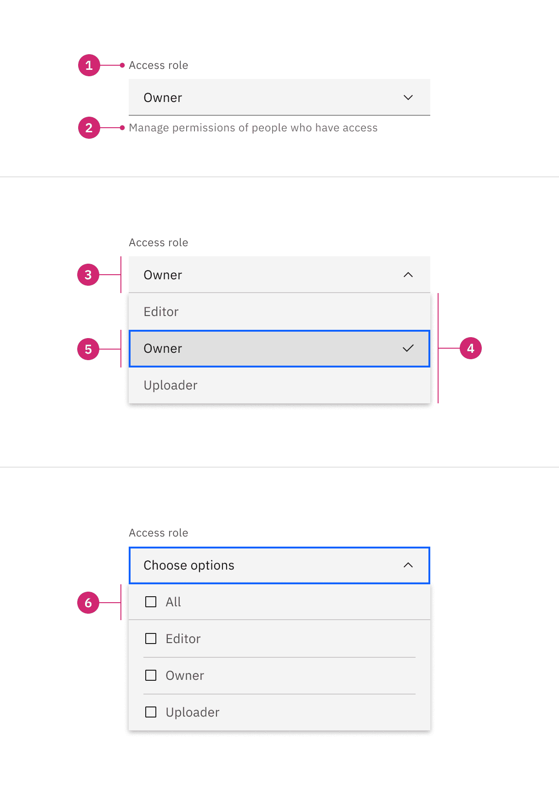
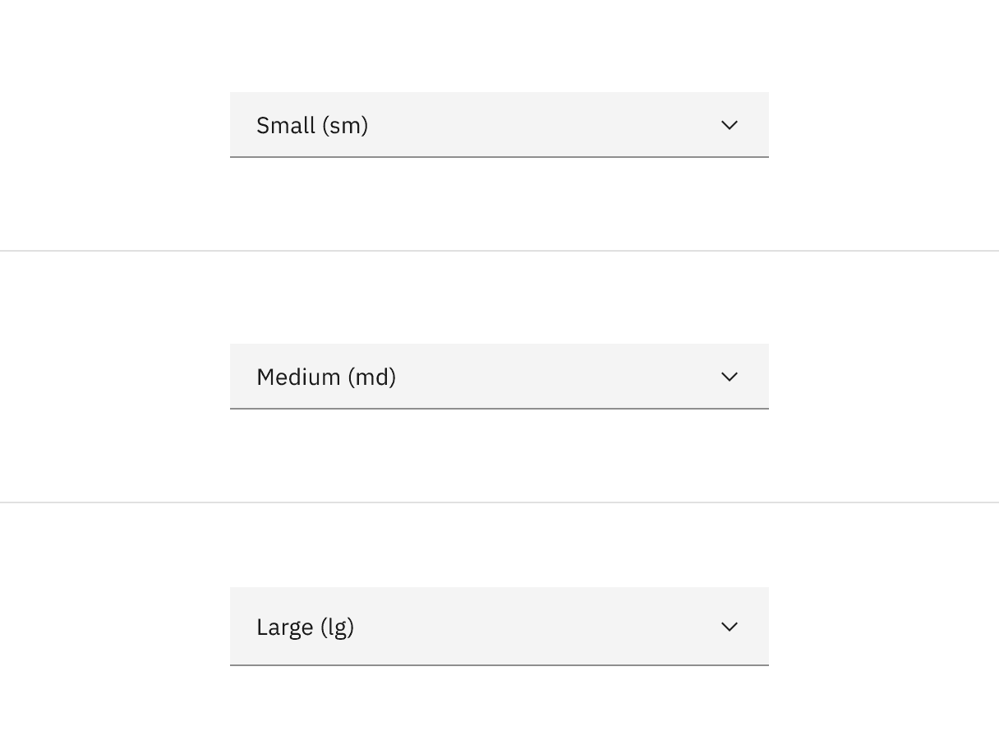
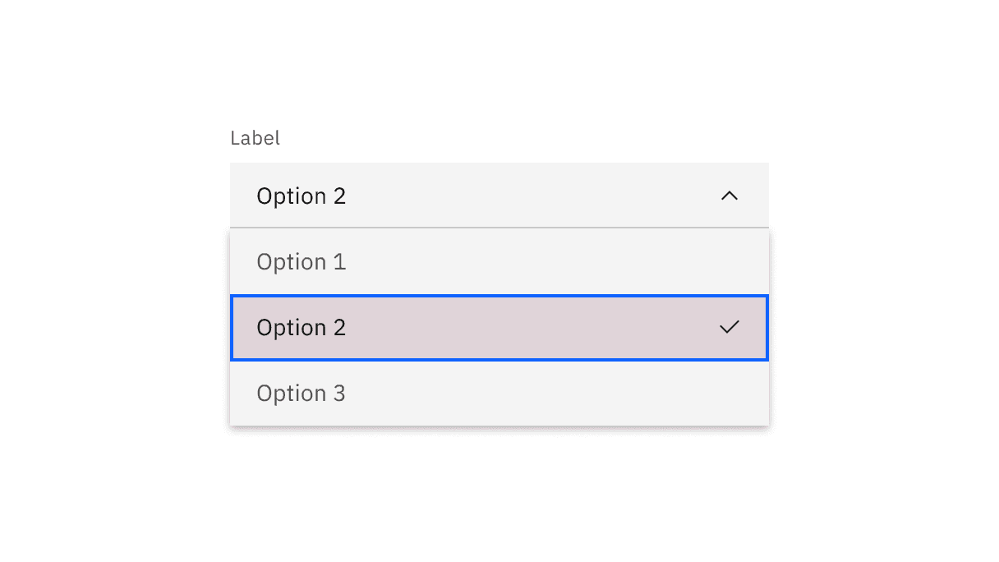
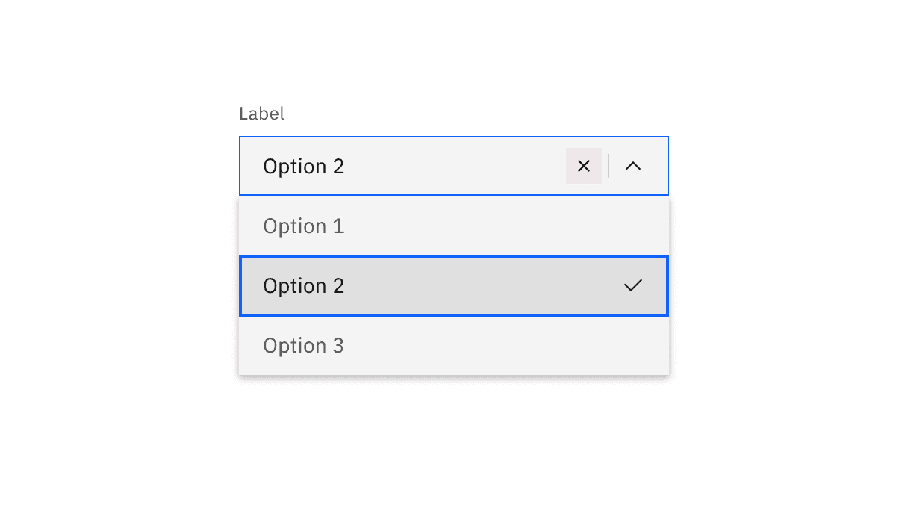
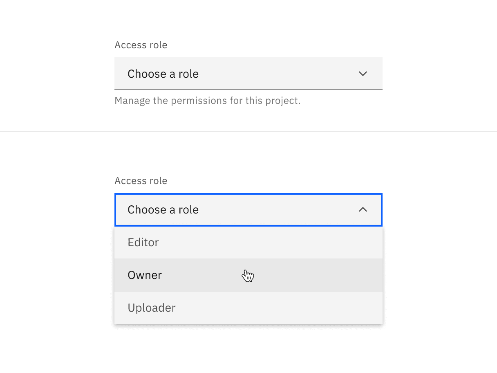
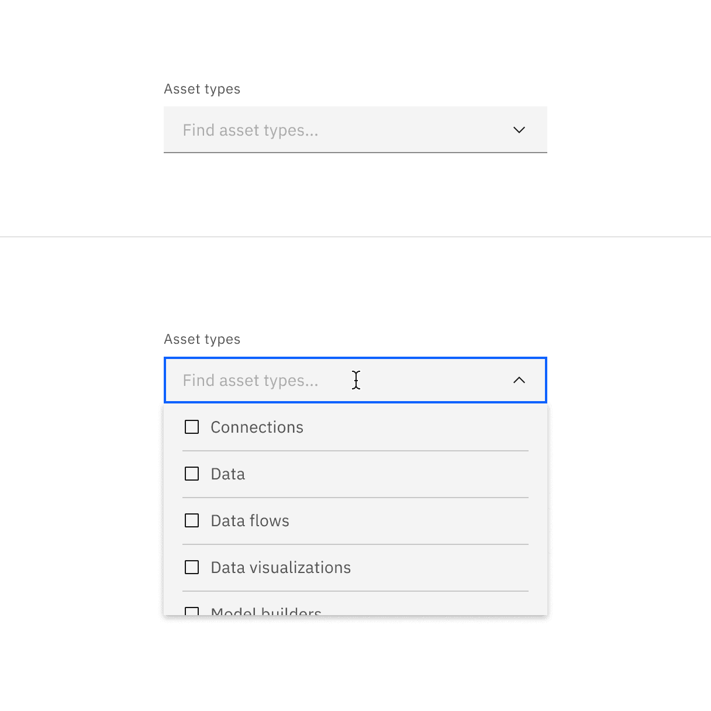
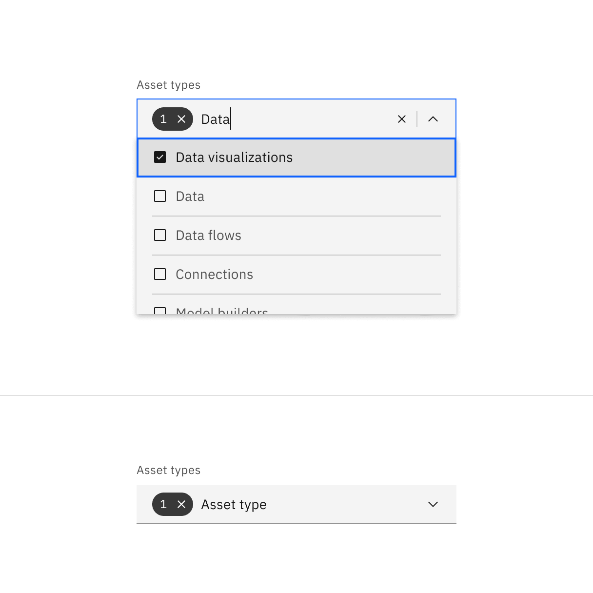
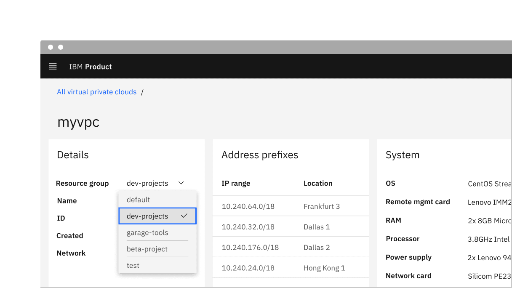
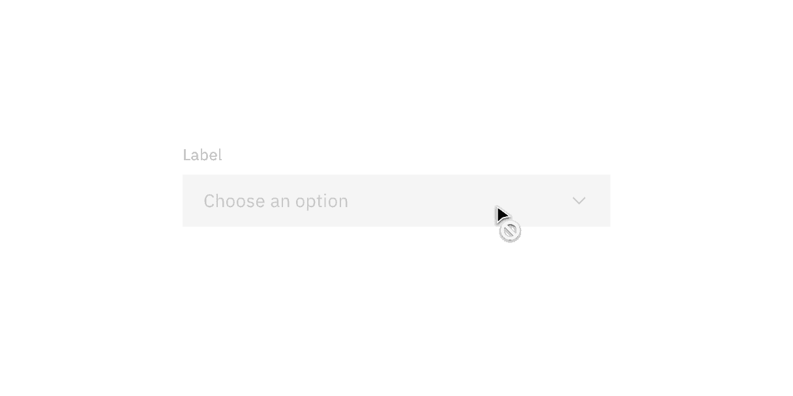

<PageDescription>

Dropdowns present a list of options from which a user can select one option, or
several. A selected option can represent a value in a form, or can be used as an
action to filter or sort existing content.

</PageDescription>

<AnchorLinks>

<AnchorLink>Overview</AnchorLink>
<AnchorLink>Live demo</AnchorLink>
<AnchorLink>Formatting</AnchorLink>
<AnchorLink>Content</AnchorLink>
<AnchorLink>Universal behaviors</AnchorLink>
<AnchorLink>Dropdown</AnchorLink>
<AnchorLink>Multiselect</AnchorLink>
<AnchorLink>Combo box</AnchorLink>
<AnchorLink>Modifiers</AnchorLink>
<AnchorLink>Related</AnchorLink>
<AnchorLink>References</AnchorLink>
<AnchorLink>Feedback</AnchorLink>

</AnchorLinks>

import items from '../../../data/components/dropdown.js';

## Overview

There are three different variants of dropdowns that support various kinds of
functionality—dropdown, multiselect, and combo box.

### Variants

| Variant                     | Purpose                                                                                                  |
| --------------------------- | -------------------------------------------------------------------------------------------------------- |
| [Dropdown](#dropdown)       | Allows the user to select one option from a list.                                                        |
| [Multiselect](#multiselect) | Allows the user to select multiple options from a list and filter.                                       |
| [Combo box](#combo-box)     | Allows a user to enter any value, or select a value from a list of suggested, likely, or desired values. |

#### When to use

- Dropdowns can be used in forms on full pages, in modals, or on side panels.
  The dropdown component is used to filter or sort contents on a page. It is a
  stylized version of the select component, and can be styled as needed.

#### When not to use

- It is best practice not to use a dropdown if there are two options to choose
  from. In this case, use a
  [radio button](https://www.carbondesignsystem.com/components/radio-button/code)
  group instead.
- Do not nest dropdowns or use them to display overly complex information. Keep
  option selections as straight forward as possible.
- Consider using a
  [select dropdown](https://www.carbondesignsystem.com/components/select/usage)
  if most of your experience is form-based or frequently used on mobile
  platforms. The native select works more easily with a native form when
  submitting data and is also easier to use on a mobile platform.

## Live demo

<ComponentDemo
  components={[
    {
      id: 'default-dropdown',
      label: 'Default',
    },
    {
      id: 'combo-box',
      label: 'Combo box',
    },
    {
      id: 'multiselect',
      label: 'Multiselect',
    },
    {
      id: 'filter-multiselect',
      label: 'Filterable multiselect',
    },
  ]}
  scope={{ items }}>
  <ComponentVariant
    id="default-dropdown"
    knobs={{
      Dropdown: ['light', 'disabled'],
    }}
    links={{
      React:
        'https://react.carbondesignsystem.com/?path=/story/dropdown--default',
      Angular:
        'https://angular.carbondesignsystem.com/?path=/story/components-dropdown--basic',
      Vue:
        'http://vue.carbondesignsystem.com/?path=/story/components-cvdropdown--default',
      Vanilla: 'https://the-carbon-components.netlify.com/?nav=dropdown',
    }}>{`
    <Dropdown
      ariaLabel="Dropdown"
      id="carbon-dropdown-example"
      items={items}
      label="Dropdown menu options"
      titleText="Dropdown title"
    />
  `}</ComponentVariant>
  <ComponentVariant
    id="combo-box"
    knobs={{
      ComboBox: ['light', 'disabled'],
    }}
    links={{
      React:
        'https://react.carbondesignsystem.com/?path=/story/combobox--default',
      Angular:
        'https://angular.carbondesignsystem.com/?path=/story/components-dropdown--basic',
      Vue:
        'http://vue.carbondesignsystem.com/?path=/story/components-cvcombobox--default',
      Vanilla: 'https://the-carbon-components.netlify.com/?nav=dropdown',
    }}>{`
    <ComboBox
      ariaLabel="ComboBox"
      id="carbon-combobox-example"
      items={items}
      label="Combo box menu options"
      titleText="Combo box title"
    />
  `}</ComponentVariant>
  <ComponentVariant
    id="multiselect"
    knobs={{
      MultiSelect: ['light', 'disabled'],
    }}
    links={{
      React:
        'https://react.carbondesignsystem.com/?path=/story/multiselect--default',
      Angular:
        'https://angular.carbondesignsystem.com/?path=/story/components-dropdown--basic',
      Vue:
        'http://vue.carbondesignsystem.com/?path=/story/components-cvmultiselect--default',
      Vanilla: 'https://the-carbon-components.netlify.com/?nav=dropdown',
    }}>{`
    <MultiSelect
      ariaLabel="MultiSelect"
      id="carbon-multiselect-example"
      items={items}
      label="Multiselect menu options"
      titleText="Multiselect title"
    />
  `}</ComponentVariant>
  <ComponentVariant
    id="filter-multiselect"
    links={{
      React:
        'https://react.carbondesignsystem.com/?path=/story/multiselect--filterable',
      Angular:
        'https://angular.carbondesignsystem.com/?path=/story/components-dropdown--basic',
      Vue:
        'http://vue.carbondesignsystem.com/?path=/story/components-cvmultiselect--user-filter-and-or-highlight',
      Vanilla: 'https://the-carbon-components.netlify.com/?nav=dropdown',
    }}>{`
    <MultiSelect.Filterable
      ariaLabel="Filterable MultiSelect"
      id="carbon--filterable-multiselect-example"
      items={items}
      label="Filterable multiselect options"
      titleText="Filterable multiselect title"
    />
 `}</ComponentVariant>
</ComponentDemo>

## Formatting

### Anatomy

Dropdowns are composed of four distinct sections—assistive text like labels or
helper text, a field, a menu, and options contained within the menu. Labels and
helper text are optional but can guide the user to make an informed decision
when making a selection.

<Row>
<Column colLg={8}>

</Column>
</Row>

1. **Labels and helper text (optional):** Assistive text to help the user make a
   selection.
2. **Field:** Persists when the dropdown is open or closed.
3. **Option:** A list of multiple options to select from within a menu.
4. **Menu:** Displayed as an open state and contains a list of options to select
   from.

### Sizing

#### Height

There are three dropdown height sizes: Large, medium (default), and small. Use a
consistent dropdown height when it is being used alongside other form components
on the same page. Supporting three different dropdown sizes gives you more
flexibility when structuring layouts. When in doubt, use the default medium size
height.

<Row>
<Column colLg={8}>

</Column>
</Row>

| Dropdown size    | Height (px/rem) | Use case                                                                                                                                                                           |
| ---------------- | --------------- | ---------------------------------------------------------------------------------------------------------------------------------------------------------------------------------- |
| Large            | 48/3            | Choose this size when there is a lot of space to work with. This size is typically used in simple forms or when a dropdown is placed by itself on a page, for example as a filter. |
| Medium (default) | 40/2.5          | This is our default size and should be used whenever possible.                                                                                                                     |
| Small            | 32/2            | Use when space is constricted or when placing a dropdown in a form that is long and complex.                                                                                       |

When the menu is open, each option in the menu should be the same height as the
field. Use a consistent size of form components on the same page. For example,
if you are using a medium size dropdown also use the same size text inputs,
buttons, and so on.

<Row>
<Column colLg={8}>

</Column>
</Row>

#### Width

There is no minimum or maximum width for a dropdown. The width can be customized
appropriately for its context.

### Placement

Field containers should vertically align to the grid and with other form
components on a page.

<DoDontRow>
  <DoDont caption="Do align field containers to the grid.">

  </DoDont>
  <DoDont type="dont" caption="Do not align field input text to the grid and hang the container.">

  </DoDont>
</DoDontRow>

## Content

### Main elements

#### Labels

- Labels inform users what to expect in the list of dropdown options.
- Keep the label short and concise by limiting it to a single line of text.

#### Helper text

- Helper text is pertinent information that assists the user in choosing the
  right selection from the dropdown menu.
- Helper text is always available when the dropdown field is focused and appears
  underneath the label.
- Use sentence-style capitalization and write the text as full sentences with
  punctuation, unless space is limited.

<Row>
<Column colLg={8}>

</Column>
</Row>

#### Field placeholder text

- Placeholder text is presented in the field by default if no selection has been
  made from the dropdown. This is important to have in case the dropdown does
  not have a label above it.
- Use clear placeholder text for the dropdown trigger so that users understand
  the purpose.

#### Options in a menu

- Describe the dropdown option succinctly in one line of text.
- Never use decorative images or icons within a dropdown.
- We recommend presenting the options in alphabetical order.

### Optional versus required fields

All fields in a form are assumed required, and optional fields are tagged. For
more information, see the
[form component](https://www.carbondesignsystem.com/components/form/usage) usage
guidance.

### Overflow content

Avoid having multiple lines of text in a dropdown. If the text is too long for
one line, add an ellipsis (…) for overflow content, and accompany with a
browser-based tooltip to show the full string of text.

<Row>
<Column colLg={8}>

</Column>
</Row>

### Further guidance

For further content guidance, see Carbon's
[content guidelines](/guidelines/content/overview).

## Universal behaviors

The behaviors listed in this section are universal across all of the variants.
For behaviors that are unique to each variant, see the sections below.

### Direction

A dropdown can open up or down depending on its position on the screen. For
example, if the dropdown appears at the bottom and close to the edge of the
interface, the menu expands upward to avoid being cropped. By default, our
dropdowns open downward.

### Elevation

Carbon has one layer style called a `box-shadow`. The box-shadow is placed
behind the dropdown menu when open. Box-shadow is also used in other components
that have overlayed menus, such as the overflow menu and date picker calendar.
The SCSS for box-shadow is `0 2px 6px 0 rgba(0,0,0,.2)`.

### Scrolling behavior

Scroll bars may not always be enabled so we recommend showing 50% of the last
option's container height to indicate there is more to see within the menu. We
recommend starting a scroll at the sixth option in the menu list, but this may
vary based on your specific use case.

<Row>
<Column colLg={8}>

</Column>
</Row>

### Interactions

#### Mouse

Users trigger a dropdown menu to open by clicking the chevron icon or clicking
anywhere within the field. Users can close the menu by clicking the chevron icon
or clicking outside of the menu.

<Row>
<Column colLg={8}>

</Column>
</Row>

- To select an option the user can click anywhere inside an option container.

<Row>
<Column colLg={8}>

</Column>
</Row>

- To clear all selected options from a list in a `multiselect` dropdown, click
  the “x” icon next to the value inside the tag.

<Row>
<Column colLg={8}>

</Column>
</Row>

- To clear a selected value in a `combo box` or a filterable dropdown, click the
  “x” icon to the right of the field input text.

<Row>
<Column colLg={8}>

</Column>
</Row>

#### Keyboard

#### Dropdown:

- The dropdown field is the element that receives focus. All keyboard
  interactions happen from this element.
- Users can move the highlighted option to the next option by pressing the
  `Down arrow`.
- Users can move the highlighted option to the previous option by pressing the
  `Up arrow`.
- Users can open the dropdown menu by pressing `Space`, `Enter`, `Down arrow` or
  the `Up arrow`.
- Users can close the dropdown menu by pressing `Escape`, `Space`, or `Enter`.

#### Combo box and filtering:

- When typing a character: focus stays on the field while an option in the menu
  is highlighted that best matches the typed character.
- When typing multiple characters in rapid succession: focus stays on the field
  while an option in the menu is highlighted that best matches the string of
  characters typed.

#### Multiple selection:

- The multiselect field receives focus if none of the options are selected in
  the menu.
- Once an option in the dropdown menu receives focus, users can press `Enter` to
  select or deselect the option.
- Users can open and close a dropdown menu by pressing `Space`.

#### Screen readers

- Labels must be announced to the screen reader on focus. Ensure the helper text
  that appears under an input is read when an assistive technology user stops at
  an input using ARIA.
- VoiceOver: Users can trigger a state change by pressing `Control-Option-Space`
  or `Space` while the dropdown field has screen reader focus.
- JAWS: Users can trigger a state change by pressing `Space` while the dropdown
  field has screen reader focus.
- NVDA: Users can trigger a state change by pressing `Space` while the dropdown
  field has screen reader focus.

## Dropdown

Use when you can select only one option from a list at a time.

- By default, the dropdown displays placeholder text in the field when closed.
- Clicking on a closed field opens a menu of options.

<Row>
<Column colLg={8}>

</Column>
</Row>

- Selecting an option from the menu closes it and the selected option text
  replaces the placeholder text in the field and also remains as an option in
  place if the menu is open.

<Row>
<Column colLg={8}>

</Column>
</Row>

## Multiselect

Use when you can select multiple options from a list or to filter information.

#### Making a selection

- By default, the dropdown displays placeholder text in the field when closed.
- Clicking a closed field opens a menu of options. Each option contains a
  checkbox input to the left of the option text.
- The menu stays open while options are being selected. The menu closes by
  clicking the field or outside of the dropdown.

<Row>
<Column colLg={8}>

</Column>
</Row>

- Once options have been selected from the menu, a tag appears to the left of
  the text in the field containing the total number of selected options. The
  placeholder text can change to text that better reflects what is selected.
- Selected options shift to the top of the menu in alphanumeric order.
- Unlike dropdown and combo box, the menu does not close once the user makes
  selections. Because multiple selections are possible, the user needs to click
  outside of the dropdown or on the parent element to close the menu.

<Row>
<Column colLg={8}>

</Column>
</Row>

#### Clear all

To clear all selected options from a list, hover over the filterable tag and
click the “x” (or `close`) icon next to the value. To help with clarity, a
browser tooltip appears when the user hovers over the “x” icon to indicate the
click action results. If you want to unselect individual options, you can do so
by unselecting the checkbox of each option.

<Row>
<Column colLg={8}>

</Column>
</Row>

#### Filtering

Use filtering to narrow down a long list of options to find the option you want
to select.

- By default, the filterable multiselect dropdown displays placeholder text in
  the field when closed.
- When hovering over the field, a text cursor appears.

<Row>
<Column colLg={8}>

</Column>
</Row>

- The menu opens by clicking anywhere in the field and you can start typing to
  filter the list of options. The options that start to match your entry remain
  in the list while other existing options are temporarily removed.
- After typing text in the field, the close (x) icon appears to the right of the
  text in the field. This clears any text that’s been entered in the field.

<Row>
<Column colLg={8}>

</Column>
</Row>

- Once options have been selected from the menu, a tag appears to the left of
  the text in the field containing the total number of selected options. The
  placeholder text can change to text that better reflects what is selected.
- Selected options shift to the top of the menu in alphanumeric order.
- Like the default multiselect dropdown, the menu does not close once the user
  makes selections.

<Row>
<Column colLg={8}>

</Column>
</Row>

## Combo box

Allows the the user to make a selection from a predefined list of options and is
typically used when there are a large amount of options to choose from.

- By default, the combo box displays placeholder text in the field when closed.
- When hovering over the field, a text cursor appears.

<Row>
<Column colLg={8}>

</Column>
</Row>

- The menu opens by clicking anywhere in the field and you can start typing to
  sort through the list of options. The option that best matches the typed characters is highlighted.
- After typing text in the field, the close (x) icon appears to the right of the
  text in the field. This clears any text that’s been entered in the field.

<Row>
<Column colLg={8}>

</Column>
</Row>

- Selecting an option closes the menu and the selected option replaces the
  placeholder text.

<Row>
<Column colLg={8}>

</Column>
</Row>

## Modifiers

#### Inline

When placing a dropdown inline with other content use the inline modifier. If
adding a visual label to an inline dropdown it should appear inline to the left
of the dropdown. If there is no visual label present you must supply an
appropriate accessibility label to the inline dropdown. _Note: Inline is only a
modifier for dropdown and does not have filtering functionality._

<Row>
<Column colLg={8}>

</Column>
</Row>

#### Light

Use the `light` prop modifier when using a dropdown on a background other than
the UI background for that theme. The light prop changes the background color
token of the dropdown from `field-01` to `field-02`. This is frequently used in
form modals and side panels, or when a dropdown sits on top of a tile on a page.

<Row>
<Column colLg={8}>

</Column>
</Row>

#### Invalid

Real time validation helps to streamline the process of filling out a form. We
have three indicators of an invalid state: a border, an icon indicator, and an
error message. Having text, color, and weight differentiation as invalid
indicators help meet accessibility requirements. For full guidelines, refer to
the [form component](https://www.carbondesignsystem.com/components/form/usage)
usage page.

<Row>
<Column colLg={8}>

</Column>
</Row>

#### Disabled

A dropdown cannot be clicked, selected, or interacted with if it is disabled. It
is not read by a screen reader and takes on the default disabled visual style.
Tooltips on a disabled state are also not read by screen readers and we
recommend having an alternative way to show descriptive text if needed.

<Row>
<Column colLg={8}>

</Column>
</Row>

## Related

#### Dropdown versus Select

Dropdown and select components have functionality and style differences.

- The underlying code of a dropdown component is styled to match the design
  system, while the select component’s appearance is determined by the browser
  being used.
- Use a dropdown component in forms, to select multiple options at a time and to
  filter or sort content on a page. The select dropdown does not have filtering
  or multiselect functionality.
- Use a select dropdown component if most of your experience is form based.
  Custom dropdowns can be used in these situations, but the native select works
  more easily with a native form when submitting data.
- Use a select dropdown component if your experience will be frequently used on
  mobile. The native select dropdown uses the native control for the platform
  which makes it easier to use.

#### Dropdown versus Combo box

While the dropdown and combo box look similar they have different functions.

- With a dropdown list, the selected option is always visible, and the other
  options are visible by clicking and opening the list.
- A combo box is a combination of a standard list box or a dropdown list and an
  editable text box and users are able to enter a value that isn't in the list.

## References

Angie Li,
[Dropdown: Design Guidelines](https://www.nngroup.com/articles/drop-down-menus/)
(Nielsen Norman Group, 2017)

- [Checkbox](https://www.carbondesignsystem.com/components/checkbox/code)
- [Form](https://www.carbondesignsystem.com/components/form/code)
- [Radio button](https://www.carbondesignsystem.com/components/radio-button/code)
- [Select](https://www.carbondesignsystem.com/components/select/code)

## Feedback

Help us improve this pattern by providing feedback, asking questions, and
leaving any other comments on
[GitHub](https://github.com/carbon-design-system/carbon-website/issues/new?assignees=&labels=feedback&template=feedback.md).
