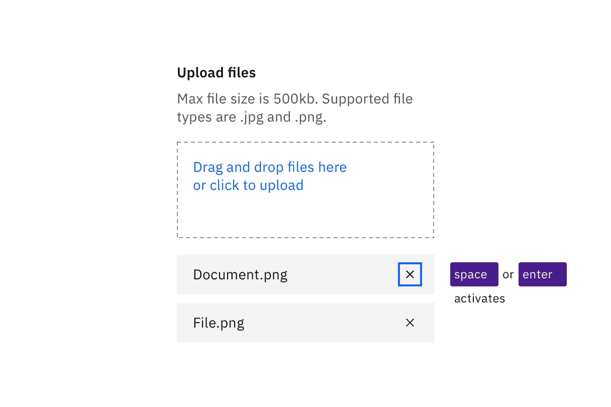

import {
  StructuredListWrapper,
  StructuredListHead,
  StructuredListBody,
  StructuredListRow,
  StructuredListInput,
  StructuredListCell,
  OrderedList,
  ListItem,
} from '@carbon/react';

<PageDescription>

No accessibility annotations are needed for file uploaders, but keep these
considerations in mind if you are modifying Carbon or creating a custom
component.

</PageDescription>

<AnchorLinks>
  <AnchorLink>What Carbon provides</AnchorLink>
  <AnchorLink>Development considerations</AnchorLink>
</AnchorLinks>

## What Carbon provides

Carbon bakes keyboard operation into its components, improving the experience of
blind users and others who operate via the keyboard. Carbon incorporates many
other accessibility considerations, some of which are described below.

### Keyboard interactions

Both variants of the file uploader provide buttons for uploading and removing
files. The drop target “Drag and drop files here..." also provides conventional
button keyboard interaction (`Tab` to reach; `Enter` or `Space` to activate).
Once a file has been added, it can be removed by activating the delete (“x”)
button after each file name.

<Row>
<Column colLg={8}>

<Caption>
  The drop zone is also a button that responds to standard keyboard interaction.
</Caption>

</Column>
</Row>

<Row>
<Column colLg={8}>

<Caption>
  Uploaded files can be removed by tabbing to each “x” button and activating.
</Caption>

</Column>
</Row>

## Development considerations

Keep these considerations in mind if you are modifying Carbon or creating a
custom component:

- The 'Drag files' area is constructed as a button to support keyboard
  operation.
- Error messages about file uploads must be exposed to assistive technology.
- The Delete button needs to have the uploaded file name associated with it
  programmatically, so the user understands which file will be removed.
