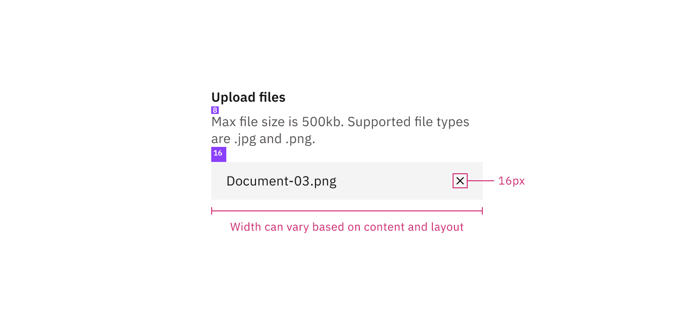

## Color

| Element             | Property                                                                                        | Color token       |
| ------------------- | ----------------------------------------------------------------------------------------------- | ----------------- |
| Heading             | text-color                                                                                      | `$text-primary`   |
| Description         | text-color                                                                                      | `$text-secondary` |
| Button              | See [primary button](https://www.carbondesignsystem.com/components/button/style#primary-button) |                   |
| Drop zone text      | text-color                                                                                      | `$link-primary`   |
| Drop zone container | border                                                                                          | `$border-strong`  |
| File name           | text-color                                                                                      | `$text-primary`   |
| File container      | background-color                                                                                | `$field` \*       |
| Delete icon         | svg                                                                                             | `$icon-primary`   |

<Caption fullWidth>
  \* Denotes a contextual color token that will change values based on the layer
  it is placed on.
</Caption>

<Row>
<Column colLg={8}>

</Column>
</Row>

### Interactive states

| State    | Element             | Property                                                                                       | Color token      |
| -------- | ------------------- | ---------------------------------------------------------------------------------------------- | ---------------- |
| Hover    | Drop zone text      | text-color                                                                                     | `link-primary`   |
|          | Drop zone container | border                                                                                         | `$focus`         |
| Focus    | Delete icon         | border                                                                                         | `$focus`         |
|          | Drop zone container | border                                                                                         | `$focus`         |
| Loading  | Loader              | See [inline loading](https://www.carbondesignsystem.com/components/inline-loading/style#color) |                  |
| Uploaded | Checkmark icon      | svg                                                                                            | `$interactive`   |
| Invalid  | File                | border                                                                                         | `$support-error` |
|          | Error title         | text-color                                                                                     | `$text-primary`  |
|          | Error message       | text-color                                                                                     | `$text-error`    |
|          | Warning icon        | svg                                                                                            | `$support-error` |
|          | Divider             | border-top                                                                                     | `$border-subtle` |
| Disabled | Label               | text-color                                                                                     | `$text-disabled` |
|          | Description         | text-color                                                                                     | `$text-disabled` |
|          | Drop zone text      | text-color                                                                                     | `$text-disabled` |

<Row>
<Column colLg={8}>

</Column>
</Row>

<Caption>Selected file states: loading, complete, focus, invalid.</Caption>

<Row>
<Column colLg={8}>

</Column>
</Row>

<Caption>Drag and drop file uploader states.</Caption>

## Typography

The file uploader label and description text should be set in sentence case,
with only the first letter of the first word in the sentence capitalized.

| Element        | Font-size (px/rem) | Font-weight    | Type token            |
| -------------- | ------------------ | -------------- | --------------------- |
| Heading        | 14 / 0.875         | SemiBold / 600 | `$heading-compact-01` |
| Description    | 14 / 0.875         | Regular / 400  | `$body-compact-01`    |
| Error message  | 12 / 0.75          | Regular / 400  | `$label-01`           |
| Drop zone text | 14 / 0.875         | Regular / 400  | `$body-compact-01`    |
| File name      | 14 / 0.875         | Regular / 400  | `$body-compact-01`    |

## Structure

The width of an uploaded file varies based on the content and layout of a
design.

| Element     | Property                                                                                   | px / rem | Spacing token |
| ----------- | ------------------------------------------------------------------------------------------ | -------- | ------------- |
| File        | width                                                                                      | 288 / 18 | –             |
|             | padding-left                                                                               | 16 / 1   | `$spacing-05` |
|             | margin-bottom                                                                              | 8 / 0.5  | `$spacing-03` |
|             | padding-right                                                                              | 16 / 1   | `$spacing-05` |
| Delete icon | height, width                                                                              | 16 / 1   | –             |
|             | margin-left, margin-right                                                                  | 16 / 1   | `$spacing-05` |
| Button      | See [primary button](https://www.carbondesignsystem.com/components/button/style#structure) |          |               |

<Caption fullwidth>
  Structure and spacing measurements for file uploader | px / rem
</Caption>

<Caption fullwidth>
  Structure and spacing measurements for drag and drop with multiple file upload
  functionality | px / rem
</Caption>

<Caption fullwidth>
  Structure and spacing measurements for drag and drop with single file upload
  functionality | px / rem
</Caption>

## Sizes

The file and button heights should always match.

| Element | Size        | Height px / rem |
| ------- | ----------- | --------------- |
| File    | Small (sm)  | 32 / 2          |
|         | Medium (md) | 40 / 2.5        |
|         | Large (lg)  | 48 / 3          |
| Button  | Small (sm)  | 32 / 2          |
|         | Medium (md) | 40 / 2.5        |
|         | Large (lg)  | 48 / 3          |

<Caption>File and button sizes | px / rem</Caption>
