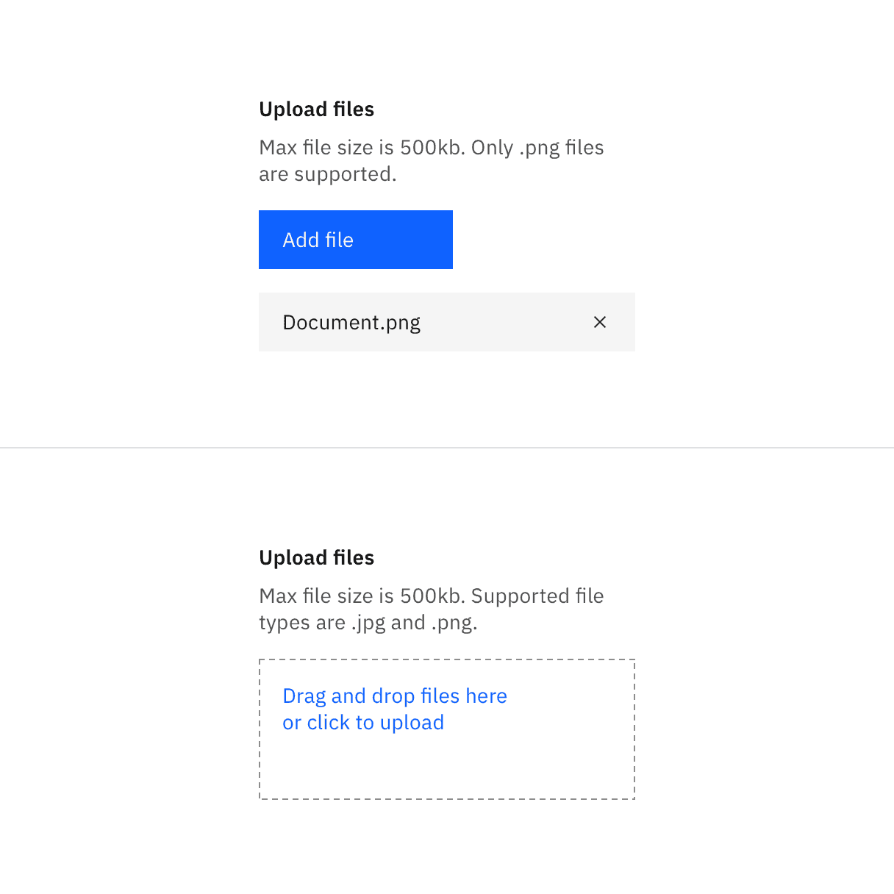
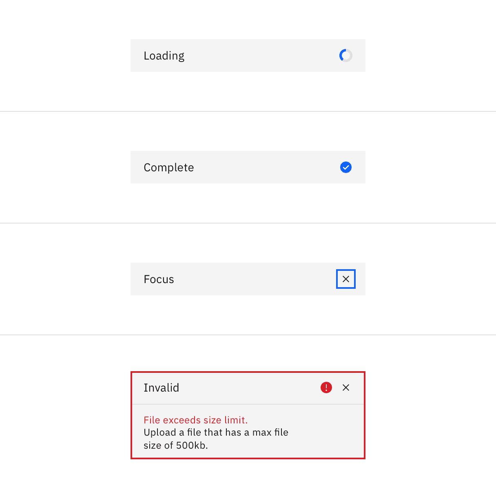
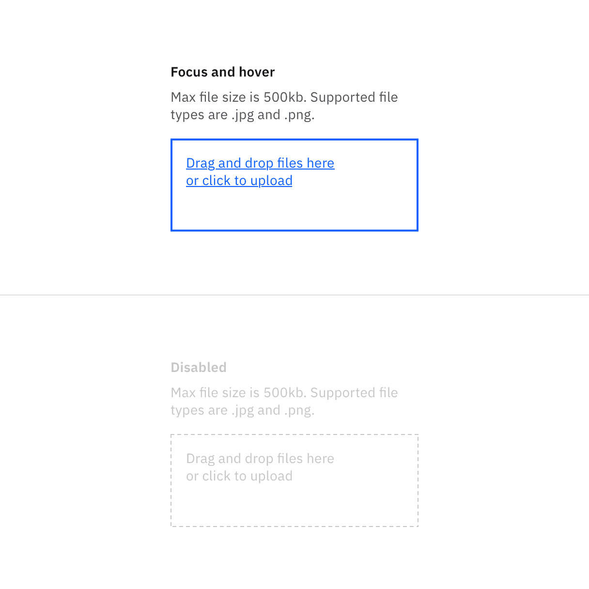

## Color

| Element        | Property                                                                                        | Color token       |
| -------------- | ----------------------------------------------------------------------------------------------- | ----------------- |
| Label          | text-color                                                                                      | `$text-primary`   |
| Description    | text-color                                                                                      | `$text-secondary` |
| File name      | text-color                                                                                      | `$text-primary`   |
| File           | background-color                                                                                | `$field`          |
| Close icon     | svg                                                                                             | `$icon-primary`   |
| Drop container | border                                                                                          | `$border-strong`  |
| Drop text      | text-color                                                                                      | `$link-primary`   |
| Button         | See [primary button](https://www.carbondesignsystem.com/components/button/style#primary-button) |                   |

<Row>
<Column colLg={8}>

</Column>
</Row>

### Interactive states

| State    | Element        | Property                                                                                       | Color token        |
| -------- | -------------- | ---------------------------------------------------------------------------------------------- | ------------------ |
| Hover    | Drop container | border                                                                                         | `$focus`           |
|          | Drop text      | text-color                                                                                     | `link-primary`     |
| Focus    | File           | border                                                                                         | `$focus`           |
|          | Drop container | border                                                                                         | `$focus`           |
| Loading  | Loader         | See [inline loading](https://www.carbondesignsystem.com/components/inline-loading/style#color) |                    |
| Uploaded | Checkmark icon | svg                                                                                            | `$interactive`     |
| Invalid  | File           | border                                                                                         | `$support-error`   |
|          | Error title    | text-color                                                                                     | `$text-primary`    |
|          | Error message  | text-color                                                                                     | `$text-error`      |
|          | Warning icon   | svg                                                                                            | `$support-error`   |
|          | Divider        | border-top                                                                                     | `$border-subtle`   |
| Disabled | Label          | text-color                                                                                     | `$text-disabled`   |
|          | Description    | text-color                                                                                     | `$text-disabled`   |
|          | Drop text      | text-color                                                                                     | `$text-disabled`   |
|          | Drop container | border                                                                                         | `$button-disabled` |

<Row>
<Column colLg={8}>

</Column>
</Row>

<Caption>Selected file states: loading, complete, focus, invalid.</Caption>

<Row>
<Column colLg={8}>

</Column>
</Row>

<Caption>Drag and drop file uploader states.</Caption>

## Typography

The file uploader label and description text should be set in sentence case,
with only the first letter of the first word in the sentence capitalized.

| Element       | Font-size (px / rem) | Font-weight     | Type token               |
| ------------- | -------------------- | --------------- | ------------------------ |
| Label         | 14 / 0.875           | Semi-bold / 600 | `$productive-heading-01` |
| Description   | 14 / 0.875           | Regular / 400   | `$body-short-01`         |
| File name     | 14 / 0.875           | Regular / 400   | `$body-short-01`         |
| Error message | 12 / 0.75            | Regular / 400   | `$label-01`              |
| Drop text     | 14 / 0.875           | Regular / 400   | `$body-short-01`         |

## Structure

The width of an uploaded file varies based on the content and layout of a
design.

| Element    | Property                                                                                   | px / rem | Spacing token |
| ---------- | ------------------------------------------------------------------------------------------ | -------- | ------------- |
| File       | width                                                                                      | 288 / 18 | –             |
|            | padding-left                                                                               | 16 / 1   | `$spacing-05` |
|            | margin-bottom                                                                              | 8 / 0.5  | `$spacing-03` |
|            | padding-right                                                                              | 16 / 1   | `$spacing-05` |
| Close icon | height, width                                                                              | 16 / 1   | –             |
|            | margin-left, margin-right                                                                  | 16 / 1   | `$spacing-05` |
| Button     | See [primary button](https://www.carbondesignsystem.com/components/button/style#structure) |          |               |

<Caption>
  Structure and spacing measurements for file uploader | px / rem
</Caption>

<Caption>
  Structure and spacing measurements for drag and drop file uploader | px / rem
</Caption>

### Sizes

The file and button heights should always match.

| Element | Property | Size   | px / rem | Spacing token |
| ------- | -------- | ------ | -------- | ------------- |
| File    | height   | Small  | 32 / 2   | –             |
|         | height   | Medium | 40 / 2.5 | –             |
|         | height   | Large  | 48 / 3   | –             |
| Button  | height   | Small  | 32 / 2   | –             |
|         | height   | Medium | 40 / 2.5 | –             |
|         | height   | Large  | 48 / 3   | –             |

<Row>
<Column colLg={8}>

</Column>
</Row>

<Caption>File and button sizes | px / rem</Caption>
