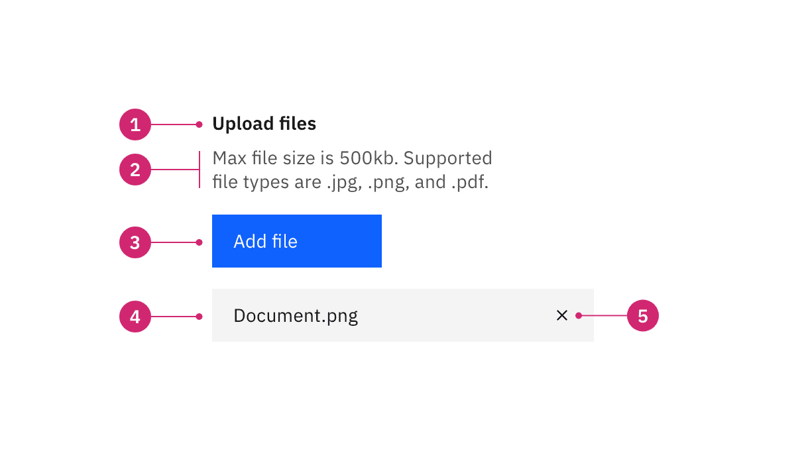
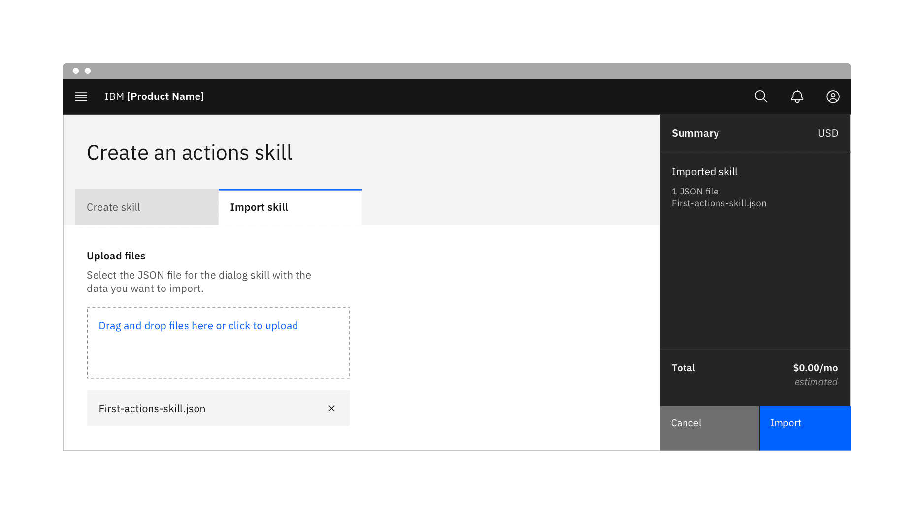
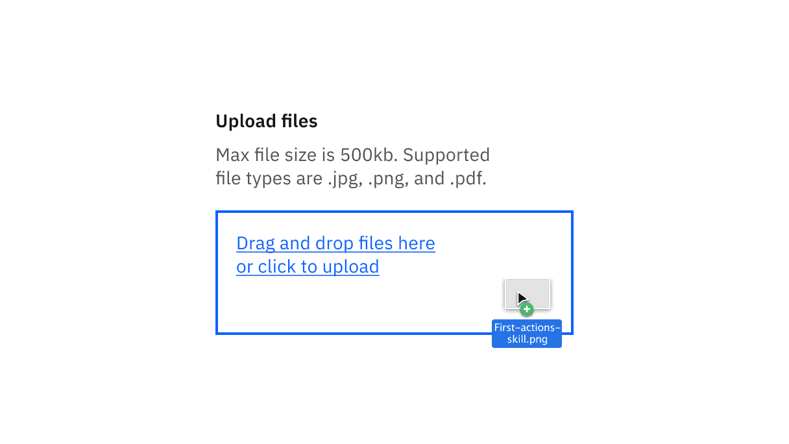

<PageDescription>

File uploaders allow users to select one or more files to upload to a specific
location.

</PageDescription>

<AnchorLinks>

<AnchorLink>Overview</AnchorLink>
<AnchorLink>Live demo</AnchorLink>
<AnchorLink>Formatting</AnchorLink>
<AnchorLink>Content</AnchorLink>
<AnchorLink>Universal behaviors</AnchorLink>
<AnchorLink>File uploader</AnchorLink>
<AnchorLink>Drag and drop file uploader</AnchorLink>
<AnchorLink>References</AnchorLink>
<AnchorLink>Feedback</AnchorLink>

</AnchorLinks>

## Overview

File uploaders allow users to upload content of their own. A file uploader is
commonly found in forms, but can also live as a standalone element. There are
two variants of file uploaders—our default file uploader and a drag and drop
file uploader.

### Variants

| Variant                                                     | Way it works                                                                                |
| ----------------------------------------------------------- | ------------------------------------------------------------------------------------------- |
| [File uploader](#file-uploader)                             | Upload one or more files by clicking an action button that prompts a file selection dialog. |
| [Drag and drop file uploader](#drag-and-drop-file-uploader) | Drag and drop selected files directly into a drop zone area to upload.                      |

### When to use

- Uploading one or more files.
- Uploading files by dragging and dropping.
- Showing the process of uploading.

### When not to use

- Do not use upload in a modal when multiple files are uploaded, as uploaded
  files stack vertically.

## Live demo

<ComponentDemo
  components={[
    {
      id: 'file-uploader',
      label: 'File uploader',
    },
    {
      id: 'drag-and-drop',
      label: 'Drag and drop',
    },
    {
      id: 'upload-states',
      label: 'Upload states',
    },
  ]}>
  <ComponentVariant
    id="file-uploader"
    knobs={{
      FileUploader: ['multiple'],
    }}
    links={{
      React:
        'https://react.carbondesignsystem.com/?path=/story/fileuploader--fileuploader',
      Angular:
        'https://angular.carbondesignsystem.com/?path=/story/components-file-uploader--basic',
      Vue:
        'http://vue.carbondesignsystem.com/?path=/story/components-cvfileuploader--default',
      Vanilla: 'https://the-carbon-components.netlify.com/?nav=file-uploader',
    }}>{`
      

        <FileUploader
          accept={[
            '.jpg',
            '.png'
          ]}
          buttonKind="primary"
          buttonLabel="Add files"
          filenameStatus="edit"
          iconDescription="Clear file"
          labelDescription="only .jpg files at 500mb or less"
          labelTitle="Upload"
        />
      

    `}</ComponentVariant>
  <ComponentVariant
    id="drag-and-drop"
    knobs={{
      FileUploaderDropContainer: ['multiple', 'disabled'],
    }}
    links={{
      React:
        'https://react.carbondesignsystem.com/?path=/story/fileuploader--drag-and-drop-upload-container-example-application',
      Angular:
        'https://angular.carbondesignsystem.com/?path=/story/components-file-uploader--drag-and-drop',
      Vue:
        'http://vue.carbondesignsystem.com/?path=/story/components-cvfileuploader--default',
      Vanilla: 'https://the-carbon-components.netlify.com/?nav=file-uploader',
    }}>{`
      

        <strong className='bx--file--label'>Account photo</strong>
        

          Only .jpg and .png files. 500kb max file size
        

        <FileUploaderDropContainer
          accept={[
            'image/jpeg',
            'image/png'
          ]}
          labelText="Drag and drop files here or click to upload"
          tabIndex={0}
        />
      

    `}</ComponentVariant>
  <ComponentVariant
    id="upload-states"
    knobs={{
      FileUploaderItem: ['status', 'invalid'],
    }}
    links={{
      React:
        'https://react.carbondesignsystem.com/?path=/story/fileuploader--fileuploaderitem',
      Angular:
        'https://angular.carbondesignsystem.com/?path=/story/components-file-uploader--basic',
      Vue:
        'http://vue.carbondesignsystem.com/?path=/story/components-cvfileuploader--default',
      Vanilla: 'https://the-carbon-components.netlify.com/?nav=file-uploader',
    }}>{`
      

        <FileUploaderItem name='color.jpg' errorSubject='File size exceeds limits' errorBody='500 kb max file size. Select a new file and try again.'/>
      

    `}</ComponentVariant>
</ComponentDemo>

## Formatting

### Anatomy

<Row>
<Column colLg={8}>

</Column>
</Row>

1. **Label:** Text to describe the action that needs to be taken.
2. **Description:** Assistive text to help the user make an informed selection.
3. **Button or drop zone:** The action to select a file to upload.
4. **Uploaded file:** A file that has successfully been uploaded.

### Sizing

The button and uploaded files should be the same height. If the file uploader is
present in a form with other inputs, use the same height for the form inputs and
the file uploader for consistency.

<Row>
<Column colLg={8}>

</Column>
</Row>

| File uploader size | Height (px/rem) | Use case                                                                                          |
| ------------------ | --------------- | ------------------------------------------------------------------------------------------------- |
| _Large_            | 48/3            | Choose this size when there is a lot of space to work with.                                       |
| _Medium_           | 40/2.5          | This is our default size and should be used whenever possible.                                    |
| _Small_            | 32/2            | Use when space is constricted or when placing a file uploader in a form that is long and complex. |

### Alignment

Left align the button or drop zone area with the uploaded files. Multiple files
will stack vertically.

<Row>
<Column colLg={8}>

</Column>
</Row>

### Placement

When including a button as the action to upload a file, use either a primary or
tertiary button depending on your use case. If there is already a primary button
present on the page, use a tertiary button for the file uploader so it does not
conflict with the primary action.

<Row>
<Column colLg={8}>

</Column>
</Row>

## Content

### Main elements

#### Label

- Labels inform users what needs to be uploaded.
- Keep the label short and concise by limiting it to a single line of text.

#### Description

- Descriptions help communicate to the user what file size or format limitations
  there are.

#### Button or drop zone text

- Button labels should be concise and describe the action that will be taken
  upon click. "Add files" is the default text that appears with the file
  uploader.
- Drop zone area text should describe that you can either drag and drop a file
  into the drop zone or click on the text to upload a file.

#### Uploaded file text

- The name of the file that has been uploaded.

### Overflow

Use an ellipsis (…) if the filename extends beyond the width of its parent
element.

<Row>
<Column colLg={8}>

</Column>
</Row>

### Further guidance

For further content guidance, see Carbon's
[content guidelines](https://www.carbondesignsystem.com/guidelines/content/overview).

### Loading states

A file that is being uploaded has three distinct states—loading, success, and
uploaded.

<Row>
<Column colLg={8}>

</Column>
</Row>

### Interactions

#### Mouse

Moving your mouse anywhere within the bounds of the drop zone area with an
attached file will enable you to drop it inside of the area and begin to upload.

<Row>
<Column colLg={8}>

</Column>
</Row>

To remove an uploaded file, click the "x” (or close) icon.

<Row>
<Column colLg={8}>

</Column>
</Row>

#### Keyboard

#### Upload button or drop zone:

- The file uploader button or drop zone can be activated by pressing `Space` or
  `Enter`.
- The file uploader button or drop zone should have text or a label that
  accurately describes the action that will be taken.
- After the file selection dialog closes, focus should retain the user’s point
  of regard and return to the element that invoked it.

#### Uploaded file:

- Pressing `Tab` shifts focus to the “x” icon.
- Pressing `Space` or `Enter` while the "x" icon is in focus will delete the
  file.

#### Screen readers

- VoiceOver: Users can upload a file by pressing `VO+Space` while the button or
  drop zone area is in focus.
- JAWS: Users can upload a file by pressing `Enter` or `Space` while the button
  or drop zone area is in focus.
- NVDA: Users can upload a file by pressing `Enter` or `Space` while the button
  or drop zone area is in focus.

### Validation

When a specific file cannot be uploaded successfully it will show an error
state. We have an option for a single line or multi-line error state depending
on how descriptive the message needs to be. Error messages should provide clear
guidance to help the user resolve the error.

If the error relates to the file uploader as a whole instead of an individual
file, you can alternatively use an inline error notification.

<Row>
<Column colLg={8}>

</Column>
</Row>

## File uploader

A file uploader traditionally uploads one or more files by clicking an action
button that prompts a file selection dialog. Once you have selected one or more
files from the dialog, the selected files will populate below the file uploader
on the page. Your file may temporarily display a loading state before uploading
has been successfully completed.

<Row>
<Column colLg={12}>

</Column>
</Row>

## Drag and drop file uploader

Drag and drop file uploaders are used to directly upload files by dragging and
dropping them into a drop zone area. Alternatively, you can also traditionally
open files through a file selection dialog by clicking the text link description
inside the drop zone.

The drop zone component lets users upload files by dragging and dropping the
files into an area on a page, or activating a button.

<Row>
<Column colLg={12}>

</Column>
</Row>

When dragging files into the drop zone area, the drop zone border changes in
color and thickness to indicate the area has been activated and is ready for
files. Additionally once the cursor hits the drop zone area it changes with a
preview of the file you are about to upload. The style of cursor change is
rendered by the browser you use.

<Row>
<Column colLg={8}>

</Column>
</Row>

## References

Page Laubheimer,
[Drag–and–Drop: How to Design for Ease of Use](https://www.nngroup.com/articles/drag-drop/),
(Nielsen Norman Group, 2020)

## Feedback

Help us improve this component by providing feedback, asking questions, and
leaving any other comments on
[GitHub](https://github.com/carbon-design-system/carbon-website/issues/new?assignees=&labels=feedback&template=feedback.md).
