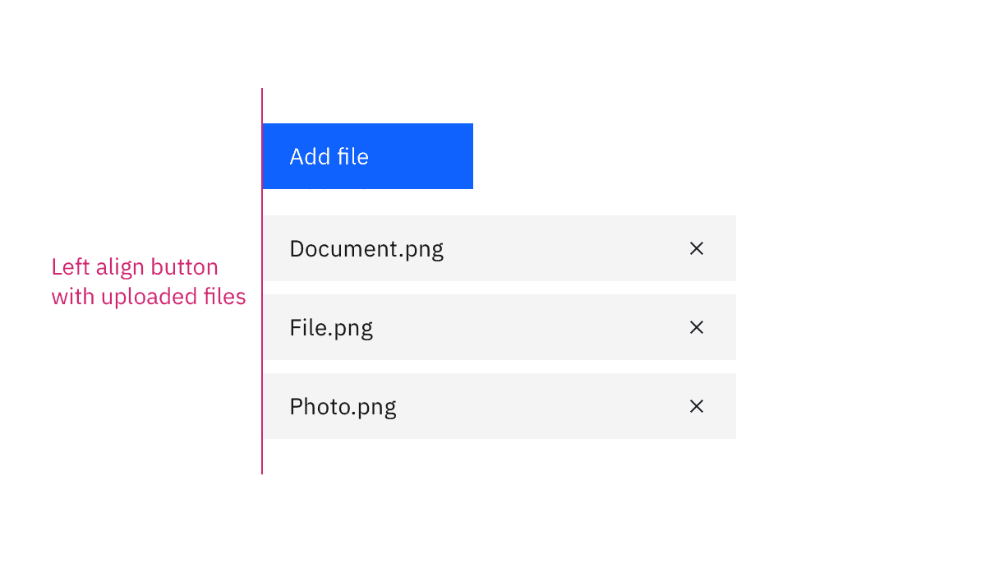
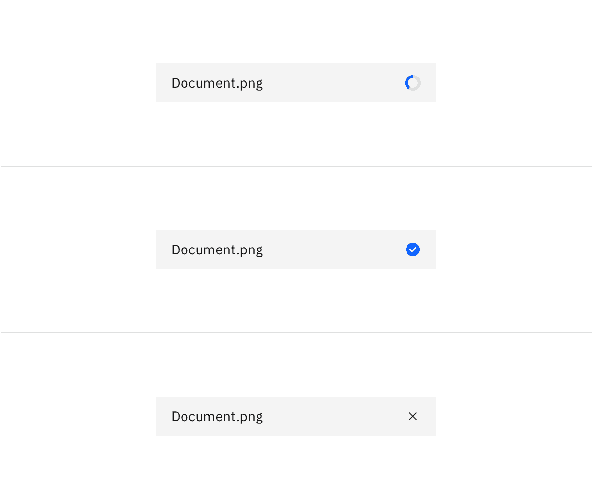
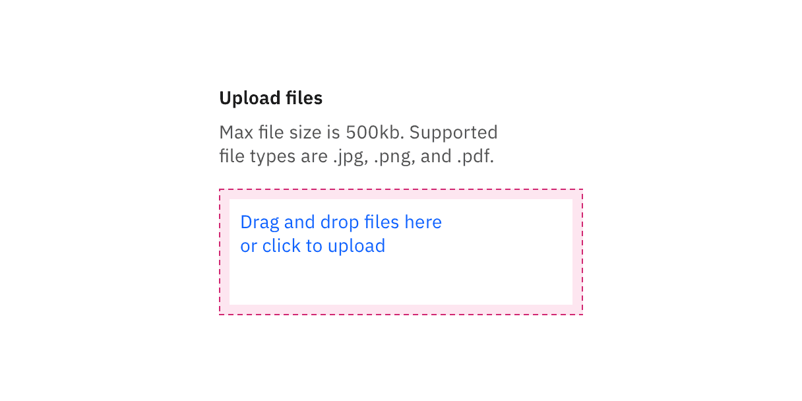
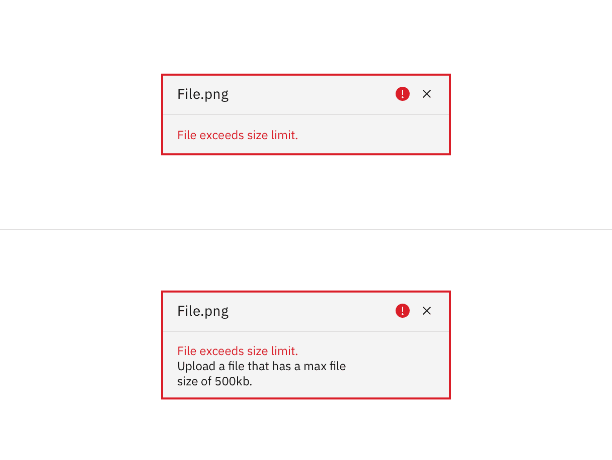
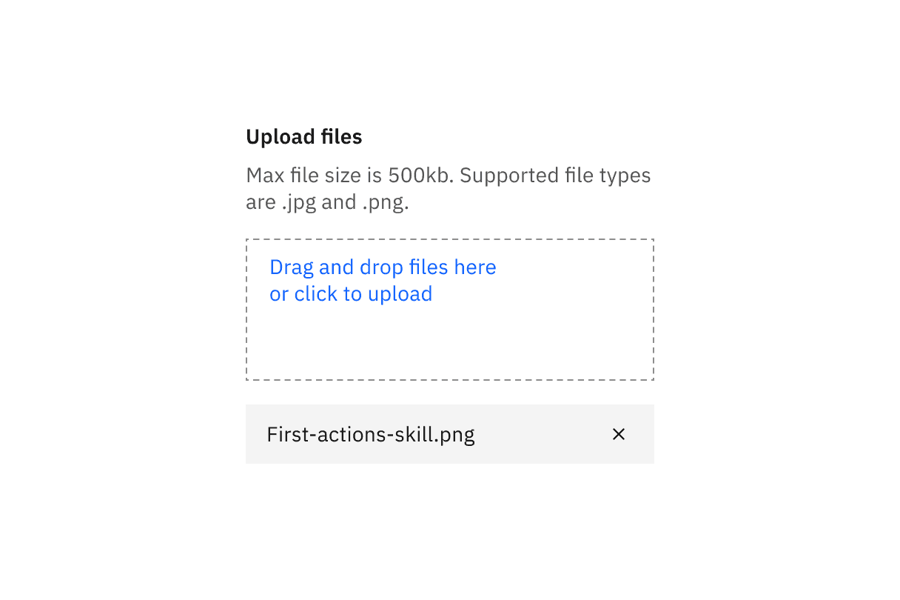

import A11yStatus from 'components/A11yStatus';

<PageDescription>

File uploaders allow users to select one or more files to upload to a specific
location.

</PageDescription>

<AnchorLinks>

<AnchorLink>Live demo</AnchorLink>
<AnchorLink>Overview</AnchorLink>
<AnchorLink>Formatting</AnchorLink>
<AnchorLink>Content</AnchorLink>
<AnchorLink>File uploader</AnchorLink>
<AnchorLink>Drag and drop file uploader</AnchorLink>
<AnchorLink>References</AnchorLink>
<AnchorLink>Feedback</AnchorLink>

</AnchorLinks>

## Live demo

<StorybookDemo
  themeSelector
  url="https://react.carbondesignsystem.com"
  variants={[
    {
      label: 'Default',
      variant: 'components-fileuploader--default',
    },
    {
      label: 'File uploader drop container',
      variant: 'components-fileuploader--file-uploader-drop-container',
    },
  ]}
/>

<A11yStatus layout="cards" components="File uploader" />

## Overview

File uploaders allow users to upload content of their own. A file uploader is
commonly found in forms, but can also live as a standalone element. There are
two variants of file uploaders—our default file uploader and a drag and drop
file uploader.

### Variants

| Variant                                                     | Way it works                                                                                |
| ----------------------------------------------------------- | ------------------------------------------------------------------------------------------- |
| [File uploader](#file-uploader)                             | Upload one or more files by clicking an action button that prompts a file selection dialog. |
| [Drag and drop file uploader](#drag-and-drop-file-uploader) | Drag and drop selected files directly into a drop zone area to upload.                      |

### When to use

- Uploading one or more files.
- Uploading files by dragging and dropping.
- Showing the process of uploading.

### When not to use

- Do not use upload in a modal when multiple files are uploaded, as uploaded
  files stack vertically.

## Formatting

### Anatomy

<Row>
<Column colLg={8}>

</Column>
</Row>

1. **Heading:** Text to describe the upload section.
2. **Description:** Text to help the user make an informed selection.
3. **Button or drop zone label:** The action to select a file to upload.
4. **Uploaded file:** A file that has successfully been uploaded.
5. **x:** The delete `x` icon will remove the uploaded file.

### Sizing

The button and uploaded files should be the same height. If the file uploader is
present in a form with other inputs, use the same height for the form inputs and
the file uploader for consistency.

<Row>
<Column colLg={8}>

</Column>
</Row>

| File uploader size | Height (px/rem) | Use case                                                                                          |
| ------------------ | --------------- | ------------------------------------------------------------------------------------------------- |
| _Large_            | 48/3            | Choose this size when there is a lot of space to work with.                                       |
| _Medium_           | 40/2.5          | This is our default size and should be used whenever possible.                                    |
| _Small_            | 32/2            | Use when space is constricted or when placing a file uploader in a form that is long and complex. |

### Alignment

Left align the button or drop zone area with the uploaded files. Multiple files
will stack vertically.

<Row>
<Column colLg={8}>

</Column>
</Row>

### Placement

When including a button as the action to upload a file, use either a primary or
tertiary button depending on your use case. If there is already a primary button
present on the page, use a tertiary button for the file uploader so it does not
conflict with the primary action.

<Row>
<Column colLg={8}>

</Column>
</Row>

## Content

### Main elements

#### Heading

- Informs users about the purpose of the upload section. "Upload files" is the
  default text that appears with the file uploader.
- Keep the heading short and concise by limiting it to a single line of text.

#### Description

- Descriptions help communicate to the user what file size or format limitations
  there are.

#### Button or drop zone label

- Button labels should be concise and describe the action that will be taken
  upon click. "Add files" is the default text that appears with the file
  uploader.
- Drop zone area label should describe that you can either drag and drop a file
  into the drop zone or click on the button to upload a file.

#### Uploaded file text

- The name of the file that has been uploaded.

### Overflow

Use an ellipsis (…) if the filename extends beyond the width of its parent
element. A tooltip should appear on hover to disclose the full length of the
filename.

<Row>
<Column colLg={8}>

</Column>
</Row>

### Buttons

### Further guidance

For further content guidance, see Carbon's
[content guidelines](https://www.carbondesignsystem.com/guidelines/content/overview).

### Loading states

A file that is being uploaded has three distinct states—loading, success, and
uploaded.

<Row>
<Column colLg={8}>

</Column>
</Row>

### Interactions

#### Mouse

Dragging your mouse anywhere within the bounds of the drop zone area with an
attached file will enable you to drop it inside of the area and begin to upload.

<Row>
<Column colLg={8}>

</Column>
</Row>

To remove an uploaded file, click the "x” (or delete) icon.

<Row>
<Column colLg={8}>

</Column>
</Row>

#### Keyboard

#### Upload button or drop zone:

- The file uploader button or drop zone can be activated by pressing `Space` or
  `Enter`.
- After the file selection dialog closes, focus should retain the user’s point
  of regard and return to the element that invoked it.

#### Uploaded file:

- Pressing `Tab` shifts focus to the “x” icon.
- Pressing `Space` or `Enter` while the "x" icon is in focus will delete the
  file.

For additional keyboard interactions, see the
[accessibility tab](/components/file-uploader/accessibility).

### Validation

When a specific file cannot be uploaded successfully it will show an error
state. We have an option for a single line or multi-line error state depending
on how descriptive the message needs to be. Error messages should provide clear
guidance to help the user resolve the error.

If the error relates to the file uploader as a whole instead of an individual
file, you can alternatively use an inline error notification.

<Row>
<Column colLg={8}>

</Column>
</Row>

## File uploader

A file uploader traditionally uploads one or more files by clicking an action
button that prompts a file selection dialog. Once you have selected one or more
files from the dialog, the selected files will populate below the file uploader
on the page. Your file may temporarily display a loading state before uploading
has been successfully completed.

<Row>
<Column colLg={12}>

</Column>
</Row>

## Drag and drop file uploader

Drag and drop file uploaders are used to directly upload files by dragging and
dropping them into a drop zone area. Alternatively, you can open files through a
file selection dialog by clicking the text link description inside the drop
zone.

The drop zone component lets users upload files by dragging and dropping the
files into an area on a page, or activating a button. By default, the drag and
drop file uploader allows multiple files to be dropped into the drop zone area.
However, we also offer functionality to limit a single file to be uploaded.

<Row>
<Column colLg={12}>

</Column>
</Row>

### Uploading multiple files

When dragging files into the drop zone area, the drop zone border changes in
color and thickness to indicate the area has been activated and is ready for
files. Additionally once the cursor hits the drop zone area it changes with a
preview of the file you are about to upload. The style of cursor change is
rendered by the browser you use.

<Row>
<Column colLg={8}>

</Column>
</Row>

<Caption>A file being dragged into the drop zone area.</Caption>

<Row>
<Column colLg={8}>

</Column>
</Row>

<Caption>
  A file successfully uploaded when you can upload multiple files.
</Caption>

### Uploading a single file

When using a drag and drop file uploader, if the requirement only allows a
single file to be uploaded, drag the single file into the drop zone area to
upload it. Once uploaded, the drop zone area will be removed to show that you
have successfully uploaded a single file. Click the close icon in the uploaded
file to remove it.

<Row>
<Column colLg={8}>

</Column>
</Row>

<Caption>
  A file successfully uploaded when you can only upload a single file.
</Caption>

## References

Page Laubheimer,
[Drag–and–Drop: How to Design for Ease of Use](https://www.nngroup.com/articles/drag-drop/),
(Nielsen Norman Group, 2020)

## Feedback

Help us improve this component by providing feedback, asking questions, and
leaving any other comments on
[GitHub](https://github.com/carbon-design-system/carbon-website/issues/new?assignees=&labels=feedback&template=feedback.md).
