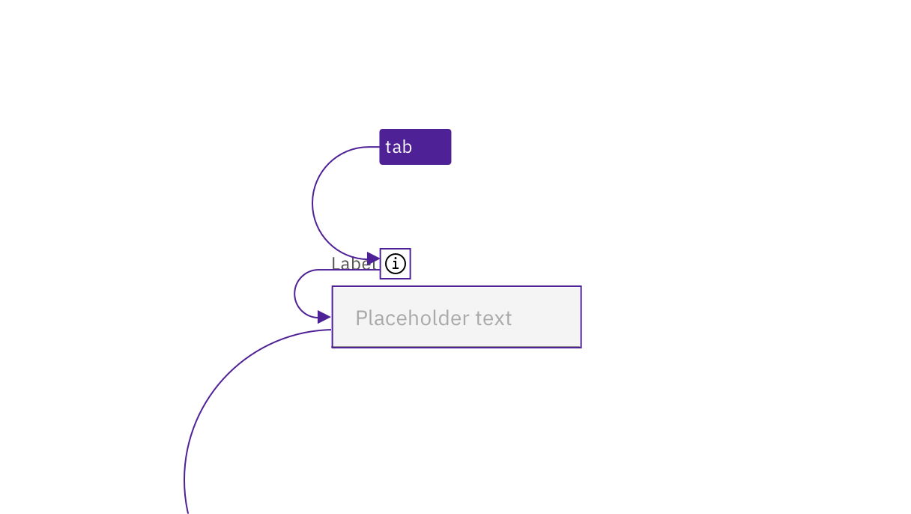

import {
  StructuredListWrapper,
  StructuredListHead,
  StructuredListBody,
  StructuredListRow,
  StructuredListInput,
  StructuredListCell,
  OrderedList,
  ListItem,
} from '@carbon/react';

<PageDescription>

Design annotations are needed for specific instances shown below, but Carbon
already incorporates accessibility into the components that make up a form.
Refer to form components’ individual accessibility tabs for specific
considerations.

</PageDescription>

<AnchorLinks>
  <AnchorLink>What Carbon provides</AnchorLink>
  <AnchorLink>Design recommendations</AnchorLink>
  <AnchorLink>Development considerations</AnchorLink>
</AnchorLinks>

## What Carbon provides

Carbon bakes keyboard operation into the components that make up a form,
improving the experience of blind users and others who operate via the keyboard.
Carbon incorporates many other accessibility considerations, some of which are
described below.

### Information icons

A common challenge for forms is how to surface additional information to the
user without making the form too dense. Carbon provides an information icon
[toggletip](/components/toggletip/usage) to ensure such information is
predictable and keyboard accessible. The toggletip is a button, which is in the
tab order. Both `Space` and `Enter` open the tip, and `Esc` dismisses it.

<Row>
<Column colLg={8}>

<Caption>
  The toggletip pattern is used to make form help text keyboard accessible.
</Caption>

</Column>
</Row>

### Error handling

Carbon incorporates accessible inline error and warning messages into many
components, such as text inputs. Error states are also conveyed programmatically
to assistive technologies.

## Design recommendations

Design annotations and considerations are needed for the following situations.

### Identify requirements at the start of the form

Traditionally, a legend at the start of a form identifies the symbol (often an
asterisk) used for required fields, and the symbol is repeated as part of the
label for each appropriate field. This is still considered the most accessible
implementation. However, as discussed in
[Optional versus required fields](/components/form/usage/#optional-versus-required-fields),
Carbon allows for either the required or optional fields to be the inputs
identified. Especially where only optional fields are indicated, an instruction
should precede a form, providing the context for whether required or optional
fields are indicated. The traditional phrasing is “All fields are required
unless marked as optional” (or the reverse). See the Equal Access Toolkit topic
[Required fields](https://www.ibm.com/able/toolkit/design/visual/#required-fields)
for more information.

By convention, simple username/password login forms do not need such an
instruction (or even to be marked as required), since the context is clear to
users.

### Be familiar with the accessibility of common form components

The following topics each have their own accessibility considerations, which
improve the overall form experience:

- Checkbox
- Date picker
- Dropdown
- File uploader
- Loading
- Modal
- Notification
- Number input
- Radio button
- Select
- Slider
- Text input
- Toggle tip

## Development considerations

Keep these considerations in mind if you are modifying Carbon patterns or
creating a custom form or input component.

- A form must be wrapped in a `<form>` element.
- Required fields must be identified programmatically, either via the label or
  with `aria-required`.
- Helper text and other instructions should be surfaced to users via
  `aria-describedby` or other accessible techniques. See
  [Programmatically associate inputs with labels](https://www.ibm.com/able/toolkit/develop/user-input/#inputs).
- See the ARIA authoring practices on
  [forms](https://w3c.github.io/aria-practices/#aria_lh_form) and
  [labels](https://w3c.github.io/aria-practices/#naming_with_labels) for more
  considerations.
